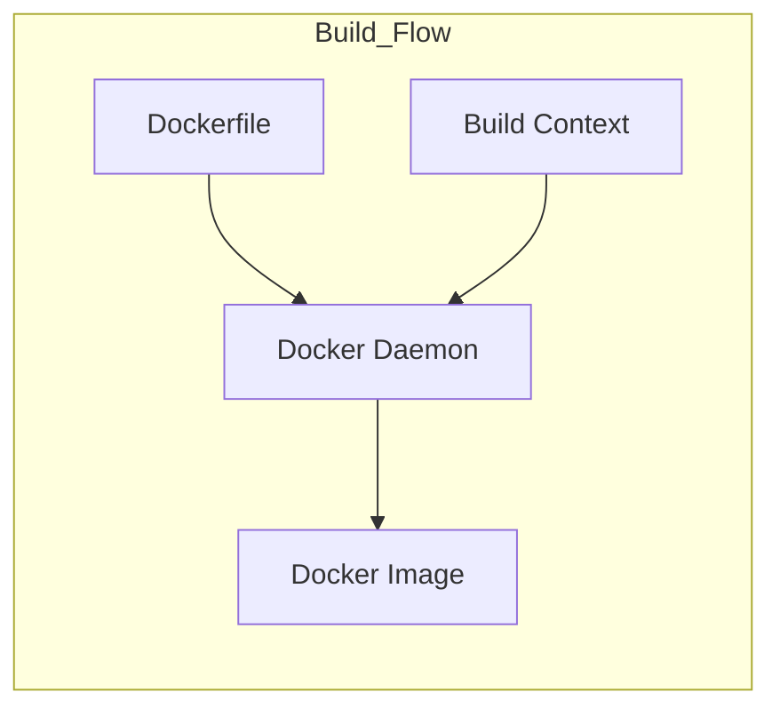

# Docker

Docker 可以被理解为一种轻量级的虚拟化技术. 与传统的虚拟机不同, Docker 不需要模拟完整的硬件和操作系统. 它直接运行在宿主机的操作系统内核之上, 通过封装应用及其依赖环境, 实现了应用与底层基础设施的解耦. 这种封装方式使得应用可以在任何安装了 Docker 引擎的机器上以相同的方式运行, 极大地简化了配置和部署过程.

> [!tip]- 原理
> Docker 的核心原理依赖于 Linux 内核的特性, 主要包括命名空间 (Namespaces) 和控制组 (Control Groups).
> 
> 命名空间提供了系统资源的隔离. 当 Docker 创建一个容器时, 它实际上是为该容器内的进程创建了一组独立的命名空间. 这意味着容器内的进程看起来拥有独立的进程 ID 空间, 网络堆栈, 挂载点以及用户空间. 这种隔离确保了容器内的操作不会影响到宿主机或其他容器.
> 
> 控制组则负责资源限制和监控. 通过 Cgroups, Docker 可以精确地控制每个容器能够使用的 CPU, 内存, 磁盘 I/O 等硬件资源. 这防止了某个容器耗尽宿主机的所有资源, 从而保证了系统的稳定性.
> 
> 此外, Docker 使用联合文件系统 (UnionFS) 来构建分层的文件系统. 这使得镜像可以通过分层的方式进行构建和存储, 极大地提高了存储效率和分发速度.
> 
> ```mermaid
> graph TD
>     subgraph Host_Machine
>         Hardware["Server Hardware"]
>         OS["Host Operating System"]
>         Docker_Engine["Docker Engine"]
>         
>         subgraph Container_A
>             LibsA["Bins/Libs"]
>             AppA["Application A"]
>         end
>         
>         subgraph Container_B
>             LibsB["Bins/Libs"]
>             AppB["Application B"]
>         end
> 
>         Hardware --> OS
>         OS --> Docker_Engine
>         Docker_Engine --> Container_A
>         Docker_Engine --> Container_B
>     end
> ```

## Install

对于Arch Linux, 直接使用[[Pacman]]进行安装:
```bash
sudo pacman -S docker
```

对于Ubuntu, 需要按照[官网](https://docs.docker.com/engine/install/ubuntu/)上的步骤进行安装:

首先删除之前安装的残留:
```bash
sudo apt remove $(dpkg --get-selections docker.io docker-compose docker-compose-v2 docker-doc podman-docker containerd runc | cut -f1)
```
然后更新docker的仓库:
```bash
sudo apt update
sudo apt install ca-certificates curl
sudo install -m 0755 -d /etc/apt/keyrings
sudo curl -fsSL https://download.docker.com/linux/ubuntu/gpg -o /etc/apt/keyrings/docker.asc
sudo chmod a+r /etc/apt/keyrings/docker.asc

# Add the repository to Apt sources:
sudo tee /etc/apt/sources.list.d/docker.sources <<EOF
Types: deb
URIs: https://download.docker.com/linux/ubuntu
Suites: $(. /etc/os-release && echo "${UBUNTU_CODENAME:-$VERSION_CODENAME}")
Components: stable
Signed-By: /etc/apt/keyrings/docker.asc
EOF

sudo apt update
```
安装docker:
```bash
sudo apt install docker-ce docker-ce-cli containerd.io docker-buildx-plugin docker-compose-plugin
```

## Start Docker Service

在运行docker之前, 需要启动dockerd.service(docker daemon)

使用下面的命令启动:
```bash
sudo systemctl enable docker --now
```
### Mirror

查看[这个Github Repo](https://github.com/dongyubin/DockerHub), 这里面存了最新可用的docker mirror

编辑文件`/etc/docker/daemon.json`, 里面写入:
```json
{
  "registry-mirrors": [
    "https://docker.1panel.live",
    "https://docker.1ms.run",
    "https://dytt.online",
    "https://docker-0.unsee.tech",
    "https://lispy.org",
    "https://docker.xiaogenban1993.com",
    "https://666860.xyz",
    "https://hub.rat.dev",
    "https://docker.m.daocloud.io",
    "https://demo.52013120.xyz",
    "https://proxy.vvvv.ee",
    "https://registry.cyou"
  ]
}
```

然后重启:
```bash
systemctl daemon-reload
systemctl restart docker
```

## Without Sudo Permission

由于docker创建一个新的group叫做docker, 并且这个group中没有任何的user. docker的container和image文件都存放在`/var/lib/docker`中, 这个文件夹需要有docker group的权限才能操作docker.

所以默认使用docker必须使用sudo权限.

如果user没有sudo权限, 最简单的方法是申请一个有sudo权限的账号(如, root: `su root`), 然后将对应[[Linux File Permission#Group#Adding a User to a Group|user添加到docker group中:]]
```bash
usermod -aG docker <username>
```

## Image

Docker 镜像是一个只读的模板. 它可以包含一个完整的操作系统环境, 里面安装了应用程序所需要的全部依赖, 配置和文件. 镜像通常是分层构建的, 每一层代表了文件系统的一次修改. 这种分层结构使得镜像非常轻量级且易于复用. 例如, 多个镜像可以共享同一个基础镜像层 (如 Ubuntu 基础镜像), 从而节省磁盘空间.

### Pull

Image通常存在于docker hub中, 使用mirror的目的就是为了加速pull的过程.

使用下面的命令拉取一个Image:
```bash
docker pull <repo_name>/<image_name>:<tag>
```

`<repo_name>`和`<tag>`是可选项. 如果不指定`<tag>`, 那么会默认拉取latest最新版.

同时, 可以不指定tag但是制定digest:
```bash
docker pull <image_name>@sha256:<digest>
```

> [!example]- 
> ```bash
> docker pull nvidia/cuda:12.8.1-devel-ubuntu22.04
> ```
> 
> ```bash
> docker pull ubuntu@sha256:45b23dee08af...
> ```

### Load & Save

通过`docker save`可以将一个image储存成一个`.tar`文件, 用于使用scp等工具传输:
```bash
docker save <image_name>:<tag> > <path/to/tar>
```

通过`docker load`可以将一个`.tar`文件加载成一个docker image, 并保留了原始的image name和tag:
```bash
docker load -i <path/to/tar>
```

使用这个命令可以在不上传docker hub的情况下在多个设备之间传输自己配置的docker

### List

展示所有下载的image:
```bash
docker image ls
```

### Remove

删除某一个docker.

但是当已经运行了一个[[#Container]]之后, 需要先[[#Container#Remove|删除]]这个container之后才能删除image:
```bash
docker image rm <image_name>:<tag>
# 或者使用hash指定, 前4位hash即可
docker image rm <image_hash>

# 另一种简便写法, 将image rm转换成rmi
docker rmi <image_hash>
```

## Container

Docker 容器则是镜像的运行实例. 它是一个独立运行的, 隔离的进程环境. 当我们启动一个容器时, Docker 会在只读的镜像层之上加载一个可读写的容器层. 应用在运行过程中产生的所有数据更改, 如写文件, 修改配置等, 都发生在这一层中.

容器具有生命周期, 它可以被创建, 启动, 停止, 删除或暂停. 虽然容器在运行时看似是一个独立的操作系统, 但它实质上是共享宿主机内核的隔离进程.

### Run

当执行这个命令时, Docker 实际上在后台连续执行了三个步骤. 首先, 它会检查本地是否存在指定的镜像, 如果不存在则从仓库拉取. 其次, 它基于该镜像创建一个新的容器实例, 这意味着在镜像的只读层之上分配了一个可读写的容器层. 最后, 它启动该容器并执行指定的入口程序.

可选参数:
- `-p host_port:container_port` 将宿主机的端口和容器的端口映射
- `-e KEY1=VAL2,KEY2=VAL2,...` 设置container的环境变量
- `--rm` 当停止时直接删除container. 这个常用于测试用容器
- `-v host_path:container_path` 将宿主机的路径挂载到容器中
- `-d` detach, 后台运行
- `-it` interactive+tty, 创建交互式shell. 参数`-i`保证了容器的标准输入 (STDIN) 是开启的, 即使没有连接到主机, 容器也能接收输入. 参数`-t`则为容器分配一个伪终端 (Pseudo-TTY).

```bash
docker run -dit <image_name>:<tag>
# 或者使用hash
docker run -dit <image_hash>
```

#### Run With GPUs

如果使用的是nvidia的docker, 需要在docker中使用GPU, 那么需要在宿主机中额外安装一个`nvidia-container-toolkit`用于创建一个docker的nvidia runtime

官方网站: [install-guide](https://docs.nvidia.com/datacenter/cloud-native/container-toolkit/latest/install-guide.html)
##### Install
安装前置要求:
```bash
sudo apt-get update && sudo apt-get install -y --no-install-recommends \
   curl \
   gnupg2
```
添加gpg key:
```bash
curl -fsSL https://nvidia.github.io/libnvidia-container/gpgkey | sudo gpg --dearmor -o /usr/share/keyrings/nvidia-container-toolkit-keyring.gpg \
  && curl -s -L https://nvidia.github.io/libnvidia-container/stable/deb/nvidia-container-toolkit.list | \
	sed 's#deb https://#deb [signed-by=/usr/share/keyrings/nvidia-container-toolkit-keyring.gpg] https://#g' | \
	sudo tee /etc/apt/sources.list.d/nvidia-container-toolkit.list
```
安装:
```bash
sudo apt-get update
export NVIDIA_CONTAINER_TOOLKIT_VERSION=1.18.0-1
sudo apt-get install -y \
  nvidia-container-toolkit=${NVIDIA_CONTAINER_TOOLKIT_VERSION} \
  nvidia-container-toolkit-base=${NVIDIA_CONTAINER_TOOLKIT_VERSION} \
  libnvidia-container-tools=${NVIDIA_CONTAINER_TOOLKIT_VERSION} \
  libnvidia-container1=${NVIDIA_CONTAINER_TOOLKIT_VERSION}
```

##### Setup
```bash
sudo nvidia-ctk runtime configure --runtime=docker
```
然后重启docker的daemon:
```bash
sudo systemctl daemon-restart
sudo systemctl restart docker
```

### Start & Stop

`docker start` 命令用于启动一个或多个处于停止状态的容器. 与 `docker run` 不同, `docker start` 操作的是已经存在的容器实例. 它不会创建新的容器, 而是恢复之前的运行状态. 容器内部的数据 (可读写层) 会保持停止前的状态, 之前配置的端口映射和挂载卷也会继续生效.

```bash
docker start <container_hash>
```

`docker stop` 命令用于优雅地停止一个运行中的容器. 当执行此命令时, Docker 首先会向容器内的主进程 (PID 1) 发送 SIGTERM 信号. 这给了应用程序一个机会来完成收尾工作, 如保存状态, 关闭连接等.

```bash
docker stop <container_hash>
```

### attach

如果想要进入一个container, 如果这个container还没有启动, 首先启动container:
```shell
sudo docker container start <container_id>
```
然后进入container:
```shell
sudo docker attach <container_id>
```
进入container

如果想要推出并stop一个container, 那么直接使用exit退出或者<kbd>Ctrl+d</kbd>结束这个shell. 这时container仍然存在, 但是不会运行, 此时仍可以通过上述命令进入

如果退出但不stop容器, 可以使用<kbd>Ctrl+p+q</kbd>(<kbd>Ctrl</kbd>键不松开即可)
### List

`docker container ls` (旧版本中常简写为 `docker ps`) 用于列出当前的容器. 默认情况下, 它只显示正在运行的容器. 如果需要查看所有容器 (包括已停止的, 异常退出的), 需要添加 `-a` (all) 参数. 输出的信息通常包括容器 ID, 镜像名称, 启动命令, 创建时间, 状态以及端口映射情况.

```bash
docker container ls -a
```

### Remove

`docker container rm` (或 `docker rm`) 用于删除指定的容器. 这是一个不可逆的操作, 容器一旦被删除, 其内部未持久化的数据将永久丢失. 值得注意的是, 默认情况下 Docker 为了安全起见, 不允许删除正在运行的容器. 如果需要强制删除一个运行中的容器, 可以添加 `-f` (force) 参数, 这会先触发强制停止操作, 然后再执行删除.

```bash
docker rm <container_hash>
```

### Commit

`docker commit` 命令允许用户将一个容器的当前状态保存为一个新的镜像. 这通常用于手动构建镜像的场景.

当用户在容器内进行了一系列操作 (如安装软件, 修改配置文件) 后, 容器的可读写层发生的变化可以通过 `docker commit` 固化下来. 这个过程实际上是将原有的镜像层加上当前的可读写层打包成一个新的只读层, 并生成一个新的镜像清单.

```docker
docker commit <container_hash> <image_name>:<tag>
```

commit之后可以配合[[#Load & Save]]进行保存和加载

# Dockerfile

> [!warning] 
> 注意, 这一部分完全由Gemini生成, 没有经过实践验证. 请自行分辨是否准确

Dockerfile 是 Docker 镜像构建的核心文件, 它本质上是一个包含了一系列指令的文本脚本. 通过编写 Dockerfile, 开发者可以使用代码来描述构建镜像的完整步骤, 从而实现基础设施即代码 (Infrastructure as Code). 这种方式不仅保证了环境搭建过程的可重复性和自动化, 同时也让镜像的构建过程变得透明且易于维护.

## Build Process Overview

在实践中, Dockerfile 的使用始于 `docker build` 命令. 当用户执行该命令时, Docker 引擎会读取 Dockerfile 中的指令, 并按顺序逐行执行. 每一条指令通常都会在镜像中创建一个新的层 (Layer).

构建过程通常涉及一个名为 "上下文" (Context) 的概念. 当执行构建命令时, 用户通常指定一个目录 (例如当前目录 `.`), 该目录下的所有文件都会被打包发送给 Docker 守护进程. 因此, 保持构建上下文的清洁非常重要, 通常会配合 `.dockerignore` 文件来排除不需要的大文件或敏感文件 (如 `.git` 目录或密码文件), 以提高构建效率.



## Core Syntax and Instructions

Dockerfile 的语法设计简洁明了, 指令不区分大小写, 但按照惯例通常使用大写字母以示区分. 以下是实践中最常用的指令及其使用细节.

### Base Image Definition

每一个 Dockerfile 必须以 `FROM` 指令开始 (除了 ARG 指令可能出现在最前面). `FROM` 指定了当前镜像构建所依赖的基础镜像.

在实际开发中, 开发者通常会选择官方提供的基础镜像, 如 `ubuntu`, `alpine` 或 `node`. 其中, `alpine` 因其极小的体积 (仅几兆字节) 而广受欢迎, 非常适合构建轻量级的生产环境镜像. 如果需要从零开始构建一个没有任何依赖的镜像, 可以使用特殊的基础镜像 `scratch`.

### Working Directory Setup

`WORKDIR` 指令用于设置容器内部的工作目录. 后续的指令 (如 `RUN`, `CMD`, `COPY` 等) 都会在这个目录下执行.

如果在 Dockerfile 中多次使用 `WORKDIR`, 且提供了相对路径, 那么路径会基于前一个 `WORKDIR` 进行累加. 在实践中, 为了避免路径混淆, 强烈建议始终使用绝对路径来定义工作目录. 如果该目录不存在, Docker 会自动创建它.

### File Operations

将文件从宿主机复制到镜像内部是构建过程中的常见需求, 主要通过 `COPY` 和 `ADD` 指令实现.

`COPY` 是最常用且推荐的指令. 它只能将构建上下文中的文件或目录复制到容器的文件系统中. 其语义非常纯粹, 就是单纯的文件复制.

`ADD` 指令的功能比 `COPY` 更丰富. 除了具备复制文件的功能外, 它还可以处理远程 URL 资源, 或者自动解压 tar 压缩包. 然而, 由于 `ADD` 的行为相对复杂且隐晦, 官方的最佳实践建议仅在确实需要自动解压功能的场景下使用它, 其余情况一律使用 `COPY`.

### Command Execution During Build

`RUN` 指令用于在镜像构建阶段执行命令. 这通常用于安装软件包, 更新系统或配置环境.

`RUN` 支持两种格式. 第一种是 Shell 格式, 就像在终端输入命令一样, 例如 `RUN apt-get update`. 第二种是 Exec 格式 (JSON 数组), 例如 `RUN ["apt-get", "update"]`.

在编写 `RUN` 指令时, 一个非常重要的技巧是将多个相关的命令通过 `&&` 连接, 并合并到同一条 `RUN` 指令中. 这样做的目的是减少镜像的层数. 因为每一条指令都会生成一个新的镜像层, 如果分多条指令安装软件, 会导致最终镜像体积膨胀. 清理缓存的操作也应该放在同一条指令的最后, 以确保缓存文件不会被保留在最终的镜像层中.

### Environment Variables

`ENV` 指令用于设置环境变量. 这些变量不仅在构建过程中有效, 而且在容器运行时依然存在. 应用程序可以通过读取系统环境变量来获取这些配置.

如果只需要在构建过程中使用变量 (例如指定软件版本号), 而不需要在运行时保留, 应该使用 `ARG` 指令. `ARG` 定义的变量仅在 `docker build` 阶段有效, 构建完成后不会保留在镜像的元数据中.

### Container Startup Command

`CMD` 和 `ENTRYPOINT` 是两个容易混淆的指令, 它们都用于指定容器启动时默认执行的命令.

`CMD` 指令为容器提供默认的执行命令或参数. 如果用户在 `docker run` 后面指定了其他命令, `CMD` 中的内容会被覆盖. 一个 Dockerfile 中只能有一个 `CMD`, 如果指定了多个, 只有最后一个生效.

`ENTRYPOINT` 指令的主要目的是将容器配置为可执行程序. 与 `CMD` 不同, 当用户在 `docker run` 后面添加参数时, 这些参数不会覆盖 `ENTRYPOINT`, 而是会被追加到 `ENTRYPOINT` 指定的命令之后.

在实践中, 一种常见的组合用法是使用 `ENTRYPOINT` 定义固定的可执行程序 (如 `nginx`), 并使用 `CMD` 定义默认的参数 (如 `-g "daemon off;"`). 这样既保证了程序的固定运行, 又允许用户在启动时灵活覆盖默认参数.

### Network Port Declaration

`EXPOSE` 指令用于声明容器运行时监听的端口. 需要注意的是, `EXPOSE` 仅仅是一个声明, 它不会自动将端口映射到宿主机. 它的主要作用是作为一种文档, 告诉使用者该镜像内的服务运行在哪个端口上. 要真正实现端口访问, 还需要在启动容器时使用 `-p` 参数.

## Multi-Stage Builds

多阶段构建 (Multi-Stage Builds) 是 Dockerfile 实践中的一项高级技巧, 旨在解决开发环境与生产环境分离的问题, 并显著减小最终镜像的体积.

在传统的构建模式中, 为了编译代码, 镜像中必须包含编译器和各种构建工具 (如 GCC, Maven, Go 编译器). 这些工具在代码编译完成后, 对于运行时的应用程序来说是完全多余的, 且占据了大量空间.

多阶段构建允许在一个 Dockerfile 中使用多个 `FROM` 指令. 每个 `FROM` 指令开始一个新的构建阶段. 开发者可以在第一个阶段 (通常称为 Builder 阶段) 安装所有的编译工具并构建源代码, 然后在第二个阶段 (Target 阶段) 重新开始一个新的, 干净的基础镜像 (如 `alpine`). 关键的一步是, 开发者可以使用 `COPY --from=0` (或使用阶段别名) 将第一个阶段生成的二进制文件直接复制到第二个阶段中.

通过这种方式, 最终生成的镜像只包含运行应用程序所必须的最小依赖和编译好的二进制文件, 而不包含任何源代码或构建工具, 从而实现了镜像体积的极致优化.
