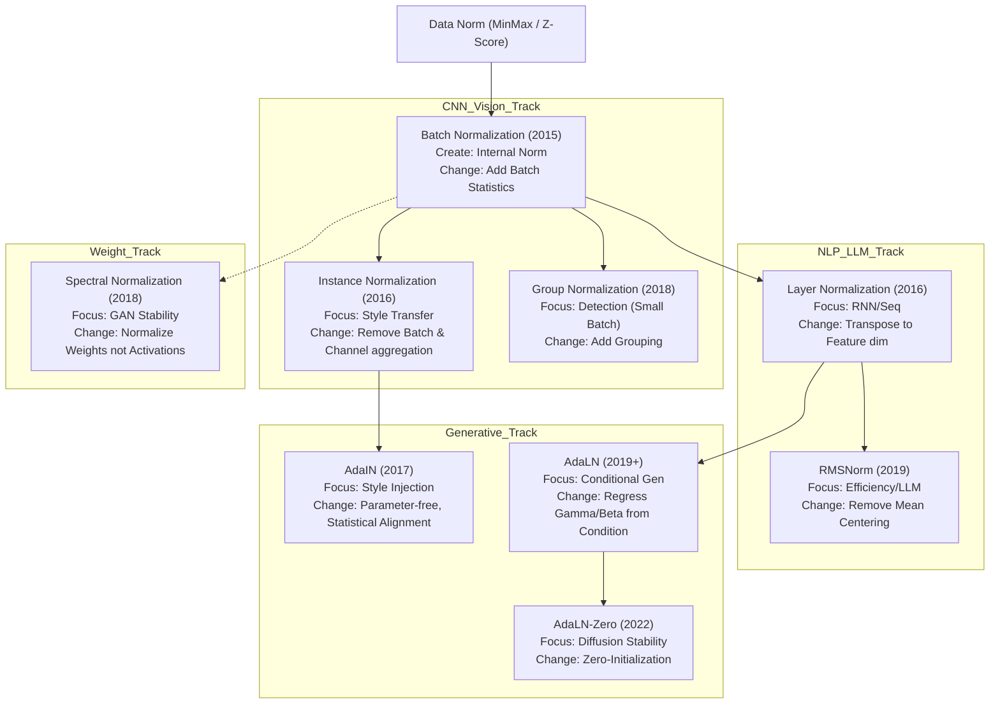

# Normalization in Deep Learning

深度学习中的归一化 (Normalization) 技术是现代神经网络模型能够成功训练的基石之一. 它的核心目的在于解决训练过程中的 Internal Covariate Shift (ICS) 问题, 即使得网络每一层的输入分布保持稳定. 从优化的角度看, 归一化极大地平滑了损失函数的曲面 (Loss Landscape), 减小了梯度的 Lipschitz 常数, 从而允许使用更大的学习率并加速收敛.

## Data Level Normalization

在将数据输入神经网络之前, 对输入数据进行预处理是必不可少的步骤. 这一层面的归一化不涉及网络内部的层结构, 而是直接作用于原始数据集.

### Min-Max Normalization

这种方法通过线性变换将数据映射到固定区间, 通常是 $[0, 1]$. 它保留了数据的原始分布结构, 但将量纲统一.

$$
x' = \frac{x - x_{min}}{x_{max} - x_{min}}
$$

| Advantages | Disadvantages |
| :--- | :--- |
| 1. 精确地将数据限制在特定的区间内 (如 0 到 1), 这对于需要输出在有界区间的激活函数 (如 Sigmoid) 非常重要.<br>2. 保留了原始数据的相对分布关系, 不改变数据的偏度. | 1. 对异常值 (Outliers) 极度敏感. 单个极端大值会将所有正常数据压缩到极小的区间, 导致特征失效.<br>2. 使得数据的均值和方差变得不确定, 不利于后续网络权重的初始化 (通常假设零均值输入). |

```python
import torch

def min_max_norm(x):
    # Epsilon 防止除以零
    return (x - x.min()) / (x.max() - x.min() + 1e-8)
```

### Z-Score Standardization

Z-Score 标准化将数据转换为均值为 0, 标准差为 1 的分布. 这是深度学习输入层最常用的预处理方式.

$$
x' = \frac{x - \mu}{\sigma}
$$

| Advantages | Disadvantages |
| :--- | :--- |
| 1. 对异常值具有较强的鲁棒性, 不会因为个别极值导致整体分布崩塌.<br>2. 产生零均值单位方差的分布, 完美契合神经网络权重的初始化假设 (如 Xavier Initialization), 有助于梯度传播. | 1. 数据的数值范围没有固定边界, 可能会出现非常大的绝对值.<br>2. 破坏了数据的原始稀疏性 (如果原始数据有很多 0, 减去均值后就不再是 0 了). |

```python
def z_score_norm(x):
    return (x - x.mean()) / (x.std() + 1e-8)
```

## Core Internal Normalizations

这是深度学习中最为重要的一类归一化, 它们作为网络层嵌入在模型结构中. 这些方法的区别主要在于计算均值和方差时所聚合的维度不同.

### Batch Normalization

Batch Normalization (BN) 在 Batch 维度 $(N)$ 以及空间维度 $(H, W)$ 上聚合, 对每个通道 $(C)$ 独立计算统计量. 它是 CNN 时代的标配.

$$
\hat{x} = \frac{x - \mu_B}{\sqrt{\sigma_B^2 + \epsilon}} \cdot \gamma + \beta
$$

| Advantages | Disadvantages |
| :--- | :--- |
| 1. 极大地加速收敛速度, 允许使用更大的学习率.<br>2. 引入了与 Batch 相关的随机噪声, 起到了轻微的正则化效果, 降低了过拟合风险.<br>3. 对权重初始化的敏感度降低. | 1. 高度依赖 Batch Size. 当 Batch Size 较小 (如 < 8) 时, 统计量估算不准, 导致模型性能崩溃.<br>2. 在 RNN 和 Transformer 等处理变长序列的模型中难以应用.<br>3. 训练和推理阶段计算逻辑不一致 (训练用 Batch 统计量, 推理用 Running 统计量). |

```python
import torch.nn as nn
# (N, C, H, W)
bn = nn.BatchNorm2d(num_features=64)
```

### Layer Normalization

Layer Normalization (LN) 放弃了 Batch 维度, 转而在特征维度上进行归一化. 对于 NLP 任务, 它在 Embedding 维度上聚合.

$$
\mu_L = \frac{1}{D} \sum_{i=1}^{D} x_i
$$

| Advantages | Disadvantages |
| :--- | :--- |
| 1. 计算完全独立于 Batch Size, 单条数据即可归一化.<br>2. 完美适用于 RNN 和 Transformer 等变长序列模型.<br>3. 训练和推理阶段的行为完全一致, 实现简单. | 1. 在卷积神经网络 (CNN) 中表现通常不如 BN, 因为它破坏了通道间的特征独立性.<br>2. 缺乏 BN 那种引入噪声带来的正则化效应, 可能更容易过拟合. |

```python
# (N, Sequence_Length, Embedding_Dim)
ln = nn.LayerNorm(normalized_shape=512)
```

### Instance Normalization

Instance Normalization (IN) 在每个样本的每个通道 $(H, W)$ 上独立计算统计量. 它既不跨 Batch, 也不跨 Channel.

| Advantages | Disadvantages |
| :--- | :--- |
| 1. 能够归一化掉图像的对比度和亮度等风格信息, 使得模型专注于内容结构.<br>2. 在风格迁移 (Style Transfer) 和图像生成任务中效果显著. | 1. 丢弃了图像的全局统计信息, 对于图像分类等判别式任务会造成信息损失, 导致精度下降.<br>2. 仅适用于特定的视觉生成领域, 通用性较差. |

```python
# (N, C, H, W)
in_norm = nn.InstanceNorm2d(num_features=64)
```

### Group Normalization

Group Normalization (GN) 是 BN 和 LN 的折中方案. 它将通道 $C$ 分成 $G$ 个组, 在组内计算统计量.

| Advantages | Disadvantages |
| :--- | :--- |
| 1. 解决了小 Batch Size 问题, 即使 Batch Size 为 1 也能稳定训练.<br>2. 在目标检测和分割等高分辨率图像任务中表现优异.<br>3. 计算不依赖 Batch, 推理和训练一致. | 1. 引入了额外的超参数 (Group Number), 需要针对任务进行调整.<br>2. 在大 Batch Size 的分类任务上, 最终精度通常仍略低于 BN. |

```python
# (N, C, H, W), divide 64 channels into 8 groups
gn = nn.GroupNorm(num_groups=8, num_channels=64)
```

## Normalization for Transformer and LLMs

随着 Transformer 架构的统治, 归一化技术针对深度和数值稳定性进行了专门的优化.

### RMSNorm

[[RMS|Root Mean Square]] Layer Normalization (RMSNorm) 去除了 LN 中的 Mean Centering (减去均值) 操作, 仅保留均方根进行缩放.

$$
\bar{x}_i = \frac{x_i}{\text{RMS}(x)} g_i
$$

| Advantages | Disadvantages |
| :--- | :--- |
| 1. 减少了计算量 (不需要计算均值), 提升了训练和推理速度.<br>2. 在深层网络 (Deep Networks) 中数值稳定性更好, 梯度流更平滑.<br>3. 现代大模型 (Llama, PaLM) 的首选方案. | 1. 理论上丧失了平移不变性 (Shift Invariance), 虽然在 LLM 实践中证明这并不重要.<br>2. 需要特定的算子优化才能发挥最大的速度优势. |

```python
class RMSNorm(nn.Module):
    def __init__(self, dim, eps=1e-8):
        super().__init__()
        self.scale = nn.Parameter(torch.ones(dim))
        self.eps = eps
    def forward(self, x):
        return x * torch.rsqrt(x.pow(2).mean(-1, keepdim=True) + self.eps) * self.scale
```

## Conditional and Adaptive Normalizations

在生成式模型中, 归一化成为了注入外部条件 (如文本描述, 时间步) 的接口.

### AdaLN-Zero

AdaLN-Zero (Adaptive Layer Norm with Zero Initialization) 是 DiT (Diffusion Transformer) 架构的核心. 它根据条件向量动态生成 Scale ($\gamma$) 和 Shift ($\beta$), 并且使用零初始化策略.

$$
\text{AdaLN}(x, c) = (1 + \gamma(c)) \cdot \text{Norm}(x) + \beta(c)
$$

| Advantages | Disadvantages |
| :--- | :--- |
| 1. 零初始化使得整个残差块在训练初期表现为恒等映射 (Identity), 极大地稳定了深层模型的训练.<br>2. 能够根据时间步和文本提示灵活调节每一层的特征分布.<br>3. 是目前 SOTA 扩散模型生成的关键技术. | 1. 引入了额外的 MLP 模块来预测参数, 略微增加了参数量.<br>2. 需要精心设计的初始化策略, 否则容易导致训练发散. |

```python
class AdaLNZero(nn.Module):
    def __init__(self, dim, cond_dim):
        super().__init__()
        self.norm = nn.LayerNorm(dim, elementwise_affine=False)
        self.linear = nn.Linear(cond_dim, dim * 2)
        nn.init.zeros_(self.linear.weight) # 核心: 零初始化
        nn.init.zeros_(self.linear.bias)
    def forward(self, x, c):
        gamma, beta = self.linear(c).chunk(2, dim=-1)
        return self.norm(x) * (1 + gamma.unsqueeze(1)) + beta.unsqueeze(1)
```

## Weight Based Normalization

这一类方法不归一化激活值, 而是直接约束权重矩阵.

### Spectral Normalization

Spectral Normalization (SN) 将权重矩阵除以其最大的奇异值 (谱范数).

$$
W_{SN} = \frac{W}{\sigma(W)}
$$

| Advantages | Disadvantages |
| :--- | :--- |
| 1. 严格限制了网络的 Lipschitz 常数, 防止梯度爆炸.<br>2. 极大地稳定了 GAN (生成对抗网络) 的判别器训练.<br>3. 不需要计算 Batch 统计量. | 1. 计算最大奇异值需要使用幂迭代法 (Power Iteration), 增加了计算开销.<br>2. 可能会过度限制模型的表达能力, 导致生成结果过于平滑. |

```python
import torch.nn.utils as utils
sn_layer = utils.spectral_norm(nn.Linear(32, 64))
```

# Evolution of Normalization

深度学习归一化技术的发展并非简单的线性替代, 而是随着模型架构 (CNN, RNN, Transformer) 和任务需求 (分类, 生成, 风格迁移) 的变化而不断分化. 以下是按时间顺序梳理的技术演进细节.

## The Era of Data Preprocessing (Pre-2015)

在深度学习爆发初期, 归一化仅存在于数据输入阶段.

### Data Normalization

早期的做法是直接对输入数据 $x$ 进行处理.
-   **机制改动**: 引入了 $x' = (x - \mu) / \sigma$.
-   **具体增减**: 增加了对原始数据的统计量计算. 此时网络内部没有任何归一化操作.

## The Big Bang: Batch Normalization (2015)

Ioffe 和 Szegedy 提出的 Batch Normalization (BN) 是该领域的奇点. 它首次将归一化引入到网络层的内部.

### Batch Normalization

这是针对深度 [[Deep Learning#Convolutional Neural Networks (CNNs)|CNN]] 训练困难的直接回应.
-   **基于何种改进**: 它是全新的内部归一化概念.
-   **具体增减**:
    -   **增加**: 在 Batch 维度 $(N)$ 上计算均值 $\mu$ 和方差 $\sigma$. 引入了两个可学习参数 $\gamma$ (缩放) 和 $\beta$ (平移) 来恢复网络的表达能力.
    -   **改变**: 改变了数据流经每一层的分布, 强制将其拉回 $N(0, 1)$ 附近.
-   **核心收益**: 解决了 Internal Covariate Shift, 使得学习率可以成倍增加.

## Adaptation for Sequences: Layer Normalization (2016)

随着 [[Deep Learning#Recurrent Neural Networks (RNNs)|RNN]] 和 [[Deep Learning#Long Short-Term Memory (LSTM)|LSTM]] 在 NLP 领域的应用, BN 暴露出了对 Batch Size 的依赖以及无法处理变长序列的问题.

### Layer Normalization

这是 Ba 等人针对序列模型对 BN 的改进.
-   **基于何种改进**: 基于 Batch Normalization.
-   **具体增减**:
    -   **移除**: 移除了计算统计量时对 Batch 维度 $N$ 的依赖.
    -   **改变**: 将聚合维度转变为特征维度 $C$ (或 Hidden Dimension $D$). 即对每一个样本独立计算均值和方差 $\mu_L, \sigma_L$.
-   **核心收益**: 使得归一化操作与 Batch Size 无关, 完美适配变长序列 (RNN/[[Transformer]]).

## The Split for Style: Instance Normalization (2016)

在计算机视觉的风格迁移任务中, 人们发现 BN 实际上阻碍了风格化的效果.

### Instance Normalization

Ulyanov 等人在生成纹理网络中提出了这一改进.
-   **基于何种改进**: 基于 Batch Normalization.
-   **具体增减**:
    -   **移除**: 移除了对 Batch 维度 $N$ 的聚合. 同时也不像 LN 那样对通道维度 $C$ 进行聚合.
    -   **改变**: 将计算限定在单个样本的单个通道 $(H, W)$ 空间内.
-   **核心收益**: 实际上是 "剔除" 了图像的内容对比度信息 (即风格), 使得模型更容易学习新的风格.

## Stabilization for GANs: Spectral Normalization (2018)

生成对抗网络 ([[Deep Learning#Generative Adversarial Networks (GANs)|GAN]]) 的判别器训练极不稳定, 传统的梯度惩罚 (Gradient Penalty) 计算昂贵.

### Spectral Normalization

Miyato 等人提出的针对权重的归一化.
-   **基于何种改进**: 这是一个全新的分支, 不同于上述针对激活值 (Activation) 的归一化.
-   **具体增减**:
    -   **改变**: 不再修改特征图 $x$, 而是直接修改权重矩阵 $W$.
    -   **增加**: 增加了对权重矩阵最大奇异值 (谱范数) 的计算 $\sigma(W)$, 并用其除以权重.
-   **核心收益**: 严格限制了 Lipschitz 常数, 解决了 GAN 梯度爆炸的根本数学问题.

## Solving Hardware Constraints: Group Normalization (2018)

在物体检测等高分辨率视觉任务中, 显存限制导致 Batch Size 只能为 1 或 2, 此时 BN 失效.

### Group Normalization

He 等人提出的 BN 替代方案.
-   **基于何种改进**: 融合了 Layer Norm 和 Instance Norm 的思想.
-   **具体增减**:
    -   **增加**: 引入了超参数 "Group" ($G$).
    -   **改变**: 将通道 $C$ 划分为 $G$ 组. 统计量的计算在 (Group, H, W) 范围内进行. 当 $G=1$ 时变为 LN, 当 $G=C$ 时变为 IN.
-   **核心收益**: 在小 Batch Size 下性能远超 BN, 且在大 Batch 下略逊于 BN, 是视觉任务的通用解.

## Optimization for LLMs: RMSNorm (2019)

随着 [[Transformer]] 模型走向深层 (Deep Learning -> Large Models), 计算效率和数值稳定性成为瓶颈.

### RMSNorm

Zhang 等人对 Layer Normalization 的简化.
-   **基于何种改进**: 基于 Layer Normalization.
-   **具体增减**:
    -   **减少**: 移除了均值 ($\mu$) 的计算和减法操作 (Centering).
    -   **改变**: 仅保留均方根 (RMS) 进行缩放. 公式变为 $x / \text{RMS}(x)$.
-   **核心收益**: 减少了计算开销, 同时在深层网络中梯度更加平稳 (不受均值偏移的影响).

## Generative Control: AdaLN-Zero (2022)

在 Diffusion Models (如 DiT) 中, 需要将时间步和条件注入网络, 且网络极深难以训练.

### AdaLN-Zero

Peebles 等人在 [[Diffusion Transformer]] 中提出的改进.
-   **基于何种改进**: 基于 Adaptive Layer Normalization (AdaLN).
-   **具体增减**:
    -   **改变**: 将原本固定的参数 $\gamma, \beta$ 变为由 MLP 根据条件 $c$ 动态预测的函数.
    -   **增加**: 增加了 "零初始化" 机制. 预测 $\gamma, \beta$ 的 MLP 最后一层权重初始化为 0.
-   **核心收益**: 使得整个 Transformer Block 在初始状态下等价于恒等映射 (Identity), 极大地降低了训练超深生成模型的难度.

# Detailed Pros and Cons Analysis

## Evolution Timeline



## Batch Normalization

| Advantages                                                                                                                     | Disadvantages                                                                                                                   |
| :----------------------------------------------------------------------------------------------------------------------------- | :------------------------------------------------------------------------------------------------------------------------------ |
| 1. **优化加速**: 极大地平滑了损失地形, 允许使用大学习率.<br>2. **隐式正则**: Batch 统计量的随机性引入了噪声, 防止过拟合.<br>3. **部署成熟**: 现有推理引擎支持 BN 层融合 (Fusion), 推理零耗时. | 1. **Batch 依赖**: Batch Size < 8 时性能急剧下降.<br>2. **序列不适**: 难以处理变长序列 (RNN/[[Transformer]]).<br>3. **逻辑割裂**: 训练和推理使用不同的统计量, 导致实现复杂. |

## Layer Normalization

| Advantages                                                                                                      | Disadvantages                                                                      |
| :-------------------------------------------------------------------------------------------------------------- | :--------------------------------------------------------------------------------- |
| 1. **独立性**: 计算不依赖其他样本, 支持单样本推理.<br>2. **通用性**: 完美适配 RNN, [[Transformer]] 等 NLP 架构.<br>3. **实现简单**: 训练与推理逻辑完全一致. | 1. **视觉劣势**: 在 CNN 中破坏了通道间的特征独立性, 精度通常低于 BN.<br>2. **无正则项**: 缺乏 BN 的随机噪声, 正则化能力较弱. |

## Instance Normalization

| Advantages | Disadvantages |
| :--- | :--- |
| 1. **风格解耦**: 有效分离内容与风格信息.<br>2. **生成利器**: 显著提升风格迁移和特定生成任务的质量. | 1. **信息丢失**: 丢弃了全局和局部的对比度信息, 对分类任务有害.<br>2. **领域受限**: 仅在特定的视觉生成领域有效. |

## Group Normalization

| Advantages | Disadvantages |
| :--- | :--- |
| 1. **小 Batch 救星**: Batch Size = 1 时依然稳定.<br>2. **稳定性**: 对 Batch Size 的变化不敏感.<br>3. **视觉通用**: 可替代 BN 用于检测, 分割等任务. | 1. **超参引入**: 需要调整 Group 数量 ($G$) 以获最优解.<br>2. **计算开销**: 相比 BN, 计算逻辑稍复杂, 且推理时无法像 BN 那样完全融合进卷积层. |

## RMSNorm

| Advantages                                                                                 | Disadvantages                                                                                                          |
| :----------------------------------------------------------------------------------------- | :--------------------------------------------------------------------------------------------------------------------- |
| 1. **计算高效**: 节省了 Mean 计算和减法操作.<br>2. **数值稳定**: 在万亿参数级的 LLM 中梯度表现更稳.<br>3. **简化实现**: 代码更简洁. | 1. **理论缺失**: 丧失了平移不变性 (Shift Invariance).<br>2. **硬件优化**: 相比高度优化的 Standard LayerNorm, 可能需要定制 [[Cuda]] Kernel 才能体现速度优势. |

## AdaLN-Zero

| Advantages                                                                                                                            | Disadvantages                                                           |
| :------------------------------------------------------------------------------------------------------------------------------------ | :---------------------------------------------------------------------- |
| 1. **训练启动**: 零初始化使得深层网络初期如浅层般易训练.<br>2. **条件控制**: 完美融合了 Time Embedding 和 Prompt 信息.<br>3. **SOTA 标配**: 高质量 [[Diffusion]] Model 的基础组件. | 1. **参数增加**: 需要额外的 MLP 网络来生成参数.<br>2. **特定场景**: 专为条件生成任务设计, 不适用于普通判别任务. |
