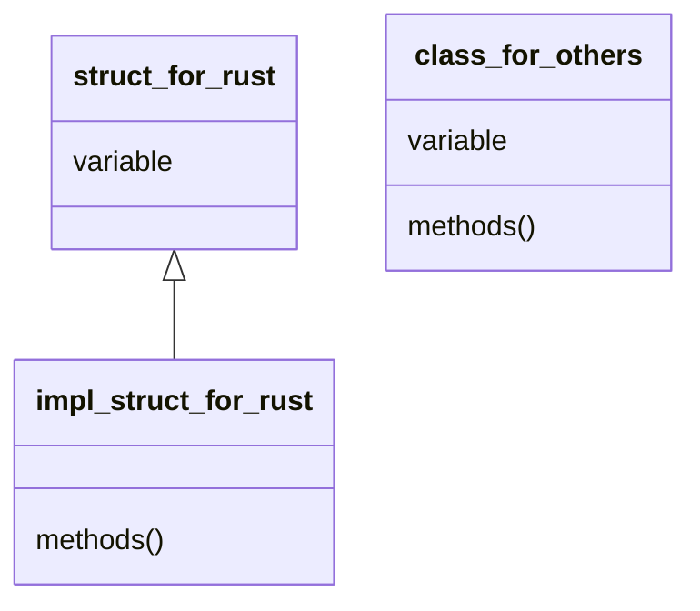

# Installation

use command below to download and install rustup, rustc and cargo, etc:

```shell
curl --proto '=https' --tlsv1.2 https://sh.rustup.rs -sSf | sh
```

if download is to slow, use ustc mirrors:

```shell
export RUSTUP_UPDATE_ROOT=https://mirrors.ustc.edu.cn/rust-static/rustup
export RUSTUP_DIST_SERVER=https://mirrors.ustc.edu.cn/rust-static
```

for Arch Linux, we can use [[Pacman]] to manage packages:

```shell
sudo pacman -S rustup
rustup run --install stable cargo
rustup default stable
```

## Update

```shell
rustup update
```

## Uninstall

```shell
rustup self uninstall
```

## Cargo

cargo will be installed with rust automatically. cargo is a rust lib manager like [[Npm]] or [[Python Module#pip|pip]].

if the speed of download too slow, use mirrors by edit `~/.cargo/config.toml`:
```toml
[source.ustc]
registry = "sparse+https://mirrors.ustc.edu.cn/crates.io-index/"
```

### Create new project

```shell
cargo new <project_name> # create a bin project
cargo new <project_name> --lib # create a lib for rust
```

the standard Package folder:

```
.
├── Cargo.lock
├── Cargo.toml
├── src/
│   ├── lib.rs
│   ├── main.rs
│   └── bin/
│       ├── named-executable.rs
│       ├── another-executable.rs
│       └── multi-file-executable/
│           ├── main.rs
│           └── some_module.rs
├── benches/
│   ├── large-input.rs
│   └── multi-file-bench/
│       ├── main.rs
│       └── bench_module.rs
├── examples/
│   ├── simple.rs
│   └── multi-file-example/
│       ├── main.rs
│       └── ex_module.rs
└── tests/
    ├── some-integration-tests.rs
    └── multi-file-test/
        ├── main.rs
        └── test_module.rs

```

### Add libs

into the project folder(with `Cargo.toml` exists)
```shell
cargo add <lib_name> [--features ...]
```

### Run project

the entry of the project is `fn main()` in `src/main.rs`.

run the project by
```shell
cargo run
cargo run --release # run in release mode
```

build the `target` folder by
```shell
cargo build # debug mode
cargo build --release # release mode
```

the size of bin with release mode is significantly smaller than debug mode.

### diagnostics

```shell
cargo check
```

check if the code could be complied.

rust analyzer = `clippy` + `cargo check`

### `Cargo.toml`

the file where the dependencies defined. just like the `package.json`

the dependencies defined as:
```toml
[dependencies]
hammer = "0.5.0" # added by cargo
rand = { version = "0.8.5", features = ["small_rng"], optional = true } # added by cargo
color = { git = "https://github.com/bjz/color-rs" } # github
geometry = { path = "crates/geometry" } # local
```

more details [here](https://course.rs/cargo/reference/specify-deps.html)

# Variable

in rust, we use `let v = value;` to bind a `value` to the variable `v`. We say "bind" instead "assign" because the [[#Ownership]] of rust.
## Basic Type

### Integer

| length                           | type with sign | type without sign |
| -------------------------------- | -------------- | ----------------- |
| 8 bit                            | i8             | u8                |
| 16 bit                           | i16            | u16               |
| 32 bit(most common)              | i32            | u32               |
| 64 bit(`long` type in cpp)       | i64            | u64               |
| 128 bit(`long long` type in cpp) | i128           | u128              |
| different per architecture       | isize          | usize             |

Literal:

| literal             | example       |
| ------------------- | ------------- |
| decimal             | `10`, `10_00` |
| hexadecimal         | `0xff`        |
| octal               | `0o77`        |
| binary              | `0b11`        |
| byte(only for `u8`) | `b'A'`        |

Overflow:

detect overflow only in `DEBUG` mode. `RELEASE` mode will handle overflow with [[Computer Architecture#two's-Complement|two's complement wrapping]] rule.

- use `wrapping_*` to handle overflow by `two's complement wrapping` in all mode, e.g. `assert_eq!(255u8.wrapping_add(2), 1)`
- use `checked_*` return `None` when overflow occurred, e.g.
	```rust
	if let Some(add) = 255u8.checked_add(1) {
		println!("255 + 1 = {}", add);
	} else {
		println!("255 + 1 overflowed");
	}
	```
- use `overflowing_*` return the value and a boolean variable indicating overflow, e.g.
  ```rust
	let (val, overflowed) = 255u8.overflowing_add(1)
    println!("255 + 1 = {}, overflowed: {}", val, overflowed);
	```
- use `saturating_*` to limit to not more than the maximum value of the target type or less than the minimum value, e.g.
  ```rust
	assert_eq!(100u8.saturating_add(1), 101);
	assert_eq!(u8::MAX.saturating_add(127), u8::MAX);
	```

### Float

- `f32`: same as `float` type
- `f64`: same as `double` type

implement by [[Computer Architecture#Representation of number|IEEE-754]], is the approximation of real number, not exactly.

### NaN

not a number. any operation with `NaN` will return `NaN`.

### Range

Simply use `..=` to generate. Only allowed to use on `integer` or `char`, because they are "distinguishable and continuous"(In fact, they are "discrete").

```rust
for i in 1..=5 {
    println!("{}",i);
}
for i in 'a'..='z' {
    println!("{}",i);
}
```

### Rational and irrational numbers

not in `std` lib. add dependency `num` to `Cargo.toml` to enable them.
```rust
use num::complex::Complex;

fn main() {
	let a = Complex { re: 2.1, im: -1.2 };
	let b = Complex::new(11.1, 22.2);
	let result = a + b;
	
	println!("{} + {}i", result.re, result.im)
}
```

### Char

use `unicode` code set, not `ascii`. so each `Char` occupied 4-byte.

`''` for `Char`, and `""` for String.

### bool

only two value, `true` or `false`

each value occupied 1-byte

### Tuple

totally same as [[Introduce to Computer Science#tuples|python tuple]]

in fact, decompose a tuple is a [[#match|Pattern Match]].
```rust
let (x, y, z) = (1, 2, 3);
// let (x, y) = (1, 2, 3); // error
/*
error[E0308]: mismatched types
 --> src/main.rs:4:5
  |
4 | let (x, y) = (1, 2, 3);
  |     ^^^^^^   --------- this expression has type `({integer}, {integer}, {integer})`
  |     |
  |     expected a tuple with 3 elements, found one with 2 elements
  |
  = note: expected tuple `({integer}, {integer}, {integer})`
             found tuple `(_, _)`
For more information about this error, try `rustc --explain E0308`.
error: could not compile `playground` due to previous error
*/
```
## Composite Type

### String

**Slice**

same as python, use `[..]` to create a slice(similar with [[#Range]] syntax):
```rust
let s = String::from("hello world");
let hello = &s[0..5];
let world = &s[6..11];

let start_to_second = &s[..2];
let third_to_last = &s[3..];

let whole = &s[..];
```

> [!warning]
> the Chinese character in UTF-8 occupied two byte, so `"中国人不骗中国人"[..2]` will make problems, and `"中国人不骗中国人"[..3]` will make no error.
> 
> all the operation with Chinese character should be careful.

also, array has slice.
```rust
let arr = [0, 1, 2, 3, 4, 5];
let slice = &arr[1..3];
```

**String**

the type of literal string is `&str`, a immutable reference of `str`.

`String` is a complex type.

By default, they are both UTF-8 encoded.

```rust
let s: &str = "Hello, world";
let ss: String = String::from(s); // 通过String::from函数, 将&str类型转换为String类型

let ref_ss: &str = &ss; // 直接取引用就可以把String类型转换成&str类型
let ref_ss_2: &str = ss.as_str(); // 或者使用函数 .as_str进行转换
```

`String` type cannot get char by index. turn into `&str` and then use indexing

**operations**

```rust
let mut s = String::from("hello"); // the variable must be mutable
s.push_str(" world"); // append &str, "hello world"
s.push('!'); // append char, "hello world!"

s.insert_str(5, ", "); // insert &str, "hello,  world!"
s.insert(7, '|'); //insert char, "hello, | world!"

let s2 = String::from("Learn rust, use rust."); // replace is not a in-place function, so there is no need to use a mutable keyword.
let new_s = s2.replace("rust", "RUST"); // "Learn RUST, use RUST." case sensitive.
let new_s2 = s2.replacen("rust", "RUST", 1); // "Learn RUST, use rust." replace n-th.
let mut s3 = String::from("learn rust, use rust."); // replace_range is a in-place function, so must use mutable
s3.replace_range(6..10, "R"); // "learn R, use rust." remove the slice, and replace by &str

let mut s4 = String::from("Please delete this string"); // pop is in-place
let p1 = s4.pop(); // p1 = Some('g') is a Option<char> variable, and s4 = "Please delete this strin"
s4.remove(1); // "Pease delete this strin" in-place, no reture value
s4.truncate(3); // "Pea" in-place, truncate with limited length
s4.clear(); // ""

let mut s5 = String::from("left");
let mut s6 = String::from("right");
let res: String = s5 + &s6; // "leftright" RHS must be &str. (&String automatically de-reference to &str). the result will be immutable
let mut res = res + "!"; // "leftright!" use shadowing to make res mutable
res += "!!!"; // "leftright!!!!"
```

### Struct

Define:
```rust
struct struct_name {
	member1: Type,
	member2: Type,
	member3: Type,
}
struct tuple_struct(Type, Type, Type); // we don't care about the member name, such as Point(f32,f32) or Color(u8,u8,u8)
struct unit_struct; // we don't care about the member.
impl SomeTrait for unit_struct {} // we just care the action of this struct

let mut struct_var1 = struct_name {
	member2: init_val2,
	member1: init_val1,
	member3: init_val3,
} // must initialize all variable, not same order

struct_var1.member3 = new_val3; // update val, the strcut variable must be declared as mutable

let member3 = new_val;

let struct_var2 = struct_name {
	member3,
	..struct_var1,
} // same syntax as typescript object, but `..` must be at the last of struct init
```
> [!warning]
> If `Type` be the composite type such as `String`, after update `struct_var2` by `..struct_var1`, the variable `struct_var1.member*` will be move and borrow.
> 
> If we want to use reference in the struct, we must use [[#Lifetime]] specifier.

use macro `#[derive(Debug)]` to allow debug [[#Trait|trait]]:
```rust
#[derive(Debug)]
struct test {
	member: i32
}

let a = test {
	member: 5
}

println!("{:?}, {:#?}", a, a);
/* output:
TestS { member: 1 }, TestS {
    member: 1,
}
*/
```

### Enum

```rust
enum Message {
    Quit, // a single type
    Move { x: i32, y: i32 }, // a struct type
    Write(String), // a type bind a value
    ChangeColor(i32, i32, i32), // a tuple struct
}

fn main() {
    let m1 = Message::Quit;
    let m2 = Message::Move{x:1,y:1};
    let m3 = Message::ChangeColor(255,255,0);
}
```

another example is `Option<T>` with [[#Generics|generics]], use [[#match|match]] to decomposition:
```rust
enum Option<T> {
	Some(T),
	None
}

let x: Option<i32> = ...;
let res = match x {
	Some(i) => Some(i + 1), // lambda, return anything you want
	None => None, // lambda
};
```

### Array

```rust
let a: [i32; 5] = [1,2,3,4,5]; // Type: [Type; length], fixed length
let i = a[0]; // get element by index
let repeat_arr = [3; 5]; // [3,3,3,3,3] repeat first element
// if the first element doesn't impl a Copy trait, use from_fn
let repeat_str: [String; 8] = std::array::from_fn(|_i| String::from("repeated"));
```

full example:
```rust
fn main() {
	// 编译器自动推导出one的类型
	let one             = [1, 2, 3];
	// 显式类型标注
	let two: [u8; 3]    = [1, 2, 3];
	let blank1          = [0; 3];
	let blank2: [u8; 3] = [0; 3];
	
	// arrays是一个二维数组，其中每一个元素都是一个数组，元素类型是[u8; 3]
	let arrays: [[u8; 3]; 4]  = [one, two, blank1, blank2];
	
	// 借用arrays的元素用作循环中
	for a in &arrays {
		print!("{:?}: ", a);
		// 将a变成一个迭代器，用于循环
		// 你也可以直接用for n in a {}来进行循环
		for n in a.iter() {
			print!("\t{} + 10 = {}", n, n+10);
		}
		
		let mut sum = 0;
		// 0..a.len,是一个 Rust 的语法糖，其实就等于一个数组，元素是从0,1,2一直增加到到a.len-1
		for i in 0..a.len() {
			sum += a[i];
		}
		println!("\t({:?} = {})", a, sum);
	}
}
```

## Collection Type

### Vector

create by macro `vec!` or `Vec::new()`
```rust
let vv: Vec<i32> = Vec::new();
let mut v = vec![1, 2, 3]; // create and assign
let vvv = vec![0; 3];   // 默认值为 0，初始长度为 3
let v_from = Vec::from([0, 0, 0]);
let mut vc = Vec::with_capacity(10); // define capacity, avoid copy

v.push(1); // update

let third: &i32 = &v[2];
match v.get(2) { // .get will return a Option<T>, indicating whether out of bound
    Some(third) => println!("第三个元素是 {third}"),
    None => println!("去你的第三个元素，根本没有！"),
}
```

reference: 
```rust
let mut v = vec![1, 2, 3, 4, 5];

let first = &v[0]; // immutable reference

v.push(6); // error here, this is a mutable reference, conflict with &v[0]

println!("The first element is: {first}");
```

iteration:
```rust
let mut v = vec![1, 2, 3];
for i in &mut v {
    *i += 10
}
```

normal usage:
```rust
let mut v =  vec![1, 2];
assert!(!v.is_empty());         // 检查 v 是否为空

v.insert(2, 3);                 // 在指定索引插入数据，索引值不能大于 v 的长度， v: [1, 2, 3] 
assert_eq!(v.remove(1), 2);     // 移除指定位置的元素并返回, v: [1, 3]
assert_eq!(v.pop(), Some(3));   // 删除并返回 v 尾部的元素，v: [1]
assert_eq!(v.pop(), Some(1));   // v: []
assert_eq!(v.pop(), None);      // 记得 pop 方法返回的是 Option 枚举值
v.clear();                      // 清空 v, v: []

let mut v1 = [11, 22].to_vec(); // append 操作会导致 v1 清空数据，增加可变声明
v.append(&mut v1);              // 将 v1 中的所有元素附加到 v 中, v1: []
v.truncate(1);                  // 截断到指定长度，多余的元素被删除, v: [11]
v.retain(|x| *x > 10);          // 保留满足条件的元素，即删除不满足条件的元素

let mut v = vec![11, 22, 33, 44, 55];
// 删除指定范围的元素，同时获取被删除元素的迭代器, v: [11, 55], m: [22, 33, 44]
let mut m: Vec<_> = v.drain(1..=3).collect();    

let v2 = m.split_off(1);        // 指定索引处切分成两个 vec, m: [22], v2: [33, 44]

let v3 = vec![11, 22, 33, 44, 55];
let slice = &v3[1..=3]; // slice
assert_eq!(slice, &[22, 33, 44]);
```

sort: stable sort will slow a little and need more space.
```rust
let mut vec = vec![1, 5, 10, 2, 15];    
vec.sort_unstable();    
assert_eq!(vec, vec![1, 2, 5, 10, 15]);
```

for float, need use `partial_cmp` to sort:
```rust
let mut vec = vec![1.0, 5.6, 10.3, 2.0, 15f32];    
vec.sort_unstable_by(|a, b| a.partial_cmp(b).unwrap());    
assert_eq!(vec, vec![1.0, 2.0, 5.6, 10.3, 15f32]);
```

for struct, implement `Ord` trait or use `#[derive(Ord, Eq, PartialEq, PartialOrder)]` to sort. the order of compare depends on the order of definition of members:
```rust
#[derive(Debug, Ord, Eq, PartialEq, PartialOrd)]
struct Person {
    name: String,
    age: u32,
}

impl Person {
    fn new(name: String, age: u32) -> Person {
        Person { name, age }
    }
}

fn main() {
    let mut people = vec![
        Person::new("Zoe".to_string(), 25),
        Person::new("Al".to_string(), 60),
        Person::new("Al".to_string(), 30),
        Person::new("John".to_string(), 1),
        Person::new("John".to_string(), 25),
    ];

    people.sort_unstable(); // first compare name, then compare age

    println!("{:?}", people);
}
```

### Hash Map

use [[Algorithm and Data Structure#hash函数|Hash Function]] to build a [[Algorithm and Data Structure#HashTable|Hash Table]]
#### create
```rust
use std::collections::HashMap;

// 创建一个HashMap，用于存储宝石种类和对应的数量
let mut my_gems = HashMap::new();

// 将宝石类型和对应的数量写入表中
my_gems.insert("红宝石", 1);
my_gems.insert("蓝宝石", 2);
my_gems.insert("河边捡的误以为是宝石的破石头", 18);

// or by other collection
let teams_list = vec![
	("中国队".to_string(), 100),
	("美国队".to_string(), 10),
	("日本队".to_string(), 50),
];

let mut teams_map = HashMap::new();
// for team in &teams_list {
// 	teams_map.insert(&team.0, team.1);
// }
let teams_map: HashMap<String, i32> = teams_list.into_iter().collect(); // need explicit declare type here
```
#### Query
```rust
use std::collections::HashMap;

let mut scores = HashMap::new();

scores.insert(String::from("Blue"), 10);
scores.insert(String::from("Yellow"), 50);

let team_name = String::from("Blue");
let score: Option<&i32> = scores.get(&team_name); // None for not exist. use reference to avoid movement of onwership

for (key, value) in &scores { // get all key-value pair
    println!("{}: {}", key, value);
}
```
#### Update
```rust
use std::collections::HashMap;

let mut scores = HashMap::new();

scores.insert("Blue", 10);

// 覆盖已有的值
let old = scores.insert("Blue", 20);
assert_eq!(old, Some(10));

// 查询新插入的值
let new = scores.get("Blue");
assert_eq!(new, Some(&20));

// 查询Yellow对应的值，若不存在则插入新值
let v = scores.entry("Yellow").or_insert(5);
assert_eq!(*v, 5); // 不存在，插入5

// 查询Yellow对应的值，若不存在则插入新值
let v = scores.entry("Yellow").or_insert(50);
assert_eq!(*v, 5); // 已经存在，因此50没有插入
```

## Mutable

the variable is immutable by default. Use keyword `mut` to make the variable mutable.

### Constants

use keyword `const` with explicit type:
```rust
const VERSION: &str = "0.1.0"
```

## Shadowing

```rust
let x = 5;
// 在作用域内对之前的x进行遮蔽
let x = x + 1;
{
	// 在当前的花括号作用域内，对之前的x进行遮蔽
	let x = x * 2;
	println!("The value of x in the inner scope is: {}", x);
}
println!("The value of x is: {}", x);

// 字符串类型
let spaces = "   ";
// usize数值类型 可行的
let spaces = spaces.len();
// 但是mut的变量不能直接绑定, 需要创建新的变量进行遮蔽(shadowing)才行
let mut wrong_example = "  ";
// wrong_example = wrong_example.len(); // 报错: mismatched types
```
## Decomposition

use tuple for decomposition:
```rust
let (m, mut n): (bool,bool) = (true, false); // m = true,不可变; n = false，可变
n = true;

let (a, b, c, d, e);
(a, b) = (1, 2);
// _ 代表匹配一个值，但是我们不关心具体的值是什么，因此没有使用一个变量名而是使用_
// .. 表示多个变量, 和Python NumPy中的...基本完全一样
[c, .., d, _] = [1, 2, 3, 4, 5];
Struct { e, .. } = Struct { e: 5 };
assert_eq!([1, 2, 1, 4, 5], [a, b, c, d, e]);
```
## Ownership

To simplify, each value is owned by a owner. Binding the value to a variable means, make the variable be the owner of the value, which the previous owner will lose the ownership of this value.

rules:
1. each value was owned by a variable, which called owner
2. each value was only able to be owned one variable at the same time, which means each value can only have one owner
3. the value will be dropped when the owner(variable) is going to leave the scope

### Copy and Move

```rust
let x = 1;
let y = x;
```

The upper code is **Copy**, because `x` is variable with [[#Basic Type]] value,

However, this is not copy, but **Move**:
```rust
let s1 = String::from("hello");
let s2 = s1;
```
because `String` is not a Basic Type.

The combination of basic type could always be copied. The immutable reference could be copied, but mutable reference could not be copied.
### Clone

deep copy, or clone

rust will never automatically clone a variable.
```rust
let s1 = String::from("hello");
let s2 = s1.clone();

println!("s1 = {}, s2 = {}", s1, s2);
```

Then, if a type implement copy or clone [[#Trait|trait]], copy/clone it.

Otherwise, move it, and lose its ownership.
### Reference

normal reference is a pointer:
```rust
let x = 5;
let y = &x;
*y += 5;
println!("{}, {}", x, *y)
```

use reference as function argument type to avoid ownership change. but reference is immutable by default.

use `&mut` to create a mutable reference: `let y = &mut x;`

attention here, there can be only one mutable reference in one scope, and mutable and immutable references cannot exist at the same scope. immutable reference could be many at same scope.

#### Hanging Reference

return a reference in the function:
```rust
fn danger() -> &String {
	let s = String::from("Error");
	&s // compiler error: this function's return type contains a borrowed value, but there is no value for it to be borrowed from.
}
```

need [[#Lifetime]] specifier

or the better way is return `String` directly:
```rust
fn no_danger() -> String {
	let s = String::from("Error");
	s
}
```
### Reference Loop

To determine whether a value is still needed, rust introduce the **Reference Count**.

当创建一个引用(strong reference. 一般而言, 引用默认创建strong reference)的时候, 对应value的reference counter加一. 当这个引用被释放(drop)的时候, reference counter减一. 当reference counter为零的时候, 这个value会被释放掉.

但是如果有引用循环的情况, 会导致问题:
```rust
let x = Rc::new(RefCell::new(ListNode::new("x"))); // The internal counter of x is initialized to 1.
let y = Rc::new(RefCell::new(ListNode::new("y"))); // The internal counter of y is initialized to 1.

x.borrow_mut().next.replace(Rc::clone(&y));
y.borrow_mut().prev.replace(Rc::clone(&x));
// Now x owns y and y owns x. Both counters count to 2.

drop(x); // The counter of x decrements to 1, because y still owns x.
drop(y); // Memory leak here:  We no longer own y, so the counter of y decrement by 1. However x still owns y, so the counter of y still counts to 1. We can neither access x or y, nor drop them. This is memory leak.
```

因此, 使用weak reference, 只创建引用, 不添加引用计数:
```rust
​let mut x = Rc::new(ListNode::new("x"));
​let mut y = Rc::new(ListNode::new("y"));
​// Both counter count to 1
​x.next = Rc::clone(y); // Now y counts to 2.
​y.prev = Rc::downgrade(&x); // But x still counts to 1.
​drop(x);
​// x now counts to 0, so x is dropped.
​// x no longer owns y, so y's reference count decrements by 1.
// We can check this via Rc::strong_count.
​assert_eq!(Rc::strong_count(&y), 1);
​drop(y); // Now y counts to 0, too. No memory leaks, yay!
```

# Lifetime

%% TODO %%

# Syntax

## Expression and Statement

statement is ended by semicolons `;`, complete a specific operation, with no return value

expression will compute the value and return it.
```rust
fn main() {
    let y = {
        let x = 3; // statement
        x + 1 //return value 4, expression
    }; // statement, but the bracket is a expression with return value 4

    println!("The value of y is: {}", y) // also a expression, with return value () (tuple)
}
```
## Function

define by prepend `fn` and (optional) return value
```rust
fn functino_name(arg1: Type1, arg2: Type2) -> ReturnType {
	...
}
```

return value `!` means this function never return.
```rust
fn loop_forever() -> ! {
	loop {
		...
	};
}
fn dead_end() -> ! {
	panic!("Error!");
}
```

# Control flow

## if-else

```rust
if condition {
	// ...
} else if condition2 {
	// ...
} else {
	// ...
}
```

the `if-else` block is [[#Expression and Statement|Expression]]. so you can do this:
```rust
let a = if condition {
	// ...
	b // return val, because no `;` at the end
} else {
	// ...
	c // return val
}; // this is a statement(from `let` to here), so don't forget adding a semicolon
```

## for loop

```rust
for element in iterator {
	// ...
}
```

pay attention for ownership:

| usage                         | equal usage                                       | ownership        |
| ----------------------------- | ------------------------------------------------- | ---------------- |
| `for item in collection`      | `for item in IntoIterator::into_iter(collection)` | move             |
| `for item in &collection`     | `for item in collection.iter()`                   | immutable borrow |
| `for item in &mut collection` | `for item in collection.iter_mut()`               | mutable borrow   |

use `.iter().enumerate()` to get index `for (index, val) in collection.iter().enumerate()` same as python

**continue**

skip current term, continue the next term

**break**

stop loop

## while loop

```rust
while condition {
	// loop ...
}
```

use break and condition to control the loop

no condition loop is defined as
```rust
loop {
	// ...
	if condition {
		break;
	}
	// ...
}
```

## match

```rust
match target {
    模式1 => 表达式1,
    模式2 => {
        语句1;
        语句2;
        表达式2
    },
    _ => 表达式3 // default
}
```

example
```rust
enum Coin {
    Penny,
    Nickel,
    Dime,
    Quarter(UsState), // bind a value here
}

fn value_in_cents(coin: Coin) -> u8 {
    match coin {
        Coin::Penny =>  {
            println!("Lucky penny!");
            1
        },
        Coin::Nickel => 5,
        Coin::Dime => 10,
        Coin::Quarter(state) => {
            println!("State quarter from {:?}!", state); // get the value bind with Coin::Quarter
            25
        },
    }
}

enum IpAddr {
   Ipv4,
   Ipv6
}

fn main() {
    let ip1 = IpAddr::Ipv6;
    let ip_str = match ip1 {
        IpAddr::Ipv4 => "127.0.0.1",
        _ => "::1", // match must exhaust all the patterns, which means, each pattern have a handler.
    };

    println!("{}", ip_str);
}
```

if you only want to match one pattern and ignore others, use `if-let`:
```rust
let a = Option<T> = ...;
if let Some(i) = a {
	// i could be a variable or value
	// handle case a == Some(i) here. if i is value, this is just a condition
	// if i is variable, here bind value from a to i
}
```

`while-let` is also available:
```rust
// Vec是动态数组
let mut stack = Vec::new();

// 向数组尾部插入元素
stack.push(1);
stack.push(2);
stack.push(3);

// stack.pop从数组尾部弹出元素
while let Some(top) = stack.pop() {
    println!("{}", top);
}
```
### macro `matches!`

match a variable by pattern, and return the result `ture` or `false`:
```rust
enum MyEnum {
    Foo,
    Bar
}
let v = vec![MyEnum::Foo,MyEnum::Bar,MyEnum::Foo];
v.iter().filter(|x| matches!(x, MyEnum::Foo));

let foo = 'f';
assert!(matches!(foo, 'A'..='Z' | 'a'..='z'));

let bar = Some(4);
assert!(matches!(bar, Some(x) if x > 2));
```

# Class

## Methods

rust v.s. others:


```rust
struct Circle {
    x: f64,
    y: f64,
    radius: f64,
}

impl Circle {
    // new是Circle的关联函数，因为它的第一个参数不是self，且new并不是关键字 或者说叫做Class function
    // 这种方法往往用于初始化当前结构体的实例
    fn new(x: f64, y: f64, radius: f64) -> Circle {
        Circle {
            x: x,
            y: y,
            radius: radius,
        }
    }

    // Circle的方法，&self表示借用当前的Circle结构体
    fn area(&self) -> f64 {
        std::f64::consts::PI * (self.radius * self.radius)
    }
}
```

> [!warning]
> the argument `self` still has ownership. usually `&self` to use reference, sometimes `&mut self` to use mutable reference. seldom use `self` directly.

rust allow us to use multiple `impl` block:
```rust
impl Rectangle {
    fn area(&self) -> u32 {
        self.width * self.height
    }
}

impl Rectangle {
    fn can_hold(&self, other: &Rectangle) -> bool {
        self.width > other.width && self.height > other.height
    }
}
```

also, we can implement method for [[#Variable#Enum|enum]]:
```rust
enum Message {
    Quit,
    Move { x: i32, y: i32 },
    Write(String),
    ChangeColor(i32, i32, i32),
}

impl Message {
    fn call(&self) {
        // 在这里定义方法体
    }
}
```

## Generics

泛型

use generics will not cause speed down. but may cause bigger bin file and slow compile speed.

use `<T>` to declare a generics.

use [[#Trait#trait bound|trait]] and `where` to limit generics:

```rust
fn add<T: std::ops::Add<Output = T>>(a:T, b:T) -> T {
    a + b
}

use std::fmt::Display;

fn create_and_print<T>() where T: From<i32> + Display {
    let a: T = 100.into(); // 创建了类型为 T 的变量 a，它的初始值由 100 转换而来
    println!("a is: {}", a);
}

fn main() {
    create_and_print::<i64>();
}
```

in struct:
```rust
struct Point<T,U> {
    x: T,
    y: U,
}
impl<T,U> Point<T,U> { // still need to declare here
    fn x(&self) -> &T {
        &self.x
    }
    fn mixup<V, W>(self, other: Point<V, W>) -> Point<T, W> { // and can declare new generics
        Point {
            x: self.x,
            y: other.y,
        }
    }
}
impl Point<f32,f32> { // define function only for type Point<f32,f32>
    fn distance_from_origin(&self) -> f32 {
        (self.x.powi(2) + self.y.powi(2)).sqrt()
    }
}
fn main() {
    let p = Point{x: 1, y :1.1};
}
```

in enumerate:
```rust
enum Result<T, E> {
    Ok(T),
    Err(E),
}
```

### const generics

for array, we have type `[item_type; length]`. if we have many array with different size and we want to use a function to print the array, we need to use const generics for length:
```rust
fn display_array<T: std::fmt::Debug, const N: usize>(arr: [T; N]) { // make generics enable debug print by using trait std::fmt::Debug
    println!("{:?}", arr);
}
fn main() {
    let arr: [i32; 3] = [1, 2, 3];
    display_array(arr);

    let arr: [i32; 2] = [1, 2];
    display_array(arr);
}
```

## Trait

trait is a group of methods. since you implement the trait, you can call all the methods defined by this trait.

you can regard it as the base class with virtual method.
```rust
pub trait Summary { // trait
    fn summarize(&self) -> String {
        format!("(Read more from {}...)", self.summarize_author())
    }
    fn summarize_author(&self) -> String;
}
pub struct Post {
    pub title: String, // 标题
    pub author: String, // 作者
    pub content: String, // 内容
}

impl Summary for Post {
    fn summarize(&self) -> String {
        format!("文章{}, 作者是{}", self.title, self.author)
    }
    fn summarize_author(&self) -> String {
        format!("@{}", self.username)
    }
}

pub struct Weibo {
    pub username: String,
    pub content: String
}

impl Summary for Weibo {
    fn summarize_author(&self) -> String {
        format!("@{}", self.username)
    }
}

fn main() {
    let post = Post{title: "Rust语言简介".to_string(),author: "Sunface".to_string(), content: "Rust棒极了!".to_string()};
    let weibo = Weibo{username: "sunface".to_string(),content: "好像微博没Tweet好用".to_string()};

    println!("{}",post.summarize()); // override
    println!("{}",weibo.summarize()); // use default impl
}
```

### trait argument

```rust
pub fn notify(item: &impl Summary) {
    println!("Breaking news! {}", item.summarize());
}
```

the argument `item` should implement the trait `Summary`

### trait bound

is just a syntactic sugar.

```rust
pub fn notify(item: &(impl Summary + Display), other: &(impl Summary + Display)) {}

pub fn notify<T: Summary + Display>(item: &T, other: &T) {
	println!("Breaking news! {} \n {}", item.summarize(), other.summarize());
}
```

#### `where` bound

```rust
fn some_function<T: Display + Clone, U: Clone + Debug>(t: &T, u: &U) -> i32 {}

fn some_function<T, U>(t: &T, u: &U) -> i32
    where T: Display + Clone, U: Clone + Debug
{}
```

### derive trait

automatically generate implementation for trait.

[details here](https://course.rs/appendix/derive.html)

### trait object

use keyword `dyn` to declare a trait object type:
```rust
trait Draw {
    fn draw(&self) -> String;
}

impl Draw for u8 {
    fn draw(&self) -> String {
        format!("u8: {}", *self)
    }
}

impl Draw for f64 {
    fn draw(&self) -> String {
        format!("f64: {}", *self)
    }
}

// 若 T 实现了 Draw 特征， 则调用该函数时传入的 Box<T> 可以被隐式转换成函数参数签名中的 Box<dyn Draw>
// Box means a reference force storage on heap
fn draw1(x: Box<dyn Draw>) {
    // 由于实现了 Deref 特征，Box 智能指针会自动解引用为它所包裹的值，然后调用该值对应的类型上定义的 `draw` 方法
    x.draw();
}

fn draw2(x: &dyn Draw) {
    x.draw();
}

fn main() {
    let x = 1.1f64;
    // do_something(&x);
    let y = 8u8;

    // x 和 y 的类型 T 都实现了 `Draw` 特征，因为 Box<T> 可以在函数调用时隐式地被转换为特征对象 Box<dyn Draw> 
    // 基于 x 的值创建一个 Box<f64> 类型的智能指针，指针指向的数据被放置在了堆上
    draw1(Box::new(x));
    // 基于 y 的值创建一个 Box<u8> 类型的智能指针
    draw1(Box::new(y));
    draw2(&x);
    draw2(&y);
}
```

this is different between `Box<T>` and `Box<dyn Trait>`:
![[Pasted image 20250328215644.png]]

