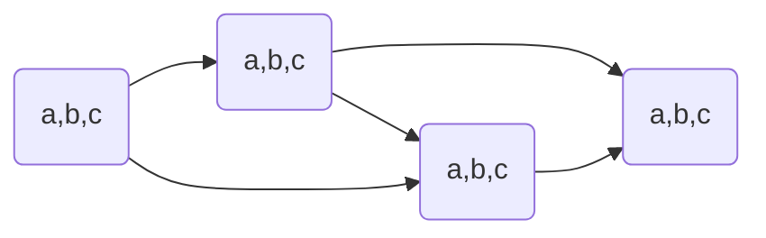
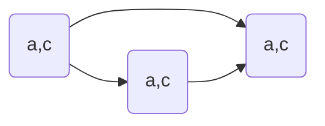

# Introduce
> [!note]- slide
> ![[CS181-01-Introduction.pdf]]

# Search
> [!note]- slide
> ![[CS181-02-Search.pdf]]

e.g. 
- problem: pathing
  - states: (x,y) location
  - action: NSEW
  - successor: update location only
  - goal test: is (x,y) = END
- problem: eat-all-dots
  - states: (x,y) dot boolean
  - action: NSEW
  - successor: update location and possibly a dot boolean
  - goal: all dots false


## 状态空间 states:

World State:

e.g. Pacman
- parameters
  - Agent position: 120
  - Food count: 30
  - Ghost: 12
  - Agent facing: NSEW
- World States:
  - Agent position: 120
  - food count: 2^30
  - Ghost: 12*12
  - Agent facing: 4
  - total: 120 * 2^30 * 12*12 * 4
- state of pathing: 120
- states for eat-all-dots: 120 * 2^30

针对不同的问题会有不同大小的解空间


状态空间越少越好, 状态空间越大, 搜索越多

### 状态空间图 State Space Graph

很少使用这种状态空间图, 因为保存的内容太多了

所以使用另外的一种算法

### 搜索树 Search Tree

当前状态作为一个根节点, 然后可以往不同决策行进

![[CS181-02-Search.pdf#page=12&rect=169,239,801,439|CS181-02-Search, p.12]]

是一种"what if"树

每一个子节点都表示一种可能性(successor)

依然是无法表达出整个状态空间

- `b`: branching factor: 表示一个节点可以扩展多少子节点
- `m`: maximum depth: 搜索可能达到的最深的路径

#### fringe

边缘

维护所有已扩展的路径中的叶子节点的路径(从根节点到该节点的路径)

更新: 选择一个fringe里面的叶子节点, 然后扩展到其子节点.

#### err

如果图上有环, 那么会导致搜索可能陷入循环, 导致没有optimal

优化: never expand a state twice. 只对某一个state搜索一次, 第二次直接停止.

不会破坏completeness, 因为所有节点还是会被访问到

### different between search graph and search tree
![[CS181-02-Search.pdf#page=13&rect=100,94,875,433|CS181-02-Search, p.13]]

## 搜索

属性

- complete: 是否能找到完整的节点
- optimal: 能否找到最优解
- time complexity
- space complexity

b是branching factor: 表示多少种不同的选择

m是最大深度, 选择的次数

solutions可能在任意深度

一共有$b+b^2+\cdots+b^m=O(b^m)$

![[CS181-02-Search.pdf#page=16&rect=407,103,868,347|CS181-02-Search, p.16]]

#### DFS

depth-first search

![[CS181-02-Search.pdf#page=20&rect=463,166,931,421|CS181-02-Search, p.20]]

使用stack来存储

- complete: 如果深度有限那么是完整的
- optimal: 只找到了最左侧的解, 但是并没有考虑深度问题, 所以不是optimal
- time: $O(b^m)$
- space: $O(bm)$

#### BFS

breadth-first search

![[CS181-02-Search.pdf#page=23&rect=469,165,923,414|CS181-02-Search, p.23]]

- complete: yes
- optimal: 如果每一条边的cost是1, 那么才是optimal的

- time: $O(b^s)$, 其中$s$表示搜索结果的层级
- space: $O(b^s)$

#### Iterative Deepening

- 限制深度为1, 进行DFS, 判断是否有解
- 如果无解, 那么限制深度为2, 进行DFS, 判断是否有解
- ...

上一层的时间复杂度远远小于下一层的时间复杂度, 每一层指数增长, 上一层的搜索对下一层可以忽略不计, 因此实用性比较好

### Cost-Sensitive Search

每个状态的转移具有不同的花费.

#### Uniform Cost Search(UCS)

strategy: 展开cost最小的node

![[CS181-02-Search.pdf#page=30&rect=574,164,930,412|CS181-02-Search, p.30]]

- complete:
- optimal
- time: $b^\frac{C^*}{\varepsilon}$
- space: 存储到priority queue内部, 比较的是cumulative cost. 

假设最小的花费(最优解)是$C^*$, 并且这条路上的最小花费是$\varepsilon$, 那么有效路径长度大概是$\frac{C*}{\varepsilon}$

缺点: 展开的过程中, 所有展开的距离(cost)是相同的

## Model

agent对于world state的一种建模. 需要基于这个建模进行Planning和Searching

e.g. 出门是否带伞: Model: 看了天气预报 / Model: 随机带伞

### Search Heuristics

目标函数: 搜索使靠近$h(goal)=0$

#### Greedy Search

贪心算法: 只考虑当前状态的最优解

best cases:

![[CS181-02-Search.pdf#page=40&rect=620,260,868,445|CS181-02-Search, p.40]]

worst cases:

![[CS181-02-Search.pdf#page=40&rect=620,55,874,242|CS181-02-Search, p.40]]

#### A* Search

uniform-cost search: backward cost 路径的花费: $g(n)$

greedy search: forward cost 未来估计价值: $h(n)$

A* search: $f(n)=g(n)+h(n)$

![[CS181-02-Search.pdf#page=44&rect=30,5,953,358|CS181-02-Search, p.44]]

- complete: 需要让$h(n)$是admissible: $0<h(n)<h^*(n)$其中$h^*(n)$是真实距离
- optimal: 

  假设:
  - 任意节点$n$, 最优解$A$, 次优解$B$
  
  Claim:
  - A will exit fringe before B

    A比B先弹出fringe, 表示A会先进行is_goal的测试

  Proof:
  - $$\text{admissive}\Rightarrow h(n)\leq h^*(n)=g(A)-g(n)$$
    $$h(A)=0\Rightarrow f(A)=g(A)\Rightarrow h(n)\leq f(A)-g(n)$$
    $$\Rightarrow h(n)+g(n)\leq f(A)\Rightarrow f(n)\leq f(A)$$
    因此, 节点$n$一定在节点$A$之前找到
  - $$\text{A is optimal and B is  suboptimal}\Rightarrow g(A)<g(B)$$
    $$\text{A, B are goal}\Rightarrow h(A)=h(B)=0\Rightarrow f(A)<f(B)$$
    $$\Rightarrow f(n)\leq f(A)<f(B)$$
    $$\Rightarrow\text{n比B先expand}$$
  - A的所有祖先节点都比B先expand
  - A比B先expand
  
  所以是optimal的

heuristics越接近真实cost, 搜索代价就越小

##### admissible

$0<h(n)<h^*(n)$其中$h^*(n)$是真实距离
##### consistency

$h(A)-h(C)\leq h^*(A-C)$

其中$h^*(A-C)$表示A到C的实际距离

consistency可以推出admissible
$$
h(C)=h(C)-h(goal)\leq h^*(C-goal)=h^*(C)
$$

# CSP

constraint satisfaction problems约束满足问题(约束求解)

Search问题的最终goal是一个固定的state, 但是CSP的每一次搜索之后都需要重新判断goal的state

state有一个变量$X_i$, 属于一个域$Domain$

e.g. 四色问题

- Variable: 不同区域
- Domain: $D=\{\text{different colors}\}$
- constraint:
  - implicit: 区域$\neq$区域
  - explicit: $(\text{区域,区域})\in\{(\text{颜色,颜色}),\cdots\}$

e.g. N皇后问题

- Formulation 1:
  - Variables: $X_{ij}$不同棋盘位置
  - Domains: $\{0,1\}$
  - constraints:
    - $\forall i,j,k, (X_{ij},X_{jk})\in\{(0,0),(1,0),(0,1)\},i\neq k\text{ or }j\neq k$
    - $\forall i,j,k,(X_{ij},X_{i+k,j\pm k})\in\{(0,0),(1,0),(0,1)\}$
    - $\sum_{ij} X_{ij}=N$
- Formulation 2:
  - 不能有相互威胁的存在


unary一元约束: $X\neq red$

Bin二元约束: $X\neq Y$

Higher-order: 更多变量之间的约束

soft: preferences, 更倾向于某些选择而不是强制约束, 经常使用不同选择有不同cost来确定(在Bayes Net部分cover)

## Solving

- 初始状态: 空的assignment, {}
- Successor function: 给一个未赋值的变量赋值
  - 变量的赋值是可交换的, 所以需要一个固定的赋值顺序
    - e.g. `[WA = red then NT = green] == [NT = green then WA = red]`
  - 但是赋值的顺序会影响搜索的效率
- goal test: 所有的变量是complete的并且满足所有的约束条件

### Backtracking Search

在DFS的基础上的优化

每走一步都进行计算判断是否满足约束, 如果不满足, 那么回溯

```pseudocode
function BACKTRACKING-SEARCH(csp) returns solution/failure
	return RECURSIVE-BACKTRACKING({}, csp)
function RECURSIVE-BACKTRACKING(assignment, csp) returns solution/failure
	if assignment is complete then return assignment
	var <- SELECT-UNASSIGNED-VARIABLE(VARIABLES[csp],assignment,csp)
	for each value in ORDER-DOMAIN-VALUES(var, assignment, csp) dp
		if value is consistent with assignment given CONSTRAINTS[csp] then
			add {var=value} to assignment
			result <- RECURSIVE-BACKTRACKING(assignment, csp)
			if result != failure then return result
			remove {var=value} from assignment
	return failure
```

## Improving

filtering: 能否直接找到不满足的情况

ordering: 哪些变量应该先赋值

Structure: 利用问题建模的结构

### filtering

#### 剪枝(forward checking)

每一次赋值, 去掉不满足的assignment(对整个图进行遍历一边). 如果出现了某一个state没有值可选, 那么直接停止搜索, 进行回溯

速度变快, 但是数据结构变复杂

#### 约束传递(Constraint Propagation)

每一次赋值之后, 将这个赋值的约束传递给所有未被赋值的state

e.g.



$1.\{(a,b,c),(a,b,c),(a,b,c),(a,b,c)\}\Rightarrow\text{检查2,3}\{(A),(b,c),(b,c),(a,b,c)\}\Rightarrow\text{检查4}\{(A),(b,c),(b,c),(a)\}$

$2.\{(A),(b,c),(b,c),(a)\}\Rightarrow\text{检查3,4}\{(A),(B),(c),(a)\}\Rightarrow\text{重新检查4}\{(A),(B),(c),(a)\}$

...

原理: 在每一次确定一个选项之后, 去判断相邻且未选择的state中,是否有值能满足constraint. 即, 遍历Domain中所有可选的值, 判断如果选这个能否还能满足constraint

缺点: 



无法提前结束, 但是这种情况无解

#### 弧相容(Consistency of Arc)

将相互约束的两个state之间的无向边理解成相互指向的有向边.

一个约束弧`Arc` $X\rightarrow Y$ 是相容的 当且仅当 tail $X$中每一个value $x$在head $Y$中有一个$y$可以满足约束

方向: 未赋值变量指向正在赋值的节点之间的所有弧

如果head $Y$因为constraint失去了value, 那么所有指向$Y$的tail $X$都需要重新进行遍历

Algorithm:

1. 将CSP约束图中所有的弧存入队列Q中
2. 从Q中pop一个arc, 并强制要求每一个正在移除的弧$X_i\rightarrow X_j$中, 对tail $X_i$的每一个剩余的值$x$都有一个head $X_j$中的值$y$能够满足约束
   - 如果不存在$y$使得$x$满足约束, 需要将$x$从$X_i$的domain中移除
3. 如果有任意值在$X_i$中被移除, 将所有的$\forall k\ s.t.\ X_k\rightarrow X_i$的弧push入Q中
4. 重复操作, 直到$Q=\emptyset$或者某一个$X_k$的domain为空

```pseudocode
function AC_3(csp) returns the CSP, possibly with reduced domains
    inputs: csp, a binary CSP with variables {X1, X2, ... Xn}
    local variables: queue, a queue of arcs, initially all the arcs in csp
    while queue is not empty do
        (Xi,Xj) <- REMOVE-FIRST(queue)
        if REMOVE-INCONSISTENT-VALUES(Xi, Xj) then
            for each Xk in NEIGHBORS[Xk] do
                add (Xk, Xi) to queue
function REMOVE-INCONSISTENT-VALUES(Xi, Xj) returns true iff succeeds
	removed <- false
	for each x in DOMAIN[Xi] do
		if no value y in DOMAIN[Xj] allows (x,y) to satisfy the constraint Xi <- Xj
			then delete x from DOMAIN[Xi]
			removed <- true
	return removed
```

e.g.

![[Pasted image 20241016141415.png]]

initial: `Q=[SA->V,V->SA,SA->NSW,NSW->SA,SA->NT,NT->SA,V->NSW,NSW->V]`

- `SA->V`

  `SA: blue` satisfy the constraint

  No value will be removed

- `V->SA`

  `V: blue` violate the constraint

  remove blue from domain of `V`

  re-add `SA->V` into queue(`NSW->V` is already in queue): `Q=[SA->NSW,NSW->SA,SA->NT,NT->SA,V->NSW,NSW->V,SA->V]`

  ![[Pasted image 20241016141956.png]]

- ...

- `NSW->SA`

  ![[Pasted image 20241016142151.png]]

  the domain of `SA` is empty$\rightarrow$backtracking

Complexity:

最坏情况下时间复杂度是$O(ed^3)$, 其中$e$为弧(有向边的数量, 即无向边数量$\times2$), d为最大domain的大小

每一条弧最多插入队列$d$词, 每一次相容性检验需要$O(d^2)$, 因此最多有$O(n^2d^3)$

> [!tip]
> 但是听说可以通过数据结构优化至 $O(n^2d^2)$ , 但具体方法未给出

### ordering

#### Minimal Remain Value

每次对最少选择的(约束最多的)state做选择

#### Least Constraining Value

每次选择最少受限的值, 因为这样最有可能找到可行解

### structure

#### Tree Structure CSP

$O(d^n)\Rightarrow O(nd^2)$

需要保证不存在环

![[CS181-03-CSP.pdf#page=38&rect=72,184,878,361|CS181-03-CSP, p.38]]

1. 无向无环图的任意节点都可以作为树, 因此只需要任选一个节点作为树根
2. 将无向边转换为指向根节点反向的有向边, 拓扑排序, 即可将无向图线性化
3. Remove Backward: `For i = n:2, apply RemoveInconsistent(Parent(Xi),Xi)`
4. Assign Forward: `For i = 1:n, assign Xi consistently with Parent(Xi)`

因为在经历过backward的consistency of arc之后, 所有的弧都是consistent的. 因此无论后续节点选什么值, forward的过程中都可以找到对应的可选的值. 因此在forward的时候不会进行回溯

### Iterative Algorithms for CSP

思想: 拿到一个不满足约束的complete的解, 然后给重新赋值, 使冲突达到最小

1. 拿到一个solution, 可能冲突
2. 随机选择一个冲突的值
3. 给该变量赋值使最小化冲突的值

preformance:
$$R=\frac{\# constraints}{\# variables}$$

$R$很大或者很小的时候都很快

### Local Search

只对局部状态做调整

优点: 不需要关心之前的状态和访问过的状态, 更快

缺点: 可能会导致incomplete和suboptimal

state: 一个complete的分配(assignment)

successor function: local changes

但是不同的策略可能导致不同的结果

### Hill Climbing

贪心, 类似梯度上升

但是可能陷入局部最优

### Beam Search

每次不止选择一个状态, 而是选择多个状态, 能够减少出现局部最优但是全局非最优的可能

也不能保证optimal

### Simulate Annealing

模拟退火

1. 拿到一个随机的移动
2. 总是接受一个uphill的移动
3. 如果是downhill, 那么有$e^\frac{-\Delta E}{T}$的概率接受这个移动, T是温度, $\Delta E$是能量差, 可以理解为上一步的评分和下一步的评分之差(这里可以看成满足constraints的个数)
4. T会随着时间的变化变小

如果T下降足够慢, 那么我们会更容易得到optimal的solution(探索更多, 更加容易跳出local局部最优)

### Genetic Algorithm

遗传算法

1. 根据fitness(评分)选择n个进行杂交
2. 随机选择一个点, 交换两者的DNA(值)
3. 概率突变

