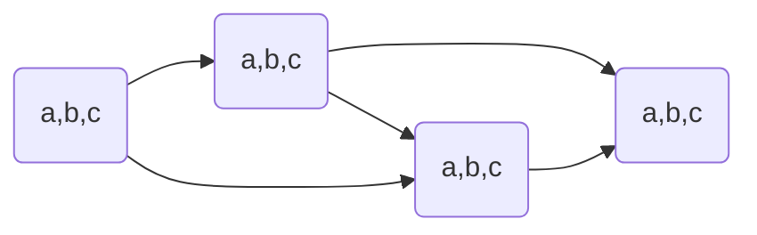
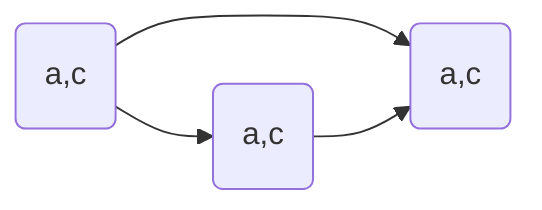
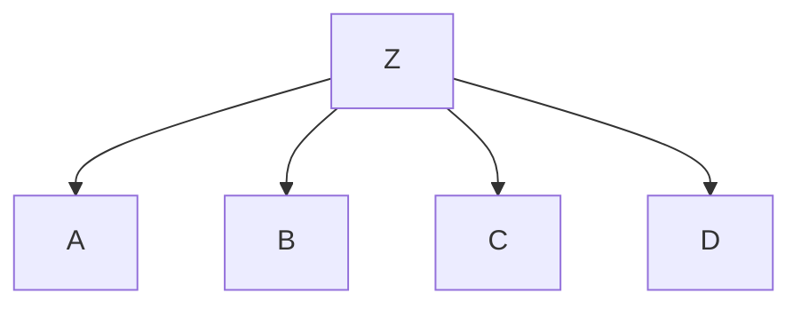
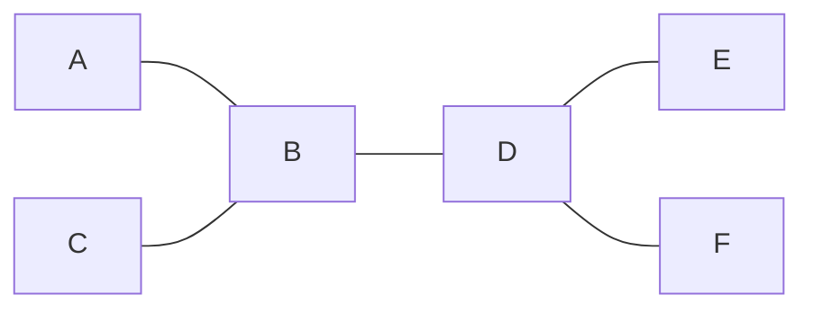
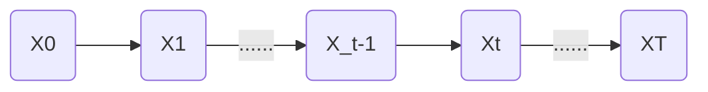
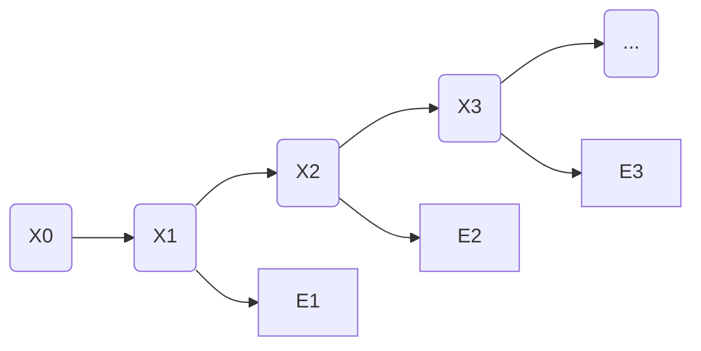

# Introduce
> [!note]- slide
> ![[CS181-01-Introduction.pdf]]

# Search
> [!note]- slide
> ![[CS181-02-Search.pdf]]

e.g. 
- problem: pathing
  - states: (x,y) location
  - action: NSEW
  - successor: update location only
  - goal test: is (x,y) = END
- problem: eat-all-dots
  - states: (x,y) dot boolean
  - action: NSEW
  - successor: update location and possibly a dot boolean
  - goal: all dots false


## 状态空间 states:

World State:

e.g. Pacman
- parameters
  - Agent position: 120
  - Food count: 30
  - Ghost: 12
  - Agent facing: NSEW
- World States:
  - Agent position: 120
  - food count: 2^30
  - Ghost: 12*12
  - Agent facing: 4
  - total: 120 * 2^30 * 12*12 * 4
- state of pathing: 120
- states for eat-all-dots: 120 * 2^30

针对不同的问题会有不同大小的解空间


状态空间越少越好, 状态空间越大, 搜索越多

### 状态空间图 State Space Graph

很少使用这种状态空间图, 因为保存的内容太多了

所以使用另外的一种算法

### 搜索树 Search Tree

当前状态作为一个根节点, 然后可以往不同决策行进

![[CS181-02-Search.pdf#page=12&rect=169,239,801,439|CS181-02-Search, p.12]]

是一种"what if"树

每一个子节点都表示一种可能性(successor)

依然是无法表达出整个状态空间

- `b`: branching factor: 表示一个节点可以扩展多少子节点
- `m`: maximum depth: 搜索可能达到的最深的路径

#### fringe

边缘

维护所有已扩展的路径中的叶子节点的路径(从根节点到该节点的路径)

更新: 选择一个fringe里面的叶子节点, 然后扩展到其子节点.

#### err

如果图上有环, 那么会导致搜索可能陷入循环, 导致没有optimal

优化: never expand a state twice. 只对某一个state搜索一次, 第二次直接停止.

不会破坏completeness, 因为所有节点还是会被访问到

### different between search graph and search tree
![[CS181-02-Search.pdf#page=13&rect=100,94,875,433|CS181-02-Search, p.13]]

## 搜索

属性

- complete: 是否能找到完整的节点
- optimal: 能否找到最优解
- time complexity
- space complexity

b是branching factor: 表示多少种不同的选择

m是最大深度, 选择的次数

solutions可能在任意深度

一共有$b+b^2+\cdots+b^m=O(b^m)$

![[CS181-02-Search.pdf#page=16&rect=407,103,868,347|CS181-02-Search, p.16]]

#### DFS

depth-first search

![[CS181-02-Search.pdf#page=20&rect=463,166,931,421|CS181-02-Search, p.20]]

使用stack来存储

- complete: 如果深度有限那么是完整的
- optimal: 只找到了最左侧的解, 但是并没有考虑深度问题, 所以不是optimal
- time: $O(b^m)$
- space: $O(bm)$

#### BFS

breadth-first search

![[CS181-02-Search.pdf#page=23&rect=469,165,923,414|CS181-02-Search, p.23]]

- complete: yes
- optimal: 如果每一条边的cost是1, 那么才是optimal的

- time: $O(b^s)$, 其中$s$表示搜索结果的层级
- space: $O(b^s)$

#### Iterative Deepening

- 限制深度为1, 进行DFS, 判断是否有解
- 如果无解, 那么限制深度为2, 进行DFS, 判断是否有解
- ...

上一层的时间复杂度远远小于下一层的时间复杂度, 每一层指数增长, 上一层的搜索对下一层可以忽略不计, 因此实用性比较好

### Cost-Sensitive Search

每个状态的转移具有不同的花费.

#### Uniform Cost Search(UCS)

strategy: 展开cost最小的node

![[CS181-02-Search.pdf#page=30&rect=574,164,930,412|CS181-02-Search, p.30]]

- complete:
- optimal
- time: $b^\frac{C^*}{\varepsilon}$
- space: 存储到priority queue内部, 比较的是cumulative cost. 

假设最小的花费(最优解)是$C^*$, 并且这条路上的最小花费是$\varepsilon$, 那么有效路径长度大概是$\frac{C*}{\varepsilon}$

缺点: 展开的过程中, 所有展开的距离(cost)是相同的

## Model

agent对于world state的一种建模. 需要基于这个建模进行Planning和Searching

e.g. 出门是否带伞: Model: 看了天气预报 / Model: 随机带伞

### Search Heuristics

目标函数: 搜索使靠近$h(goal)=0$

#### Greedy Search

贪心算法: 只考虑当前状态的最优解

best cases:

![[CS181-02-Search.pdf#page=40&rect=620,260,868,445|CS181-02-Search, p.40]]

worst cases:

![[CS181-02-Search.pdf#page=40&rect=620,55,874,242|CS181-02-Search, p.40]]

#### A* Search

uniform-cost search: backward cost 路径的花费: $g(n)$

greedy search: forward cost 未来估计价值: $h(n)$

A* search: $f(n)=g(n)+h(n)$

![[CS181-02-Search.pdf#page=44&rect=30,5,953,358|CS181-02-Search, p.44]]

- complete: 需要让$h(n)$是admissible: $0<h(n)<h^*(n)$其中$h^*(n)$是真实距离
- optimal: 

  假设:
  - 任意节点$n$, 最优解$A$, 次优解$B$
  
  Claim:
  - A will exit fringe before B

    A比B先弹出fringe, 表示A会先进行is_goal的测试

  Proof:
  - $$\text{admissive}\Rightarrow h(n)\leq h^*(n)=g(A)-g(n)$$
    $$h(A)=0\Rightarrow f(A)=g(A)\Rightarrow h(n)\leq f(A)-g(n)$$
    $$\Rightarrow h(n)+g(n)\leq f(A)\Rightarrow f(n)\leq f(A)$$
    因此, 节点$n$一定在节点$A$之前找到
  - $$\text{A is optimal and B is  suboptimal}\Rightarrow g(A)<g(B)$$
    $$\text{A, B are goal}\Rightarrow h(A)=h(B)=0\Rightarrow f(A)<f(B)$$
    $$\Rightarrow f(n)\leq f(A)<f(B)$$
    $$\Rightarrow\text{n比B先expand}$$
  - A的所有祖先节点都比B先expand
  - A比B先expand
  
  所以是optimal的

heuristics越接近真实cost, 搜索代价就越小

##### admissible

$0<h(n)<h^*(n)$其中$h^*(n)$是真实距离
##### consistency

$h(A)-h(C)\leq h^*(A-C)$

其中$h^*(A-C)$表示A到C的实际距离

consistency可以推出admissible
$$
h(C)=h(C)-h(goal)\leq h^*(C-goal)=h^*(C)
$$

# CSP

constraint satisfaction problems约束满足问题(约束求解)

Search问题的最终goal是一个固定的state, 但是CSP的每一次搜索之后都需要重新判断goal的state

state有一个变量$X_i$, 属于一个域$Domain$

e.g. 四色问题

- Variable: 不同区域
- Domain: $D=\{\text{different colors}\}$
- constraint:
  - implicit: 区域$\neq$区域
  - explicit: $(\text{区域,区域})\in\{(\text{颜色,颜色}),\cdots\}$

e.g. N皇后问题

- Formulation 1:
  - Variables: $X_{ij}$不同棋盘位置
  - Domains: $\{0,1\}$
  - constraints:
    - $\forall i,j,k, (X_{ij},X_{jk})\in\{(0,0),(1,0),(0,1)\},i\neq k\text{ or }j\neq k$
    - $\forall i,j,k,(X_{ij},X_{i+k,j\pm k})\in\{(0,0),(1,0),(0,1)\}$
    - $\sum_{ij} X_{ij}=N$
- Formulation 2:
  - 不能有相互威胁的存在


unary一元约束: $X\neq red$

Bin二元约束: $X\neq Y$

Higher-order: 更多变量之间的约束

soft: preferences, 更倾向于某些选择而不是强制约束, 经常使用不同选择有不同cost来确定(在Bayes Net部分cover)

## Solving

- 初始状态: 空的assignment, {}
- Successor function: 给一个未赋值的变量赋值
  - 变量的赋值是可交换的, 所以需要一个固定的赋值顺序
    - e.g. `[WA = red then NT = green] == [NT = green then WA = red]`
  - 但是赋值的顺序会影响搜索的效率
- goal test: 所有的变量是complete的并且满足所有的约束条件

### Backtracking Search

在DFS的基础上的优化

每走一步都进行计算判断是否满足约束, 如果不满足, 那么回溯

```pseudocode
function BACKTRACKING-SEARCH(csp) returns solution/failure
	return RECURSIVE-BACKTRACKING({}, csp)
function RECURSIVE-BACKTRACKING(assignment, csp) returns solution/failure
	if assignment is complete then return assignment
	var <- SELECT-UNASSIGNED-VARIABLE(VARIABLES[csp],assignment,csp)
	for each value in ORDER-DOMAIN-VALUES(var, assignment, csp) dp
		if value is consistent with assignment given CONSTRAINTS[csp] then
			add {var=value} to assignment
			result <- RECURSIVE-BACKTRACKING(assignment, csp)
			if result != failure then return result
			remove {var=value} from assignment
	return failure
```

## Improving

filtering: 能否直接找到不满足的情况

ordering: 哪些变量应该先赋值

Structure: 利用问题建模的结构

### filtering

#### 剪枝(forward checking)

每一次赋值, 去掉不满足的assignment(对整个图进行遍历一边). 如果出现了某一个state没有值可选, 那么直接停止搜索, 进行回溯

速度变快, 但是数据结构变复杂

#### 约束传递(Constraint Propagation)

每一次赋值之后, 将这个赋值的约束传递给所有未被赋值的state

e.g.



$1.\{(a,b,c),(a,b,c),(a,b,c),(a,b,c)\}\Rightarrow\text{检查2,3}\{(A),(b,c),(b,c),(a,b,c)\}\Rightarrow\text{检查4}\{(A),(b,c),(b,c),(a)\}$

$2.\{(A),(b,c),(b,c),(a)\}\Rightarrow\text{检查3,4}\{(A),(B),(c),(a)\}\Rightarrow\text{重新检查4}\{(A),(B),(c),(a)\}$

...

原理: 在每一次确定一个选项之后, 去判断相邻且未选择的state中,是否有值能满足constraint. 即, 遍历Domain中所有可选的值, 判断如果选这个能否还能满足constraint

缺点: 



无法提前结束, 但是这种情况无解

#### 弧相容(Consistency of Arc)

将相互约束的两个state之间的无向边理解成相互指向的有向边.

一个约束弧`Arc` $X\rightarrow Y$ 是相容的 当且仅当 tail $X$中每一个value $x$在head $Y$中有一个$y$可以满足约束

方向: 未赋值变量指向正在赋值的节点之间的所有弧

如果head $Y$因为constraint失去了value, 那么所有指向$Y$的tail $X$都需要重新进行遍历

Algorithm:

1. 将CSP约束图中所有的弧存入队列Q中
2. 从Q中pop一个arc, 并强制要求每一个正在移除的弧$X_i\rightarrow X_j$中, 对tail $X_i$的每一个剩余的值$x$都有一个head $X_j$中的值$y$能够满足约束
   - 如果不存在$y$使得$x$满足约束, 需要将$x$从$X_i$的domain中移除
3. 如果有任意值在$X_i$中被移除, 将所有的$\forall k\ s.t.\ X_k\rightarrow X_i$的弧push入Q中
4. 重复操作, 直到$Q=\emptyset$或者某一个$X_k$的domain为空

```pseudocode
function AC_3(csp) returns the CSP, possibly with reduced domains
    inputs: csp, a binary CSP with variables {X1, X2, ... Xn}
    local variables: queue, a queue of arcs, initially all the arcs in csp
    while queue is not empty do
        (Xi,Xj) <- REMOVE-FIRST(queue)
        if REMOVE-INCONSISTENT-VALUES(Xi, Xj) then
            for each Xk in NEIGHBORS[Xk] do
                add (Xk, Xi) to queue
function REMOVE-INCONSISTENT-VALUES(Xi, Xj) returns true iff succeeds
	removed <- false
	for each x in DOMAIN[Xi] do
		if no value y in DOMAIN[Xj] allows (x,y) to satisfy the constraint Xi <- Xj
			then delete x from DOMAIN[Xi]
			removed <- true
	return removed
```

e.g.

![[Pasted image 20241016141415.png]]

initial: `Q=[SA->V,V->SA,SA->NSW,NSW->SA,SA->NT,NT->SA,V->NSW,NSW->V]`

- `SA->V`

  `SA: blue` satisfy the constraint

  No value will be removed

- `V->SA`

  `V: blue` violate the constraint

  remove blue from domain of `V`

  re-add `SA->V` into queue(`NSW->V` is already in queue): `Q=[SA->NSW,NSW->SA,SA->NT,NT->SA,V->NSW,NSW->V,SA->V]`

  ![[Pasted image 20241016141956.png]]

- ...

- `NSW->SA`

  ![[Pasted image 20241016142151.png]]

  the domain of `SA` is empty$\rightarrow$backtracking

Complexity:

最坏情况下时间复杂度是$O(ed^3)$, 其中$e$为弧(有向边的数量, 即无向边数量$\times2$), d为最大domain的大小

每一条弧最多插入队列$d$词, 每一次相容性检验需要$O(d^2)$, 因此最多有$O(n^2d^3)$

> [!tip]
> 但是听说可以通过数据结构优化至 $O(n^2d^2)$ , 但具体方法未给出

### ordering

#### Minimal Remain Value

每次对最少选择的(约束最多的)state做选择

#### Least Constraining Value

每次选择最少受限的值, 因为这样最有可能找到可行解

### structure

#### Tree Structure CSP

$O(d^n)\Rightarrow O(nd^2)$

需要保证不存在环

![[CS181-03-CSP.pdf#page=38&rect=72,184,878,361|CS181-03-CSP, p.38]]

1. 无向无环图的任意节点都可以作为树, 因此只需要任选一个节点作为树根
2. 将无向边转换为指向根节点反向的有向边, 拓扑排序, 即可将无向图线性化
3. Remove Backward: `For i = n:2, apply RemoveInconsistent(Parent(Xi),Xi)`
4. Assign Forward: `For i = 1:n, assign Xi consistently with Parent(Xi)`

因为在经历过backward的consistency of arc之后, 所有的弧都是consistent的. 因此无论后续节点选什么值, forward的过程中都可以找到对应的可选的值. 因此在forward的时候不会进行回溯

### Iterative Algorithms for CSP

思想: 拿到一个不满足约束的complete的解, 然后给重新赋值, 使冲突达到最小

1. 拿到一个solution, 可能冲突
2. 随机选择一个冲突的值
3. 给该变量赋值使最小化冲突的值

preformance:
$$R=\frac{\# constraints}{\# variables}$$

$R$很大或者很小的时候都很快

### Local Search

只对局部状态做调整

优点: 不需要关心之前的状态和访问过的状态, 更快

缺点: 可能会导致incomplete和suboptimal

state: 一个complete的分配(assignment)

successor function: local changes

但是不同的策略可能导致不同的结果

### Hill Climbing

贪心, 类似梯度上升

但是可能陷入局部最优

### Beam Search

每次不止选择一个状态, 而是选择多个状态, 能够减少出现局部最优但是全局非最优的可能

也不能保证optimal

### Simulate Annealing

模拟退火

1. 拿到一个随机的移动
2. 总是接受一个uphill的移动
3. 如果是downhill, 那么有$e^\frac{-\Delta E}{T}$的概率接受这个移动, T是温度, $\Delta E$是能量差, 可以理解为上一步的评分和下一步的评分之差(这里可以看成满足constraints的个数)
4. T会随着时间的变化变小

如果T下降足够慢, 那么我们会更容易得到optimal的solution(探索更多, 更加容易跳出local局部最优)

### Genetic Algorithm

遗传算法

1. 根据fitness(评分)选择n个进行杂交
2. 随机选择一个点, 交换两者的DNA(值)
3. 概率突变

# Adversarial Search

> [!note]- slide
> ![[CS181-04-Adversarial-search.pdf]]

Game Type:

- 是否确定(只能选择一个或几个行为之一) Deterministic or stochastic
- 玩家个数
- 是否零和博弈 zero sum
- 是否观测到当前状态的所有信息 Perfect Infomation

目的是找到一个policy(strategy), 能够给定任意的state $S$, 找到一个行为action $A$

## Search

### Single-Agent Tree

![[CS181-04-Adversarial-search.pdf#page=14&rect=113,46,822,440|CS181-04-Adversarial-search, p.14]]

### Minmax Search

对抗: 红色状态是敌人的agent, 要让红色状态的state value越小越好, 蓝色状态的state value越大越好

![[CS181-04-Adversarial-search.pdf#page=16&rect=106,40,844,440|CS181-04-Adversarial-search, p.16]]

- 如果是终止状态, 直接返回终止状态的value
- 如果是max, 寻找最大化的state value: `max(v, value(successor))`
- 如果是min, 寻找最小化的state value: `min(v, value(successor))`

是类似穷举的DFS

时间复杂度: $O(b^m)$

空间复杂度: $O(bm)$

$b$是state, $m$是步数

## Improve

### depth-limited search

在有限深度下搜索

Evaluation Function: 对非终止节点的state value的估计, 根据不同的特征进行判断

理想方程: 真实的minmax search的state value

### Monte Carlo Tree Search

对树进行采样, 控制采样的深度和次数, 对采样的结果进行统计, 可以得出原始的树的state value和distribution

## Game Tree Pruning

### Minmax Pruning

![[CS181-04-Adversarial-search.pdf#page=31&rect=104,100,644,393|CS181-04-Adversarial-search, p.31]]

第一步找到了3, 第二步中, 找到了一个2, 那么第二步的min的state value一定是一个小于2的值, 那么可以直接舍去这一个选择(要选择max的state value)

### Alpha-Beta Pruning

![[CS181-04-Adversarial-search.pdf#page=32&rect=607,56,902,433|CS181-04-Adversarial-search, p.32]]

- 假设现在对节点`n`计算state value
- 展开`n`的节点的子节点. 因为是取最小, 那么展开`n`的子节点的过程中, `n`的state value一定是递减的
- 假设`a`是MIN层中最大的节点
- `n`的state value一旦小于`a`的state value, 那么在向上传递的过程中, 在与`a`同层的位置一定会选择更大的`a`而不是`n`的state value
- 所以可以直接舍去`n`节点的后续计算

Implementation:

- 初始化$\alpha$是MAX的最优选项, $\beta$是MIN的最优选项
- max value:
  - 初始化$v=-\infty$
  - 更新每一个successor
    - `v = max(v, value(successor))`
    - 如果$v\leq\beta$, 那么直接不计算(剪枝)
    - 更新$\alpha=\max(\alpha, v)$
- min value:
  - 初始化$v=+\infty$
  - 更新每一个successor:
    - `v=min(v, value(successor))`
    - 如果$v\geq\alpha$, 剪枝
    - 更新$\beta=\min(\beta, v)$

# Propositional Logic

> [!note]- slide
> ![[CS181-05-Propositional-logic.pdf]]

**Truth tables for connectives**

|   P   |   Q   | $\neg$ P | P$\wedge$Q | P$\vee$Q | P$\Rightarrow$Q | P$\Leftrightarrow$Q |
| :---: | :---: | :------: | :--------: | :------: | :-------------: | :-----------------: |
| **F** | **F** |    T     |     F      |    F     |        T        |          T          |
| **F** | **T** |    T     |     F      |    T     |        T        |          F          |
| **T** | **F** |    F     |     F      |    T     |        F        |          F          |
| **T** | **T** |    F     |     T      |    T     |        T        |          T          |

![[CS181-05-Propositional-logic.pdf#page=15&rect=69,29,663,347|CS181-05-Propositional-logic, p.15]]

## Inference Rule

推理: 两个model为true的时候一定能推出下面的为true:
$$\text{if }p_1=\neg q_1$$
$$\frac{p_1\vee p_2\vee\cdots\vee p_n,\ \ \ q_1\vee\cdots\vee q_m}{p_2\vee\cdots p_n\vee q_2\vee\cdots\vee q_m}
$$
e.g. 请推导出$\text{KB}\models\alpha$

1. to prove $\text{KB}\models\alpha$, consider use contradiction by shown $\text{KB}\wedge\neg\alpha$ is unsatisfiable
2. expand $\text{KB}$ and $\alpha$ to CNF
3. use Inference rule:

![[CS181-05-Propositional-logic.pdf#page=25&rect=20,89,678,414|CS181-05-Propositional-logic, p.25]]

## Horn Logic

首先将所有的Knowledge Base转写成$\Rightarrow$的格式($p_1\wedge\cdots\wedge p_n\Rightarrow q$)

### Forward chain

$q$所需要的前提($p_1,\cdots,p_n$)的个数$n$作为需要证实的数量.

如果$q$的证明有两条路线, 那么这两条路线需要的证据是分开计算的.

只要有一条路线的证据数量被满足($p_1\wedge\cdots\wedge p_n$为True), 那么认为$q$也为True

![[CS181-05-Propositional-logic.pdf#page=29&rect=172,50,556,305|CS181-05-Propositional-logic, p.29]]

initial:
$$P\Rightarrow Q\qquad1$$
$$L\wedge M\Rightarrow P\qquad2$$
$$B\wedge L\Rightarrow M\qquad2$$
$$A\wedge P\Rightarrow L\qquad2$$
$$A\wedge B\Rightarrow L\qquad2$$
$$\text{agenda: }[A,B]$$
step 1:
$$P\Rightarrow Q\qquad1$$
$$L\wedge M\Rightarrow P\qquad2$$
$$B\wedge L\Rightarrow M\qquad2$$
$$A\wedge P\Rightarrow L\qquad1$$
$$A\wedge B\Rightarrow L\qquad1$$
$$\text{agenda: }[B]$$
step 2:
$$P\Rightarrow Q\qquad1$$
$$L\wedge M\Rightarrow P\qquad2$$
$$B\wedge L\Rightarrow M\qquad1$$
$$A\wedge P\Rightarrow L\qquad1$$
$$A\wedge B\Rightarrow L\qquad0$$
$$\text{agenda: }[L]$$
step 3:
$$P\Rightarrow Q\qquad1$$
$$L\wedge M\Rightarrow P\qquad1$$
$$B\wedge L\Rightarrow M\qquad0$$
$$A\wedge P\Rightarrow L\qquad1$$
$$A\wedge B\Rightarrow L\qquad0$$
$$\text{agenda: }[M]$$
step 4:
$$P\Rightarrow Q\qquad1$$
$$L\wedge M\Rightarrow P\qquad0$$
$$B\wedge L\Rightarrow M\qquad0$$
$$A\wedge P\Rightarrow L\qquad1$$
$$A\wedge B\Rightarrow L\qquad0$$
$$\text{agenda: }[P]$$
step 5:
$$P\Rightarrow Q\qquad0$$
$$L\wedge M\Rightarrow P\qquad0$$
$$B\wedge L\Rightarrow M\qquad0$$
$$A\wedge P\Rightarrow L\qquad0$$
$$A\wedge B\Rightarrow L\qquad0$$
$$\text{agenda: }[Q]$$
Then, we can obtain the final $Q$ by knowledge base

### Backward chain

找到需要证明的内容, 然后找如果要证明这个命题需要证明哪些

不断回溯, 知道找到已证明(true)的内容

# First-Order Logic
> [!note]- slide
> ![[CS181-06-First-order-logic.pdf]]

Pros of Propositional Logic:
- 比较简单
- 支持命题操作比较多
- 可以将简单的逻辑组合, 推导出新的知识
  $$B_{1,1}\wedge P_{1,2}\Rightarrow B_{1,1}$$
- 上下文无关 context-independent
Cons of Propositional Logic:
- 很难表述一个单独的单词
- 很难表述数字
- 很难表示关系
- Generalizations, patterns, regularities can’t easily be represented (e.g., “all triangles have 3 sides”)


## 一阶谓词逻辑

假设world包含:

- Object: 人, 房子, 颜色, ...
- Relations: red, round, prime, bigger than, ...
- Functions: father of, best friend of, ...

假设了world中存在一些事实


## Basic Element

Logic Symbols:

- Connectives $\neg,\wedge,\vee,\Rightarrow,\Leftrightarrow$
- Quantifiers $\forall,\exists$
- Variables
- Equality $=$

Non-Logic Symbols:

- Constants `KingJohn, 2 (numbers), ShanghaiTech, ...`
- Predications `Brother, >, ...`
- Functions `Sqrt, LeftLegOf, ...`


Atomic Sentences: `Predicate(term1, term2, ...)` or `term1 = term2`

Term: `Constants` or `Variables` or `Function(term1, term2, ...)`

一个原子语句`Function(term1, term2, ...)`是正确的当且仅当object `term1, term2, ...`是在`Predicate`所描述的`relation`中


Model的数量是infinity的

## Inference

- Universal  Instantiation
  $$
  \frac{\forall x\ \alpha}{\text{Subst}(\{x/g\},\alpha)}
  $$
  e.g. $\forall x,\ \text{King}(x)\wedge \text{Greedy}(x)\Rightarrow\text{Evil}(x)$ 可以推出 $\text{King}(\text{anyone})\wedge\text{Greedy(anyone)} \Rightarrow \text{Evil(anyone)}$ 

- Exists Instantiation
  $$
  \frac{\exists x\ \alpha}{\text{Subst}(\{x/k\},\alpha)}
  $$
  e.g. $\exists x,\ \text{Crown}(x)\wedge\text{OnHead}(x,\text{John})$ 可以推出 $\text{Crown}(C_1)\wedge\text{OnHead}(C_1,\text{John})$

  被称为Skolemization, 其中$C_1$称为Skolem symbol

一般使用$\Rightarrow$和$\forall$配合, 一般使用$\wedge$和$\exists$配合

### Unify

![[CS181-06-First-order-logic.pdf#page=38&rect=35,129,666,413|CS181-06-First-order-logic, p.38]]

$\mathbf{Unify}(\alpha,\beta)=\theta\iff\alpha\theta=\beta\theta$

第四行的表示的原因是两个sentence, 表示的变量名重复但是表示的含义不同. 因此需要标准化: 不同变量需要有不同变量名

为了`Unify`$\text{Know(John,}x\text{)}$和$\text{Know(}y,z\text{)}$, 需要给变量赋值. 其中两种为:

- $\theta=\{y/\text{John}, x/z\}$ or $\theta=\{y/\text{Jonh},x/\text{John},y/\text{John}\}$

有一个最泛化的Unify的方式:

- $\text{MGU}=\{y/\text{John},x/z\}$

## Horn Logic

Generalized Modus Pones(`GMP`):
$$
\frac{p_1',\cdots,p_n',\qquad p_1\wedge\cdots p_n\Rightarrow q}{q\theta}\qquad\text{where $p'_i\theta=p_i\theta$ for all $i$}
$$
e.g.

$(\text{King}(x)\wedge\text{Greedy}(x)\Rightarrow\text{Evil}(x))$, $\text{King(John})$, $\text{Greedy(y)}$

- $p'_1$ is $\text{King(John)}$, $p_1$ is $\text{King}(x)$
- $p'_2$ is $\text{Greedy(y)}$, $p_2$ is $\text{Greedy}(x)$
- Therefore, $\theta=\{x/\text{John}, y/\text{John}\}$
- $q$ is $\text{Evil}(x)$, $q\theta$ is $\text{Evil(John)}$

### Forward Chaining

e.g.

> The US law says that it is a crime for an American to sell weapons to hostile nations. The country Nono, an enemy of America, has some missiles, and all of its missiles were sold to it by Colonel West, who is American.
> Prove that Col. West is a criminal.

![[CS181-06-First-order-logic.pdf#page=44&rect=36,87,623,420|CS181-06-First-order-logic, p.44]]
![[CS181-06-First-order-logic.pdf#page=46&rect=40,71,652,432|CS181-06-First-order-logic, p.46]]

前向推理的性质:

- 对于一阶Horn Logic而言, FC是complete的
- 如果一阶谓词逻辑(FOL)没有function(Datalog), 那么FC在有限步数内终止
- 一般而言, 如果$\alpha$没有entail, 那么FC可能不会终止.
  - 这是不可避免的

### Backward Chaining

![[CS181-06-First-order-logic.pdf#page=48&rect=50,284,622,336|CS181-06-First-order-logic, p.48]]
![[CS181-06-First-order-logic.pdf#page=49&rect=70,177,613,336|CS181-06-First-order-logic, p.49]]
![[CS181-06-First-order-logic.pdf#page=51&rect=71,87,621,329|CS181-06-First-order-logic, p.51]]
![[CS181-06-First-order-logic.pdf#page=52&rect=76,70,605,332|CS181-06-First-order-logic, p.52]]
![[CS181-06-First-order-logic.pdf#page=53&rect=86,69,611,326|CS181-06-First-order-logic, p.53]]
![[CS181-06-First-order-logic.pdf#page=54&rect=80,75,623,331|CS181-06-First-order-logic, p.54]]

后向推理的性质:

- 使用DFS进行搜索. 搜索的空间占用和证明所需要的大小呈线性关系
- 通过检查当前目标和堆栈中的每个目标, 避免无限循环
- 通过缓存当前的结果, 避免重复子目标

### Resolution(Inference Rule)

$$\frac{l_1\vee\cdots\vee l_k,\qquad m_1\vee\cdots\vee m_n}{(l_2\vee\cdots\vee l_k\vee m_2\vee\cdots\vee m_n)\theta}$$
$$\text{where }\mathbf{Unify}(l_1,\neg m_1)=\theta$$

> [!tip] example
> $$\frac{\neg\text{Rich}(x)\vee\text{Unhappy(x)}\qquad\text{Rich(Ken)}}{\text{Unhappy(Ken)}}$$
> $$\text{with }\theta=\{x\text{/Ken}\}$$

## Conversion to CNF

$$
\forall x[\forall y\text{ Animal}(y)\Rightarrow\text{ Loves}(x,y)]\Rightarrow\exists y\text{ Loves}(y,x)
$$

1. Eliminate biconditionals and implications
   $$\forall x[\neg\forall y\ \neg\text{Animal}(y)\vee\text{Loves}(x,y)]\vee[\exists y\text{ Loves}(y,x)]$$
2. Move $\neg$ inwards:
   - $\neg\forall x\ p\equiv\exists x\ \neg p$
   - $\neg\exists x\ p\equiv\forall x\ \neg p$
   $$\forall x[\exists y\text{ Animal}(y)\wedge\neg\text{Loves}(x,y)]\vee[\exists y\text{ Loves}(y,x)]$$
3. Standardize variables: 对于每一个语句, 都需要使用不同的变量
   $$\forall x[\exists y\text{ Animal}(y)\wedge\neg\text{Loves}(x,y)]\vee[\exists z\text{ Loves}(z,x)]$$
4. Skolemize: 将变量替换成一个特定的值
   $$\forall x[\text{Animal}(F(x))\wedge\neg\text{Loves}(x, F(x))]\vee\text{Loves}(G(x),x)$$
5. Drop universal quantifierfs:
   $$[\text{Animal}(F(x))\wedge\neg\text{Loves}(x,F(x))]\vee\text{Loves}(G(x),x)$$
6. Distribute $\vee$ over $\wedge$
   $$[\text{Animal}(F(x))\vee\text{Loves}(G(x),x)]\wedge[\neg\text{Loves}(x,F(x))\vee\text{Loves}(G(x),x)]$$
# Bayes Network

> [!note]- slide
> ![[CS181-07-Bayesian-networks.pdf]]

CPT: Conditional Probability Table

独立: 
$$\forall x,y\ P(x,y)=P(x)P(y)$$
$$\text{or }\forall x,y\ P(x|y)=P(x)$$
$$\text{or }\forall x,y\ P(y|x)=P(y)$$


条件独立: 给定某个条件下, 两个事件相互独立
$$\forall x,y,z\ P(x,y|z)=P(x|z)P(y|z)$$
$$\text{or }\forall x,y,z\ P(x|y,z)=P(x|z)$$
$$\text{or }\forall x,y,z\ P(y|x,z)=P(y|z)$$
写作$x\perp\!\!\!\perp y|z$

链式法则chain rule:
$$P(x_1,x_2,x_3,\cdots)=P(x_1)P(x_2|x_1)P(x_3|x_2,x_1)\cdots$$
可以在使用链式法则的时候使用条件独立化简条件:

e.g.: Traffic, Umbrella, Rain

$\text{P(Traffic, Umbrella, Rain)=P(Rain)P(Traffic|Rain)P(Umbrella|Traffic,Rain)=P(Rain)P(Traffic|Rain)P(Umbrella|Rain)}$


对于某一个子节点:

- 假设父节点的domain为$d_i$
- 假设该节点的domain为$d$
- 每一行之和是1
- 那么该节点的复杂度(参数量)是$(d-1)\prod_id_i$
- $(d-1)$的原因是行之和为1

![[CS181-07-Bayesian-networks.pdf#page=41&rect=13,5,690,450|CS181-07-Bayesian-networks, p.41]]

对于一个Bayesian Network:

- $n$个变量
- 最大的domain是$d$
- 最大的父节点数量是$k$

$\Rightarrow$ 全联合概率密度分布是$O(d^n)$

$\Rightarrow$ Bayes Net的空间是$O(n\cdot d^{k+1})$

## Markov Blanket

给定父节点, 子节点, 子节点的父节点, 然后该节点与其他所有节点条件独立

- causal chain

  Global semantic: $P(x,y,z)=P(x)P(y|x)P(z|y)$

  $P(z|x,y)=\frac{P(x,y,z)}{P(x,y)}=\frac{P(x)P(y|x)P(y|z)}{P(x)P(y|x)}=P(z|y)$

  给定$Y$, 有$X\perp\!\!\!\perp Z|Y$
  
  ![[CS181-07-Bayesian-networks.pdf#page=52&rect=50,143,461,373|CS181-07-Bayesian-networks, p.52]]

- Global semantic: $P(x,y,z)=P(y)P(x|y)P(z|y)$

  $P(z|x,y)=P(z|y)$

  给定$X$, 有$Z\perp\!\!\!\perp Y|X$
  
  ![[CS181-07-Bayesian-networks.pdf#page=53&rect=16,96,456,392|CS181-07-Bayesian-networks, p.53]]
  
- 若不给定$Z$, 那么$X\perp\!\!\!\perp Y$

  给定$Z$, 有$X$与$Y$不独立

  ![[CS181-07-Bayesian-networks.pdf#page=54&rect=59,23,326,359|CS181-07-Bayesian-networks, p.54]]

![[CS181-07-Bayesian-networks.pdf#page=56&rect=594,2,937,432|CS181-07-Bayesian-networks, p.56|257]]
灰色节点表示是given nodes, 即给定的条件(或者说block的nodes)

这里的Active Triple表示dependent, Inactive Triple表示Conditional Independent

判断两个节点是否是条件独立, 那么可以看这条路径是否是Inactive的.

查询是否条件独立的编程思想: 

- 第一层循环遍历所有的路径
- 第二层循环遍历所有的Triple

![[CS181-07-Bayesian-networks.pdf#page=59&rect=179,12,734,426|CS181-07-Bayesian-networks, p.59]]

$T$和$D$节点有两个路径, 只有第二条能够全部Inactive

详情参考![[Machine Learning#D-separate|D-separate]]

## Node Ordering

每一个模型的假设是不同的, 即可以认为是$X\rightarrow Y$也可以认为是$Y\rightarrow X$

但是每一种假设会有不同的计算复杂度和不同的空间复杂度

如果Bayes Network建模的是因果关系, 那么会高效很多

## Markov Network

可以看作是无向图+势函数的结合

Bayes Network是有向无环图来建模, Markov Network是无向有环图来定义的


Clique: 一个完全图(全连接)

Maximal Clique: 最大的全连接的图

![[CS181-07-Bayesian-networks.pdf#page=85&rect=676,51,901,267|CS181-07-Bayesian-networks, p.85|191]]

定义势函数$\psi(x_c)>0$针对Clique(或者Maximal Clique).

对于联合概率, 与势函数的乘积成比例:

$P(x)=\frac{1}{Z}\prod_C\psi_C(x_C)$, 其中$Z=\sum_C\psi_C(x_C)$是归一化系数

> [[Machine Learning#Markov Blanket|Markov Blanket]]: 所有与该节点直接相连的节点组成Markov Blanket
>
> ![[CS181-07-Bayesian-networks.pdf#page=87&rect=122,52,775,380|CS181-07-Bayesian-networks, p.87]]

e.g.

![[CS181-07-Bayesian-networks.pdf#page=88&rect=204,171,879,389|CS181-07-Bayesian-networks, p.88]]

定义每个pixel $x_i$,  定义pixel对应是否是想要的分类 $y_i$

定义势函数$\psi(x_i,y_i)=\exp(w^T\phi(x_i,y_i))$ where $\phi(x_i,y_i)$ is feature vector

定义势函数$\psi(y_i,y_j)=\exp(\alpha \mathbf{I}(y_i=y_j))$表示相邻的两个点之间更可能是相同的分类

如果有更复杂的网络结构, 那么分类的准确率会更大

![[CS181-07-Bayesian-networks.pdf#page=90&rect=675,63,872,418|CS181-07-Bayesian-networks, p.90|100]]
![[CS181-07-Bayesian-networks.pdf#page=91&rect=166,167,787,317|CS181-07-Bayesian-networks, p.91]]
### Convert Bayes Network to Markov Network

![[CS181-07-Bayesian-networks.pdf#page=93&rect=212,61,736,432|CS181-07-Bayesian-networks, p.93]]
![[CS181-07-Bayesian-networks.pdf#page=94&rect=166,19,779,428|CS181-07-Bayesian-networks, p.94]]

Moralization: 

Bayes Network中, 相关的关系不一定体现在边的连接上. 但是在Markov Network中, 只有相连的两个节点才会有关系. 所以在转换的过程中, 需要把相关的两个点添加边连接


Steps:
- Moralization
- Construct potential functions from CPTs

Bayes Network和Markov Network编码了同样的分布

但是并不是编码相同的条件独立性

> [!tip]
> 如, 在第二张图中, 我们可以认为Markov Network的建模中, $x_2,x_4$共同影响$x_1$.
>
> 但是Bayes Network中, $x_4$不能影响$x_1$

认为Bayes Network和Markov Network更接近于谓词逻辑PL(相较于一阶谓词逻辑FOL)

可以认为BN和MN是带有概率的拓展PL

## CRF Conditional Random Field

生成式模型: 建模一个分布: $P(X_1, X_2,\cdots, X_n)$

- Bayes Network和Markov Network都是Generative Model

判别式模型: 只建模$P(Y_1,\cdots,Y_n|X)$, 不建模$P(X)$

- CRF, Image Segmentation


CRF的概率:
$$P(y|x)=\frac1{Z(x)}\prod_C\psi_C(y_C,x)$$
$$Z(X)=\sum_y\prod_C\psi_C(y_C,x)$$
applications:

- NLP
  - Pos tagging
  - Named entity recognize
  - Syntactic parsing
- CV
  - Image Segmentation
  - Posture Recognize

![[CS181-07-Bayesian-networks.pdf#page=103&rect=523,154,853,372|CS181-07-Bayesian-networks, p.103]]

# Bayes Net Inference
> [!note]- slide
> ![[CS181-08-BN-exact-Inference.pdf]]

## Variable Elimination

![[CS181-08-BN-exact-Inference.pdf#page=4&rect=650,176,907,442|CS181-08-BN-exact-Inference, p.4|329]]

$$P(B|+j,+m)\propto_B P(B,+j,+m)$$
$$=\sum_{e,a}P(B,e,a,+j,+m)$$
$$=\sum_{e,a}P(B)P(e)P(a|B,e)P(+j|a)P(+m|a)$$
$$=P(B)P(+e)P(+a|B,+e)P(+j|+a)P(+m|+a)+P(B)P(-e)P(+a|B,-e)P(+j|+a)P(+m|+a)$$
$$+P(B)P(+e)P(-a|B,+e)P(+j|-a)P(+m|-a)+P(B)P(-e)P(-a|B,-e)P(+j|-a)P(+m|-a)$$
考虑$uwy + uwz + uxy + uxz + vwy + vwz + vxy +vxz=(u+v)(w+x)(y+z)$

可以将原本16乘法7加法转换成2乘法3加法

于是考虑隐变量的因子消除方法:
$$P(B|+j,+m)\propto_B P(B,+j,+m)$$
$$=\sum_{e,a}P(B)P(e)P(a|B,e)P(+j|a)P(+m|a)$$
$$=P(B)\sum_eP(e)\sum_aP(a|B,e)P(+j|a)P(+m|a)$$

但是有一个问题. 在计算$P(a|B,e)$的时候, $P(a|B,e)$不是一个正常的实数, 而是一系列与$B,e$有关的值. 所以在计算的时候, 需要把他们当成一个多元的变量, 称作`factor`

### operation

1. Join Factors

   给定多个CPT, 将多个CPT整合成一个CPT
   ![[CS181-08-BN-exact-Inference.pdf#page=14&rect=178,13,901,220|CS181-08-BN-exact-Inference, p.14]]
2. Variable Elimination

   将隐变量求和, 消除
   ![[CS181-08-BN-exact-Inference.pdf#page=15&rect=78,49,507,212|CS181-08-BN-exact-Inference, p.15]]

假设求$P(Q|E_1=e_1,\cdots,E_n=e_n)$

- 从local CPT开始
- 选择一个隐变量$H$
  - 将所有提到$H$的factor进行join
  - 对$H$进行求和(sum elimination)
- 重复, 直到只剩下$Q$和$E_1,\cdots,E_n$

e.g.

![[CS181-08-BN-exact-Inference.pdf#page=24&rect=65,37,759,426|CS181-08-BN-exact-Inference, p.24]]
![[CS181-08-BN-exact-Inference.pdf#page=25&rect=88,38,786,440|CS181-08-BN-exact-Inference, p.25]]

## Ordering Matter



假设我们需要计算$P(D)$

那么所有其他的变量都是hidden variable

- 如果消除顺序为`CBAZ`
  $$P(D)=\alpha\sum_{a,b,c,z}P(z)P(D|z)P(A|z)P(B|z)P(C|z)$$  $$=\alpha\sum_{z}P(z)P(D|z)\sum_aP(A|z)\sum_bP(B|z)\sum_cP(C|z)$$

- 如果消除顺序为`ZABC`
  $$P(D)=\alpha\sum_{a,b,c,z}P(z)P(D|z)P(A|z)P(B|z)P(C|z)$$
  $$=\alpha\sum_{a}\sum_{b}\sum_{c}\sum_{z}P(z)P(D|z)P(A|z)P(B|z)P(C|z)$$
  

消除顺序不同则参数量不同

不存在一种最小的复杂度对于一个Bayes Network Variable Elimination. 这个和图的结构有关

## Message Passing and General Graphs



对于`poly-tree`的网络, 可以看作图上的信息的传播. 将算好的概率传播

![[CS181-08-BN-exact-Inference.pdf#page=36&rect=583,208,943,410|CS181-08-BN-exact-Inference, p.36]]

分团之后, 两个团的连接点必须同时出现在两个团中. 如 cluster1: $ABC$, cluster2: $BCD$, 相连的两个点是$C$和$B$, 那么这两个点必须在这两个cluster中同时出现

# Bayes Net: Approximate Inference
> [!note]- slide
> ![[CS181-09-BN-approximate-inference.pdf]]

Sampling from given distribution

1. step1: 从一个`[0, 1)`的uniform distribution采样一个u

   有多重方式实现, 如:

   ```python
   import random
   u = random.random()
   ```

2. step2: 从采样的概率中获取到变量

   如:
   ![[CS181-09-BN-approximate-inference.pdf#page=3&rect=439,227,950,395|CS181-09-BN-approximate-inference, p.3]]

## Prior Sampling

![[CS181-09-BN-approximate-inference.pdf#page=6&rect=181,9,795,447|CS181-09-BN-approximate-inference, p.6]]

> 先根据$C$的概率采样: $c$
>
> 然后已知$C=c$的情况下采样 $\neg s$, $r$
>
> 然后在已知$c,\neg s,r$的情况下采样: $w$
>
> 最终得到$c,\neg s,r,w$
>
> 重复多次

采样的顺序最好为Bayes Network的拓扑结构(有了condition才能更好算出当前的结果)

![[CS181-09-BN-approximate-inference.pdf#page=7&rect=239,279,680,418|CS181-09-BN-approximate-inference, p.7]]

采样多次之后, 假设我们有$(c,\neg s,r,w),(c,\neg s,r,w)(c,\neg s,r,w)(c,\neg s,r,w)(c,\neg s,r,\neg w)$

如果要计算$P(W)$, 那么有$\{w:4,\neg w:1\}$, 则$P(w)=0.8,P(\neg w)=0.2$

> [!tip]
> 算法推导:
>- 根据真实概率采样
>  $$S_{Prior Sample}(x_1,\cdots,x_n)=\prod_iP(x_i|\text{Parent}(x_i))=P(x_1,\cdots,x_n)$$
>- 采样得到的概率$\hat P$有
>  $$\hat P(x_1,\cdots,x_n)=\frac{N_{Prior Sample}(x_1,\cdots,x_n)}{N}$$
>- 则当采样次数$N\to\infty$时:
>  $$\lim_{N\to\infty}\hat P(x_1,\cdots,x_n)=\lim_{N\to\infty}\frac{N_{Prior Sample}(x_1,\cdots,x_n)}{N}$$
>  $$=S_{Prior Sample}(x_1,\cdots,x_n)=P(x_1,\cdots,x_n)$$

## Rejection Sample

假设我们需要计算$P(W|r,w)$, 即需要已知$R=r,W=w$的概率, 那么我们直接不需要采样(记录)出现$R=\neg r$或者$W=\neg w$的情况

![[CS181-09-BN-approximate-inference.pdf#page=12&rect=275,251,734,431|CS181-09-BN-approximate-inference, p.12]]

有问题:

假设condition本身就是很小的概率, 那么我们的概率可能很小或者极大.

如:


假设$P(\text{Color}=\text{Blue})=0.001$, 那么本身出现blue的概率很小, 那么如果采样Shape, 很容易出现极端情况

## Likelihood Sample

为了解决Rejection Sample的问题, 我们首先固定已知的变量, 在这种情况下进行采样, 而不是直接采样然后拒绝

将所有采样的Evidence的条件概率相乘作为权重

然后在计算概率的时候, 我们并不是使用出现的个数, 而是使用采样对应的权重进行计算

![[CS181-09-BN-approximate-inference.pdf#page=15&rect=167,1,772,444|CS181-09-BN-approximate-inference, p.15]]
![[CS181-09-BN-approximate-inference.pdf#page=16&rect=306,202,616,434|CS181-09-BN-approximate-inference, p.16]]
![[CS181-09-BN-approximate-inference.pdf#page=17&rect=97,235,296,375|CS181-09-BN-approximate-inference, p.17]]

那么有$\{(c,r,w)=0.1+0.2+0.1=0.4,(\neg c,r,w)=0.3+0.6=0.8\}$

然后归一化$P(c,r,w)=0.333,P(\neg c,r,w)=0.667$

> [!tip]
> 正确性推导
> - $S_{Likelihood Sample}(z,e)=\prod_iP(z_i|\text{Parent}(z_i))$
> - $w(z,e)=\prod_iP(e_i|\text{Parent}(e_i))$
> - $\Rightarrow S_{LikelihoodSample}(z,e)\cdot w(z,e)=\prod_iP(z_i|\text{Parent}(z_i))\prod_iP(e_i|\text{Parent}(e_i))=P(z,e)$

### Importance Sample

使用Likelihood Sample的优化, 改变weight的计算

假设$P(x)$很小, 那么很难采样$P(x)$. 我们可以自己设计一个$Q(x)$分布, 然后根据$Q(x)$进行采样, 最终使用$\frac{P(x)}{Q(x)}$作为权重

选取$Q(x)$对算法的影响很大. 最好的$Q(x)$应该是$Q(x)\propto|f(x)|P(x)$

## Gibbs Sample

原先的采样是$X_i'\sim P(X_i|\text{Parent}(X_i))$, 现在我们认为采样的时候与其他所有的变量相关, 即$X_i'\sim P(X_i|X_1,\cdots,X_n)$

但是注意有Markov Blanket阻断其他变量的信息流通, 那么我们其实只需要关注:
$$X_i'\sim P(X_i|X_1,\cdots,X_n)=P(X_i|\text{Markov Parent}(X_i))$$
$$=P(X_i|U_1,\cdots,U_m)\prod_jP(Y_j|\text{Parent}(Y_j))$$
![[CS181-09-BN-approximate-inference.pdf#page=22&rect=627,7,920,278|CS181-09-BN-approximate-inference, p.22]]

### Markov Chain Monte Carlo(MCMC)

Markov Chain是一个条件假设: 每一个状态只依赖于前一个状态而不是全局状态

Monte Carlo: 采样算法

### Metropolis-Hastings

在给定分布$g(x'|x)$下进行采样

- $g(x'|x)$是一种易于采样的分布

有概率接受这个采样, 接受概率为$\min\left(1,\frac{P(x')g(x|x')}{P(x)g(x'|x)}\right)$

# Probabilistic Temporal Model
> [!note]- slide
> ![[CS181-10-Probabilistic-logics.pdf]]
> ![[CS181-11-Probabilistic-temporal-models.pdf]]

## Markov Model



假设许多离散的变量(infinity)拥有相同且有限的domain(Domain中的values叫做states),

转移模型$P(X_t|X_{t-1})$展示了state随时间的转移的概率

Stationarity Assumption: 所有时间步上, 有相同的转移模型

联合概率: $P(X_0,\cdots,X_T)=P(X_0)\prod_tP(X_t|X_{t-1})$ 

Markov Assumption: $X_{t+1}\perp\!\!\!\perp X_0,X_1,\cdots,X_{t-1}|X_t$, 即每一个变量之和自己的上一时刻的状态相关, 与过去的state无关

> [!example]
> Weather Predict
> 
> ![[CS181-11-Probabilistic-temporal-models.pdf#page=10&rect=28,18,930,449|CS181-11-Probabilistic-temporal-models, p.10]]
> ![[CS181-11-Probabilistic-temporal-models.pdf#page=11&rect=28,120,630,437|CS181-11-Probabilistic-temporal-models, p.11]]
> ![[CS181-11-Probabilistic-temporal-models.pdf#page=12&rect=32,117,660,440|CS181-11-Probabilistic-temporal-models, p.12]]
> 
> 可以写成$P(X_{t+1})=\sum_tP(X_{t+1},X_t=x_t)=\sum_tP(X_{t+1}|X_t=x_t)P(X_t=x_t)$, 迭代计算从$t=0$开始

### Stationary Distribution

注意: 随着后续转移次数增多, 状态最终**有可能**会趋向于一个固定的概率, 无论初始值是什么

![[CS181-11-Probabilistic-temporal-models.pdf#page=16&rect=45,13,945,436|CS181-11-Probabilistic-temporal-models, p.16]]

因此我们称Stationary Distribution $P_\infty(X)=P_{\infty+1}(X)=\sum_xP(X|x)P_\infty(X)$

但是并不是所有的Markov Chain都有Stationary Distribution

> [!example]
> Weather
>
> ![[CS181-11-Probabilistic-temporal-models.pdf#page=18&rect=27,19,956,428|CS181-11-Probabilistic-temporal-models, p.18]]

## HMM - Hidden Markov Model

> [!note]- Another View of HMM
> # Background
> 
> 频率派: 统计机器学习, 核心思想是定义一个Loss Function, 然后进行优化
> 
> > 一般思路:
> >
> > 1. 定义model: e.g. $y=w^Tx+b$ 超平面
> > 2. 定义strategy: 定义优化的策略, 即定义一个Loss Function. 不同的Loss Function会偏向优化不同的方面
> > 3. 算法求解: e.g. 梯度下降,随机梯度下降,牛顿法,逆牛顿法,...
> 
> 贝叶斯派: 概率图模型, 核心思想是做推断, 求后验概率, 求后验概率相关的计算(方差, 期望, etc...), 采用数值积分的方式(Monta Carlo的方法有了实质的突破)
> 
> 那么HMM从根本上是属于概率图模型
> 
> ## 概率图模型
> 
> - 有向图: 贝叶斯网络
> - 无向图: 马尔可夫随机场
> 
>   - 概率图+时间: 动态模型 Dynamic Model
> 
>     一般而言的模型, 如高斯混合模型(GMM), N个样本: $\{x_1,x_2,\cdots,x_N\}$这些样本之间是独立同分布的.
> 
>     但是Dynamic Model是在普通模型的基础上添加了时间序列. 这个时间可以认为是真实的时间, 也可以是一个抽象的时间, 也可以是一个序列(一段话, 一个句子(nlp))
> 
>     这个时候$x_i$之间就不是独立同分布(i.i.d)的了
> 
>     e.g.
> 
>     ```mermaid
>     graph LR
>     i1-->i2
>     i1-->o1
>     i2-->i3
>     i2-->o2
>     i3-->...
>     ```
> 
>     其中, $A_i$是系统状态system state, 是隐变量, 而$o_i$是观测变量. 
> 
>     可以认为横向是时间, 或者说是序列; 纵向是混合mixture
> 
>     如果时间序列上(横向)的system state是离散的, 每一个隐变量的取值是离散的: HMM; 如果是连续, 那么判断是否是线性的. 其中一个线性的代表是Kalman Filter, 非线性的代表是Partide Filter
> 
> # HMM
> 
> ### 参数
> 
> 假设观测变量用$o$表示, 系统状态变量用i表示
> 
> 然后假设取值集合(值域): o的值域$V=\{v_1, v_2,\cdots,v_M\}$, i的取值集合(值域): $Q=\{q_1,q_2,\cdots,q_N\}$
> $$\lambda=(\pi,A,B)$$
> $$\pi\text{: 初始的概率分布}$$
> $$\pi=[\pi_1,\pi_2,...,\pi_N]\text{表示系统变量取值的概率.默认所有变量的初始的分布是相同的}$$
> $$A=[\ a_{ij}\ ]\text{: 状态转移矩阵}$$
> 其中, $a_{ij}=p(i_{t+1}=q_j|i_t=q_i)$. 注意这里的下标$_i$表示状态取值的第$i$个值,而$i_t$指系统变量$i$在$t$时刻的取值
> $$B=[\ b_j(k)\ ]\text{: 发射矩阵}$$
> $$\text{其中, }b_j(k)=p(o_t=v_k|i_t=q_j)$$
> 
> 这里的$\pi_i$是指的是在初始状态下为第$i$个状态的概率, 并不是第$i$个system state的概率. 默认初始状态下所有system state的分布相同
> 
> ### 假设
> 
> - 齐次马尔可夫假设
> 
>   可以简单认为是无后效性的. 也就是说, 认为未来和过去没有关系
> 
>   $p(i_{t+1}|i_t,i_{t-1},\cdots,i_1,o_t,o_{t-1},\cdots,o_1)=p(i_{t+1}|i_t)$
> 
>   即,$i_{t+1}$只和$i_t$相关, 其他的都无关
> 
> - 观测独立假设
> 
>   $p(o_t|i_t,i_{t-1},\cdots,i_1,o_{t-1},\cdots,o_1)=p(o_t|i_t)$
> 
>   即, $o_t$只和$i_t$有关
> 
> ### 三个主要问题
> 
> - Evaluation
> 
>   根据初始化的参数$\lambda=(\pi,A,B)$求$P(O|\lambda)$
> 
>   常用Forward Backward Algorithm
> 
> - Learning
> 
>   求参数$\lambda$
> 
>   使用EM算法
> 
>   $\lambda=\mathop{\arg\max}p(O|\lambda)$
> 
> - Decoding
> 
>   根据O求解I. 常见两种求解:
> 
>   1. 预测, 求解$p(i_{t+1}|o_1,o_2,\cdots,,o_t)$
>   2. 滤波, 求解$p(i_t|o_1,o_2,\cdots,o_t)$
> 
>   $I=\mathop{\arg\max}p(I|O)$
> 
> ## Evaluation
> 
> Given $\lambda$, find $p(O|\lambda)$
> $$p(O|\lambda)=\sum_Ip(I,O|\lambda)=\sum_Ip(O|I,\lambda)p(I|\lambda)$$
> 
> 其中
> 
> $$p(I|\lambda)=p(i_1,i_2,\cdots,i_T|\lambda)=p(i_T|i_1,i_2,\cdots,i_{T-1},\lambda)p(i_1,\cdots,i_{T-i}|\lambda)$$
> $$=p(i_T|i_1,i_2,\cdots,i_{T-1},\lambda)\cdots p(i_2|i_1,\lambda)p(i_1|\lambda)$$
> $$\text{consider the assumption: }p(i_{t+1}|i_t,i_{t-1},\cdots,i_1,o_t,o_{t-1},\cdots,o_1)=p(i_{t+1}|i_t)$$
> $$\Rightarrow p(I|\lambda)=p(i_T|i_{T-1})\cdots p(i_2|i_1)=a_{i_{T-1}i_T}a_{i_{T-2}i_{T-1}}\cdots a_{i_1i_2}\pi(i_1)=\pi(i_1)\prod_{t=2}^Ta_{i_{t-1}i_{t}}$$
> 
> $$p(O|I,\lambda)=\text{<使用观测独立假设, 类似的过程>}=\prod_{t=1}^Tb_{i_t}(o_t)$$
> 
> 因此
> $$p(O|\lambda)=\sum_I\pi(i_1)\prod_{t=2}^Ta_{i_{t-1}i_{t}}\prod_{t=1}^Tb_{i_t}(o_t)$$
> $$=\sum_{i_1}\sum_{i_2}\cdots\sum_{i_N}\pi(i_1)\prod_{t=2}^Ta_{i_{t-1}i_{t}}\prod_{t=1}^Tb_{i_t}(o_t)$$
> 注意到时间复杂度为$O(N^T)$是一个指数时间增长的, 时间复杂度非常恐怖. 所以使用另外的方法计算
> 
> ### 前向算法
> 
> 现在假设一个记号$\alpha_t(i)=p(o_1,o_2,\cdots,o_t,i_t=q_i|\lambda)$(注意分别作为参数的i是$q_i$的下标,而$i_t$是表示第$t$个system state)
> 
> 这个记号表示第$t$个system state为$q_i$, 并且观测到的结果为$o_1,\cdots,o_t$的概率.
> 
> 那么有:
> $$P(O|\lambda)=\sum_{i=1}^Np(o_1,\cdots,o_T,i_T=q_i|\lambda)=\sum_{i=1}^N\alpha_T(i)$$
> 尝试通过累加的方式消除掉引入的$i_T$
> 
> 现在通过计算$\alpha_T(i)$能化简计算:
> $$\alpha_{t+1}(j)=p(o_1,\cdots,o_{t+1},i_{t+1}=q_j|\lambda)$$
> $$=\sum_{i=1}^Np(o_1,\cdots,o_{t+1},i_{t+1}=q_j,i_t=q_i|\lambda)$$
> $$=\sum_{i=1}^Np(o_{t+1}|o_1,\cdots,o_t,i_{t+1}=q_j,i_t=q_i,\lambda)p(o_1,\cdots,o_t,i_{t+1}=q_j,i_t=q_i|\lambda)$$
> $$=\sum_{i=1}^Np(o_{t+1}|i_{t+1}=q_j)p(o_1,\cdots,o_t,i_{t+1}=q_j,i_t=q_i|\lambda)\ \ \ \ \text{使用观测独立假设}$$
> $$=\sum_{i=1}^Np(o_{t+1}|i_{t+1}=q_j)p(i_{t+1}=q_j|o_1,\cdots,o_t,i_t=q_i,\lambda)p(o_1,\cdots,o_t,i_t=q_i|\lambda)$$
> $$=\sum_{i=1}^Np(o_{t+1}|i_{t+1}=q_j)p(i_{t+1}=q_j|i_t=q_i)\alpha_t(i)\ \ \ \ \text{使用齐次马尔可夫假设}$$
> $$=\sum_{i=1}^Nb_j(o_{t+1})a_{ij}\alpha_t(i)$$
> 
> ### 后向传播
> 
> 假定一个记号$\beta_y(i)=p(o_{t+1},\cdots,o_T|i_t=q_i,\lambda)$, 表示在给定第$t$个时刻的system state $i_t=q_i$之后, 可观测变量为$o_{t+1},\cdots,o_T$的概率
> 
> 注意, $i_t$和$o_{t+1}$是正好错开了一个时序
> 
> 那么有$\beta_1(i)=p(o_2,\cdots,o_T|i_1=q_i,\lambda)$
> 
> 那么根据$\beta_t(i)$, 写出:
> $$p(O|\lambda)=p(o_1,\cdots,o_T|\lambda)$$
> $$=\sum_{i=1}^Np(o_1,\cdots,o_T,i_1=q_i|\lambda)$$
> $$=\sum_{i=1}^Np(o_1,\cdots,o_T|i_1=q_i,\lambda)p(i_1=q_i|\lambda)$$
> $$=\sum_{i=1}^Np(o_1|o_2,\cdots,o_T,i_1=q_i,\lambda)p(o_2,\cdots,o_T|i_1=q_i,\lambda)\pi_i$$
> $$=\sum_{i=1}^Np(o_1|i_1=q_i)\beta_1(i)\pi_i$$
> $$=\sum_{i=1}^Nb_i(o_1)\pi_i\beta_1(i)$$
> 现在推导$\beta_t(i)$的地推表达式
> 
> 引论: 
> [[#Markov Blanket]]
> and
> ![[Machine Learning#D-separate]]
> 
> $$\begin{aligned}\beta_t(j)=p(o_{t+1},\cdots,o_T|i_t=q_j,\lambda)\\
> &=\sum_{i=1}^Np(o_{t+1},\cdots,o_T,q_{t+1}=q_i|i_t=q_j,\lambda)\\
> &=\sum_{i=1}^Np(o_{t+1},\cdots,o_T|i_{t+1}=q_i,i_t=q_j,\lambda)p(i_{t+1}=q_i|i_t=q_j,\lambda)\\
> &=\sum_{i=1}^Np(o_{t+1},\cdots,o_T|i_{t+1}=q_i,\lambda)a_{ji}\ \ \ \ \text{考虑D-seperated第一种情况,$i_t$在给定$i_{t+1}$时条件独立}\\
> &=\sum_{i=1}^Np(o_{t+1}|o_{t+2},\cdots,o_T,i_{t+1}=q_i,\lambda)p(o_{t+2},\cdots,o_T|i_{t+1}=q_i,\lambda)a_{ji}\\
> &=\sum_{i=1}^Np(o_{t+1}|i_{t+1}=q_i)\beta_{t+1}(i)a_{ji}\ \ \ \ \text{使用观测独立假设}\\
> &=\sum_{i=1}^Nb_i(o_{t+1})a_{ji}\beta_{t+1}(i)\end{aligned}$$
> 
> ## Learning
> 
> $\lambda=\mathop{\arg\max}_\lambda p(O|\lambda)$
> 
> > Baum-Welch算法是在EM算法之前提出的, 但是实际上Baum-Welch算法就是EM算法的一种特殊形式
> 
> 考虑[[Machine Learning#EM算法|EM算法]]公式:
> $$\theta^{(t+1)}=\mathop{\arg\max}\int_z\log p(X,Z|\theta)p(Z|X,\theta^{(t)})dZ$$
> 在这里, 隐变量$Z=I$, $X=O$, $\theta=\lambda$, 那么就有了针对HMM的EM算法的公式:
> $$\lambda^{(t+1)}=\mathop{\arg\max}_\lambda\sum_{I}\log p(O,I|\lambda)p(I|O,\lambda^{(t)})$$
> $$=\mathop{\arg\max}_\lambda\sum_{I}\log p(O,I|\lambda)\frac{p(O,I|\lambda^{(t)})}{p(O|\lambda^{(t)})}$$
> $$=\mathop{\arg\max}_\lambda\sum_{I}\log p(O,I|\lambda)p(O,I|\lambda^{(t)})$$
> 注意, $\lambda^{(t)}=(\pi^{(t)},A^{(t)},B^{(t)})$是上一次迭代产生的结果, 那么$p(O|\lambda^{(t)})$是一个常数, 对求解$\mathop{\arg\max}_\lambda$没有关系, 因此可以舍弃.
> 
> 我们再定义中间的函数$Q(\lambda,\lambda^{(t)})=\sum_{I}\log p(O,I|\lambda)p(O,I|\lambda^{(t)})$
> 
> 将原始的Evalution带入表达式:
> $$
> \begin{aligned}
> Q(\lambda,\lambda^{(t)})&=\sum_I\log(\pi(i_1)\prod_{t=2}^Ta_{i_{t-1}i_{t}}\prod_{t=1}^Tb_{i_t}(o_t))p(O,I|\lambda^{(t)})\\
> &=\sum_I\left[\left(\log\pi_{i_1}+\log\sum_{t=1}^Ta_{i_{t-1}i_t}+\log\sum_{t=1}^Tb_{i_1}(o_t)\right)p(O,I|\lambda^{(t)})\right]\\
> \\
> \pi^{(t+1)}&=\mathop{\arg\max}_\pi Q(\lambda,\lambda^{(t)}))=\sum_{i_1}\cdots\sum_{i_T}\left(\log\pi_{i_1}p(O,i_1,\cdots,i_T|\lambda^{(t)}))\right)\\
> &=\mathop{\arg\max}_\pi\sum_{i_1}\left(\log\pi_{i_1}p(O,i_1|\lambda^{(t)})\right)\ \text{s.t.}\sum_{i}\pi_{i}=1\\
> \end{aligned}
> $$
> 应用拉格朗日乘子法:
> $$
> \begin{aligned}
> \mathcal{L}(\pi,\eta)&=\sum_{i=1}^N\log\pi_ip(O,i_1=q_i|\lambda^{(t)})+\eta(\sum_{i=1}^N\pi_i-1)\\
> &\frac{\partial\mathcal{L}}{\partial\pi_i}=\frac{1}{\pi_i}p(O,i_1=q_i|\lambda^{(t)})+\eta=0\ \ \ \ (1)\\
> \Rightarrow&\sum_{i=1}^N\left[p(O,i_1=q_i|\lambda^{(t)})+\pi_i\eta\right]=0\ \ \ \Leftrightarrow\ \ \ p(O|\lambda^{(t)})+\eta=0\ \ \Leftrightarrow\ \ \ \eta=-p(O|\lambda^{(t)})\\
> \text{代入(1), 得: }&p(O,i_1=q_i|\lambda^{(t)})+\eta\pi_i=p(O,i_1=q_i|\lambda^{(t)})-\pi_ip(O|\lambda^{(t)})=0\\
> \Rightarrow&\pi_i^{(t+1)}=\frac{p(O,i_1=q_i|\lambda^{(t)})}{p(O|\lambda^{(t)})}
> \end{aligned}
> $$
> 关于$A^{(t+1)}$和$B^{(t+1)}$的推导过程是类似的, 这里不做推导.
> 
> ## Decoding
> 
> 也称为Viterbi Algorithm
> 
> $\hat I=\arg\max_I p(I|O,\lambda)$
> 
> > 我们可以认为这里有一个动态规划的问题
> >
> > 假设路径的长度是$\frac1p$, 那么我们的目的就是找到最短路径. 这样就能最大化概率
> 
> 定义
> $$\delta_t(i)=\max_{i_1,\cdots,i_{t-1}} p(o_1,\cdots,o_t,i_1,\cdots,i_{t-1},i_t=q_i|\lambda)$$
> 意义是达到$t$时刻的时候, 选择$q_i$作为system state的概率的最大值
> 
> 状态转移方程为:
> 
> $$
> \delta_{t+1}(j)=\max_{i_1,\cdots,i_t}p(o_1,\cdots,o_{t+1},i_1,\cdots,i_t,i_{t+1}=q_j|\lambda)=\max_{1\leq i\leq N}\delta_t(i)a_{ij}b_j(o_{t+1})
> $$
> 记录中间经过的路径:
> $$
> \text{定义}\psi_{t+1}(j)=\mathop{\arg\max}_{1\leq i\leq N}\delta_t(i)a_{ij}
> $$
> 
> ## 其他
> 
> 假设隐变量是$Z$, 观测变量是$X$
> 
> ### filtering
> 
> $$
> P(z_t|x_1,\cdots,x_t)
> $$
> 
> 是给定观测结果从$x_1,\cdots,x_t$之后找到对应的隐变量$z_t$
> 
> 这个可以做online learning在线学习
> 
> $$p(z_1|x_1)\rightarrow p(z_2|x_1,x_2)\rightarrow\cdots\rightarrow p(z_t|x_1,\cdots,x_t)\rightarrow\cdots$$
> 
> 每进来一个数据就可以做一次filtering, 是可以做online的
> $$
> p(z_t|x_{1:t})=\frac{p(z_t,x_{1:t})}{p(x_{1:t})}=\frac{p(z_t,x_{1:t})}{\sum_{z_t}p(x_{1:t},z_t)}\propto p(z_t,x_{1:t})=\alpha_t(z_t)
> $$
> 
> 
> ### smoothing
> 
> $$
> p(z_t|x_1,\cdots,x_T)
> $$
> 
> 给定所有的观测值, 然后求解某一个时刻的隐变量
> 
> 更偏向offline, 类似于全部结束之后的整体复盘
> 
> 称作*前向后向算法*
> $$
> \begin{aligned}
> p(z_t|x_{1:T})&=\frac{p(z_t,x_{1:T})}{p(x_{1:T})}=\frac{p(z_t,x_{1:T})}{\sum_{z_t}p(x_{1:T},z_t)}\\
> p(x_{1:T},z_t)&=p(x_{1:t},x_{t+1:T},z_t)=p(x_{t+1:T}|x_{1:t},z_t)p(x_{1:t},z_t)=p(x_{t+1:T}|z_t)\alpha_t(z_t)=\beta_t(z_t)\alpha_t(z_t)\\
> \Rightarrow&p(z_t|x_{1:T})\propto p(z_t,x_{1:T})=\beta_t(z_t)\alpha_t(z_t)
> \end{aligned}
> $$
> 中间的$p(x_{t+1:T}|x_{1:t},z_t)=p(x_{t+1:T}|z_t)$化简用到了[[Machine Learning#D-separate]]
> 
> ### prediction
> 
> $$
> p(z_{t+1},\cdots|x_1,\cdots,x_t)\\\text{or}\\
> p(x_{t+1},\cdots|x_1,\cdots,x_t)
> $$
> 
> 在给定前$t$时刻的观测值$x_1,\cdots,x_t$之后, 预测后面一个或者多个隐变量或者观测值的过程
> 
> 马尔可夫齐次假设和filtering问题:
> $$
> \begin{aligned}
> p(z_{t+1}|x_{1:t})&=\sum_{z_t}p(z_{t+1},z_t|x_{1:t})\\&=\sum_{z_t}p(z_{t+1}|z_t,x_{1:t})p(z_t|x_{1:t})\\&=\sum_{z_t}p(z_{t+1}|z_t)\alpha_t(z_t)
> \end{aligned}$$
> 
> 观测独立假设和上面刚刚求解的预测:
> $$
> \begin{aligned}
> p(x_{t+1}|x_{1:t})&=\sum_{z_{t+1}}p(x_{t+1},z_{t+1}|x_{1:t})\\&=\sum_{z_{t+1}}p(x_{t+1}|z_{t+1},x_{1:t})p(z_{t+1}|x_{1:t})\\&=\sum_{z_{t+1}}\left[p(x_{t+1}|z_{t+1})\sum_{z_t}p(z_{t+1}|z_t)\alpha_t(z_t)\right]
> \end{aligned}
> $$
> 

只能知道Evidence Variable(或者说, 可观测变量)$E$, 但是Markov Chain的state transition是在隐变量$X$上进行的.



### Model

- Initial Distribution: $P(X_0)$
- Transition Model: $P(X_t|X_{t-1})$
- Emission Model: $P(E_t|X_t)$

Joint Distribution of HMM: $P(X_0,\cdots,X_T,E_1,\cdots,E_T)=P(X_0)\prod_tP(X_t|X_{t-1})P(E_t|X_t)$

独立性: 

- 给定上一时刻的state, 当前时刻的state与其他时刻的state条件独立
- 给定当前的隐变量, 当前的evidence与其他任何变量条件独立

### Inference

规定: 一个标记: $A_{t:T}=A_t,A_{t+1},A_{t+2},\cdots,A_T$

- **Filtering** $P(X_t|E_{1:t})$

  belief state: 给定目前为止所有的观测变量之后找到当前state的后验概率分布

- **Prediction** $P(X_{t+k}|E_{1:t})\text{ for }k>0$

  在给定目前为止所有变量之后, 计算未来state的后验概率分布

- **Smoothing** $P(X_k|E_{1:t})\text{ for }0\le k\leq t$

  在给定目前为止所有evidence之后计算过去的一个state的后验概率分布

- Most Likely explanation

  $$
  \mathop{\arg\max}_{X_{0:t}}P(X_{0:t}|E_{0:t})
  $$

#### Filtering

Filtering: infer current state given all evidence

目标: 用迭代的方式求解Filtering
$$P(X_{t+1}|E_{1:t+1})=P(X_{t+1}|E_{1:t},E_{t+1})=\alpha P(E_{t+1}|X_{t+1},E_{1:t})P(X_{t+1}|E_{1:t})$$
$$=\alpha P(E_{t+1}|x_{t+1})\sum_{X_t}P(X_t|E_{1:t})P(X_{t+1}|X_{t})$$
其中$\alpha=\frac1{P(E_{t+1}|E_{1:t})}$是正则化项. 因为已经观测到了$E_{t+1}$和$E_{1:t}$, 所以$\alpha$是一个常量, 不影响概率分布. 因此可以直接写成一个正则化项的形式

![[CS181-11-Probabilistic-temporal-models.pdf#page=32&rect=64,273,744,432|CS181-11-Probabilistic-temporal-models, p.32]]

假设结果是$f_{1:t+1}$, 计算过程为$f_{1;t+1}=\mathbf{Forward}(f_{1:t},E_{t+1})$. 其中初始化为$f_{1:0}=P(X_0)$

时间复杂度: $O(|X|^2)$, 其中$|X|$是state的数量

变量消除: $\sum_{X_t}$

> [!example]
> Weather
>
> ![[CS181-11-Probabilistic-temporal-models.pdf#page=34&rect=25,45,948,436|CS181-11-Probabilistic-temporal-models, p.34]]
>
> ![[CS181-11-Probabilistic-temporal-models.pdf#page=35&rect=18,61,947,435|CS181-11-Probabilistic-temporal-models, p.35]]

##### Another view

![[CS181-11-Probabilistic-temporal-models.pdf#page=37&rect=67,248,593,430|CS181-11-Probabilistic-temporal-models, p.37]]

每一个边(Arc)表示一个transition: $X_{t-1}\rightarrow X_t$

每一个边都有自己的weight: $P(X_t|X_{t-1})P(E_t|X_t)$

weight的乘积与这个path的路径的概率成正比: $P(X_0)\prod_tP(X_t|X_{t-1})P(E_t|X_t)=P(X_{0:t}, E_{1:t})\propto P(X_{0:t}|E_{1:t})$

计算新的state: $P(X_{t+1}|E_{1:t+1})=\sum_{X_{0:t}}P(X_{0:t+1}|E_{1:t+1})$, 类似BFS

使用动态规划的思想: 保存每一个state的概率, 便于计算(用空间换时间, 不用记忆化需要时间$O(T^{|X|})$, 用记忆化搜索之后时间为$O(|X|^2T)$):
$$f_{1:t+1}=\mathbf{Forward}(f_{1:t},E_{t+1})$$
$$=\alpha P(E_{t+1}|X_{t+1})\sum_{X_t}P(X_{t+1}|X_{t})f_{1:t}[X_t]$$

#### Most Likely Explanation

维特比算法 Viterbi algorithm. 计算最优路径:
$$
\mathop{\arg\max}_{X_{0:t}}P(X_{0:t}|E_{1:t})
$$

- Viterbi algorithm

  对于时间$t$的state, 记录最大概率的路径

  $m_{1:t+1}=\mathbf{Viterbi}(m_{1:t},E_{t+1})=\alpha P(E_{t+1}|X_{t+1})\max_{X_t}P(X_{t+1}|X_t)m_{1:t}[X_t]$

- Forward Algorithm

  求和. 对于时间$t$的state, 记录路径到该节点处的总概率

  $f_{1:t+1}=\alpha P(E_{t+1}|X_{t+1})\sum_{X_t}P(X_{t+1}|X_t)f_{1:t}[X_t]$

![[CS181-11-Probabilistic-temporal-models.pdf#page=43&rect=31,230,951,446|CS181-11-Probabilistic-temporal-models, p.43]]
$$m_{1:1}(\text{sun})=0.2\times\max(\underline{0.9\times0.5},0.3\times0.5)=0.09$$
$$m_{1:1}(\text{rain})=0.9\times\max(0.1\times0.5, \underline{0.7\times0.5})=0.315$$$$\cdots\cdots$$
![[CS181-11-Probabilistic-temporal-models.pdf#page=44&rect=30,234,955,445|CS181-11-Probabilistic-temporal-models, p.44]]

时间复杂度: $O(|X|^2T)$

空间复杂度: $O(|X|T$)

本质上是一个Search. 从根节点出发, 逐层扩展. 保留概率最大的state.

## DBN Dynamic Bayes Network

Bayes Network的基础之上, 加上了时间的状态

![[CS181-11-Probabilistic-temporal-models.pdf#page=46&rect=75,65,674,284|CS181-11-Probabilistic-temporal-models, p.46]]

假设后一时态的状态和上一时态的状态有关.

每一个Dynamic Bayes Network都可以被HMM表示. 但是每一个DBN的时态都需要做笛卡尔积.

如: 3个二元变量在HMM中就是一个$2^3$大小的一个隐变量

### 优点

依赖稀疏(Sparse Dependencies): 参数量极少

e.g. 假设有20个二元变量, 每一个变量都有两个祖先:

- HMM parameters: $2^{20}\times2^{20}\simeq10^{12}$
- DBN parameters: $20\times2^{2+1}=160$, 两个父节点和自己一共八个状态

### Exact Inference

Variable Elimination 应用给DBN

- Offline: 将网络在$T$个时间步上展开, 然后消除变量, 计算得出$O(X_T|E_{1:T})$

  但是会导致出现很大的BN

- Online: 正常展开. 但是每一次展开都消除掉上一时间步中的所有的变量.

## Particle Filtering

对于一个状态空间极大的HMM, 直接进行Exact Inference是不可行的

我们使用approximate inference, 将Evidences看作"下游", 通过忽略evidence, 直接对Hidden State进行采样. 但是权重会下降非常快, 概率变得非常低, 可能会导致过少的可接受的结果出现.

改进: 使用Particle Filtering

每一个采样的sample叫做一个particle. 初始可以设置成先验分布或者均一分布进行采样. 然后将采样的粒子作为新的概率. 注意, 一般而言, 采样的大小$N<<|X|$

第一次根据$P(X_0)$的分布采样. 然后有转移概率:$X_{t+1}\sim P(E_t|X_t)$, 当前状态下的权重是$P(E_t|X_t)$. 但是weight在多次之后会变得很小, 会导致每个粒子的权重一直在衰减.

所以进行resample. 在拿到weight之后iou, 根据这个weight重新进行采样新的分布, weight全为1

![[CS181-11-Probabilistic-temporal-models.pdf#page=55&rect=49,45,924,393|CS181-11-Probabilistic-temporal-models, p.55]]

# Markov Decision Process
> [!note]- slide
> ![[CS181-12-Markov-decision-process.pdf]]

![[CS181-12-Markov-decision-process.pdf#page=5&rect=46,161,917,425|CS181-12-Markov-decision-process, p.5]]

是Non-deterministic的[[#Search|搜索算法]]

假定了下一时刻的状态只和当前事态的状态和当前时刻的action有关, 与之前的状态和动作无关
$$P(S_{t+1}=s'|S_t=s_t,A_t=a_t,s_{t-1}=s_{t-1},\cdots,S_0=s_0)=P(S_{t+1}=s'|S_t=s_t,A_t=a_t)$$
假设$R(s)$是reward function, $R(s)$表示每存活一定时间对总的reward的更新:

![[CS181-12-Markov-decision-process.pdf#page=8&rect=258,13,850,440|CS181-12-Markov-decision-process, p.8]]

不同的reward function会导致不同的结果

## Markov Search Tree

![[CS181-12-Markov-decision-process.pdf#page=12&rect=31,42,809,410|CS181-12-Markov-decision-process, p.12]]

节点$(s,a)$并不是真实的节点, 而是虚拟的节点, 类似expectation-max的节点

## Utilities of Sequences

如何考虑未来的reward的影响? 应该放弃眼前的收益考虑更长远的收益还是更期待长期的收益?

Utility Function: 是基于整个Sequence的值的函数, 并不完全等于Reward Function. 如果只关注了最近的一个值的update, 那么就是Reward

Discounting: 如果未来的reward比较低, 对当前的影响不大, 那么设置一个discounting factor: $\gamma$, 每一个时间步的reward的影响(reward的值)乘上$\gamma$作为未来的权重. 如果更看重当前, 那么设置$0<\gamma<1$, 如果更看中未来, 可以让$\gamma>1$.

$0<\gamma<1$有助于防止无限循环, 有助于算法收敛

> 防止无限循环的方法:
>
> 1. 设置discounting factor<1
>    $$U([r_0,\cdots,r_\infty])=\sum_{t=0}^\infty\gamma^tr_t\leq \frac{R_\text{max}}{1-\gamma}\text{(Sum of Geometric Sequence)}$$
> 2. 设置最多轮数, 设置最大搜索深度
> 3. 设置aborting state. 如果一个状态进去就出不来, 就设置这个状态为停止状态, 表示这个状态没必要再搜索

### Optimal Quantities

![[CS181-12-Markov-decision-process.pdf#page=19&rect=32,52,871,410|CS181-12-Markov-decision-process, p.19]]

optimal value function:
$$V^*(s)=\max_a Q^*(s,a)$$
$$Q^*(s,a)=\sum_{s'}T(s,a,s')[R(s,a,s')+\gamma V^*(s')]$$
$$\Rightarrow V^*(s)=\max_a\sum_{s'}T(s,a,s')[R(s,a,s')+\gamma V^*(s')]$$
其中, $T(s,a,s')$是状态转移的概率,  $R(s,a,s')$是状态转移的reward, $\gamma$是discounting factor.

前面两个式子可以写成一个总式(最后一行), 叫做Bellman Equation

### Value Iteration

从$V_0(s)=0$开始, 迭代计算
$$V_{k+1}\leftarrow\max_a\sum_{s'}T(s,a,s')[R(s,a,s')+\gamma V_k(s')]$$

复杂度: $O(s^2a)$

![[CS181-12-Markov-decision-process.pdf#page=21&rect=251,73,705,417|CS181-12-Markov-decision-process, p.21]]

#### Q-value

相同的, Q-value也可以使用Value Iteration计算
$$Q_{k+1}(s,a)\leftarrow\sum_{s'}T(s,a,s')[R(s,a,s')+\gamma\max_{a'} Q_k(s',a')]$$

![[CS181-12-Markov-decision-process.pdf#page=22&rect=256,73,702,418|CS181-12-Markov-decision-process, p.22]]
#### proof

Bellman equation $U_{t+1}\leftarrow BU_t$

max norm $||U||=\max_s|U(s)|$

the bellman update is a contraction by a  factor of $\gamma$ on the space of utility vectors
- $||BU_t-BU_t'||\leq\gamma||U_t-U_t'||$

there exists only one optimal value of contraction transformation
- $B[V^*]=V^*$

Value iteration $V_{k+1}=T[V_k]$ converges to $V^*$

#### example

> [!example]
>
> ![[CS181-12-Markov-decision-process.pdf#page=30&rect=414,69,939,418|CS181-12-Markov-decision-process, p.30]]
>
> Value Iteration:
> ![[CS181-12-Markov-decision-process.pdf#page=30&rect=43,69,398,421|CS181-12-Markov-decision-process, p.30]]
> ![[CS181-12-Markov-decision-process.pdf#page=31&rect=45,64,400,420|CS181-12-Markov-decision-process, p.31]]
> ![[CS181-12-Markov-decision-process.pdf#page=33&rect=44,68,403,410|CS181-12-Markov-decision-process, p.33]]
> ![[CS181-12-Markov-decision-process.pdf#page=34&rect=44,69,393,414|CS181-12-Markov-decision-process, p.34]]
> ![[CS181-12-Markov-decision-process.pdf#page=35&rect=40,65,399,411|CS181-12-Markov-decision-process, p.35]]


> [!example]
>
> ![[CS181-12-Markov-decision-process.pdf#page=3&rect=539,156,933,436|CS181-12-Markov-decision-process, p.3]]
>
> Value Iteration:
>
> ![[CS181-12-Markov-decision-process.pdf#page=37&rect=256,35,706,420|CS181-12-Markov-decision-process, p.37]]
> ![[CS181-12-Markov-decision-process.pdf#page=38&rect=253,36,704,420|CS181-12-Markov-decision-process, p.38]]
> $$\cdots$$
> ![[CS181-12-Markov-decision-process.pdf#page=49&rect=258,39,705,416|CS181-12-Markov-decision-process, p.49]]

#### Computing action from values

$$\pi^*(s)=\mathop{\arg\max}_a\sum_{s'}T(s,a,s')[R(s,a,s')+\gamma V^*(s')]$$

称作policy extraction

或者如果已知[optimal q-function](#Q-value), 可以写成:
$$\pi^*(s)=\mathop{\arg\max}_aQ^*(s,a)$$
相较于从value得出, action从q-value得出更容易(计算量更少)

### Policy Iteration

Problem with Value Iteration:
$$V_{k+1}(s)\leftarrow\max_a\sum_{s'}T(s,a,s')\left[R(s,a,s')-\gamma V_k(s')\right]$$

- 太慢, 每一次迭代的时间复杂度为$O(s^2a)$
  - 对自己的所有值域遍历(每个值对应的value都更新, 复杂度$O(s)$), 
  - 取每个action中的最大值($O(a)$)
  - 每个action的值由action对应状态$s'$的转移概率和对应的Reward乘积决定($O(s)$)
- 在max这一步的value基本没有改变

因此提出: 只关注$\mathop{\arg\max}\pi^*$即可, 而不是关注每一个值

1. 计算当前Policy的结果

   计算一个固定的(不一定optimal, 可能是随机)Utility Function
2. 优化Policy

   更新policy使用one-step look-ahead, 可能不是最优, 但是收敛速度更快


- Step1
  $$V^\pi_{k+1}=\sum_{s'}T(s,\pi(s),s')[R(s,\pi(s),s')+\gamma V^\pi_k(s')]$$

  不再提供action, 而是给定一个policy函数$\pi$, 根据这个函数计算对应的值.

  复杂度: $O(s^2)$

  或者假定已经达到了收敛状态, 那么只需要解出一个线性方程即可
  $$V^\pi=\sum_{s'}T(s,\pi(s),s')[R(s,\pi(s),s')+\gamma V^\pi(s')]$$

- Step2

  更新Policy:
  $$\pi_{i+1}(s)=\mathop{\arg\max}_a\sum_{s'}T(s,a,s')[R(s,a,s')+\gamma V^{\pi_i}(s')]$$

#### Value Iteration v.s. Policy Iteration

都是计算相同的内容: 计算一个最优的action

都是动态规划


Value Iteration:

- 每一次更新都会计算所有的state的value
- 会track所有的state的值

Policy Iteration:

- 只更新一部分固定的state. 每一个iteration都只关注一个state而不是全部的state
- 每一次计算之后都会更新policy function
- 可能收敛更快

# Reinforcement Learning
> [!note]- slide
> ![[CS181-13-Reinforcement-learning.pdf]]
> ![[CS181-14-Supervised-machine-learning.pdf]]
> ![[CS181-15-Unsupervised-machine-learning.pdf]]
> ![[CS181-16-Large-Language-Models.pdf]]
> ![[CS181-17-Advanced-topics-in-AI.pdf]]

所有的 #ReinforcementLearning tag的文章均基于此

![[CS181-13-Reinforcement-learning.pdf#page=8&rect=77,243,400,386|CS181-13-Reinforcement-learning, p.8]]

使用类似MDP的定义, 但是这个时候并不清楚$T$或者$R$

![[CS181-13-Reinforcement-learning.pdf#page=9&rect=190,190,744,429|CS181-13-Reinforcement-learning, p.9]]

在Agent中存在$\pi$或者说action, 在environment中存在state, reward function和transition function.

认为在environment中的作为ground truth, 因此是function而不是model(model是Agent中学习到的)

Basic Idea:  假设在时间步$t$有一个策略$\pi_\omega(s_t)$,

- 找到当前可观测状态$s_t$
- 找到action: $a=\pi_\omega(s_t)$
- 根据environment的transition probability $T(s_{t+1},a_t,s_t)$找到$s_{t+1}$
- 我们的目标是最大化$R=\mathbb E_\pi\left[\sum_{t=0}^{T-1}r_t(s_t,a_t)\right]$

Offline learning v.s. Online learning:

offline不需要真正运行一次游戏, 不会对环境产生影响(e.g. MDP)

online需要真实运行一次游戏, 对环境影响(e.g. RL)

## Model Based Learning

通过经验进行学习一个近似的模型, 然后将学习到的模型进行估计

Step 1: 采取不同的action然后基于outcomes计算MDP Model

- 计算outcomes $s'$根据给定的$s,a$

  a是由$\pi_i(s)$给出的, 这个$\pi_i$是在Agent中, 我们认为在更新environment的过程中, $\pi_i$是固定的.
- 归一化, 然后计算$\hat T(s,a,s')$

  我们认为虽然$T$的parameters中有$s,a,s'$三个, 但是$s$是current state是固定的, $a=\pi_i(s)$认为是固定的. 因此随机性只产生在$s'$处.
- 计算$R(s,a,s')$对于每一个给定的$s,a,s'$

  Reward Function是environment中的函数, 有可能是已知的, 但是在真实的environment中也是需要迭代的.

Step 2: 使用MDP的Iteration的方法计算, 更新$\pi_{i+1}$

Pros: 
- 更有效率地利用sample(低sample complexity)

Cons:
- May not scale to large state space
  - solving MDP is intractable for very large $|S|$

    当状态空间很大的时候, MDP很难搜索
- RL feedback loop tends to magnify small model errors

  本身RL就是一个模拟, 自带一定的误差. 多次训练可能会放大这个error
- Much harder when the environment is partially observable

  当空间是not perfect infomation的时候, 很难完整的看到environment

## Model Free Learning

> [!note]
> model based v.s. model free
>
> 假设计算所有人的平均年龄:
> - 如果已知每个年龄有多少概率:
>   $$E[A]=\sum_aP(a)a$$
> - 如果未知$P(a)$
>   - model based
>     $$\hat P(a)=\frac{\# a}{N}$$
>     $$E[A]\approx\sum_a\hat P(a)a$$
>   - model free
>     $$E[A]\approx\frac1N\sum_ia_i$$

区别: 是否要估计某一个统计量的分布. Model free是直接通过sample来模拟一个概率分布

passive v.s. active Reinforcement learning
- passive RL: 在根据过去已经给定的策略下估计, 常见在evaluation
- active RL: 在根据过去给定的策略, 并且手动去测试下估计

### Passive RL

简单来说就是policy evaluation

- Input: a fixed policy $\pi(s)$
- know $R(s,a,s')$
- don't know $T(s,a,s')$
- goal: learn state values

> [!example]
> Direct Estimation
>
> Goal: Compute each state value under $\pi$
>
> Idea: Average together obversed samples values
>
> ![[CS181-13-Reinforcement-learning.pdf#page=31&rect=17,51,937,430|CS181-13-Reinforcement-learning, p.31]]
>
> 对于B: 只有两个, 即Episode1, Eposide2, 加和的结果是(8+8)=16, Average=8
>
> 对于C: 我们只关心从C开始的, 四个Eposide都有C, 那么只看四个的最下面两个value: (-1+10)+(-1+10)+(-1+10)+(-1-10)=16, Average=4
>
> 对于A: 只有一个, Eposide4, -10
>
> 对于E: 两个, Eposide3,Eposide4, (-1-1+10)+(-1-1-10)=-4, Average=-2

Pros:

- 易于理解
- 不需要任何关于$R(s,a,s')$和$T(s,a,s')$的知识
- 使用sample transition能近似计算出来正确的结果

Cons:

- 浪费了state connection的信息, 每个state是独立的, 所以需要很长时间的学习

### Sample-Based Policy Evaluation

给定一个固定的策略, state的value是一个期望: $V^\pi(s)=\sum_{s'}T(s,\pi(s),s')[R(s,\pi(s),s')+\gamma V^\pi(s')]$

- Idea1: 使用真实采样去估计期望

  $sample_1=R(s.\pi(s),s'_1)+\gamma V^\pi(s_1'))$

  $sample_2=R(s.\pi(s),s'_1)+\gamma V^\pi(s_1'))$

  $V^\pi(s)\leftarrow\frac1N\sum_isample_i$

  但是有一个问题: RL的过程中, 一旦采取了action, 那么environment一定会改变. 如果想要回到上一个状态, 那么需要走回上一个状态. 但是environment已经改变掉了, 因此是无法改变的

- Idea2: Update value of $s$ after each transition $s,a,s',r$

  Update $V^\pi([3,1])$ based on $R([3,1],up,[3,2])$ and $\gamma V^\pi([3,2])$

  ...

  有一个问题: 会在结果不精确的前提下flash掉之前的估计的结果. 因为这个是based on一个数据而不是大量数据的平均

- Idea3:

  > [!note]
  > Running average:
  >
  > 在有增量的连续数据流的过程中, 如何维持一个average:
  >
  > 记录之前的average和之前的数据量, 增量数据只需要$\mu_{new}=\frac{\mu_{old}\times n+x_{new}}{n+1}$
  >
  > $\mathbb E[\mu]$是$\mathbb E[x_i]$凸的combination, 因此是无偏的
### TD Learning  
$$sample=R(s,\pi(s),s')+\gamma V^\pi(s')$$
$$V^\pi(s)\leftarrow(1-\alpha)V^\pi(s)+\alpha\times sample$$
$$\Rightarrow V^\pi(s)\leftarrow V^\pi(s)+\alpha\times(sample-V^\pi(s))$$

$\alpha$是learning rate. $sample-V^\pi(s)$是TD error

> [!example]
>
> ![[CS181-13-Reinforcement-learning.pdf#page=42&rect=21,42,930,427|CS181-13-Reinforcement-learning, p.42]]
>
> 第一个transition:
> $$V^\pi(B)\leftarrow(1-\frac12)V^\pi(B)+\frac12[R(B,\pi(B),C)+1\times V^\pi(C)]$$
> $$=\frac12\times0+\frac12\times(-2+0)=-1$$
> 第二个transition:
> $$V^\pi(C)\leftarrow\frac12 V^\pi(C)+\frac12[R(C,\pi(C),D)+1\times V^\pi(D)]$$
> $$=\frac12\times0+\frac12[-2+1\times8]=3$$

TD Value Learning的优点:
- Model free
- Bellman Update with running sample mean

缺点:
- 需要transition model去improve

### Q-Learning

对Q-state进行TD Value learning:
$$Q(s,a)\leftarrow(1-\alpha)Q(s,a)+\alpha\times[R(s,a,s')+\gamma\max_{a'} Q(s',a')]$$
我们直接从$Q(s,a)$中学习, 不需要转移模型

缺点: 空间复杂度会比较大. 每一个格子需要存储所有action的value

接受一个sample $s,a,s',r$

根据旧的$Q(s,a)$来更新新的$Q(s,a)\leftarrow(1-\alpha)Q(s,a)+\alpha[r(s,a,s')+\gamma\times\max_{a'}Q(s',a')]$

![[CS181-13-Reinforcement-learning.pdf#page=47&rect=654,112,927,323|CS181-13-Reinforcement-learning, p.47]]

性质:

- 根据已有的policy $\pi$去更新value. 但是是和采样的policy是无关的. 是off-policy learning.

  但是需要更多探索, learning rate($\alpha$)不能太大

虽然TD value learning很像梯度下降, 但是并不是梯度下降, 是不动点迭代

## Exploration and Exploitation

### $\varepsilon$-greedy

是一个Exploration的方法

每一个时间步, 根据概率$\varepsilon$去选择: 随机行动($\varepsilon$)或者根据现有概率行动($1-\varepsilon$)

可能会做一些非常愚蠢的动作, 有些动作可以认为是重复无限次.

### Optimisitic Exploration Functions

如果一个state value是$u$, 这个state经过了$n$次, 那么$f(u,n)=u+\frac{k}{\sqrt{n}}$

当探索次数比较小的时候, 这个state的function比较大, 会更倾向探索. 如果探索次数比较多, 会趋向于自己本身的value, 根据自己本身的value来选择action
$$Q(s,a)\leftarrow(1-\alpha)Q(s,a)+\alpha\times[R(s,a,s')+\gamma\max_{a'}f(Q(s',a'),n(s',a'))]$$
