> [!note]- Slides
> 详情请参见[github repo](https://github.com/eniverz/CS280/blob/slides)

# Foundational Knowledge

这部分内容涵盖了构建和训练深度学习模型所需的基础理论和技术，包括神经网络的基本组成、激活函数、损失函数的定义与反向传播、梯度优化算法、权重初始化策略以及数据预处理和正则化方法。

## Neural Network Basics

神经网络是通过组合一系列基本数学运算来构建复杂函数的一种模型。

### Artificial Neuron

人工神经元是神经网络的基本计算单元，其设计灵感来源于生物神经元。它接收多个输入，对这些输入进行加权求和，然后通过一个非线性激活函数生成输出。

数学模型上，一个神经元的计算过程可以分为两步。首先是加权求和，对于输入特征向量 $x = [x_1, x_2, \dots, x_M]^T$ 和对应的权重向量 $w = [w_1, w_2, \dots, w_M]^T$，加上一个偏置项 $b$，计算得到线性组合 $s$：
$$s = b + w_1x_1 + w_2x_2 + \dots + w_Mx_M = w^T x + b$$
这个结果 $s$ 随后被送入一个非线性函数 $g(\cdot)$，也称为激活函数，产生最终的输出 $h$：
$$h = g(s)$$
这个非线性步骤是至关重要的，因为它使得神经网络能够学习和表示非线性关系。

### Single-Layer Network

单层神经网络由多个并行的神经元组成，它们共享相同的输入。这可以看作是将单个神经元的计算过程并行化。整个层通过一个权重矩阵 $W$ 和一个偏置向量 $b$ 对输入向量 $x$ 进行线性变换，然后逐元素地应用激活函数。

对于一个有 $M$ 个输入特征和 $K$ 个神经元的单层网络，其计算可以表示为：
$$s = W^T x + b$$
$$h = \sigma(s)$$
其中，$x$ 是一个 $M \times 1$ 的输入向量，$W$ 是一个 $M \times K$ 的权重矩阵，$b$ 是一个 $K \times 1$ 的偏置向量。$s$ 是一个 $K \times 1$ 的加权和向量，$\sigma$ 是逐元素应用的激活函数，最终输出 $h$ 也是一个 $K \times 1$ 的向量，它的每个元素都是一个独立的特征或属性检测器。

### Multi-Layer Network

多层神经网络（或多层感知机，MLP）是通过堆叠多个单层网络而形成的。前一层的输出作为后一层的输入，形成一个层次化的特征提取结构。这种层叠的结构使得网络能够学习从低级到高级的抽象特征。

一个多层网络的计算过程可以看作是一个函数的复合嵌套。如果我们将第 $l$ 层的操作表示为函数 $f^{(l)}$，那么整个网络的输出可以写成：
$$x^{(L)} = f^{(L)}(f^{(L-1)}(\dots f^{(1)}(x^{(0)}) \dots))$$
其中 $x^{(0)}$ 是原始输入。对于每一层 $l$，其计算过程为：
$$s^{(l)} = (W^{(l)})^T x^{(l-1)} + b^{(l)}$$
$$x^{(l)} = \sigma(s^{(l)})$$
其中 $x^{(l-1)}$ 是第 $l-1$ 层的输出（或原始输入），$W^{(l)}$ 和 $b^{(l)}$ 是第 $l$ 层的权重和偏置。通过这种方式，网络可以构建出非常复杂的非线性映射。

## Activation Functions

激活函数是神经网络中至关重要的组成部分，它为模型引入非线性，使其能够学习和拟合复杂的数据模式。

### Sigmoid

Sigmoid 函数的数学表达式为 $\sigma(x) = \frac{1}{1 + e^{-x}}$。它曾是历史上非常流行的激活函数，因为它可以将任意实数输入压缩到 $(0, 1)$ 的输出范围内，这在概率解释上很有用，例如模拟神经元的“发放率”。
然而，Sigmoid 函数存在几个严重的问题：
- 梯度饱和与消失: 当输入值非常大或非常小时，Sigmoid 函数的导数趋近于零。在反向传播过程中，这会导致梯度信号在流经 Sigmoid 神经元时被“杀死”，使得深层网络的权重难以更新，即梯度消失问题。
- 输出非零中心: Sigmoid 的输出值恒为正，这会导致下一层神经元的输入是非零中心的。这会使得权重梯度的更新方向受到限制（要么全为正，要么全为负），导致优化过程呈锯齿状，收敛缓慢。
- 计算成本高: 函数中包含指数运算 $e^x$，相对于其他激活函数（如 ReLU）计算成本更高。

### Tanh

Tanh 函数，即双曲正切函数，其表达式为 $\tanh(x) = \frac{e^x - e^{-x}}{e^x + e^{-x}}$。它将输入值压缩到 $(-1, 1)$ 的范围内。
相比于 Sigmoid，Tanh 的一个主要优点是其输出是零中心的，这在一定程度上缓解了 Sigmoid 的非零中心问题，使得优化过程更平滑。
然而，Tanh 函数仍然存在梯度饱和的问题，当输入值的绝对值很大时，其梯度也会趋近于零。它常被用于循环神经网络（RNN）的变体如 LSTM 和 GRU 中。

### ReLU

ReLU（Rectified Linear Unit，修正线性单元）是目前深度学习中最常用的激活函数。其定义非常简单：$f(x) = \max(0, x)$。
ReLU 具有以下显著优点：
- 不饱和性: 在正数区域（$x > 0$），梯度恒为 1，有效缓解了梯度消失问题。
- 计算效率高: 只需进行一次比较操作，计算成本极低。
- 收敛速度快: 在实践中，使用 ReLU 的网络通常比使用 Sigmoid 或 Tanh 的网络收敛快得多。
- 生物学合理性: 在一定程度上更符合生物神经元的激活模式。

ReLU 也有其缺点：
- 非零中心输出: 与 Sigmoid 类似，ReLU 的输出非零中心。
- “死亡 ReLU” 问题: 如果一个神经元的输入恒为负，那么它的输出将永远是 0，其梯度也永远是 0。这意味着该神经元将不再进行任何学习，因为它对损失函数没有任何贡献。如果学习率设置过大，可能会导致大量神经元“死亡”。为了缓解这个问题，有时会使用较小的正偏置进行初始化（例如 0.01）。

### Leaky ReLU and PReLU

为了解决“死亡 ReLU”问题，研究者提出了 Leaky ReLU。它的定义是 $f(x) = \max(\alpha x, x)$，其中 $\alpha$ 是一个很小的正常数，例如 $0.01$。这保证了在负数区域梯度不会为零，从而避免神经元“死亡”。
PReLU (Parametric ReLU) 是 Leaky ReLU 的一个变体，它将 $\alpha$ 作为一个可学习的参数，让网络在训练过程中自行决定负数区域的斜率。

### ELU

ELU (Exponential Linear Unit，指数线性单元) 是另一种旨在解决 ReLU 问题的激活函数。其定义为：
$$f(x) = \begin{cases} x & \text{if } x > 0 \\ \alpha(e^x - 1) & \text{if } x \le 0 \end{cases}$$
ELU 结合了 ReLU 的优点，同时其输出更接近零均值。负饱和区域的存在也为模型提供了一定的噪声鲁棒性。其主要缺点是计算中包含指数运算，成本略高于 ReLU。

### Summary of Usage

- 对于神经网络的内部（隐藏）层，ReLU 是最安全和最常用的选择。可以尝试使用 Leaky ReLU, PReLU 或 ELU 来观察性能是否有所提升，但通常不建议使用 Sigmoid。
- 对于输出层，激活函数的选择取决于具体的任务和损失函数。例如，在二分类问题中，输出层通常使用 Sigmoid 函数来输出概率；在多分类问题中，则使用 Softmax 函数。

## Loss Functions and Backpropagation

损失函数和反向传播是监督学习中模型训练的核心。

### Loss Functions

损失函数（Loss Function）用于量化模型预测值与真实值之间的差异。在训练过程中，我们的目标是通过调整模型参数来最小化损失函数的值。
通常我们最小化的是在整个训练集上的平均损失，称为经验损失（Empirical Loss），其定义为 $\hat{L}(f) = \frac{1}{n} \sum_{i=1}^n l(f, x_i, y_i)$，我们希望这个值能够很好地代表在未知数据上的期望损失（Expected Loss）。

#### Common Loss Functions
- 平方损失 (Squared Loss): 主要用于回归任务。其形式为 $\sum_k (o_k^{(n)} - t_k^{(n)})^2$，其中 $o_k^{(n)}$ 是模型对第 $n$ 个样本第 $k$ 维的预测输出，$t_k^{(n)}$ 是对应的真实值。
- 均方误差(Mean Squared Loss): 主要用于回归任务, 其形式为 $\frac{\sum_k (o_k^{(n)} - t_k^{(n)})^2}{n}$，其中 $o_k^{(n)}$ 是模型对第 $n$ 个样本第 $k$ 维的预测输出，$t_k^{(n)}$ 是对应的真实值, $n$是样本总数。
- 交叉熵损失 (Cross-Entropy Loss): 主要用于分类任务。其形式为 $-\sum_k t_k^{(n)} \log o_k^{(n)}$。当真实标签 $t^{(n)}$ 是 one-hot 编码时，这等价于最小化正确类别的负对数似然（Negative Log Likelihood）。

#### Logistic Regression and Softmax Loss
在多分类问题中，模型通常输出每个类别的得分（logits）$s_j$。这些得分通过 Softmax 函数转换为概率分布：
$P(Y=k | X=x_i) = \frac{e^{s_k}}{\sum_j e^{s_j}}$
对应的损失函数（也称为 Softmax Loss 或 Cross-Entropy Loss）就是正确类别的负对数似然：
$L_i = -\log P(Y=y_i | X=x_i) = -s_{y_i} + \log \sum_j e^{s_j}$
这个损失的取值范围是从 0 到无穷大。在训练开始时，如果权重很小（接近 0），所有得分 $s_j \approx 0$，那么每个类别的概率接近 $1/C$（$C$ 是类别总数），此时初始损失大约为 $-\log(1/C) = \log C$。

### Backpropagation

反向传播（Backpropagation, BP）是一种用于高效计算神经网络中所有参数梯度的算法。它是梯度下降法在神经网络中应用的核心。

#### Computation Graph
为了系统地应用链式法则，我们可以将神经网络的计算过程表示为一个计算图（Computation Graph）。在这个图中，节点代表变量（输入、参数、中间值），边代表操作。
计算过程分为两步：
1.  前向传播 (Forward Pass): 从输入开始，按照图的拓扑顺序依次计算每个节点的值，直到最终的损失函数值。
2.  反向传播 (Backward Pass): 从最终的损失节点开始，按照图的拓扑逆序，利用链式法则计算损失函数对每个节点的梯度（或“误差信号”）。

#### Chain Rule and Gradients
反向传播的核心是链式法则。对于一个复合函数 $f(g(x))$，其导数为 $f'(g(x))g'(x)$。在多变量情况下，这推广为雅可比矩阵的乘积。
在神经网络中，每一层的梯度都可以通过后一层的梯度计算得出。例如，对于第 $L$ 层的权重 $W^{(L)}$，其梯度为：
$\frac{\partial \mathcal{L}}{\partial W^{(L)}} = \frac{\partial \mathcal{L}}{\partial x^{(L)}} \frac{\partial x^{(L)}}{\partial s^{(L)}} \frac{\partial s^{(L)}}{\partial W^{(L)}}$
这里的 $\frac{\partial \mathcal{L}}{\partial x^{(L)}}$ 是从网络更深处传回的梯度，$\frac{\partial x^{(L)}}{\partial s^{(L)}}$ 是激活函数的导数，$\frac{\partial s^{(L)}}{\partial W^{(L)}}$ 是与线性变换相关的项。这个过程可以看作是一种“消息传递”算法，其中梯度作为消息从网络的输出端向输入端反向传递。

## Optimization and Gradient

优化算法的目标是找到一组模型参数，使得损失函数最小化。

### Stochastic Gradient Descent (SGD)

在大型数据集中，计算整个数据集上的梯度（即批量梯度下降）成本非常高。随机梯度下降（SGD）通过在每次迭代中使用一小部分数据（一个 minibatch）来估计梯度，从而显著降低了计算成本。
$$W^{t+1} = W^t - \eta \nabla_{W} \hat{L}_{\text{minibatch}}(W^t)$$
由于 minibatch 是从整个数据集中随机抽样的，其梯度是真实梯度的无偏估计。然而，这种随机性也引入了噪声，导致损失函数在训练过程中并非单调下降，而是在最小值附近振荡。

尽管 SGD 很有效，但它面临一些挑战：
- 高条件数的损失曲面: 当损失曲面在某些方向上非常陡峭，而在另一些方向上非常平坦时（即 Hessian 矩阵的条件数很高），SGD 会在陡峭方向上“抖动”，而在平坦方向上进展缓慢。
- 鞍点: 在高维空间中，鞍点（某些维度上是局部最小，另一些维度上是局部最大）远比局部极小值更常见。梯度为零的鞍点会使 SGD 停滞不前。
- 噪声梯度: 来自 minibatch 的梯度估计本身带有噪声，这可能导致优化路径不稳定。

### Momentum

动量法（Momentum）旨在加速 SGD 在相关方向上的收敛并抑制振荡。它引入了一个“速度”向量 $v$，该向量是过去梯度的指数衰减平均值。更新规则如下：
$v_{t+1} = \rho v_t + \nabla f(x_t)$
$x_{t+1} = x_t - \alpha v_{t+1}$
其中 $\rho$ 是动量系数（通常取 0.9 或 0.99）。动量可以帮助优化过程“冲过”平坦区域和小的局部极小值。

### Nesterov Momentum

Nesterov 动量是标准动量法的一个改进。它的核心思想是“向前看一步”：它首先根据当前速度 $v_t$ 估计参数的下一个近似位置 $x_t + \rho v_t$，然后在这个“未来”位置计算梯度，并用这个梯度来修正最终的更新方向。这使得它能更早地“感知”到即将到来的斜坡并减速，从而减少振荡。

### Adaptive Learning Rate Methods

自适应学习率方法为每个参数独立地调整学习率。
- AdaGrad: 根据参数的历史梯度平方和来缩放学习率。对于梯度较大的参数，学习率会减小得更快；对于梯度较小的参数，学习率会减小得更慢。其更新规则为：$\text{grad\_squared} \leftarrow \text{grad\_squared} + dx \cdot dx$，$x \leftarrow x - \text{learning\_rate} \cdot dx / (\sqrt{\text{grad\_squared}} + \epsilon)$。它的主要缺点是学习率会随着训练的进行而单调递减，最终可能变得过小而导致训练停滞。
- RMSProp: 为了解决 AdaGrad 学习率急剧下降的问题，RMSProp 使用了梯度的指数衰减移动平均来代替累加。这使得它能够“忘记”遥远的过去，从而避免学习率过早衰减。
- Adam: Adam（Adaptive Moment Estimation）是目前最流行的优化器之一。它结合了 Momentum（维护梯度的一阶矩估计，即均值）和 RMSProp（维护梯度的二阶矩估计，即未中心化的方差）。此外，它还包括偏差校正步骤，以修正一阶和二阶矩估计在训练初期的偏差。

### Learning Rate Schedules

在训练过程中动态调整学习率是一种常见的做法，称为学习率调度。
- 目的: 在训练初期使用较大的学习率以快速收敛，在训练后期使用较小的学习率以稳定地收敛到最小值。
- 常用策略:
    - 步进衰减 (Step Decay): 在固定的 epoch 数后将学习率乘以一个衰减因子（如 0.1）。
    - 指数衰减 (Exponential Decay): $\alpha = \alpha_0 e^{-kt}$。
    - $1/t$ 衰减: $\alpha = \alpha_0 / (1+kt)$。
    - 余弦退火 (Cosine Annealing): 学习率随时间按余弦曲线下降。
- 学习率预热 (Linear Warmup): 在训练开始的少数迭代中，将学习率从 0 线性增加到一个初始值。这有助于在模型参数尚未稳定时避免因大学习率导致的数值不稳定。

## Weight Initialization

正确的权重初始化对于深度神经网络的成功训练至关重要。

- 零初始化: 如果所有权重都初始化为零，那么同一层中的所有神经元将计算出相同的输出和相同的梯度，导致对称性无法被打破，网络无法学习。
- 过小的随机初始化: 对于非常深的网络，如果权重过小，激活值在逐层传播中会趋向于零（梯度消失）。
- 过大的随机初始化: 如果权重过大，激活值可能会在饱和激活函数（如 tanh）中饱和，导致梯度为零（梯度饱和）。

Xavier 初始化旨在保持每一层激活值的方差和反向传播梯度的方差不变。它假设激活函数是零中心的线性函数。权重从一个均值为 0，方差为 $\text{Var}(W) = 1/n_{\text{in}}$ 或 $\text{Var}(W) = 2/(n_{\text{in}} + n_{\text{out}})$ 的分布中采样，其中 $n_{\text{in}}$ 和 $n_{\text{out}}$ 分别是层的输入和输出维度。这对于像 tanh 这样的零中心激活函数非常有效。

由于 ReLU 激活函数不是零中心的，其输出的方差大约是输入方差的一半。为了解决这个问题，He 初始化将权重的方差调整为 $\text{Var}(W) = 2/n_{\text{in}}$。这种方法对于使用 ReLU 及其变体的现代深度网络至关重要。

## Data Preprocessing and Regularization

数据预处理和正则化是提高模型性能和泛化能力的关键技术。

### Data Preprocessing

- 动机: 原始数据可能存在不同特征尺度不一、非零中心等问题，这会给优化过程带来困难，例如导致损失曲面形状不佳，减慢收敛速度。
- 方法:
    - 中心化 (Centering): 从数据中减去其均值，使数据以原点为中心。对于图像，通常是减去整个数据集的平均图像，或每个颜色通道的平均值。
    - 归一化 (Normalization): 将数据除以其标准差，使其具有单位方差。
    - PCA 和白化 (Whitening): 更高级的技术，用于去除特征之间的相关性。在图像处理中不常用。

### Regularization

正则化是一系列旨在防止模型过拟合的技术，通过向损失函数添加惩罚项或在训练过程中引入随机性来实现。
- [[Machine Learning#Lasso回归|L1]] and [[Machine Learning#岭回归 Ridge Regression|L2]] Regularization: 这是最常见的正则化形式。$L_2$ 正则化（权重衰减）惩罚大的权重值，倾向于使权重分布更平滑。$L_1$ 正则化惩罚权重的绝对值，倾向于产生稀疏的权重矩阵（即许多权重为零）。
- Early Stopping: 是一种隐式正则化。通过在验证集性能不再提升时提前停止训练，可以防止模型在训练数据上过度拟合。
- Data Augmentation: 通过对训练数据进行随机变换（如图像的翻转、裁剪、旋转、颜色抖动）来人工增加训练集的大小和多样性。这有助于模型学习对这些变换不变的特征，从而提高泛化能力。
- Dropout: 在训练期间，以一定的概率 $p$ 随机将神经元的输出设置为零。这迫使网络学习冗余的表示，并可以被看作是训练一个由大量共享权重的子网络组成的集成模型。在测试时，所有神经元都被使用，但其输出会按概率 $p$ 进行缩放，以保持期望输出的一致性。
- Stochastic Regularization Variants: 除了 Dropout，还有其他向模型引入随机性的正则化方法，如 DropConnect（随机丢弃连接而非神经元）、Cutout（在输入图像上随机遮挡一个方块区域）、Mixup（将两个样本及其标签进行线性插值）。
- Batch Normalization as Regularization: BN 本身也具有轻微的正则化效果。因为每个 minibatch 的均值和方差都是对整个数据集统计量的有噪声估计，这种噪声为模型的训练过程增加了一定的随机性。
# Basic and Common Models

本部分将详细介绍深度学习领域中基础且常见的模型，涵盖了从简单的线性分类器到复杂的卷积神经网络架构，以及用于处理序列数据的循环神经网络。我们将按照模型的演进顺序，探讨它们各自的架构、优缺点、适用任务以及相互之间的改进关系。

## Vision Models

### Linear Classifiers

作为深度学习的起点，单个神经元可以被看作一个简单的线性分类器。

#### Architecture
一个线性分类器的核心是一个神经元，它对输入特征进行加权求和，并通过一个阈值（或激活函数）来做出决策。其数学表达式为 $s = w^T x + b$。在二元分类任务中，决策边界由超平面 $w^T x + b = 0$ 定义。

#### Advantages and Disadvantages
- 优点: 模型简单、易于理解和实现、计算速度快。
- 缺点: 表达能力非常有限，只能解决线性可分的问题。对于现实世界中复杂的非线性数据分布，它无法有效建模。例如，它无法解决经典的XOR问题。

#### Task
主要用于简单的二元线性分类任务。

#### Comparison
线性分类器是后续更复杂模型的基础。它的核心局限性——无法处理非线性问题——直接推动了多层神经网络和非线性激活函数的发展。

### Convolutional Neural Networks (CNNs)

CNN是为处理具有网格状拓扑结构的数据（如图像）而设计的神经网络。

#### Architecture
一个典型的CNN由多个基本模块堆叠而成，每个模块通常包含卷积层、激活函数和池化层，最后由一个或多个全连接层进行分类或回归。

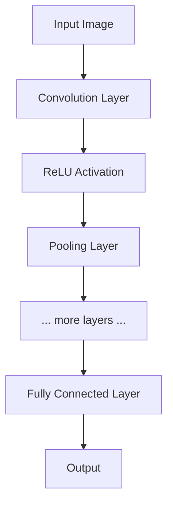

#### Key Concepts
CNN的核心思想是通过引入归纳偏置（inductive biases）来有效处理图像数据。
- 局部连接 (Local Connectivity): 每个神经元只与输入数据的一个局部区域（称为感受野, receptive field）相连。这利用了图像中像素的空间局部性，即相邻像素之间的关系更紧密。
- 参数共享 (Parameter Sharing): 在同一个特征图（feature map）中，所有神经元共享同一组权重（即同一个滤波器或卷积核）。这使得网络能够在图像的不同位置检测到相同的特征，从而实现了平移等变性（translation equivariance），并大大减少了模型的参数量。
- 池化 (Pooling): 池化层（如下采样层）通过对特征图的局部区域进行聚合操作（如最大值或平均值）来降低其空间分辨率。这有助于使表示对微小的平移和变形具有一定的鲁棒性（不变性），并减少后续层的计算量。

#### Mathematical Derivations
- 2D卷积操作: 对于输入图像 $A$ 和卷积核 $B$，其输出 $(A * B)$ 在位置 $(i, j)$ 的值为：
  $$(A * B)_{ij} = \sum_s \sum_t A_{st} B_{i-s, j-t}$$
- 卷积层输出尺寸: 对于一个 $W_1 \times H_1$ 的输入，使用 $F \times F$ 的卷积核，步长 (stride) 为 $S$，填充 (padding) 为 $P$，输出的尺寸 $W_2 \times H_2$ 计算公式为：
  $$W_2 = (W_1 - F + 2P)/S + 1$$
  $$H_2 = (H_1 - F + 2P)/S + 1$$

#### Advantages and Disadvantages
- 优点:
    - 强大的特征学习能力，能够自动学习从低级到高级的层次化特征。
    - 由于参数共享，相比全连接网络，参数量大大减少，更易于训练。
    - 对平移、缩放和一定程度的形变具有鲁棒性。
- 缺点:
    - 对旋转和大的尺度变化不是天然不变的（需要数据增强来弥补）。
    - 池化层会丢失精确的空间位置信息，这对于某些密集预测任务（如语义分割）可能不利。

#### Task
图像分类、目标检测、语义分割等各种计算机视觉任务。

### LeNet-5

LeNet-5是早期成功的CNN架构之一，主要用于手写数字识别。

#### Architecture
它构建了现代CNN的基本框架：卷积层和池化层交替堆叠，最后连接全连接层进行分类。

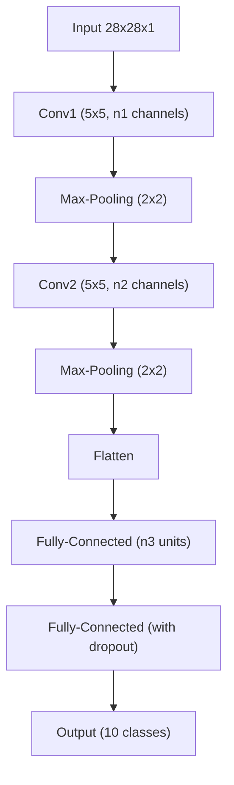

#### Advantages and Disadvantages
- 优点: 首次成功地将卷积、池化和全连接层组合在一起，验证了CNN在图像识别任务上的巨大潜力。
- 缺点: 按照今天的标准，网络结构较浅，使用的激活函数（如Sigmoid或Tanh）和池化方式（平均池化）已经相对过时。

#### Comparison
LeNet-5是现代深度CNN的鼻祖。后续的AlexNet、VGG等模型都是在其基本思想上进行扩展和深化，例如使用更深的结构、更大的数据集以及更有效的组件（如ReLU激活函数）。

### AlexNet

AlexNet是2012年ImageNet竞赛的冠军，它的成功标志着深度学习在计算机视觉领域的革命性突破。

#### Architecture
AlexNet比LeNet-5更深（8层），并引入了几个关键创新。其结构包含5个卷积层和3个全连接层。它使用了较大的卷积核（第一个卷积层为$11 \times 11$），并引入了重叠池化。

#### Advantages and Disadvantages
- 优点:
    - 首次成功应用ReLU激活函数，显著加快了训练速度。
    - 引入了Dropout作为正则化手段，有效防止了过拟合。
    - 证明了深度（更多的层）和宽度（更多的通道）对于提升性能至关重要。
- 缺点:
    - 第一个卷积层的$11 \times 11$卷积核在现在看来过大，可能会丢失一些细节信息。
    - 整体架构设计较为复杂，不如后来的VGGNet规整。

#### Comparison
AlexNet是深度学习发展史上的一个里程碑。它不仅在性能上远超当时的传统方法，更重要的是它引入的ReLU和Dropout等技术成为了后续深度学习模型的标准配置，为VGG、ResNet等更深模型的出现铺平了道路。

### VGGNet

VGGNet探索了网络深度对性能的影响，其特点是结构非常简洁和规整。

#### Architecture
VGGNet的核心设计原则是完全使用小尺寸的卷积核（$3 \times 3$）和池化核（$2 \times 2$）。整个网络由重复堆叠的“卷积块+池化层”构成，最后接几个全连接层。常见的有VGG16和VGG19（数字代表带权重的层数）。

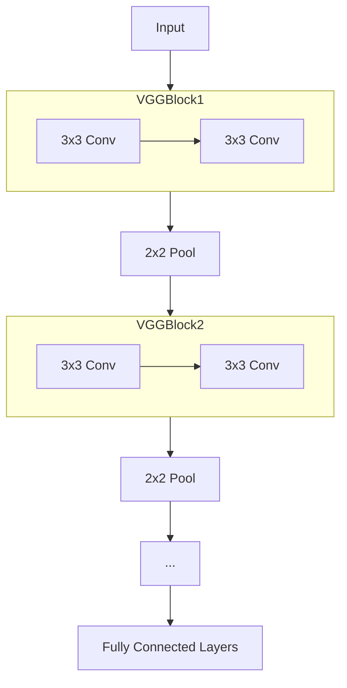

#### Advantages and Disadvantages
- 优点:
    - 结构简单、统一，易于理解和实现。
    - 证明了通过堆叠小卷积核来增加网络深度是提升性能的有效途径。两个$3 \times 3$卷积层的堆叠具有与一个$5 \times 5$卷积层相同的感受野，但参数更少，非线性更强。
- 缺点:
    - 参数量巨大（主要集中在全连接层），导致模型体积大，计算成本高。

#### Comparison
VGGNet继承了AlexNet“网络越深越好”的思想，并将其推向了极致。它的成功表明，一个简单、规整且足够深的网络架构就能取得优异的性能。然而，其巨大的参数量和计算开销促使研究者们开始探索更高效的网络设计，如GoogLeNet的Inception模块。

### GoogLeNet (Inception)

GoogLeNet是2014年ImageNet竞赛的冠军，其核心是Inception模块，旨在提高网络的计算效率和性能。

#### Architecture
GoogLeNet不再是简单的线性堆叠卷积层，而是在一个“模块”内部并行地使用多种不同尺寸的卷积核和池化操作，然后将它们的输出在深度维度上拼接起来。

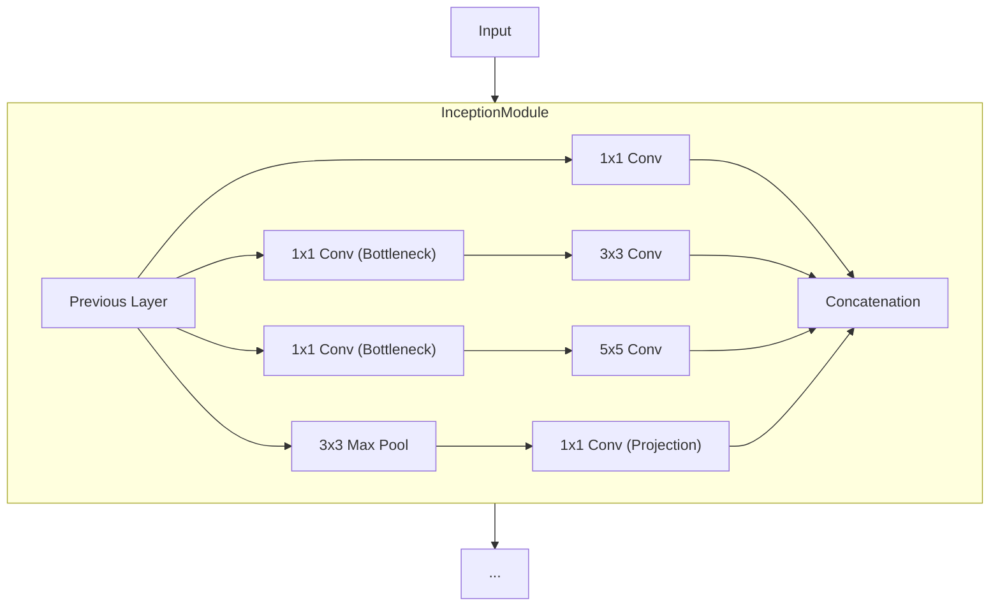
一个关键的创新是使用$1 \times 1$卷积作为“瓶颈层”（bottleneck），在计算昂贵的$3 \times 3$和$5 \times 5$卷积之前先进行降维，大大减少了计算量。

#### Advantages and Disadvantages
- 优点:
    - 计算效率极高，以远少于VGG的参数量和计算量达到了更优的性能。
    - Inception模块的多尺度处理能力使其能够捕捉到不同尺度的特征。
- 缺点:
    - 架构设计复杂，有很多需要手动调整的超参数。

#### Comparison
GoogLeNet开创了“网络中的网络”（network-in-network）和并行结构的设计思路，与VGG的深而窄的串行结构形成对比。它证明了精心设计的网络拓扑结构可以在不牺牲性能的前提下显著提升计算效率。

### ResNet (Residual Network)

ResNet的出现解决了极深网络难以训练的问题，使得构建数百甚至上千层的网络成为可能。

#### Architecture
ResNet的核心是“残差块”（Residual Block）。它引入了一个“跳跃连接”（skip connection），将块的输入直接加到块的输出上。

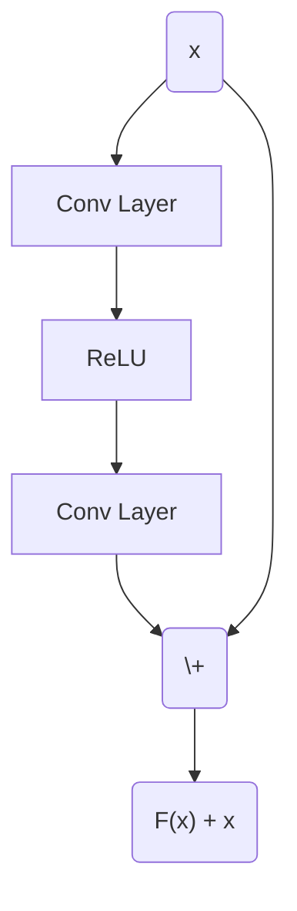

#### Mathematical Derivations
传统网络层学习的是一个目标映射 $H(x)$。而残差块学习的是一个残差映射 $F(x) := H(x) - x$。这样，原始的映射就变成了 $H(x) = F(x) + x$。如果恒等映射（identity mapping）是当前的最优解，那么网络只需要将 $F(x)$ 的权重学习为零即可，这比学习一个完整的恒等变换要容易得多。

#### Advantages and Disadvantages
- 优点:
    - 解决了深度网络的“退化”问题（即网络加深后性能反而下降），使得训练非常深的网络成为可能。
    - 残差连接提供了一条梯度的“高速公路”，有效缓解了梯度消失问题。
- 缺点: 虽然非常强大，但简单的残差结构本身可能不如Inception模块那样具有丰富的多尺度信息。

#### Comparison
ResNet是深度学习发展史上的又一个里程碑。它提供了一种简单而极其有效的构建深度网络的方法，其思想深刻地影响了后续几乎所有的网络架构设计。相比GoogLeNet复杂的Inception模块，ResNet的残差块更加简洁通用。

### Object Detection Models

目标检测任务不仅需要识别图像中的物体类别，还需要定位它们的位置。

#### R-CNN Family (Two-Stage Detectors)
- R-CNN: 这是一个多阶段的流程。
    1.  使用Selective Search等算法生成约2000个候选区域（Region Proposals）。
    2.  将每个候选区域缩放到固定大小。
    3.  对每个缩放后的区域独立地通过一个CNN提取特征。
    4.  使用线性的SVM分类器对特征进行分类。
    5.  使用一个线性回归模型对边界框进行微调。
    - 缺点: 速度极慢，因为需要对每个候选区域独立进行CNN前向传播，计算冗余严重。
- Fast R-CNN:
    - 改进: 只对整张图像进行一次CNN前向传播，得到一个全局的特征图。然后，将候选区域映射到这个特征图上，并使用一个称为RoI Pooling的层从特征图中为每个区域提取固定大小的特征向量。
    - 优点: 共享了卷积计算，大大提高了速度。
- Faster R-CNN:
    - 改进: 引入了一个Region Proposal Network (RPN)，它与检测网络共享卷积特征，从而使得候选区域的生成也由神经网络完成。
    - RPN通过在特征图上滑动窗口，并利用预定义的多种尺寸和比例的“锚框”（Anchor Boxes）来预测物体边界和“物体性”（objectness）得分。
    - 优点: 实现了端到端的训练，是第一个真正意义上的实时高精度深度学习检测器。

#### YOLO / SSD (Single-Stage Detectors)
- 架构: 与R-CNN系列的两阶段方法不同，YOLO（You Only Look Once）和SSD（Single Shot MultiBox Detector）将目标检测视为一个单一的回归问题。
- 核心思想: 将图像划分为一个网格（grid），每个网格单元负责预测落在该单元中心的物体的边界框、置信度以及类别概率。
- 优点: 速度非常快，可以达到实时检测。
- 缺点: 相对于两阶段方法，在定位精度和对小目标的检测上通常稍逊一筹。

## Sequential Models

### Recurrent Neural Networks (RNNs)

RNN是为处理序列数据而设计的网络，其核心特点是引入了循环连接，使得信息可以在时间步之间传递。

#### Architecture
RNN的隐藏状态 $h_t$ 不仅依赖于当前时刻的输入 $x_t$，还依赖于上一时刻的隐藏状态 $h_{t-1}$。
$$h_t = f_W(h_{t-1}, x_t)$$
最简单的形式是 $h_t = \tanh(W_{hh} h_{t-1} + W_{xh} x_t)$。

#### Advantages and Disadvantages
- 优点:
    - 能够处理任意长度的序列。
    - 权重共享机制使其能将在一个位置学到的模式应用到其他位置。
- 缺点:
    - 难以捕捉长期依赖关系，因为在反向传播过程中梯度会指数级消失或爆炸。
    - 计算是串行的，难以并行化，导致训练和推理速度较慢。

#### Task
语言建模、机器翻译、语音识别等序列相关的任务。

### Long Short-Term Memory (LSTM)

LSTM是一种特殊的RNN架构，旨在解决普通RNN的梯度消失问题，从而更好地捕捉长期依赖。

#### Architecture
LSTM的核心是一个“细胞状态”（cell state）$C_t$，它可以看作是一条信息传送带，信息可以在上面顺畅地流动，只受到轻微的线性修改。LSTM通过三个“门”（gate）结构来控制信息的添加、移除和输出。

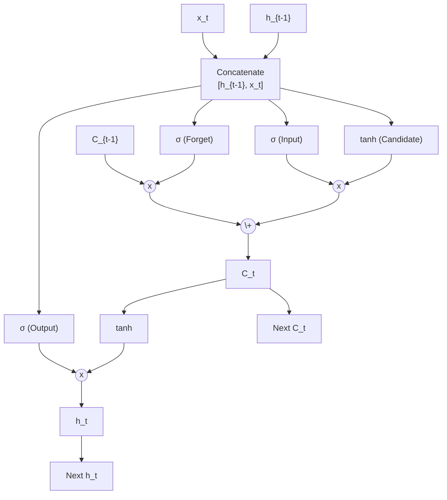

#### Mathematical Derivations
- 遗忘门 (Forget Gate): $f_t = \sigma(W_f \cdot [h_{t-1}, x_t] + b_f)$
- 输入门 (Input Gate): $i_t = \sigma(W_i \cdot [h_{t-1}, x_t] + b_i)$
- 候选细胞状态: $\tilde{C}_t = \tanh(W_C \cdot [h_{t-1}, x_t] + b_C)$
- 细胞状态更新: $C_t = f_t \odot C_{t-1} + i_t \odot \tilde{C}_t$
- 输出门 (Output Gate): $o_t = \sigma(W_o \cdot [h_{t-1}, x_t] + b_o)$
- 隐藏状态更新: $h_t = o_t \odot \tanh(C_t)$

#### Advantages and Disadvantages
- 优点: 细胞状态的加性更新机制有效地解决了梯度消失问题，使其能够学习到序列中跨度很长的依赖关系。
- 缺点: 结构比简单RNN复杂，参数更多，计算成本更高。

#### Comparison
LSTM是对简单RNN的重大改进，通过引入门控机制和细胞状态，它克服了RNN最主要的局限性，并成为了处理序列数据的标准模型之一。

### Gated Recurrent Units (GRU)

GRU是LSTM的一个变体，旨在简化LSTM的结构，同时保持其优异的性能。

#### Architecture
GRU将LSTM的遗忘门和输入门合并成一个单一的“更新门”（update gate）$z_t$，并引入了一个“重置门”（reset gate）$r_t$。它没有独立的细胞状态$C_t$。

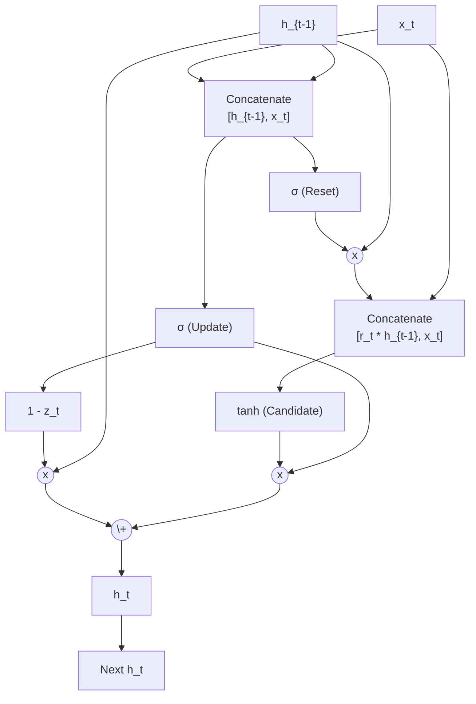

#### Advantages and Disadvantages
- 优点: 参数比LSTM少，计算上更高效。
- 缺点: 表达能力可能略低于LSTM。

#### Comparison
GRU是LSTM的一个成功的简化版本。在许多任务上，它的性能与LSTM相当，但由于其更简单的结构和更少的参数，训练起来可能更快。在选择LSTM还是GRU时，并没有一个绝对的答案，通常需要根据具体任务和数据集进行经验性的选择。

# Advanced Architectures

本部分将深入探讨当前深度学习领域中一些更高级和前沿的模型架构。这些模型通常是为了解决基础模型的特定局限性而设计的，例如处理长距离依赖、提高生成质量或实现更高效的计算。我们将从注意力机制开始，逐步过渡到完全基于注意力的 Transformer 模型，最后探讨几种主流的深度生成模型。

## Attention and Transformer

### Attention Mechanism

注意力机制最初是为了解决基于 RNN 的 Encoder-Decoder 模型在处理长序列时的“信息瓶颈”问题而提出的。它允许模型在生成输出的每一步动态地“关注”输入序列的不同部分。

#### Model Architecture (in Encoder-Decoder)
注意力机制通常被嵌入到 Encoder-Decoder 框架中。Decoder 在生成每个输出词元 $y_t$ 时，不再仅仅依赖于 Encoder 最后的隐藏状态，而是计算一个上下文向量 $c_t$，该向量是 Encoder 所有隐藏状态 $h_1, h_2, \dots, h_N$ 的加权和。

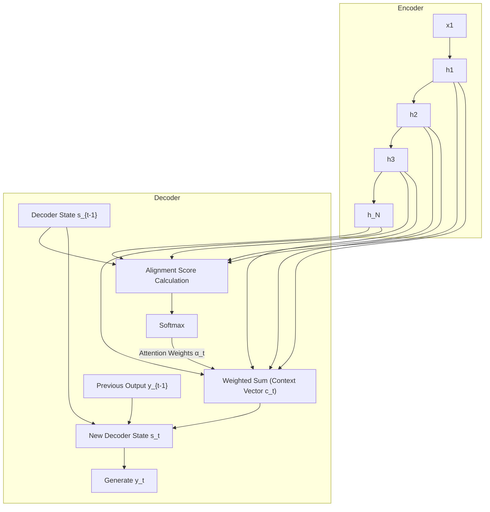

#### Mathematical Derivations
注意力机制的计算过程主要分为三步：
1.  计算对齐分数 (Alignment Score): 对于 Decoder 的当前隐藏状态 $s_{t-1}$ 和 Encoder 的每个隐藏状态 $h_i$，计算一个分数 $e_{t,i}$ 来衡量它们的相关性。
    $$e_{t,i} = a(s_{t-1}, h_i)$$
    这里的对齐函数 $a$ 可以有多种形式，例如：
    - 加性注意力 (Additive Attention): $a(s, h) = v_a^T \tanh(W_a s + U_a h)$
    - 点积注意力 (Dot-Product Attention): $a(s, h) = s^T h$
    - 缩放点积注意力 (Scaled Dot-Product Attention): $a(s, h) = \frac{s^T h}{\sqrt{d_k}}$
2.  计算注意力权重 (Attention Weights): 将对齐分数通过 Softmax 函数进行归一化，得到注意力权重 $\alpha_{t,i}$。
    $$\alpha_{t,i} = \frac{\exp(e_{t,i})}{\sum_{j=1}^N \exp(e_{t,j})}$$
    这些权重 $\alpha_{t,i}$ 的和为 1，可以看作是一个概率分布，表示在生成 $y_t$ 时对输入位置 $i$ 的关注程度。
3.  计算上下文向量 (Context Vector): 上下文向量 $c_t$ 是 Encoder 所有隐藏状态的加权和。
    $$c_t = \sum_{i=1}^N \alpha_{t,i} h_i$$
这个上下文向量 $c_t$ 随后与 Decoder 的前一状态 $s_{t-1}$ 和前一输出 $y_{t-1}$ 一起，用于计算当前状态 $s_t$ 和生成当前输出 $y_t$。

#### Advantages and Disadvantages
- 优点:
    - 解决了长序列的信息瓶颈问题，显著提升了机器翻译等任务的性能。
    - 提供了模型的可解释性，通过可视化注意力权重，可以直观地看到模型在生成每个输出时“关注”了输入的哪些部分。
- 缺点: 在 RNN 框架下，其计算仍然是串行的，限制了并行计算能力。

#### Task
主要应用于机器翻译 (NMT)、图像字幕生成 (Image Captioning) 等需要对齐输入和输出的序列到序列任务中。

### Self-Attention

自注意力机制是注意力机制的一种特殊形式，它将注意力机制从 Encoder-Decoder 之间的交互推广到了单个序列内部的元素交互。它允许序列中的每个元素关注序列中的所有其他元素（包括自身）。

#### Model Architecture
自注意力的核心思想是将每个输入向量 $x_i$ 映射为三个不同的向量：查询向量 (Query, $q_i$)、键向量 (Key, $k_i$) 和值向量 (Value, $v_i$)。这是通过与三个可学习的权重矩阵 $W_Q, W_K, W_V$ 相乘得到的。
$$q_i = W_Q x_i, \quad k_i = W_K x_i, \quad v_i = W_V x_i$$
然后，每个位置的输出 $y_i$ 是所有值向量 $v_j$ 的加权和，权重由查询向量 $q_i$ 和所有键向量 $k_j$ 的相似度决定。

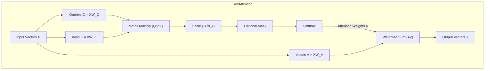

#### Mathematical Derivations (Scaled Dot-Product Attention)
对于整个序列的矩阵形式，计算过程如下：
$$Attention(Q, K, V) = \text{softmax}\left(\frac{QK^T}{\sqrt{d_k}}\right)V$$
- $Q, K, V$ 分别是由所有查询、键、值向量堆叠而成的矩阵。
- $\sqrt{d_k}$ 是一个缩放因子，$d_k$ 是键向量的维度。这个缩放是为了防止当 $d_k$ 很大时，点积结果过大，导致 Softmax 函数进入梯度很小的饱和区域。

#### Advantages and Disadvantages
- 优点:
    - 能够捕捉序列内部任意两个位置之间的长距离依赖关系，因为信息传递路径是直接的（长度为 $O(1)$），而 RNN 是 $O(N)$。
    - 计算是高度可并行化的，因为每个位置的输出可以独立计算。
- 缺点:
    - 计算和内存复杂度为 $O(N^2 d)$，其中 $N$ 是序列长度，这使得它难以处理非常长的序列。
    - 自身不包含位置信息，是排列不变的，需要额外引入位置编码 (Positional Encoding)。

### Transformer

[[Transformer]] 是一个完全基于自注意力机制的模型架构，完全抛弃了循环和卷积结构。

#### Model Architecture
Transformer 由一个 Encoder 堆栈和一个 Decoder 堆栈组成。
- Encoder Block: 每个 Encoder 块包含两个子层：
    1.  一个多头自注意力层 (Multi-Head Self-Attention)。
    2.  一个简单的、位置独立的全连接前馈网络 (Position-wise Feed-Forward Network)。
    每个子层都使用了残差连接和层归一化 (Layer Normalization)。
- Decoder Block: 每个 Decoder 块包含三个子层：
    1.  一个带掩码的多头自注意力层 (Masked Multi-Head Self-Attention)，确保在预测当前位置时只能关注到之前的位置。
    2.  一个多头注意力层，其 Query 来自前一个 Decoder 子层，Key 和 Value 来自 Encoder 的输出，实现了 Encoder-Decoder 之间的注意力。
    3.  一个位置独立的全连接前馈网络。
    同样，每个子层都使用了残差连接和层归一化。
- 多头注意力 (Multi-Head Attention): 与其执行一次高维的自注意力，不如将 Query, Key, Value 线性投影到 $h$ 个不同的低维空间中，并行地执行 $h$ 次注意力计算，然后将结果拼接并再次进行线性投影。这允许模型在不同位置、不同子空间中共同关注来自不同表示空间的信息。
- Positional Encoding: 由于模型不含循环或卷积，为了利用序列的顺序信息，需要在输入嵌入中加入位置编码。这通常是通过一组特定频率的正弦和余弦函数来实现的。

#### Advantages and Disadvantages
- 优点:
    - 凭借其并行计算能力和对长距离依赖的强大建模能力，在许多 NLP 任务上取得了 SOTA 性能。
    - 成为 NLP 领域预训练模型（如 BERT, GPT）的基础架构。
- 缺点:
    - $O(N^2)$ 的复杂度和内存消耗仍然是处理超长序列的主要瓶颈。
    - 需要大量的训练数据和计算资源。

#### Task
机器翻译、语言建模、文本摘要、问答系统等几乎所有的 NLP 任务。

## Generative Models

深度生成模型旨在学习数据的底层分布，并能够从中生成新的、与训练数据相似的样本。

### Autoencoder (AE)

自编码器是一种无监督学习模型，其目标是学习数据的有效表示（编码）。

#### Model Architecture
AE 由两部分组成：一个编码器 (Encoder) $f$ 和一个解码器 (Decoder) $g$。
- Encoder 将输入数据 $x$ 映射到一个通常是低维的潜在表示（或编码）$z = f(x)$。
- Decoder 尝试从潜在表示 $z$ 中重建原始输入 $\hat{x} = g(z)$。

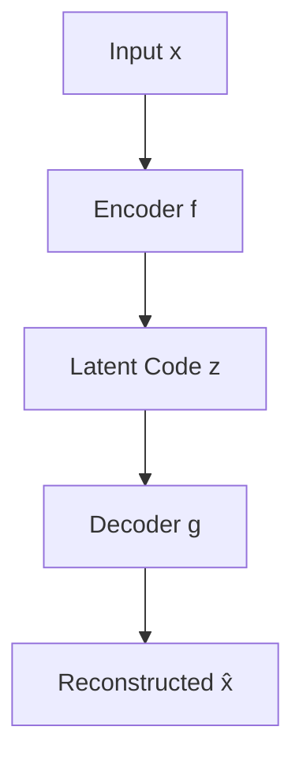

#### Loss Function
训练的目标是最小化重建误差，即输入与重建输出之间的差异。对于连续数据，通常使用均方误差 (MSE) 损失：
$$L(x, \hat{x}) = ||x - g(f(x))||^2$$
对于二值数据，则使用交叉熵损失。

#### Variants and Properties
- Undercomplete AE: 当潜空间维度小于输入维度时，AE 被迫学习数据中最重要的特征。如果编码器和解码器都是线性的，那么它学习到的子空间与主成分分析 (PCA) 相同。
- Regularized AE: 即使潜空间维度大于等于输入维度，也可以通过向损失函数添加正则化项来防止 AE 简单地学习恒等函数。
    - Sparse AE: 在损失中加入对潜表示 $z$ 的稀疏性惩罚（如 $L_1$ 范数），促使每个样本只有少数几个神经元被激活。
    - Denoising AE: 在训练时，向输入 $x$ 中加入噪声得到 $\tilde{x}$，然后让 AE 学习从损坏的输入 $\tilde{x}$ 中重建出原始的、干净的输入 $x$。这迫使模型学习数据流形，而不仅仅是复制输入。

#### Advantages and Disadvantages
- 优点: 是一种简单而有效的特征学习和降维方法，可以作为预训练步骤来初始化监督学习模型。
- 缺点: 它是一个确定性模型，潜空间 $z$ 可能不连续或不规则，导致我们无法从中有效地采样来生成新的数据。它学习的是一个从数据到编码的映射，而不是数据的概率分布。

### Variational Autoencoder (VAE)

VAE 是一种结合了变分推断和深度学习的生成模型，它旨在学习数据的概率分布。

#### Model Architecture
VAE 同样由 Encoder 和 Decoder 组成，但它们都具有概率性。
- Encoder ($q_{\phi}(z|x)$): 也称为“推断网络”或“识别模型”，它不再是输出一个确定的潜码 $z$，而是输出一个概率分布的参数（通常是高斯分布的均值 $\mu(x)$ 和方差 $\sigma^2(x)$）。潜码 $z$ 从这个分布中采样得到。
- Decoder ($p_{\theta}(x|z)$): 也称为“生成网络”，它接收一个潜码 $z$ 作为输入，并输出一个关于数据 $x$ 的概率分布的参数（例如，如果 $x$ 是图像，则输出每个像素的高斯分布均值）。

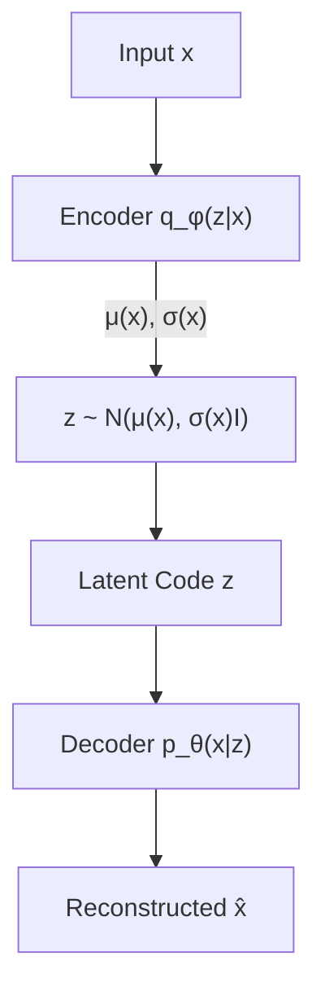

#### Mathematical Derivations (ELBO)
VAE 的目标是最大化数据的边际对数似然 $\log p(x)$。由于 $\log p(x) = \log \int p(x,z) dz$ 难以直接优化，VAE 转而最大化其证据下界（Evidence Lower Bound, ELBO）。
$$\log p_{\theta}(x) \ge \mathcal{L}(\theta, \phi; x) = E_{q_{\phi}(z|x)}[\log p_{\theta}(x|z)] - D_{KL}(q_{\phi}(z|x) || p(z))$$
- 重建项 $E_{q_{\phi}(z|x)}[\log p_{\theta}(x|z)]$: 鼓励解码器在给定潜码的情况下能很好地重建数据。
- 正则化项 $- D_{KL}(q_{\phi}(z|x) || p(z))$: 促使编码器输出的后验分布 $q_{\phi}(z|x)$ 接近先验分布 $p(z)$（通常是标准正态分布 $N(0, I)$）。这使得潜空间具有良好的结构，便于采样。

#### Reparameterization Trick
为了能够通过反向传播来训练整个模型（特别是对采样步骤求导），VAE 使用了重参数化技巧。对于高斯分布，采样过程 $z \sim N(\mu, \sigma^2)$ 可以重写为 $z = \mu + \sigma \cdot \epsilon$，其中 $\epsilon \sim N(0, 1)$。这样，随机性就被从网络结构中分离出来，梯度可以顺畅地流过确定性的 $\mu$ 和 $\sigma$ 节点。

#### Advantages and Disadvantages
- 优点:
    - 是一个真正的生成模型，可以从先验分布 $p(z)$ 中采样并生成新的数据。
    - 学习到的潜空间通常是连续且有意义的，可以用于插值和探索。
- 缺点:
    - 生成的样本通常比 GANs 模糊。这可能是因为重建损失（如 MSE）倾向于生成“平均”的图像，以及变分近似的局限性。
    - ELBO 是真实对数似然的一个下界，最大化 ELBO 并不等同于最大化真实似然。

#### Task
图像生成、特征学习、数据降维等。

### Generative Adversarial Networks (GANs)

GANs 是一种通过对抗性训练过程来学习生成模型的框架。

#### Model Architecture
GAN 由两个相互竞争的神经网络组成：
- 生成器 (Generator, $G$): 接收一个随机噪声向量 $z$ 作为输入，并输出一个与真实数据相似的假样本 $G(z)$。它的目标是生成足够逼真的样本来欺骗判别器。
- 判别器 (Discriminator, $D$): 接收一个样本（真实的或生成的）作为输入，并输出该样本是真实数据的概率。它的目标是尽可能准确地分辨出真实样本和生成样本。

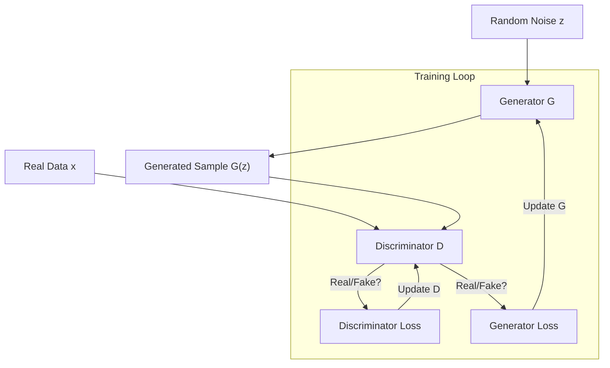

#### Mathematical Derivations (Minimax Game)
GAN 的训练过程是一个二人零和博弈，其目标函数为：
$$\min_G \max_D V(D, G) = E_{x \sim p_{\text{data}}(x)}[\log D(x)] + E_{z \sim p_z(z)}[\log(1 - D(G(z)))]$$
- 判别器 D 的目标是最大化这个表达式，即正确分类真实样本（$D(x) \to 1$）和虚假样本（$D(G(z)) \to 0$）。
- 生成器 G 的目标是最小化这个表达式，即让判别器将生成的样本误判为真实样本（$D(G(z)) \to 1$）。
在理论上，当达到纳什均衡时，$p_G = p_{\text{data}}$，判别器无法区分真假，对所有输入的输出均为 $1/2$。

#### Challenges and Solutions
GAN 的训练非常不稳定，常见的问题包括：
- 模式崩溃 (Mode Collapse): 生成器只学会了生成少数几种能够欺骗判别器的样本，而没有学习到整个数据分布的多样性。
- 梯度消失: 如果判别器训练得太好，它能轻易地区分真假样本，导致生成器的梯度消失，无法继续学习。
为了解决这些问题，研究者提出了许多变体：
- WGAN (Wasserstein GAN): 使用 Wasserstein 距离代替原始 GAN 的 JS 散度作为损失函数。Wasserstein 距离即使在两个分布没有重叠时也能提供有意义的梯度，从而缓解了梯度消失和模式崩溃问题。
- Conditional GAN (CGAN): 通过向生成器和判别器提供额外的条件信息 $y$（如类别标签），可以控制生成样本的属性。

#### Advantages and Disadvantages
- 优点:
    - 能够生成非常清晰、逼真的图像，通常优于 VAEs。
    - 训练过程不需要直接计算复杂的概率密度函数。
- 缺点:
    - 训练过程不稳定，需要仔细调整超参数和网络架构。
    - 容易发生模式崩溃。
    - 评估生成模型的质量很困难。

#### Task
高质量图像生成、图像到图像翻译 (Pix2Pix, CycleGAN)、超分辨率、数据增强等。

### Diffusion Models

[[Diffusion|扩散模型]]是近年来在图像生成领域取得巨大成功的一类生成模型。

#### Model Architecture and Process
扩散模型包含两个过程：
1.  前向过程 (Forward/Diffusion Process): 这是一个固定的、非学习的过程。它从一个真实数据样本 $\mathbf{x}_0$ 开始，通过 $T$ 个步骤逐渐向其添加高斯噪声，直到最终得到一个纯粹的噪声样本 $\mathbf{x}_T \sim N(0, I)$。
    $$\mathbf{x}_t = \sqrt{\alpha_t} \mathbf{x}_{t-1} + \sqrt{1 - \alpha_t} \mathbf{\epsilon}_{t-1}, \quad \text{where } \epsilon \sim N(0, I)$$
    一个重要的性质是，任意时刻的 $\mathbf{x}_t$ 都可以直接从 $\mathbf{x}_0$ 通过以下公式得到：
    $$\mathbf{x}_t = \sqrt{\bar{\alpha}_t} \mathbf{x}_0 + \sqrt{1 - \bar{\alpha}_t} \mathbf{\epsilon}$$
    其中 $\bar{\alpha}_t = \prod_{i=1}^t \alpha_i$。
2.  反向过程 (Reverse/Denoising Process): 这是一个学习的过程。模型（通常是一个 U-Net 架构的神经网络）学习如何从一个噪声样本 $\mathbf{x}_t$ 中预测并移除噪声，以逐步恢复出更干净的样本 $\mathbf{x}_{t-1}$。这个过程从纯噪声 $\mathbf{x}_T$ 开始，迭代 $T$ 次，最终生成一个干净的样本 $\mathbf{x}_0$。

#### Training Objective
模型被训练来预测在给定 $\mathbf{x}_t$ 的情况下，添加到 $\mathbf{x}_0$ 中以产生 $\mathbf{x}_t$ 的噪声 $\mathbf{\epsilon}$。训练目标通常是一个简单的均方误差损失：
$$L = E_{t, \mathbf{x}_0, \mathbf{\epsilon}} \left[ ||\mathbf{\epsilon} - \mathbf{\epsilon}_{\theta}(\mathbf{x}_t, t)||^2 \right]$$
其中 $\mathbf{\epsilon}_{\theta}$ 是我们的神经网络。这个目标函数可以被证明是变分下界（ELBO）的一个简化和加权版本。

#### Sampling
采样过程就是反向过程的迭代应用。从一个纯噪声样本 $\mathbf{x}_T \sim N(0, I)$ 开始，对于 $t = T, \dots, 1$：
$$\mathbf{x}_{t-1} = \frac{1}{\sqrt{\alpha_t}}\left(\mathbf{x}_t - \frac{1-\alpha_t}{\sqrt{1-\bar{\alpha}_t}}\mathbf{\epsilon}_{\theta}(\mathbf{x}_t, t)\right) + \sigma_t \mathbf{z}$$
其中 $\mathbf{z} \sim N(0, I)$ 是一个随机噪声项。

#### Variants (DDIM, LDM)
- DDIM (Denoising Diffusion Implicit Models): 提出了一种非马尔可夫的前向过程，使得在采样时可以跳过一些步骤，从而大大加快了生成速度，而图像质量几乎没有损失。
- LDM (Latent Diffusion Models), e.g., Stable Diffusion: 为了解决在像素空间进行扩散计算成本高昂的问题，LDM 首先使用一个预训练的自编码器（如 VAE）将图像压缩到一个低维的潜空间，然后在潜空间中执行扩散和去噪过程，最后再由解码器将潜码恢复为图像。这极大地降低了计算和内存需求。

#### Advantages and Disadvantages
- 优点:
    - 能够生成质量极高且多样性丰富的图像，在许多基准测试上超越了 GANs。
    - 训练过程相对稳定。
- 缺点:
    - 传统的采样过程（如 DDPM）非常缓慢，需要数百到数千次迭代才能生成一个样本。尽管 DDIM 等技术可以加速，但通常仍比 GANs 慢。

#### Task
高质量的无条件和有条件图像生成（包括文本到图像、图像修复等），视频生成，音频合成，分子结构生成等。

# Other Applications and Concepts

本部分将简要介绍深度学习模型，特别是前文讨论的高级模型，在一些前沿和具体应用中的实现。内容严格依据您提供的PPT，重点展示这些模型如何被应用于解决实际问题。

## Generative Model Applications

深度生成模型，特别是VAE、GAN和Diffusion模型，已经催生了大量创造性的应用，从图像合成、编辑到跨模态生成。

### Text-to-Image Synthesis

这是生成模型最引人注目的应用之一，目标是根据文本描述生成相应的图像。

#### Key Models
- DALL-E 2: 这是OpenAI开发的一个强大的文本到图像模型。其核心思想是利用CLIP（Contrastive Language-Image Pre-Training）模型学习到的联合表示空间。
    1.  **CLIP训练 (Step-1)**: 首先训练一个CLIP模型，它包含一个文本编码器和一个图像编码器，使得匹配的文本-图像对在潜空间中的表示尽可能接近。
    2.  **Prior训练 (Step-2)**: 训练一个"先验"模型（可以是自回归模型或扩散模型），学习从一个CLIP文本嵌入生成对应的CLIP图像嵌入。
    3.  **Decoder训练 (Step-3)**: 训练一个图像解码器（通常是扩散模型），该解码器以CLIP图像嵌入为条件，生成最终的高分辨率图像。
    这个分阶段的过程允许模型解耦文本理解和图像合成，提高了生成质量和对文本的遵循度。
- Imagen: 这是Google提出的模型，其特点是使用了强大的预训练语言模型（如T5）作为文本编码器，并且整个生成过程都在像素空间通过级联的扩散模型完成，而没有像DALL-E 2那样使用一个共享的潜空间。它首先生成一个低分辨率图像，然后通过一系列超分辨率扩散模型逐步提升图像的分辨率。Imagen的成功表明，一个非常强大的文本编码器对于生成高质量、符合文本描述的图像至关重要。
- Stable Diffusion: 这是一个基于潜扩散模型（Latent [[Diffusion]] Model, LDM）的开源文本到图像模型。它首先使用一个[[#Variational Autoencoder (VAE)|VAE]]的编码器将图像压缩到一个低维的潜空间，然后在该潜空间中进行扩散过程，最后用VAE的解码器将去噪后的潜码恢复为高分辨率图像。由于扩散过程在低维空间进行，其计算效率远高于在像素空间操作的模型，使其能够在消费级硬件上运行。
- Parti Model (Google): 这是一个基于自回归方法的模型。它将图像分词（tokenize）为一系列离散的视觉词元（visual tokens），然后像训练语言模型（如GPT）一样，以文本描述为条件，自回归地预测下一个视觉词元，最终生成完整的图像词元序列并解码为图像。

#### Summary of Framework
这些先进的文本到图像模型通常遵循一个通用的多模态框架：
1.  **Text Encoder**: 一个强大的模块（通常是[[Transformer]]）将输入的文本提示编码为一个丰富的语义表示。
2.  **Generation Model**: 一个生成模型（自回归、扩散模型等）以文本表示为条件，生成一个中间表示（如CLIP图像嵌入、潜码或低分辨率图像）。
3.  **Image Decoder**: 一个解码器（扩散模型的超分辨率部分、VAE解码器等）将中间表示转换为最终的高分辨率图像。
这个框架的成功依赖于大数据（如LAION-5B）、大模型和大量的计算资源。

### Cross-Modality and Downstream Applications

生成模型的能力已经超越了简单的文本到图像生成，扩展到了更复杂的编辑和跨模态任务。
- DreamBooth: 一种“主题驱动”的生成技术。用户只需提供一个特定主体（如一只宠物狗）的少量（3-5张）图片，就可以对一个预训练的文本到图像模型进行微调，使其能够生成该特定主体在不同场景、姿态和风格下的全新图像。
- ControlNet: 允许对预训练的扩散模型进行更精细的空间控制。它通过一个额外的可训练网络分支，将边缘图、人体姿态骨架、深度图等条件信息注入到扩散模型的去噪过程中，从而可以精确地控制生成图像的结构和构图。
- InstructPix2Pix: 这是一个基于指令的图像编辑模型。它能够理解人类的编辑指令（如“把向日葵换成玫瑰”），并对输入图像进行相应的修改。该模型通常基于GPT-3等大型语言模型来理解指令，并结合扩散模型来执行编辑。

### Text-to-3D Synthesis

这是生成模型领域的一个新兴且激动人心的方向。
- NeRF (Neural Radiance Field)的应用: NeRF提供了一种连续的3D场景表示，这为从2D生成模型扩展到3D提供了桥梁。
- DreamFusion: 该模型利用一个预训练的2D文本到图像扩散模型（如Imagen）作为“知识先验”，通过一种称为Score Distillation Sampling (SDS)的技术，来优化一个3D表示（如NeRF）。它在没有3D训练数据的情况下，能够从文本生成高质量的3D模型。
- Magic3D (NVIDIA) 和 Point-E (OpenAI): 这些模型进一步发展了文本到3D的技术，通常采用粗到精的策略，先生成低分辨率的粗糙表示，再逐步优化细节，以提高生成速度和质量。
- InstructNeRF2NeRF: 类似于InstructPix2Pix，该模型允许用户通过文本指令来编辑一个已经构建好的NeRF场景。

## Vision Transformers (ViT) and Unification

Transformer架构最初为NLP设计，但其成功引发了将其应用于计算机视觉的浪潮，旨在统一AI领域的基础模型。

### iGPT (Image GPT)

iGPT是OpenAI将GPT模型应用于图像生成的早期尝试。
- 核心思想: 将图像展平为一个像素序列，然后像处理文本一样，使用一个自回归的Transformer模型来预测下一个像素。
- 应用: 可以用于图像补全（completion）和无监督特征学习。在CIFAR-10等数据集上，通过iGPT预训练后进行线性探测（linear probing）或微调，可以获得与有监督方法相媲美的分类性能，证明了生成式预训练在视觉领域的潜力。

### DALL-E

DALL-E（第一代）是另一个将GPT思想用于视觉的力作。它将文本和图像都分词为离散的词元序列，然后训练一个巨大的自回归Transformer模型来联合建模这些序列。这使得模型能够从文本生成图像，并且还能进行零样本的图像到图像转换。

### Vision Transformer ([[ViT]])

ViT是Google提出的一个直接将Transformer架构应用于图像分类的模型，取得了巨大成功。
- 核心思想: 不再依赖卷积。它将输入图像分割成一系列固定大小的图像块（patches），将每个图像块线性嵌入为一个向量，并添加位置编码，然后将这个向量序列输入到一个标准的Transformer编码器中进行处理。最后，使用一个特殊的 `[CLS]` 令牌的最终输出来进行分类。
- 意义: ViT的成功挑战了CNN在计算机视觉领域的统治地位，表明基于自注意力的架构也能够学习到强大的视觉表示，开启了视觉和NLP模型统一的大门。Swin Transformer等后续工作通过引入视觉先验（如层次化和局部性）进一步提升了性能，使其在目标检测、分割等密集预测任务上也超越了CNN。

## Neural Rendering Applications

神经渲染结合了计算机图形学和深度学习，旨在从数据中学习可控的、逼真的场景表示。

### Neural Human Rendering

这是神经渲染的一个重要应用方向，目标是创建和控制逼真的人体数字替身。
- DVP (Deep Video Portraits): 使用一个编码器-解码器框架，将一个源视频中人物的动作和表情迁移到一个目标人物上。它首先从源视频和目标视频中提取3D模型参数（姿态、表情等），然后将源视频的运动参数应用到目标人物的模型上，生成一个合成的中间表示（渲染图、法线图等），最后通过一个图像到图像的转换网络（如pix2pix）将这个中间表示渲染成逼真的视频帧。
- Everybody Dance Now: 这是一个动作迁移的例子。它首先从一个源视频（如专业舞者）中提取人体骨架姿态序列，然后训练一个条件GAN（cGAN），以源姿态序列和目标人物的单张图片为条件，生成目标人物做出相同舞蹈动作的视频。
- 动态场景的神经引擎: 近期的研究（如Neural Animated Mesh, Instant-NVR）致力于构建能够实时渲染动态场景（特别是人体）的系统。这些系统通常利用神经表示（如NeRF的变体）来建模4D时空流形，并开发高效的特征表示（如Fourier PlenOctrees, Tri-plane representation）和压缩技术，以实现实时、高质量的自由视角渲染和编辑。这些技术在虚拟现实、数字人和远程呈现等领域有巨大潜力。

