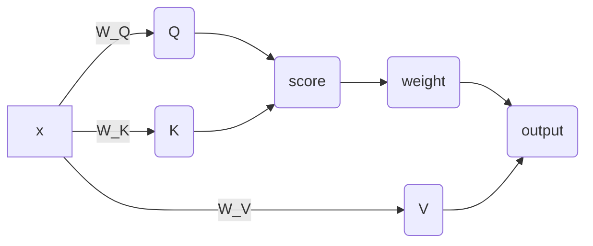

# Lecture 01
> [!note]- slide
> ![[CS190C_Lec1.pdf]]

# Lecture 02
> [!note]- slide
> ![[CS190C_Lec2.pdf]]

# Lecture 03
> [!note]- slide
> ![[CS190C_Lec3.pdf]]

# Lecture 04
> [!note]- slide
> ![[CS190C_Lec4.pdf]]

## BPE: Byte-Pair Encoding

### Motivation

语言模型不能直接处理字符串, 需要先把 text 无损地转换成一串 token id, 再通过 embedding matrix 变成向量. 核心问题是: 如何把文本稳定地映射到数字序列?

一个朴素想法是按词表编码: 给每个词、空格、标点和符号分配一个编号, 再把文本映射成数字序列. 但它有明显问题:

1. 词表非常大. 一种语言里可能有几百万个词, 对存储和计算都不友好.
2. 切分不唯一. 例如 `United Kingdoms` 可以看作一个词, 也可以看作两个词; 中文还会出现 `学习/大语言模型`, `学/习/大/语/言/模/型` 等多种切法.
3. 泛化能力差. `Dog` 和 `Dogs` 在纯词级映射下是两个独立 id, 模型很难自然利用它们的形态关系.

另一个朴素想法是直接使用 UTF-8 byte 编码. 它的优点是规则简单、覆盖所有字符、映射一一对应, 初始词表只需要 256 个 byte. 但问题是序列会显著变长. 对 Transformer 来说, 注意力复杂度约为 $O(n^2)$, 序列越长, 时间和显存开销越大. 同时 byte token 的信息密度太低: 一个词的语义要拆成多个 token 表示, 学习难度增加; embedding matrix 也只能用 256 个向量承载大量语义组合.

因此需要一种折中方案:

1. token 尽量能表示接近完整词或常见词根的语义.
2. 词表大小可控, 通常是几万规模.
3. 编码过程仍然有确定规则, 能从文本无损映射到词表中的 token.

BPE 就是通过统计语料中的高频相邻 byte pair, 逐步把常见 byte 序列合并成更大的 token.

### 完整算法流程

真实训练时不是每一轮都重新扫描整个 corpus, 而是先把语料切成 pre-token, 再用双向链表、pair 位置表、pair 计数表和优先队列做局部更新.

#### 1. 准备输入和超参数

训练 BPE tokenizer 需要:

1. `corpus`: 原始训练文本.
2. `special_tokens`: 特殊 token, 如 `<|endoftext|>`.
3. `vocab_size`: 目标词表大小.
4. `split_pattern`: pre-tokenization 正则.

GPT-2 风格的 pre-tokenization 正则是:

```python
GPT2_SPLIT_PATTERN = r"""'(?:[sdmt]|ll|ve|re)| ?\p{L}+| ?\p{N}+| ?[^\s\p{L}\p{N}]+|\s+(?!\S)|\s+"""
```

这个正则会粗略切出英文缩写、带前导空格的单词、数字、连续符号和空白. 它的作用是限制 BPE 只在 pre-token 内部合并, 避免把跨词、跨文档的片段合成一个巨大 token.

#### 2. 初始化 vocabulary

初始 vocabulary 先放入所有 byte token:

```text
0: b'\x00'
1: b'\x01'
...
255: b'\xff'
```

然后加入特殊 token:

```text
256: b'<|endoftext|>'
```

此时 `vocab` 至少有 `256 + len(special_tokens)` 个 token. 后续每完成一次 merge, 就向 `vocab` 追加一个新 token.

#### 3. Pre-tokenization

先按特殊 token 把 corpus 切成多个 chunk, 保证 `<|endoftext|>` 这类符号作为整体保留下来. 对普通文本 chunk, 再用 `split_pattern` 切成 pre-token.

例如:

```text
abcd abcd tech tech<|endoftext|> are ü?
```

会变成类似:

```text
b'abcd'
b' abcd'
b' tech'
b' tech'
b'<|endoftext|>'
b' are'
b' \xc3\xbc'
b'?'
```

注意: 每个 pre-token 先编码成 UTF-8 bytes, 后续 merge 只能发生在同一个 pre-token 内部.

#### 4. 构建可局部更新的数据结构

把所有 pre-token 展开成 token 节点, 初始每个节点是一个 byte 或一个 special token. 对这些节点建立:

1. `token_dict`: `token_idx -> token_value`, 记录每个位置当前是什么 token.
2. `prev` / `next`: 双向链表, 记录同一个 pre-token 内每个 token 的前驱和后继. pre-token 边界处不连接.
3. `pair_positions`: `pair -> set[token_idx]`, 记录每个 pair 的左 token 位置.
4. `pair_counter`: `pair -> count`, 记录每个 pair 当前出现次数.
5. `heap`: 优先队列, 用 `(-count, tie_breaker, pair)` 找到当前最应该合并的 pair.

这里的 pair 只统计同一个 pre-token 内真正相邻的 token, 不统计跨 pre-token 的相邻 byte.

#### 5. 初始化 pair 统计和优先队列

遍历每个 pre-token 的链表:

1. 对每个 token `x`, 找到它的 `next[x]`.
2. 如果 `next[x]` 存在, 得到 pair `(token_dict[x], token_dict[next[x]])`.
3. 把 `x` 加入 `pair_positions[pair]`.
4. 更新 `pair_counter[pair]`.
5. 把所有 pair 的计数放入 `heap`.

这一步只需要完整扫描一次 corpus. 后续每轮 merge 都只更新局部.

#### 6. Merge loop

当 `len(vocab) < vocab_size` 时重复:

1. 从 `heap` 中取出当前 count 最大的 pair.
2. 做 lazy check: 如果堆顶记录的 count 已经过期, 或这个 pair 在 `pair_counter` 中已经不是当前值, 就丢弃并继续弹出.
3. 设要合并的 pair 为 `(a, b)`, 新 token 为 `new = a + b`.
4. 把 `new` 加入 `vocab`, 记录新的 token id.
5. 把 `(a, b) -> new` 追加到 `merges`, 并记录它的 merge rank.
6. 取出 `pair_positions[(a, b)]` 中的所有候选位置, 逐个检查和合并.

对每个候选左位置 `i`:

1. 令 `j = next[i]`. 如果 `j` 不存在, 跳过.
2. 检查 `token_dict[i] == a` 且 `token_dict[j] == b`. 如果不成立, 说明这是 lazy update 留下的旧位置, 跳过.
3. 取 `p = prev[i]`, `n = next[j]`.
4. 合并前, 从统计中删除受影响的旧 pair:
	1. 如果 `p` 存在, 删除 `(token_dict[p], a)`.
	2. 删除 `(a, b)`.
	3. 如果 `n` 存在, 删除 `(b, token_dict[n])`.
5. 执行合并:
	1. `token_dict[i] = new`.
	2. 删除或标记失效 `j`.
	3. `next[i] = n`.
	4. 如果 `n` 存在, `prev[n] = i`.
6. 合并后, 加入新的相邻 pair:
	1. 如果 `p` 存在, 加入 `(token_dict[p], new)`, 位置为 `p`.
	2. 如果 `n` 存在, 加入 `(new, token_dict[n])`, 位置为 `i`.
7. 对所有被修改过计数的 pair, 把新的 count 重新 push 到 `heap`. 旧堆项不立即删除, 之后靠 lazy check 跳过.

局部更新的关键是: 合并 `(a, b)` 时, 真正会变的只有合并点附近的 pair:

```text
(prev_token, a)   -> (prev_token, new)
(a, b)            -> new
(b, next_token)   -> (new, next_token)
```

因此训练阶段不需要每轮重扫语料, 只需要根据 `pair_positions` 精确访问被合并 pair 的出现位置.

#### 7. 训练产物

训练结束后得到:

1. `vocab`: `token_id -> token_bytes`, 包含 256 个 byte token、special tokens 和所有 merge 出来的 token.
2. `merges`: 按训练顺序排列的 pair 合并列表.
3. `merge_ranks`: `pair -> rank`, 用于之后快速 encode.
4. `special_tokens`: 编码时需要优先识别并保持整体的特殊 token.

#### 8. 使用训练好的 BPE encode

编码新文本时使用同样的 pre-tokenization, 然后逐个 pre-token 独立合并:

1. 把 pre-token 编码成 UTF-8 byte token list.
2. 找出当前 token list 中所有相邻 pair.
3. 查询这些 pair 在 `merge_ranks` 中的 rank.
4. 每次选择 rank 最小的 pair 合并, 因为它最早在训练中被 merge.
5. 只更新合并位置附近的新 pair.
6. 重复直到没有 pair 存在于 `merge_ranks`.
7. 用 `vocab` 把最终 token bytes 映射成 token id.

这样 encode 不需要按完整 `merges` 列表扫描文本, 而是对每个 pre-token 做少量局部合并. 同时因为所有合并都来自训练阶段的 `merges`, 最终 token 一定能在 `vocab` 中找到.

# Lecture 05
> [!note]- slide
> ![[CS190C_Lec5.pdf]]

## Softmax Activation

将score转换成一个分布:
$$x_i=\frac{e^{x_i}}{\sum e^{x_i}}$$

但是会有问题. 当score为1000左右时, 会导致数值溢出: $e^{1000}=\mathbf{Nan}$

为了避免这个问题, 需要把score tensor减去最大值以避免溢出:
$$x_i=\frac{e^{x_i-x_{\max}}}{\sum e^{x_i-x_{\max_i=\frac{e^{x_i}}{\sum e^{x_i}}}}}$$

## RoPE

相对位置编码. 计算方法:
$$\begin{aligned}\theta_{i,k}&=\frac{i}{\Theta^{2k/d}}\\R^i_k&=\begin{bmatrix}\cos(\theta_{i,k})&-\sin(\theta_{i,})\\\sin(\theta_{i,k})&\cos(\theta_{i,k})\end{bmatrix}\\R^i&=\begin{bmatrix}R^i_1&0&0&\cdots&0\\0&R^i_2&0&\cdots&0\\\vdots&\vdots&\vdots&\ddots&\vdots\\0&0&0&\cdots&R^i_{d/2}\end{bmatrix}\\q'_i&=R^iq_i\\k'_j&=R^jk_j\\q'^Tk'_j&=q^T_i(R^i)^TR^jk_j\\&=q^TR^{j-i}k_j\end{aligned}$$

那么, 事实上一个$R^i$应该长成这样:
![[CS190C_Lec5.pdf#page=28&rect=62,79,688,253]]

但是, 如果直接计算有问题: 缓存. 因为这是一个稀疏矩阵, 因此效率很低. 于是希望使用一维的矩阵进行计算, 使用batch进行加速:
![[CS190C_Lec5.pdf#page=30&rect=341,40,625,264]]
只需要计算一个cos序列和一个sin序列即可. 其他的可以通过batch并行化计算快速得出: 1,3,5直接取cos chunk, 2,4,6取sin chunk并取负号

```python
class RoPE(nn.Module):
	def __init__(self,theta,d_k,max_seq_len,device):
		super(RoPE,self).__init__()
		self.theta-theta
		self.d_k=d_k
		self.max_seq_len=max_seq_len
		self.device=device
		
		d_half=d_k//2
		positions=torch.arange(max_seq_len, device=device).unsqueeze(1) # (max_seq_len, 1)
		dims=torch.arange(d_half,device=device).unsqueeze(0) # (1,d_half)
		angles=positions/(theta**(2*dims/d_k))
		cos_values=torch.cos(angles)
		self.register_buffer("cos_values", cos_values) # (1, max_seq_len, d_half)
		sin_values=torch.sin(angles)
		self.register_buffer("sin_values", sin_values)
		
	def forward(self, x, token_positions):
		x_splited=x.reshape(*x.shape[:-1], self.d_k//2,2)
		cos_chunk=self.cos_values[:,token_positions,:]
		sin_chunk=self.sin_values[:,token_positions,:]
		
		even_transform=torch.stack([cos_chunk, -sin_chunk], dim=-1)
		odd_transform=torch.stack([sin_chunk, cos_chunk], dim=-1)
		
		x_ratated_odd=torch.sum(odd_transform*x_splited)
		x_rotated_even=torch.sum(even_transform*x_splited)
		stacked_x=torch.stack([x_rotated_even,x_rotated_odd],dim=-1)
		# TODO
		return ...
```

## FFN

```python
def forward(self,x):
	enhanced=self.linear_w1(x)
	# TODO
```

Feed Forward Network

## Multihead Attention



多头注意力: 将sequence切分成num_head个切片, 每一个切片维度为`d_k=d_model // num_head`的长度. 得到了`(bs, seq_len, d_model)->(bs, seq_len, num_heads, d_k)`. 实际上, 需要参与计算的维度只有`seq_len, d_k`这两个维度. 因此需要进行transpose把`seq_len`放后面: `(bs, seq_len, num_heads, d_k)->(bs, num_heads, seq_len, d_k)`

首先得到score, 然后根据attention mask给每一个head进行mask, `mask==0`的位置填充`float(-inf)`.

然后, 使用softmax对mask的score计算weight, 把weight和V矩阵相乘, 得到一个attention head的输出.

最终, 把每一个attention head的输出concat到一起

# Lecture 06
> [!note]- slide
> ![[CS190C_Lec6.pdf]]

模型训练和自回归

如何训练一个模型:
1. 取数据. 标准的输入输出
2. 利用当前模型参数进行forward, 做一次预测
3. 将预测的结果和标准输出使用loss function做比较
4. 根据loss得到gradients. 如果梯度过大, 需要使用clipping(梯度裁剪)
5. 根据训练step更新学习率
6. 根据learning rate和gradient更新参数

整个训练过程需要上述过程寻来呢多次

## Data Sampling Module

语料库太大, 因此不能一次性将全部的数据都加载进入内存(占据内存过大, 使用时间过长). 因此需要设计一个方法, 只取其中的一部分(取较为精准的一个区间, 把数据取出来):

把数据切成多个chunk. 如果数据在一个chunk中, 那么直接读取一个chunk然后取出数据即可; 如果一个数据在两个chunk中间, 那么只需要读两个chunk然后取出数据即可.

使用`np.memmap`进行磁盘读取


## AdamW Optimizer

梯度下降: SGD: $\theta=\theta-\alpha\nabla L(\theta)$

问题: 会有随机的震荡

解决: AdamW:
$$\begin{aligned}m_t&=\beta_1(m_{t-1}-g_t)+g_t=\beta_2 m_{t-1}+(1-\beta_2)g_t\\v_t&=\beta_2(v_{t-1}-g^2_t)+g_t^2=\beta_2v_{t-1}+(1-\beta_2)g_t^2\\\theta_t&=\theta_{t-1}-\alpha\frac{m_t}{\sqrt{v_t}+\epsilon}\end{aligned}$$
其中:
- $m_t$是first moment, 称作动量(momentum). 目的: 让更新变得平滑. 在更新的时候同时要考虑之前的梯度信息
- $v_t$是second moment, 记录历史梯度波动信息. 目的: 使用$g_t^2$对于高频词的方差变大、低频词方差变小. 我们希望, 高频词在更新的梯度不要过大(尽可能不要有震荡), 对于低频词要尽快更新达到最优.
- $g_t$表示当前step的梯度

但是上述优化有个问题: 当t非常小时, 有:
$$m_1=(1-\beta_1)g_1,m_2=\beta_1(1-\beta_1)g_1+(1-\beta_1)g_2\cdots\cdots$$
假设梯度每次大致相同, 有:
$$\begin{aligned}|m_t|&=(1-\beta_1^t)|g|\\|v_t|&=\sqrt{1-\beta_2^t}|g|\end{aligned}$$
为了要有一个稳定的学习率, 定义:
$$\alpha_t=\alpha\frac{\sqrt{1-\beta^t_2}}{1-\beta_1^t}$$
如此, 有:
$$\theta_t=\theta_{t-1}\alpha_t\frac{m_t}{\sqrt{v_t}+\epsilon}=\theta_{t-1}-\alpha\frac{\sqrt{1-\beta_2^t}}{1-\beta_1^t}\frac{m_t}{\sqrt{v_t}+\epsilon}$$

## Cross-Entropy Loss

[[Cross-Entropy Loss]]

原理:
 ![[Cross-Entropy Loss#Mathematical Formulation]]

在训练初期, 可能会有问题: 初始时可能预测的结果非常差, 导致预测到的probability非常接近0, 导致$\mathcal L=-\log0$出现Nan.

因此这样处理:
$$\mathcal L=-\log\frac{\exp(s_i-s_{\max})}{\sum\exp(s_k-s_{\max})}=(s_i-s_{\max})-\log(\sum\exp(s_k-s_{\max}))$$

这样能够确保, $(s_i-s_{\max})$不会有问题因为已经在log外面来, 后面的$\sum\exp...$也不会有问题因为一定会大于等于1(因为$s_k=s_{\max}$的时候$\exp(0)=1$)

## Gradient Clipper

当梯度非常大的时候, 使用AdamW可能会导致$v_t\to\infty$, 导致$\alpha_t\frac{m_t}{\sqrt{v_t}+\epsilon}\to0$, 导致优化器反常停止

因此当梯度太大的时候需要将其映射到一个足够小的等级. 通过scale, 乘一个系数缩放所有的梯度:
$$\begin{aligned}g&=\sqrt{\sum\|\nabla p_i\|_2^2}\\g_t'&=\frac{\text{max\_norm}}{g+\epsilon}\cdot g_t\end{aligned}$$
- $g$是全局的梯度范数
- max norm是一个预定义的参数, 表示可接受的最大的梯度的值

通过缩放梯度让最终AdamW的$v_t$不要太大

## Learning Rate Scheduler

![[CS190C_Lec6.pdf#page=44&rect=205,30,771,373]]

在前$10\%$左右设置学习率逐渐上升; 后续让学习率逐渐降低([[Deep Learning#Learning Rate Schedules|Cosine Annealing]], 线性衰减等)

## Checkpoint

保存:
1. 模型参数
2. 优化器状态(Optimizer, Scheduler)
