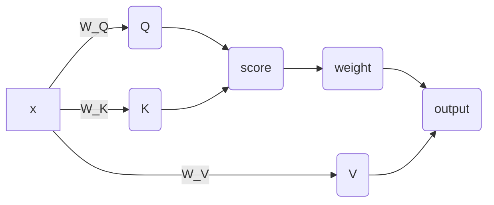

# Lecture 01
> [!note]- slide
> ![[CS190C_Lec1.pdf]]

# Lecture 02
> [!note]- slide
> ![[CS190C_Lec2.pdf]]

# Lecture 03
> [!note]- slide
> ![[CS190C_Lec3.pdf]]

# Lecture 04
> [!note]- slide
> ![[CS190C_Lec4.pdf]]

# Lecture 05
> [!note]- slide
> ![[CS190C_Lec5.pdf]]

## Softmax Activation

将score转换成一个分布:
$$x_i=\frac{e^{x_i}}{\sum e^{x_i}}$$

但是会有问题. 当score为1000左右时, 会导致数值溢出: $e^{1000}=\mathbf{Nan}$

为了避免这个问题, 需要把score tensor减去最大值以避免溢出:
$$x_i=\frac{e^{x_i-x_{\max}}}{\sum e^{x_i-x_{\max_i=\frac{e^{x_i}}{\sum e^{x_i}}}}}$$

## RoPE

相对位置编码. 计算方法:
$$\begin{aligned}\theta_{i,k}&=\frac{i}{\Theta^{2k/d}}\\R^i_k&=\begin{bmatrix}\cos(\theta_{i,k})&-\sin(\theta_{i,})\\\sin(\theta_{i,k})&\cos(\theta_{i,k})\end{bmatrix}\\R^i&=\begin{bmatrix}R^i_1&0&0&\cdots&0\\0&R^i_2&0&\cdots&0\\\vdots&\vdots&\vdots&\ddots&\vdots\\0&0&0&\cdots&R^i_{d/2}\end{bmatrix}\\q'_i&=R^iq_i\\k'_j&=R^jk_j\\q'^Tk'_j&=q^T_i(R^i)^TR^jk_j\\&=q^TR^{j-i}k_j\end{aligned}$$

那么, 事实上一个$R^i$应该长成这样:
![[CS190C_Lec5.pdf#page=28&rect=62,79,688,253]]

但是, 如果直接计算有问题: 缓存. 因为这是一个稀疏矩阵, 因此效率很低. 于是希望使用一维的矩阵进行计算, 使用batch进行加速:
![[CS190C_Lec5.pdf#page=30&rect=341,40,625,264]]
只需要计算一个cos序列和一个sin序列即可. 其他的可以通过batch并行化计算快速得出: 1,3,5直接取cos chunk, 2,4,6取sin chunk并取负号

```python
class RoPE(nn.Module):
	def __init__(self,theta,d_k,max_seq_len,device):
		super(RoPE,self).__init__()
		self.theta-theta
		self.d_k=d_k
		self.max_seq_len=max_seq_len
		self.device=device
		
		d_half=d_k//2
		positions=torch.arange(max_seq_len, device=device).unsqueeze(1) # (max_seq_len, 1)
		dims=torch.arange(d_half,device=device).unsqueeze(0) # (1,d_half)
		angles=positions/(theta**(2*dims/d_k))
		cos_values=torch.cos(angles)
		self.register_buffer("cos_values", cos_values) # (1, max_seq_len, d_half)
		sin_values=torch.sin(angles)
		self.register_buffer("sin_values", sin_values)
		
	def forward(self, x, token_positions):
		x_splited=x.reshape(*x.shape[:-1], self.d_k//2,2)
		cos_chunk=self.cos_values[:,token_positions,:]
		sin_chunk=self.sin_values[:,token_positions,:]
		
		even_transform=torch.stack([cos_chunk, -sin_chunk], dim=-1)
		odd_transform=torch.stack([sin_chunk, cos_chunk], dim=-1)
		
		x_ratated_odd=torch.sum(odd_transform*x_splited)
		x_rotated_even=torch.sum(even_transform*x_splited)
		stacked_x=torch.stack([x_rotated_even,x_rotated_odd],dim=-1)
		# TODO
		return ...
```

## FFN

```python
def forward(self,x):
	enhanced=self.linear_w1(x)
	# TODO
```

Feed Forward Network

## Multihead Attention



多头注意力: 将sequence切分成num_head个切片, 每一个切片维度为`d_k=d_model // num_head`的长度. 得到了`(bs, seq_len, d_model)->(bs, seq_len, num_heads, d_k)`. 实际上, 需要参与计算的维度只有`seq_len, d_k`这两个维度. 因此需要进行transpose把`seq_len`放后面: `(bs, seq_len, num_heads, d_k)->(bs, num_heads, seq_len, d_k)`

首先得到score, 然后根据attention mask给每一个head进行mask, `mask==0`的位置填充`float(-inf)`.

然后, 使用softmax对mask的score计算weight, 把weight和V矩阵相乘, 得到一个attention head的输出.

最终, 把每一个attention head的输出concat到一起

# Lecture 06
> [!note]- slide
> ![[CS190C_Lec6.pdf]]

模型训练和自回归

如何训练一个模型:
1. 取数据. 标准的输入输出
2. 利用当前模型参数进行forward, 做一次预测
3. 将预测的结果和标准输出使用loss function做比较
4. 根据loss得到gradients. 如果梯度过大, 需要使用clipping(梯度裁剪)
5. 根据训练step更新学习率
6. 根据learning rate和gradient更新参数

整个训练过程需要上述过程寻来呢多次

## Data Sampling Module

语料库太大, 因此不能一次性将全部的数据都加载进入内存(占据内存过大, 使用时间过长). 因此需要设计一个方法, 只取其中的一部分(取较为精准的一个区间, 把数据取出来):

把数据切成多个chunk. 如果数据在一个chunk中, 那么直接读取一个chunk然后取出数据即可; 如果一个数据在两个chunk中间, 那么只需要读两个chunk然后取出数据即可.

使用`np.memmap`进行磁盘读取


## AdamW Optimizer

梯度下降: SGD: $\theta=\theta-\alpha\nabla L(\theta)$

问题: 会有随机的震荡

解决: AdamW:
$$\begin{aligned}m_t&=\beta_1(m_{t-1}-g_t)+g_t=\beta_2 m_{t-1}+(1-\beta_2)g_t\\v_t&=\beta_2(v_{t-1}-g^2_t)+g_t^2=\beta_2v_{t-1}+(1-\beta_2)g_t^2\\\theta_t&=\theta_{t-1}-\alpha\frac{m_t}{\sqrt{v_t}+\epsilon}\end{aligned}$$
其中:
- $m_t$是first moment, 称作动量(momentum). 目的: 让更新变得平滑. 在更新的时候同时要考虑之前的梯度信息
- $v_t$是second moment, 记录历史梯度波动信息. 目的: 使用$g_t^2$对于高频词的方差变大、低频词方差变小. 我们希望, 高频词在更新的梯度不要过大(尽可能不要有震荡), 对于低频词要尽快更新达到最优.
- $g_t$表示当前step的梯度

但是上述优化有个问题: 当t非常小时, 有:
$$m_1=(1-\beta_1)g_1,m_2=\beta_1(1-\beta_1)g_1+(1-\beta_1)g_2\cdots\cdots$$
假设梯度每次大致相同, 有:
$$\begin{aligned}|m_t|&=(1-\beta_1^t)|g|\\|v_t|&=\sqrt{1-\beta_2^t}|g|\end{aligned}$$
为了要有一个稳定的学习率, 定义:
$$\alpha_t=\alpha\frac{\sqrt{1-\beta^t_2}}{1-\beta_1^t}$$
如此, 有:
$$\theta_t=\theta_{t-1}\alpha_t\frac{m_t}{\sqrt{v_t}+\epsilon}=\theta_{t-1}-\alpha\frac{\sqrt{1-\beta_2^t}}{1-\beta_1^t}\frac{m_t}{\sqrt{v_t}+\epsilon}$$

## Cross-Entropy Loss

[[Cross-Entropy Loss]]

原理:
 ![[Cross-Entropy Loss#Mathematical Formulation]]

在训练初期, 可能会有问题: 初始时可能预测的结果非常差, 导致预测到的probability非常接近0, 导致$\mathcal L=-\log0$出现Nan.

因此这样处理:
$$\mathcal L=-\log\frac{\exp(s_i-s_{\max})}{\sum\exp(s_k-s_{\max})}=(s_i-s_{\max})-\log(\sum\exp(s_k-s_{\max}))$$

这样能够确保, $(s_i-s_{\max})$不会有问题因为已经在log外面来, 后面的$\sum\exp...$也不会有问题因为一定会大于等于1(因为$s_k=s_{\max}$的时候$\exp(0)=1$)

## Gradient Clipper

当梯度非常大的时候, 使用AdamW可能会导致$v_t\to\infty$, 导致$\alpha_t\frac{m_t}{\sqrt{v_t}+\epsilon}\to0$, 导致优化器反常停止

因此当梯度太大的时候需要将其映射到一个足够小的等级. 通过scale, 乘一个系数缩放所有的梯度:
$$\begin{aligned}g&=\sqrt{\sum\|\nabla p_i\|_2^2}\\g_t'&=\frac{\text{max\_norm}}{g+\epsilon}\cdot g_t\end{aligned}$$
- $g$是全局的梯度范数
- max norm是一个预定义的参数, 表示可接受的最大的梯度的值

通过缩放梯度让最终AdamW的$v_t$不要太大

## Learning Rate Scheduler

![[CS190C_Lec6.pdf#page=44&rect=205,30,771,373]]

在前$10\%$左右设置学习率逐渐上升; 后续让学习率逐渐降低([[Deep Learning#Learning Rate Schedules|Cosine Annealing]], 线性衰减等)

## Checkpoint

保存:
1. 模型参数
2. 优化器状态(Optimizer, Scheduler)
