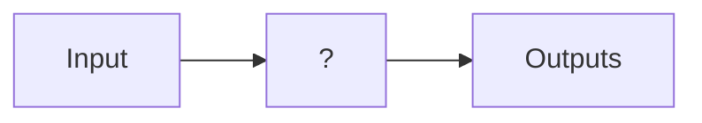

# Preliminaries

Kernal:
$$F(\alpha)=\int_a^bf(t)K(\alpha,t)dt$$

- 傅立叶: $K(\omega,t)=e^{-j\omega t}$
- Laplace: $K(s,t)=e^{-st}$

Eigenvalues:

Kernel of matrix $A$ is null space of matrix $A$:
$$N(A)=null(A)=\{x\in\mathbb R|Ax=0\}$$
当零空间只有平凡解的时候, 是可逆的. 反之, 那么矩阵不可逆

$$det(A)=\prod\lambda_i$$


O.D.E:

$$\frac{dx}{dt}=\lambda x$$
$$\frac{dx}{x}=\lambda dt$$
$$\int_0^t\frac{1}{x}dx=\int_0^t\lambda dt$$
$$\ln|x(t)|-\ln|x(0)|=\lambda(t-0)$$
$$x(t)=x(0)e^{\lambda t}$$

# Lecture 01

> [!note]- slides
> ![[EE160-Lec1-Introduction2FeedbackControl.pdf]]

## Control Theory

Control Theory 研究以下三类问题:

System Identification Problem:


Simulation Problem


Control Problem


## Control

控制:
- Dynamics: 这个系统本身的变化方向. 如:
	- $\frac{d}{dt}x=\pm1$: 恒定增长/减小
	- $\frac{d}{dt}x=\pm x$: 指数增长/减小
	- $\frac{d}{dt}x=x^2$: 非线性增长/减小
- Goal: 期望系统达成的目标. 如, 让$x\to0$, 并稳定下来
- Input: 重点的部分. 要设计一个输入(Control System), 使得整个系统达到我们的Goal:
	- $\frac{d}{dt}x=x^2+u$
	- $u$是Control Input. 前面的是Dynamics

但是更常见的系统是一个二阶系统(加速度, ...):
![[EE160-Lec1-Introduction2FeedbackControl.pdf#page=20&rect=34,318,319,469|409]]

为了防止过冲(有加速度, 一阶系统仅能做到靠近, 但是无法确保不会“过冲”(overshoot)或者震荡)

### Feedback Control

反馈(feedback): 需要知道输出才能知道控制, 即输入$u$是$x$的函数

#### Negative Feedback

负反馈. 输出越大, 输入越小(或者越负). 防止输出爆炸

e.g.
![[EE160-Lec1-Introduction2FeedbackControl.pdf#page=22&rect=275,330,570,435|230]]
根据图中的关系写表达式:
- $Y=D_2+P(U+D_1)$: 最终的输出
- $U=CE$: 由控制器$C$发出的信号, 用于控制最终的输出
- $E=R-Y$: Error误差, 期望的目标$R$(或者叫Reference)和输出$Y$之间的差异

将$U$替换, 得到最终的输出的公式:
$$\begin{aligned}Y&=D_2+P(U+D_1)\\&=D_2+P(C(R-Y)+D_1)\\&=D_2+PCR-PCY+PD_1\end{aligned}$$
$$\Rightarrow Y=\frac{PC}{1+PC}R+\frac{P}{1+PC}D_1+\frac{1}{1+PC}D_2$$

此处可以理解为:
- $C$是一个转换器, 希望得到的是$R$, 有误差$E$, 经过$C$使得最终的输出$Y$接近$R$.
- 这个系统的目的是让输出$Y$追随目标$R$

使$C=\infty$, 可以令$\frac{PC}{1+PC}R\to R$, 最终$Y\overset{C\to\infty}{=\mathrel{\mkern-3mu}=}R$. 即, 如果让控制的增益能够达到无限, 那么系统会忽视其他的组件, 直接复制Reference.

但是实际上这个是理想的系统, 真实世界中由于 能量不是无限的, 因此令$C\to\infty$是不可能达成的.
# Lecture 02
> [!note]- slide
> ![[EE160-Lec2-MathModels.pdf]]

## Linear Time Invariant System

[[EE160-Lec2-MathModels.pdf#page=3&selection=28,0,28,11|齐次性(homogenity)]]: $\alpha h(x)=h(\alpha x)$
![[EE160-Lec2-MathModels.pdf#page=3&rect=5,179,247,308|254]]

[[EE160-Lec2-MathModels.pdf#page=3&selection=32,0,32,13|可加性(superposition)]]: $h(x)+h(y)=h(x+y)$
![[EE160-Lec2-MathModels.pdf#page=3&rect=258,144,499,305|244]]

[[EE160-Lec2-MathModels.pdf#page=3&selection=38,1,39,15|时不变性(time invariance)]]: $\matrix{x(t)\rightarrow\text{system}\rightarrow y(t)\\\Downarrow\\x(t+t_0)\rightarrow\text{system}\rightarrow y(t+t_0)}$
![[EE160-Lec2-MathModels.pdf#page=3&rect=503,146,839,306|254]]

### Linear Operator

线性操作. 对一个线性系统做线形操作, 得到的系统仍然是线性的.
- $\alpha x(t)$
- $\frac{1}{\alpha}x(t)$
- $\int x(t)dt$
- $\frac{d}{dt}x(t)$
- $x_1(t)+x_2(t)$
- $x_1(t)-x_2(t)$

## Laplace Transform

[[EE160-Lec2-MathModels.pdf#page=6&selection=16,0,16,21|激励函数]](Excitation Functions): 在未知系统的时候, 创建一个冲击函数作为输入, 然后根据输出去分析这个系统的构成
- 冲击函数: $\delta(t)$: $\int_{0^-}^{0^+}\delta(t)dt=1$
- 阶跃函数: $u(t)=\left\{\matrix{1&t>0\\0&t<0}\right.$ ^1a68f2
- Ramp函数: $tu(t)$
- Parabola函数: $\frac{1}{2}t^2u(t)$
- Sinusoid函数: $\sin(\omega t)$

![[EE160-Lec2-MathModels.pdf#page=6&rect=465,90,826,482|490]]

### Laplace Transform

定义$s=\sigma+j\omega$:
$$\mathcal L[f(t)]=F(s)=\int_{0^-}^{\infty}f(t)e^{-st}dt$$

常见的Laplace[[EE160-Lec2-MathModels.pdf#page=7&rect=14,89,318,342|变换]]:

| $f(t)$                                                    | $F(s)$                          |
| :-------------------------------------------------------- | :------------------------------ |
| $\delta(t)$                                               | $1$                             |
| $u(t) = \begin{cases} 1 & t > 0 \\ 0 & t < 0 \end{cases}$ | $\frac{1}{s}$                   |
| $tu(t)$                                                   | $\frac{1}{s^2}$                 |
| $t^n u(t)$                                                | $\frac{n!}{s^{n+1}}$            |
| $e^{-at}u(t)$                                             | $\frac{1}{s+a}$                 |
| $\sin \omega t u(t)$                                      | $\frac{\omega}{s^2 + \omega^2}$ |
| $\cos \omega t u(t)$                                      | $\frac{s}{s^2 + \omega^2}$      |

常见的Laplace[[EE160-Lec2-MathModels.pdf#page=8&rect=400,103,832,418|变换的操作]], 即复合函数的Laplace变换:

| Theorem                                                                                     | Name                    |
| :------------------------------------------------------------------------------------------ | :---------------------- |
| $\mathscr{L}[f(t)] = F(s) = \int_{0-}^{\infty} f(t)e^{-st}dt$                               | Definition              |
| $\mathscr{L}[kf(t)] = kF(s)$                                                                | Linearity theorem       |
| $\mathscr{L}[f_1(t) + f_2(t)] = F_1(s) + F_2(s)$                                            | Linearity theorem       |
| $\mathscr{L}[e^{-at}f(t)] = F(s+a)$                                                         | Frequency shift theorem |
| $\mathscr{L}[f(t-T)] = e^{-sT}F(s)$                                                         | Time shift theorem      |
| $\mathscr{L}[f(at)] = \frac{1}{a}F\left(\frac{s}{a}\right)$                                 | Scaling theorem         |
| $\mathscr{L}\left[\frac{df}{dt}\right] = sF(s) - f(0-)$                                     | Differentiation theorem |
| $\mathscr{L}\left[\frac{d^2f}{dt^2}\right] = s^2F(s) - sf(0-) - f'(0-)$                     | Differentiation theorem |
| $\mathscr{L}\left[\frac{d^n f}{dt^n}\right] = s^n F(s) - \sum_{k=1}^{n} s^{n-k}f^{k-1}(0-)$ | Differentiation theorem |
| $\mathscr{L}\left[\int_{0-}^{t} f(\tau)d\tau\right] = \frac{F(s)}{s}$                       | Integration theorem     |
| $f(\infty) = \lim_{s \to 0} sF(s)$                                                          | Final value theorem     |
| $f(0+) = \lim_{s \to \infty} sF(s)$                                                         | Initial value theorem   |


> [!example] 
> 计算$e^{-3t}t\cdot u(t)$的Laplace Transform:
> 
> $$\mathcal L[e^{-3t}f(t)]=F(s+a)$$
> $$\mathcal L[t\cdot u(t)]=\frac{1}{s^2}$$
> $$\Rightarrow\mathcal L[e^{-3t}t\cdot u(t)]=\frac{1}{(s+3)^2}$$

> [!example] 
> 计算Laplace Inverse Transform: $F_1(s)=\frac{s^3+2s^2+6s+7}{s^2+s+5}$
> $$\begin{aligned}F_1(s)&=\frac{s^3+2s^2+6s+7}{s^2+s+5}\\&=\frac{s(s^2+s+5)+(s^2+s+5)+2}{s^2+s+5}\\&=s+1+\frac{2}{s^2+s+5}\\&=s+1+\frac{\sqrt{\frac{19}{4}}}{(s+\frac{1}{2})^2+\frac{19}{4}}\cdot\frac{2}{\sqrt{\frac{19}{4}}}\end{aligned}$$
> $$\Rightarrow\mathcal L^{-1}[F_1(s)]=\frac{d\delta(t)}{dt}+\delta(t)+e^{-\frac{1}{2}t}\sin\sqrt{\frac{19}{4}}t\cdot u(t)\cdot\frac{2}{\sqrt{\frac{19}{4}}}$$

> [!example] 
> 根据微分方程求解Laplace Inverse Transform: $\frac{d^2y}{dt^2}+12\frac{dy}{dt}+32y=32u(t)$
> 
> 对两侧使用Laplace Transform, 得:
> $$s^2F(s)-sy(0^-)-y'(0^-)+12(sF(s)-y(0^-))+32F(s)=32\frac{1}{s}$$
> 因为初始状态下$y$为0, 有:
> $$\begin{aligned}s^2F(s)+12sF(s)+32F(s)&=\frac{32}{s}\\\\ F(s)&=\frac{32}{s(s^2+12s+32)}\\&=32\cdot\frac{1}{s}\cdot\frac{1}{4}(\frac{1}{s+4}-\frac{1}{s+8})\\&=8\cdot\frac{1}{3}(\frac{1}{s}-\frac{1}{s+4})-8\cdot\frac{1}{7}(\frac{1}{s}-\frac{1}{s+8})\\\\\Rightarrow y(t)&=\frac{8}{3}u(t)-\frac{8}{3}e^{-4t}u(t)-\frac{8}{7}u(t)+\frac{8}{7}e^{-8t}u(t)\\&=\frac{32}{21}u(t)-\frac{8}{3}e^{-4t}u(t)+\frac{8}{7}e^{-8t}u(t)\end{aligned}$$

> [!tip]- 裂项的求法
> $$F(s)=\frac{1}{s(s+2)^2}$$
> 裂项之后的结果为:
> $$F(s)=\frac{A}{s}+\frac{B}{s+2}+\frac{C}{(s+2)^2}$$
> 注意, 高次项裂项需要把低次项都写出来
> 
> 然后计算系数(对列项后的结果进行操作):
> $$\begin{aligned}\text{let $s=0$, we have: }A&=sF(s)\\&=\frac{s}{s(s+2)^2}\\&=\frac{1}{(s+2)^2}\\A&=\frac{1}{4}\\\\\text{let $s=-2$, we have: }C&=(s+2)^2F(s)\\&=\frac{1}{s}\\C&=-\frac{1}{2}\end{aligned}$$
> 对于$B$, 需要用求导的方式进行计算:
> $$\begin{aligned}\text{let $s=-2$, we have: }B&=[(s+2)^2F(s)]'\\&=-\frac{1}{s^2}\\B&=-\frac{1}{4}\end{aligned}$$

> [!example] 
> ![[EE160-Lec2-MathModels.pdf#page=11&rect=28,457,367,480]]
> $$\begin{aligned}\mathcal L[f(t)]=F(s+5)=\frac{1}{s+5}\end{aligned}$$
> 
> ![[EE160-Lec2-MathModels.pdf#page=11&rect=392,458,819,481]]
> $$\begin{aligned}F(s)&=\frac{10}{s(s+2)(s+3)^2}\\&=\frac{}{s}+\frac{}{s+2}+\frac{}{s+3}+\frac{}{(s+3)^2}\end{aligned}$$
> 注意, 高次项在裂项的时候需要使用重根, 不能省略$\frac{C}{s+3}$这一项

## Transfer Function

转移函数是一个线性时不变([[#Linear System|LTI]])的函数. 定义为: 在 **零初始化** 的状态下, 系统的输入量与输出量的[[#Laplace Transform]]之比:
$$G(s)=\frac{\mathcal L\{\text{Output}\}(s)}{\mathcal L\{\text{Input}\}(s)}$$

从微分方程转换:
1. 将两侧通过Laplace Transform转换成频域
2. 写成$G(s)=\frac{C(s)}{R(s)}=\frac{\cdots}{\cdots}$的形式
![[EE160-Lec2-MathModels.pdf#page=13&rect=30,99,825,477]]

> [!example]
> ![[EE160-Lec2-MathModels.pdf#page=14&rect=30,412,607,475]]
> $$G(s)=\frac{s^2+4s+3}{s^3+3s^2+7s+5}$$
> 
> ![[EE160-Lec2-MathModels.pdf#page=14&rect=31,275,602,352]]
> $$\frac{d^2c}{dt^2}+6\frac{dc}{dt}+2c=2\frac{dr}{dt}+r$$
> 
> ![[EE160-Lec2-MathModels.pdf#page=14&rect=32,144,526,215]]
> $$c(t)=\frac{1}{32}-\frac{1}{16}e^{-4t}+\frac{1}{32}e^{-8t}$$

## System Examples

对于电路系统:
![[EE160-Lec2-MathModels.pdf#page=16&rect=17,111,828,488]]

一个RLC振荡电路 [[Electric Circuits#RC Circuits]] [[Electric Circuits#RL Circuit]]

对于一个物理弹簧:
![[EE160-Lec2-MathModels.pdf#page=17&rect=9,132,790,480]]

电机转子:
![[EE160-Lec2-MathModels.pdf#page=18&rect=25,83,826,486]]

## State Space Model

状态: $x$, 一个线性无关的向量

SSM将整个系统的所有的方程, 整理成了两个部分:
- 状态方程: $\overset{\cdot}{x}=\mathbf{A}x(t)+\mathbf{B}u(t)$
	- 状态的变化速度 = 物理规律$\times$当前的状态$+$外部影响力$\times$外部输入
- 输出: $y=\mathbf{C}x(t)+\mathbf{D}u(t)$
	- 测量的结果 = 观测能力$\times$当前的状态$+$外部对测量值的影响力$\times$外部输入

其中:
- $x(t)$是状态向量
- $\overset{\cdot}{x}(t)$是一阶导数
- $y$是输出向量
- $u$是输入向量, 或者说control vector
- $\mathbf{A}$是系统矩阵
- $\mathbf{B}$是输入矩阵
- $\mathbf{C}$是输出矩阵
- $\mathbf{D}$是前馈矩阵

![[EE160-Lec2-MathModels.pdf#page=25&rect=16,299,410,445]]
$$\overset{\cdot}{x}=\begin{bmatrix}\frac{1}{C_1}&\frac{1}{C_1}&-\frac{1}{C_1}\\-\frac{1}{L}&0&0\\\frac{1}{C_2}&0&-\frac{1}{C_2}\end{bmatrix}\cdot x+\begin{bmatrix}0\\1\\0\end{bmatrix}\cdot v_i(t)$$
$$y=\begin{bmatrix}0&0&1\end{bmatrix}x$$

![[EE160-Lec2-MathModels.pdf#page=25&rect=435,340,812,442]]
$$\overset{\cdot}{z}=\begin{bmatrix}0&1&0&0&0&0\\-1&-1&0&1&0&0\\0&0&0&1&0&0\\0&1&-1&-1&1&0\\0&0&0&0&1&0\\0&0&1&0&-1&-1\end{bmatrix}\cdot z+\begin{bmatrix}0\\1\\0\\0\\0\\0\end{bmatrix}\cdot f(t)$$
$$y=\begin{bmatrix}0&0&0&0&1&0\end{bmatrix}z$$
$$\text{where: }z=\begin{bmatrix}x_1&\overset{\cdot}{x}_1&x_2&\overset{\cdot}{x}_2&x_3&\overset{\cdot}{x}_3&\end{bmatrix}^\top$$

### O.D.E to State Space Model

原始O.D.E方程:
$$\frac{d^ny}{dt^n}+a_{n-1}\frac{d^{n-1}y}{dt^{n-1}}+\cdots+a_1\frac{dy}{dt}+a_0y=b_0u$$

首先定义: $x_1=y$, $x_2=\frac{dy}{dt}$, $\cdots$, $x_n=\frac{d^{n-1}y}{dt^{n-1}}$

有:

则SSM: $\dot x=Ax+Bu$ 可以转换成:
$$\begin{bmatrix}\dot x_1\\\dot x_2\\\vdots\\\dot x_n\end{bmatrix}=A\begin{bmatrix}x_1\\x_2\\\vdots\\x_n\end{bmatrix}+Bu$$

由于$\dot x_1=x_2$, $\dot x_{m-1}=x_m$, 则A的上部分为:
$$\begin{bmatrix}0&1&0&\cdots&0\\0&0&1&\cdots&0\\&&\vdots\\0&0&0&\cdots&1\\?&?&?&\cdots&?\end{bmatrix}$$
根据原始的O.D.E, 有: $\dot x_n+a_{n-1}x_n+\cdots+a_0x_1=b_0u$, 因此$\dot x_n=-a_{n-1}x_n-\cdots-a_0x_1+b_0u$, 因此完整的$A$为:
$$\begin{bmatrix}0&1&0&\cdots&0\\0&0&1&\cdots&0\\&&\vdots\\0&0&0&\cdots&0\\-a_0&-a_1&-a_2&\cdots&-a_{n-1}\end{bmatrix}$$
完整的$B$为:
$$\begin{bmatrix}0\\0\\\vdots\\b_0\end{bmatrix}$$

因此, 状态方程为:
![[EE160-Lec2-MathModels.pdf#page=26&rect=403,172,816,299|397]]

输出为$y$, 就是$x_1$. 则最终的输出方程为:
![[EE160-Lec2-MathModels.pdf#page=26&rect=437,87,583,171|215]]

### Transfer Function to State Space Model

首先, 将转移函数转换成O.D.E, 然后使用[[#O.D.E to State Space Model]].

对于分子不是常数的转移函数, 引入中间变量.

假设转移函数为$\frac{Y(s)}{U(s)}=\frac{b_{n-1}s^{n-1}+\cdots+b_1s+b_0}{s^n+a_{n-1}s^{n-1}+\cdots+a_1s+a_0}$
1. 引入中间变量$X(s)$, 使得$\frac{X(s)}{U(s)}=\frac{1}{s^n+a_{n-1}s^{n-1}+\cdots+a_1s+a_0}$, $\frac{Y(s)}{X(s)}=b_{n-1}s^{n-1}+\cdots+b_1s+b_0$
2. 构造$$A=\begin{bmatrix}0&1&0&\cdots&0\\0&0&1&\cdots&0\\&&\vdots\\0&0&0&\cdots&1\\-a_0&-a_1&-a_2&\cdots&-a_{n-1}\end{bmatrix},B=\begin{bmatrix}0\\0\\\vdots\\0\\1\end{bmatrix}$$
3. 构造$C$矩阵. 频域的输出为$Y(s)=b_0\cdot X(s)+b_1\cdot sX(s)+\cdots+b_{n-1}\cdot s^{n-1}X(s)$. 因此, 构建矩阵$$C=\begin{bmatrix}b_0&b_1&\cdots&b_{n-1}\end{bmatrix}$$
4. 矩阵$D$依然为0

对于分子分母同幂次的转移方程, 需要构建矩阵$D$. 步骤为:
1. 将转移函数写成如下形式:$$G(s)=\frac{Y(s)}{U(s)}=\beta+\frac{b_{n-1}s^{n-1}+\cdots+b_1s+b_0}{s^n+a_{n-1}s^{n-1}+\cdots+a_1s+a_0}$$
2. 对于后面的真分式, 使用前面的方法获取矩阵$A$, $B$, $C$:$$A=\begin{bmatrix}0&1&0&\cdots&0\\0&0&1&\cdots&0\\&&\vdots\\0&0&0&\cdots&1\\-a_0&-a_1&-a_2&\cdots&-a_{n-1}\end{bmatrix},B=\begin{bmatrix}0\\0\\\vdots\\0\\1\end{bmatrix},C=\begin{bmatrix}b_0&b_1&\cdots&b_{n-1}\end{bmatrix}$$
3. 矩阵$D$为一个常数$D=\begin{bmatrix}\beta\end{bmatrix}$


> [!example]-
> ![[EE160-Lec2-MathModels.pdf#page=27&rect=25,89,353,420]]

### State Space Model to Transfer Function

假设已知:
$$\dot X=AX+BU,Y=CX+DU$$

结论为: 转移函数为
$$T(s)=\frac{Y(s)}{U(s)}=C(sI-A)^{-1}B+D$$

计算矩阵的逆的方法:
$$(sI-A)^{-1}=\frac{\text{adj}(sI-A)}{\det(sI-A)}$$
$\text{adj}$的结果仍然是一个矩阵, $\det$的结果是一个scalar. 最终的结果应该是一个矩阵, shape和$A$相同.

$\text{adj(A)}$的算法为:
![[EE160-Lec2-MathModels.pdf#page=31&rect=25,99,621,210]]


> [!example]+ 
> ![[EE160-Lec2-MathModels.pdf#page=32&rect=179,343,616,444]]
> $$sI-A=\begin{bmatrix}s+4&1.5\\-4&s\end{bmatrix}$$
> $$adj(sI-A)=\begin{bmatrix}s&-1.5\\4&s+4\end{bmatrix}$$
> $$det(sI-A)=s(s+4)+6$$
> $$(sI-A)^{-1}=\frac{ajd(sI-A)}{det(sI-A)}=\frac{\begin{bmatrix}s&-1.5\\4&s+4\end{bmatrix}}{s^2+4s+6}$$
> $$T(s)=\begin{bmatrix}1.5&0.625\end{bmatrix}\frac{\begin{bmatrix}s&-1.5\\4&s+4\end{bmatrix}}{s^2+4s+6}\begin{bmatrix}2\\0\end{bmatrix}=\frac{3s+5}{s^2+4s+6}$$

### Diagonal State Space Repr

> [!note] 引入: 变量的变换
> 
> 对于一个系统而言, SSM不是唯一的. 将变量通过Transform矩阵转换到另一个变量, SSM也会随之改变.
> 
> 如, 令$Z=PX$, 那么SSM变成了:
> $$\dot z=P^{-1}APz+P^{-1}Bu$$
> $$y=CPz+Du$$

使用对角状态空间表达的原因是解耦和, 让变量对最终结果的输出相互独立.

如果没有对角化, 那么$\dot x_1$可能依赖于$x_1,x_2,\cdots$. 对角化之后, $\dot z_1$只和$z_1$以及$u$有关

> [!tip]- 矩阵对角化
> 使用[[LinearAlgebra#Eigenvector|特征向量]]进行矩阵对角化处理:
> $$\det(\lambda I-A)=0$$
> 计算得到所有的特征值. 然后计算特征向量:
> $$A\begin{bmatrix}x_1\\\vdots\\x_n\end{bmatrix}=\lambda_i\begin{bmatrix}x_1\\\vdots\\x_n\end{bmatrix}$$
> 所有的特征向量组成特征矩阵:
> $$P=\begin{bmatrix}x_{11}&\cdots&x_{1n}\\&\vdots\\x_{n1}&\cdots&x_{nn}\end{bmatrix}$$
> 
> 然后对角化矩阵$$\text{Diag}(A)=P^{-1}AP$$

> [!example] 
> ![[EE160-Lec2-MathModels.pdf#page=35&rect=9,349,501,445|443]]
> 
> Solution:
> ![[EE160-Lec2-MathModels.pdf#page=35&rect=672,245,839,335|135]]
> ![[EE160-Lec2-MathModels.pdf#page=35&rect=35,95,783,232|533]]
> ![[EE160-Lec2-MathModels.pdf#page=35&rect=525,350,835,467|279]]
> ![[EE160-Lec2-MathModels.pdf#page=35&rect=496,250,668,331|213]]
> 使用[[#State Space Model to Transfer Function|之前]]的解法:
> $$\begin{aligned}Y&=C(sI-A)^{-1}Bu\\&=\begin{bmatrix}2&3\end{bmatrix}\begin{bmatrix}s+3&-1\\-1&s+3\end{bmatrix}^{-1}\begin{bmatrix}1\\2\end{bmatrix}u\\&=\begin{bmatrix}2&3\end{bmatrix}\frac{\begin{bmatrix}s+3&1\\1&s+3\end{bmatrix}}{s^2+6s+8}\begin{bmatrix}1\\2\end{bmatrix}u\\&=\frac{8s+31}{s^2+6s+8}u=\left(\frac{}{s+2}+\frac{}{s+4}\right)u\end{aligned}$$
> 

> [!example]- 
> ![[EE160-Lec2-MathModels.pdf#page=36&rect=45,208,410,468]]
> ![[EE160-Lec2-MathModels.pdf#page=36&rect=433,341,820,470]]

## Solution of the State Space Model

根据SSM的公式, 求解时域的表达式.

假设SSM的状态方程为:
$$\dot x=Ax+Bu$$

最终的结果为:
![[EE160-Lec2-MathModels.pdf#page=38&rect=321,177,767,361]]
其中:
![[EE160-Lec2-MathModels.pdf#page=38&rect=425,99,806,142]]

## Block Diagram

框图:
![[EE160-Lec2-MathModels.pdf#page=40&rect=56,294,572,482]]
信号都是在频域中的.
- 箭头指向某一个框(System), 然后得到输出, 这个过程是做了乘法(以上图中的b为例): $C(s)=R(s)G(s)$
- 箭头指向一个圈(或者一个operator), 指的是按照符号进行相加减, 然后得到输出(如上图中的c)

串联: 频域相乘:
![[EE160-Lec2-MathModels.pdf#page=40&rect=141,94,425,202]]
并联: 频域相加:
![[EE160-Lec2-MathModels.pdf#page=40&rect=427,96,730,271]]
反馈: 输出影响输入:
![[EE160-Lec2-MathModels.pdf#page=41&rect=518,173,782,315]]
等价于: ![[EE160-Lec2-MathModels.pdf#page=41&rect=581,105,720,150|135]]
### 化简

注意符号
- [[#Linear Time Invariant System|叠加原理(superposition)]]: ![[EE160-Lec2-MathModels.pdf#page=42&rect=493,178,789,419]]
- 齐次原理: ![[EE160-Lec2-MathModels.pdf#page=42&rect=145,219,397,418]]

> [!example] 
> ![[EE160-Lec2-MathModels.pdf#page=43&rect=286,209,828,478]]
> 
> Solution: 化简框图, 得:
> ![[EE160-Lec2-MathModels.pdf#page=44&rect=256,98,541,474]]

# Lecture 03
> [!note]- slide
> ![[EE160-Lec3-StabilityAndPerformance.pdf]]

## Poles and Zeros

![[EE160-Lec3-StabilityAndPerformance.pdf#page=3&rect=280,93,820,434]]

响应:
- 强迫响应([[EE160-Lec3-StabilityAndPerformance.pdf#page=4&selection=6,21,6,36|force response]]): 由于外界输入引起的响应 (输入函数的极点)
- 自然响应([[EE160-Lec3-StabilityAndPerformance.pdf#page=4&selection=10,41,10,49|natural response]]): 由于系统本身的性质而产生的响应 (转移函数的极点)

极点 $p = \sigma + j\omega$ 的位置决定了 $e^{(\sigma + j\omega)t} = e^{\sigma t} (\cos \omega t + j \sin \omega t)$ 的形态：

| 极点的位置 (在 s 平面上) | 数学形式 ($p$)                | 自然响应的时间函数形式 ($e^{pt}$)                | 物理表现 (参考 [[EE160-Lec3-StabilityAndPerformance.pdf#page=8&rect=329,60,698,536\|Lecture 3, Page 8]]) |
| :-------------- | :------------------------ | :------------------------------------ | :------------------------------------------------------------------------------------------------- |
| **负实轴上** (左半平面) | $p = -\sigma$             | $e^{-\sigma t}$                       | **单调衰减**。系统受到冲击后平滑地回到零，不震荡（过阻尼）。                                                                   |
| **原点**          | $p = 0$                   | $e^{0t} = 1$ (阶跃)                     | **常数/积分**。系统保持当前状态不恢复。                                                                             |
| **正实轴上** (右半平面) | $p = +\sigma$             | $e^{+\sigma t}$                       | **单调发散**。系统不稳定，数值趋向无穷大。                                                                            |
| **左半平面共轭复数**    | $p = -\sigma \pm j\omega$ | $e^{-\sigma t} \cos(\omega t + \phi)$ | **衰减震荡**。系统会震荡，但振幅随 $e^{-\sigma t}$ 逐渐减小，最终趋于稳定（欠阻尼）。                                              |
| **虚轴上共轭复数**     | $p = 0 \pm j\omega$       | $\cos(\omega t + \phi)$               | **等幅震荡**。系统像永动机一样不停震荡，不衰减也不发散（临界稳定）。                                                               |
| **右半平面共轭复数**    | $p = +\sigma \pm j\omega$ | $e^{+\sigma t} \cos(\omega t + \phi)$ | **发散震荡**。震荡幅度越来越大，系统不稳定。                                                                           |

### Typical System

一阶系统只有一个极点, 通常是一个实数.

二阶系统有两个极点, 但是这两个极点不一定是什么, 可能是共轭的也可能是相同的.
- Natural frequency $\omega_n$
- Damping ratio $\zeta$
- 假设传递函数为$G(s)=\frac{\omega_n^2}{s^2+2\zeta\omega_ns+\omega_n^2}$

![[EE160-Lec3-StabilityAndPerformance.pdf#page=9&rect=374,89,715,373]]

#### Performance Metrics

指示系统的性能指标.
- 上升时间$T_r$: 指示反应速度
- 峰值时间$T_p$: 上升到最大值的时间
- 超调量$\%OS$ overshoot: 冲过头了多少
- 调节时间$T_s$: 需要多久稳定下来

$$T_p=\frac{pi}{\omega_n\sqrt{1-\zeta^2}}=\frac{\pi}{\omega_d}$$
$$T_s=\frac{4}{\zeta\omega_n}=\frac{4}{\sigma_d}$$
$$\%OS=e^{-(\frac{\zeta\pi}{\sqrt{1-\zeta^2}})}\times100\%$$

> [!example] 
> ![[EE160-Lec3-StabilityAndPerformance.pdf#page=14&rect=275,397,608,439|443]]![[EE160-Lec3-StabilityAndPerformance.pdf#page=14&rect=14,103,270,443|100]]
> 
> ![[EE160-Lec3-StabilityAndPerformance.pdf#page=14&rect=274,111,697,377|400]]

### Stability

- Stable: 所有的极点都位于左半平面内
- Unstable: 一个或多个极点位于右半平面内
- Marginally Stable: 没有极点位于右半平面内, 但是有不重复的简单极点位于虚轴上
	- "简单极点": 就是不重复的极点
	- 如果在虚轴上的极点是重复的, 那么这个系统就是Unstable的

## Routh Table

![[EE160-Lec3-StabilityAndPerformance.pdf#page=19&rect=9,92,836,545]]

特征方程: 传递函数的分母等于零的函数. 假设特征方程为$G(s)=\frac{N(s)}{D(s)}$, 特征方程为$D(s)=0$

Routh-Table:

假设$D(s)=a_ns^n+a_{n-1}s^{n-1}+\cdots+a_1s+a_0=0$

首先建立Routh Table的初始行(前两行):
- 第一行$s^n$, 填入$a_n, a_{n-2},a_{n-4},\cdots$ (从最高次项开始, 隔一个取一个)
- 第二行$s^{n-1}$, 填入$a_{n-1},a_{n-3},\cdots$ (剩下的系数, 如果缺少则补0)

从第三行开始, 每一行的元素都由上两行计算得出:
$$
\text{新元素} = \frac{(\text{左上} \times \text{右下}) - (\text{左下} \times \text{右上})}{\text{左上}}
$$
注意：这里指的“左上”是当前计算位置的**上一行第一列**元素. 对于最后一列, 右上和右下补零.

然后一直计算到$s^0$, 观察第一列的符号变化:
- 如果符号没有变化, 那么说明是稳定的
- 如果符号有变化, 变化的次数就是不稳定极点的个数

> [!example] 
> ![[EE160-Lec3-StabilityAndPerformance.pdf#page=20&rect=9,315,455,377]]
> 
> ![[EE160-Lec3-StabilityAndPerformance.pdf#page=20&rect=465,90,833,482|300]]
> 
> 因此这个系统是不稳定的, 有两个不稳定极点

特殊情况:
1. 如果第一列为0, 那么这个系统一定不是稳定的. 如果硬要算下去, 需要用无穷小量$\epsilon$代替0
2. 如果一整行都为0, 那么存在关于原点对称的极点(如, $\pm j\omega$). 如果要继续算下去, 需要求解$\frac{d}{ds}P(s)$, 将系数替换. 这里的$P(s)$是将上一行的系数根据劳斯表该行的最高次幂和系数组合的. 如, 最高次幂为$s^k$, 系数为$c_k, c_{k-2},\cdots$, 那么$P(s)=c_ks^k+c_{k-2}s^{k-2}+\cdots$

## Steady State Error

为了衡量系统的精度, 引入指标稳态误差. 指的是时间趋于无穷大的时候(到达稳定之后), 系统实际输出和期望之间的差值.

Final value theorem:
$$\begin{aligned}E(s)&=R(s)[1-T(s)]\\e(\infty)&=\lim_{s\to0}sR(s)[1-T(s)]\end{aligned}$$

常见的稳态误差函数:
![[EE160-Lec3-StabilityAndPerformance.pdf#page=30&rect=52,103,522,439]]

![[EE160-Lec3-StabilityAndPerformance.pdf#page=31&rect=30,196,770,400]]

对于阶跃函数, Type 0的系统(上下幂次相同)有常数误差, Type 1,2误差为0; 对于Ramp函数, 由于有二阶输入, 因此Type 0无法跟住(误差为$\infty$); 类似的, 三阶输入需要至少Type 2的系统.

> [!example] 通过误差的值计算传递函数
> ![[EE160-Lec3-StabilityAndPerformance.pdf#page=32&rect=140,95,813,443]]

如果有“外部扰动” $D(s)$, 那么最终的输出的稳态误差会有区别:
![[EE160-Lec3-StabilityAndPerformance.pdf#page=34&rect=425,275,830,445]]
在这个情况下, 最终的稳态误差为:
![[EE160-Lec3-StabilityAndPerformance.pdf#page=34&rect=53,372,407,434]]![[EE160-Lec3-StabilityAndPerformance.pdf#page=34&rect=47,175,563,250]]

## Root Locus

在一个系统中, 有一个“调节旋钮” 增益(Gain) $K$, 用于调节系统反应的速度. 如果增益太小, 那么系统的反应会慢; 如果增益太大, 那么系统会不稳定(明显的震荡).

对于高阶系统而言, 极点难以计算. Root Locus的目的是随着$K$从$0\to\infty$, 得到poles的移动轨迹

画圈表示开环极点(Poles), 画叉表示开环零点(Zeros). 

### Vector Repr of Complex Numbers

将复数转换成向量, 可以根据Poles和Zeros去直接根据几何求解函数:
![[EE160-Lec3-StabilityAndPerformance.pdf#page=39&rect=584,294,840,485|256]]
![[EE160-Lec3-StabilityAndPerformance.pdf#page=39&rect=639,86,832,218|252]]

> [!example] 
> ![[EE160-Lec3-StabilityAndPerformance.pdf#page=39&rect=7,87,585,454]]

### Sketching Rules

1. 根轨迹的数量等于开环极点的数量
2. 所有轨迹从开环极点出发
	1. 其中有m条轨迹会走进开环零点(一共有m个开环零点, n个开环极点. 通常$n\geq m$)
	2. 剩下的n-m个轨迹会延伸到无穷远处
3. 在实轴上的点, 如果右侧极点零点加起来为奇数, 那么当前这一段为root locus; 如果加起来是偶数, 那么当前这一段不为root locus
	- e.g., $G(s)H(s)=\frac{K(s+3)}{s(s+1)(s+5)}$
	- 此时数轴为:
	  ```mermaid
	  graph LR
	  x1(0)
	  x2(\-1)
	  x3(\-5)
	  z(\-3)
	  \-infty-->x3-->z-->x2-->x1-->infty
	  ```
	- 按照从右往左的顺序
		- 第一段$0\rightarrow\infty$不是(因为0个点)
		- 第二段$-1\rightarrow0$是, 因为有一个极点
		- 第三段$-3\rightarrow-1$不是, 因为有两个极点
		- 第四段$-5\rightarrow-3$是, 因为有一个零点和两个极点
		- 第五段$-\infty\rightarrow-5$不是, 因为有三个极点和一个零点
	- 注意只有$-5\rightarrow-3$是一个线段. 因为$-1\rightarrow0$两个都是极点, 因此会发散到无穷远处
4. 对于去无穷远处的root locus, 会沿着渐近线走向无穷远处.
   - 所有的渐近线在实轴上交于一点, 这个点为$\sigma_a=\frac{\sum\text{Poles}-\sum\text{Zeros}}{n-m}$
   - 每个渐近线的角度为$\theta_a=\frac{(2k+1)\times180^\circ}{n-m}$. 即如果$n-m=3$, 那么角度分别为$60^\circ,180^\circ,300^\circ$
5. 当两条轨迹在实轴上相遇的时候, 会分开跑向复平面(e.g. 第三条的例子的$-5\rightarrow\leftarrow-3$)
	- 分开的位置为: $\frac{dK}{ds}=0$求解得出.
	- 一个简便算法: $\sum\frac{1}{s-p_i}=\sum\frac{1}{s-z_i}$
		- $p_i$是极点的值, $z_i$是零点的值

如何确定一个sketch是否是root locus:
1. 对称性: 沿实轴对称
2. 这个sketch如果右侧有偶数个点, 那么一定不是root locus
3. 数量守恒: sketch的数量等于极点的数量
4. 去无穷远处的数量一定等于$n-m$, 就是 极点个数-零点个数
5. 起点一定是极点, 终点一定是零点或无穷远

examples:
![[EE160-Lec3-StabilityAndPerformance.pdf#page=44&rect=522,102,838,387|200]]![[EE160-Lec3-StabilityAndPerformance.pdf#page=45&rect=175,182,463,441|200]]![[EE160-Lec3-StabilityAndPerformance.pdf#page=47&rect=570,63,837,418|200]]![[EE160-Lec3-StabilityAndPerformance.pdf#page=50&rect=364,41,708,456|200]]

![[EE160-Lec3-StabilityAndPerformance.pdf#page=54&rect=27,88,829,479]]

# Lecture 4
> [!note]- slide
> ![[EE160-Lec4-CompensatorViaRootLocus.pdf]]

## Compensator

常见串联在误差信号之后, 受控对象(Plant)之前. 数学上引入了额外的极点和零点到系统中(动态的补偿器)

在[[#Root Locus]]中, 只调节了一个静态的常数增益$K$. 如果给Gain引入变量$s$, 让Gain和输入输出有关, 就得到了Dynamic Compensator. 引入动态补偿器的目的是, 如果受控对象的表现(如速度/精度/稳定性等)无法满足需求, 那么可以加入一个“大脑”(补偿器)来改变输入信号, 补偿硬件的缺陷

### Integral and Lag Compensation

积分补偿器(Integral Compensator): 在原点$s=0$处有极点, 在$s=-a$处有零点的一个补偿器: $\frac{K(s+a)}{s}$
- 作用: 消除[[#Steady State Error|稳态误差]]
- 副作用: 会完全改变[[#Root Locus]]
- 解决方案: $a\to0$变成一个很小的数, 和原点处的极点组合来抵消对高频轨迹的影响

设计方法:
1. 确定要求, $\zeta$, $s_d$和对应的增益$K$
2. 极点一定位于原点处
3. 零点位于非常靠近原点的负实轴上
4. 确定增益: $K\approx K_{\text{old}}$, 或者按照幅值条件微调


延后补偿器(Lag Compensator): $\frac{s+z_c}{s+p_c}$或$K\frac{s+z_c}{s+p_c}$
- 改善稳态精度 同时既可能保持原有的瞬态响应不变
- 极点和零点都在非常靠近原点处
- 对增益的提升倍数为$\alpha=\frac{z_c}{p_c}$
	- 这个用于题目中有提到“improve the steady-state error by factor $\alpha$”这种说法
	- $|z_c|>|p_c|$, 即零点的位置更靠左

设计方法:
1. 确定倍数$\alpha=\frac{z_c}{p_c}=\frac{K_{new}}{K_{old}}$
2. 选择一个极点$p_c$, 尽可能靠近原点
3. 计算零点$z_c=\alpha p_c$
4. 增益应该和原始的增益近似: $K\approx K_{old}$, 最终的增益应该由Compensator进行调整

### Differentiation and Lead Compensation

微分控制器(Derivative Compensator): 引入一个零点, $s+z_c$
- 增加阻尼(Damping), 提前“刹车”, 防止过冲(允许让Gain开的比较大)
- 只提供一个零点, 没有极点的干扰, 因此能够提供非常丰富的角度补偿
- 根据需要的root去修改root locus
	- 由于要求$\sum\text{零点到root与+x轴角度}-\sum\text{极点到root与+x轴的角度}=180^\circ$, 因此直接修改root locus是不可行的.
	- 因此引入一个零点用于平衡

设计方法:
1. 根据设计指标($\zeta$, $T_s$等)确定$s_d$
2. 计算当前极点零点对$\sigma_d$的角度: $\sum\angle\text{zeros}-\sum\angle\text{poles}$
3. 根据角度和得到需要补偿的角度$\phi=-180^\circ-(\sum\angle\text{zeros}-\sum\angle\text{poles})$
4. 利用几何关系计算零点$\angle(s_d+z_c)=\phi$
   - $z_c=a+\frac{\omega_d}{\tan\phi}$, 其中$s_d=-a+j\omega_d$
1. 利用条件$K=\frac{\prod\text{极点到}s_d\text{的距离}}{\prod\text{零点到}s_d\text{的距离}}$来计算新的增益$K$

提前补偿器(Lead Compensator): $\frac{s+z_c}{s+p_c}$
- Derivative Compensator通过引入零点提供更丰富的角度补偿, 但是会极大改变Transient Response
- 因此这个提供一个极点一个零点, 来维持原始的Transient Response变化不大

设计方法:
1. 同PD的设计, 首先确定$s_d$, 然后确定$\phi$
2. 设计零点和极点. 有两种方法:
	1. 抵消法: 将一个零点放在一个极点上, 然后计算满足$\phi$的另一个极点
	2. 角平分线法: 几何作图, 使得$s_d$与零极点连线的夹角平分线通过原点
3. 根据$K=\frac{\prod\text{极点到}s_d\text{的距离}}{\prod\text{零点到}s_d\text{的距离}}$计算增益$K$

### PID Control

![[EE160-Lec4-CompensatorViaRootLocus.pdf#page=22&rect=19,84,370,302]]
- 比例 P: $K_1$
- 误差积分 I: $\frac{K_2}{s}$
- 微分 D: $K_3s$

设计方法:
1. 确定目标极点:
	1. 根据$\%OS$计算$\zeta$
	2. 根据$T_s$计算$\sigma$
	3. 在复平面上计算$s_d$
2. 设计PD零点:
	1. 计算角度亏空$\phi$
	2. 利用PD控制器提供的角度, 计算PD零点位置
	3. 此时控制器为$G_{PD}(s)=K(s+z_D)$
3. 设计PI零点:
	1. PI零点应该靠近原点 (任意选择一个零点)
	2. 引入原点处的积分极点
	3. 此时控制器为$G_{PID}(s)=K(s+z_D)\frac{s+z_I}{s}$

### Lag-Lead Compensation

通常采用先Lead再Lag的形式:
$$G_c(s)=K\cdot\left(\frac{s+z_{lead}}{s+p_{lead}}\right)\cdot\left(\frac{s+z_{lag}}{s+p_{lag}}\right)$$

计算方法:
1. 确定$s_d$:
	1. 根据$\%OS$确定$\zeta$
	2. 根据$T_s$确定$\sigma$和$\omega_d$
	3. $s_d=-\sigma+j\omega_d$
2. 设计Lead部分:
	1. 设计lead的零点(可以考虑放在一个极点上, 进行抵消)
	2. 计算角度亏空$\phi$
	3. 根据$\phi$计算$p_{lead}$必须提供的角度, 来设计$p_{lead}$
	4. 利用幅值条件, 计算增益$K=\frac{\prod\text{极点到}s_d\text{的距离}}{\prod\text{零点到}s_d\text{的距离}}$
3. 设计lag部分:
	1. 基于Lead的增益, 计算提升倍数$\alpha=\frac{K_{target}}{K_{current}}$, 使用[[#Steady State Error]]计算$K_v$
	2. 放置零点, 任意位置, 但是要靠近原点
	3. $p_{lag}=\alpha\cdot z_{lag}$

### Notch Filter

在剧烈波动的峰值处放一个零点和极点, 抑制这个波动:
$$G_c(s)=\frac{s^2+2\zeta_z\omega_ns+\omega_n^2}{s^2+2\zeta_p\omega_ns+\omega_n^2}$$
- $\zeta_z$: 零点阻尼比, 确定限制强度(越小越强)
- $\zeta_p$: 极点阻尼比, 确定限制范围

### Summary

![[EE160-Lec4-CompensatorViaRootLocus.pdf#page=36&rect=424,63,838,541]]

## Feedback Compensation


