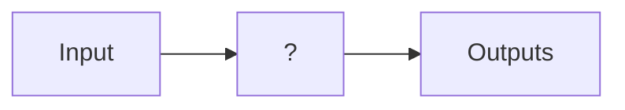
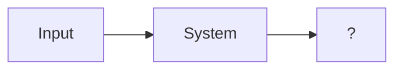

# Preliminaries

Kernal:
$$F(\alpha)=\int_a^bf(t)K(\alpha,t)dt$$

- 傅立叶: $K(\omega,t)=e^{-j\omega t}$
- Laplace: $K(s,t)=e^{-st}$

Eigenvalues:

Kernel of matrix $A$ is null space of matrix $A$:
$$N(A)=null(A)=\{x\in\mathbb R|Ax=0\}$$
当零空间只有平凡解的时候, 是可逆的. 反之, 那么矩阵不可逆

$$det(A)=\prod\lambda_i$$

O.D.E:

$$\frac{dx}{dt}=\lambda x$$
$$\frac{dx}{x}=\lambda dt$$
$$\int_0^t\frac{1}{x}dx=\int_0^t\lambda dt$$
$$\ln|x(t)|-\ln|x(0)|=\lambda(t-0)$$
$$x(t)=x(0)e^{\lambda t}$$

Lecture 01
===

> [!note]- slides
> ![[ee160-lec1.pdf]]

Control Theory 研究以下三类问题:

System Identification Problem:

Simulation Problem

Control Problem

## Control

反馈(feedback): 需要知道输出才能知道控制, 即输入$u$是$x$的函数

![[ee160-lec1.pdf#page=22|ee160-lec1, p.22]]

![[ee160-lec1.pdf#page=22&rect=315,312,406,405|ee160-lec1, p.22|100]]
$$E=R-Y$$

![[ee160-lec1.pdf#page=22&rect=382,339,466,392|ee160-lec1, p.22|100]]
$$U=CE$$

![[ee160-lec1.pdf#page=22&rect=462,338,654,419|ee160-lec1, p.22|211]]
$$Y=D_2+P(U+D_1)$$

上面三个公式组成了输出$Y$, 输入$U$与输出$Y$有关, 因此这个是一个反馈的系统

将中间变量全部消除, 得到:
$$Y=D_2+P(D_1+C(R-Y))$$
由于两侧都有输出$Y$, 因此移动并合并, 得到:
$$Y=\frac{PC}{1+PC}R+\frac{P}{1+PC}D_1+\frac{1}{1+PC}D_2$$
即: [[ee160-lec1.pdf#page=23|ee160-lec1, p.23]]

![[ee160-lec1.pdf#page=24&rect=313,315,684,445|ee160-lec1, p.24]]

此处可以理解为:
- $C$是一个转换器, 希望得到的是$R$, 有误差$E$, 经过$C$使得最终的输出$Y$接近$R$. 使$C=\infty$, 可以令$\frac{PC}{1+PC}R\to R$, 最终$Y\overset{C\to\infty}{=\mathrel{\mkern-3mu}=}R$
- 这个系统的目的是让输出$Y$追随目标$R$

