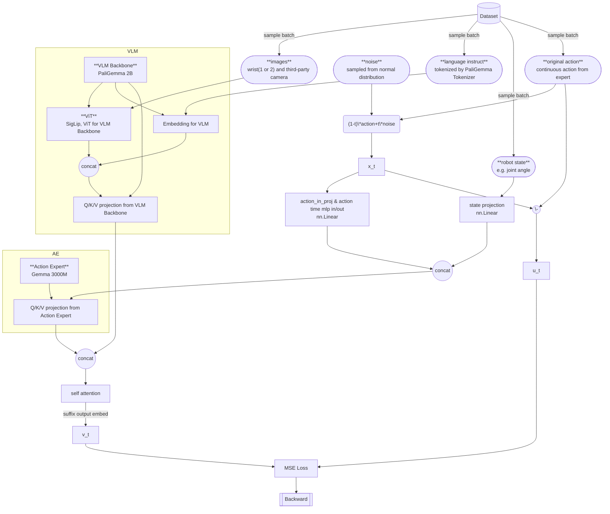
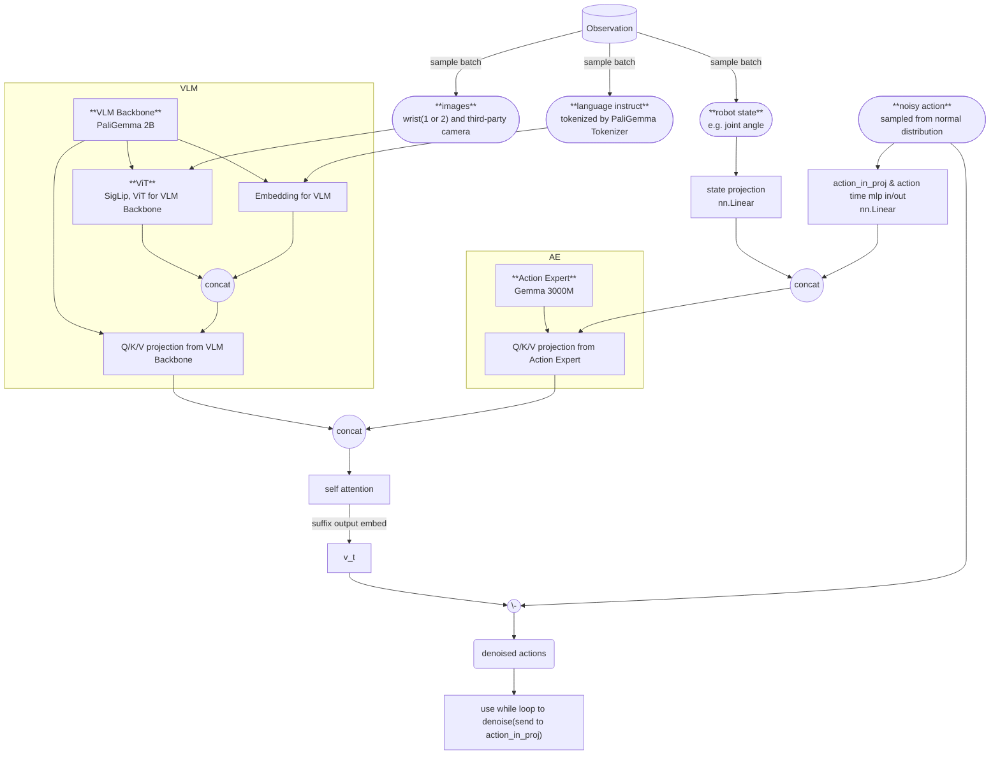

> [!note]- paper
![[2410.24164v3.pdf]]

Motivation:
1. Embodiment数据稀缺: 使用[[2410.24164v3.pdf#page=2&selection=161,9,162,48|pretrained VLM]]以获取先验知识. 使用corss-embodiment数据集
2. 模型架构泛化性: 使用[[2410.24164v3.pdf#page=3&selection=1,41,7,32|cross-embodiment training]], 将来自多个不同机器人的数据合并到一个模型中
3. 给出一个更加高效的训练策略: 在[[2410.24164v3.pdf#page=3&selection=53,16,54,4|10000h+的机器人数据集中pretrain]], [[2410.24164v3.pdf#page=3&selection=54,11,57,22|然后针对特殊的任务进行finetune]]

pipeline:
![[2410.24164v3.pdf#page=4&rect=47,587,578,751]]

使用[[SigLip]]作为[[2010.11929|ViT]]+PaliGemma [[1706.03762|Transformer]]作为VLM backbone, 配合[[2210.02747|Flow Matching]]的denoise过程生成连续的action.

Training的代码的架构:

Inference时的架构:

metrics:

本文中没有给出仿真环境下benchmark的metrics, 仅给出了真实世界下的测试结果:
![[2410.24164v3.pdf#page=7&rect=311,598,569,741]]
- $\pi_0$是官方的版本, 使用训练700k step
- $\pi_0\text{(parity)}$ 版本是训练了160k step的版本
- $\pi_0\text{-small}$ 是[[2410.24164v3.pdf#page=5&selection=445,0,445,22|没有VLM的纯Action Expert模型]]. 目的是为了查看 $\pi_0$ 模型优秀 是否是因为VLM的先验知识而强大, 因此这个版本去掉了VLM backbone.
	- 使用[[DistilBERT]]作为语言编码器
	- 使用R26-S-32 [[Deep Learning#ResNet (Residual Network)|ResNet]]-[[2010.11929|ViT]] hybrid作为视觉编码器
	- 使用传统的Encoder-Decoder架构的[[1706.03762|Transformer]], 从头初始化
	- Action Expert部分使用了[[Diffusion Transformer]]框架, 使用[[PyTorch Normalization#Conditional and Adaptive Normalizations#AdaLN-Zero|AdaLN-Zero]] layers进行注入时间步$\tau$
	- 参数规模约 470B
- [[2406.09246|OpenVLA]], [[Octo]]都是在相同的$\pi_0$数据集上进行训练. OpenVLA (UR5e only)是仅使用了UR5e的数据集进行训练(这个版本[[2410.24164v3.pdf#page=7&selection=202,50,203,37|在UR5e的任务上有更好的表现]](?没看出来))
	- [[Octo]]是类似[[2303.04137|Diffusion Policy]]的形式, 并不是 #VLA based

这个experiment证明了, $\pi_0$的flow matching架构非常的优秀, 并且$\pi_0$也超过了其他的VLA架构

