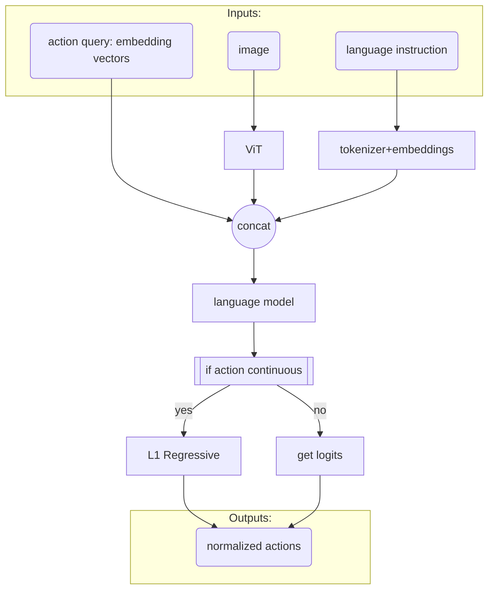

> [!note]- paper
![[Paper/PDF/2509.09372v2.pdf]]

[Github Repo](https://github.com/OpenHelix-Team/VLA-Adapter)

> [!PDF|] [[2509.09372v2.pdf#page=1&selection=150,40,151,66|2509.09372v2, p.1]]
> > In this paper, we investigate how to effectively bridge vision-language (VL) representations to action (A). 
> 
> Motivation:
> - 高效将视觉-语言表达和动作对齐
> - 减少 #VLA 模型对大型 #VLM 和大规模pretrain的训练

训练需要的参数:
![[2509.09372v2.pdf#page=1&rect=254,192,496,245|2509.09372v2, p.1]]
pipeline:
![[2509.09372v2.pdf#page=1&rect=254,156,496,194|2509.09372v2, p.1]]

pipeline:
![[2509.09372v2.pdf#page=5&rect=108,319,508,467]]

> [!PDF|] [[2509.09372v2.pdf#page=3&selection=175,15,178,1|2509.09372v2, p.3]]
> > ActionQuery AQ
> 
> 这个是一个Embedding, 可学习的参数:
> 
> [self.action_queries = nn.Embedding(NUM_TOKENS, self.llm_dim)](https://github.com/OpenHelix-Team/VLA-Adapter/blob/838a36da195daf3e8b8a53520c8c7ce86231b6d9/prismatic/extern/hf/modeling_prismatic.py#L375C9-L375C69)
> 
> 在VLM中, 每一层[[1706.03762|Transformer]] layer输出的hidden state和Action Query进行一次cross attention, 得到更深一层的action query features:
> ![[2509.09372v2.pdf#page=4&rect=116,566,213,693&c|162]]

> [!PDF|] [[2509.09372v2.pdf#page=3&selection=223,0,223,62|2509.09372v2, p.3]]
> > The backbones select the Prismatic VLM trained on Qwen2.5-0.5B
> 
> VLM骨干用的是 [[2502.13923|Qwen2.5-0.5B]], 是纯文字版本, 然后使用Prismatic VLM的方法进行训练.
> 
> 使用[[SigLip]]和[[DINOv2]]作为[[2010.11929|ViT]], 获取图片的feature, 与Qwen进行共同训练

> [!PDF|] [[2509.09372v2.pdf#page=4&selection=277,0,304,54|2509.09372v2, p.4]]
> > Key Finding 1. Regarding CR t , the middle-layer latent performs better than the deep-layer latent. Deep-layer CR t is biased towards semantic information and less effective in action generation. The middle-layer CR t effectively integrates image and text information, retains richer multimodal details, and facilitates action generation.
> 
> 结果: 中间层的Hidden State(embeds)会包含更加丰富的features, 深层的Hidden State包含的语义信息更多但是features更少. 因此中间层更适合用于Action的生成

> [!PDF|] [[2509.09372v2.pdf#page=4&selection=306,0,326,85|2509.09372v2, p.4]]
> > Key Finding 2. Regarding CAQ t , deep-layer latent performs better than other-layer latent. Since ActionQuery is trained from scratch, and deep-layer CAQ t aggregates richer multimodal details and is more effectively promoting action generation than the shallow layers.
> 
> 结果: 深层的Action Query的hidden state更有效果. 因为Action Query的训练过程中, 会逐层与transformers的hidden state(embeds)进行交互, 越深层的action query学习到的表征越丰富
> 
> 但是这个与上面的结论有一定的冲突: 越深层应该会有更多的语义信息但是更少的feature, 为什么?

> [!PDF|] [[2509.09372v2.pdf#page=4&selection=328,0,336,85|2509.09372v2, p.4]]
> > Key Finding 3. Multi-layer features perform better. We observed that using all-layer features generally outperforms a single layer. Not only does it improve performance, but it also saves time on best layer selection during design. This design can be more universal.
> 
> 结论: 多个layer的feature共同的效果会更好.
> 
> 这个很符合逻辑, 多个layer的hidden state会有更丰富的信息, 从高feature到高语意, 融合更多信息.
> 
> 同时, 使用multi-layer features可以省去选择layer的痛苦: 不需要逐层测试哪一层的效果最好. 超参数更少了.

> [!PDF|] [[2509.09372v2.pdf#page=5&selection=150,0,176,1|2509.09372v2, p.5]]
> > $\left\{\mathcal C_t^{\mathcal R},\mathcal C_t^{\mathcal{AQ}},\mathbf A_t^{\tau=0},\mathcal P_t\right\}$.
> 
> 这里说的输入是: language+image的hidden state(经过attention), action query的hidden state(经过attention), 初始的action, proprioceptive state.
> 
> 但是实际上, proprioceptive在代码中完全没有使用过, initial action甚至在代码中不存在, 只有$\mathcal C_t^{\mathcal R}$和$\mathcal C_t^{\mathcal{AQ}}$是上一层留下来的output embeddings(hidden state), 两者也没有做cross attention而是concat到一起去做self attention.

> [!PDF|] [[2509.09372v2.pdf#page=5&selection=413,0,414,1|2509.09372v2, p.5]]
> > Bridge Attention.
> 
> Bridge Attention: 将VLM的hidden state和Action Query的hidden state作为condition生成Action:
> ![[2509.09372v2.pdf#page=5&rect=273,348,499,431&color=blue|452]]
> 实际上, 在代码中, 并没有直接按照Bridge Attention的做法, 做Cross Attention以及Action的Attention. 在代码中, 仅仅是将`image feature`+`language feature`+`action query hidden state`拼接到一起, 过一次`self.language_model`的self attention, 然后通过`action_head`(分成两种, continuous的L1Regressive以及discrete的通过VLM的`logits`计算)获取normalized action.

总体的数据流动为:

实验结果:
B1: [[2509.09372v2.pdf#page=6&selection=194,57,194,69|Qwen2.5-0.5B]]([[2502.13923|Qwen2.5VL]], 但是实际上是纯文字版本加上了[[SigLip]]), B2: [[2509.09372v2.pdf#page=6&selection=200,31,200,41|LLaMA2-7B]]([[LLaMA2]]), B3: [[2509.09372v2.pdf#page=6&selection=206,6,206,16|OpenVLA-7B]]([[2406.09246|OpenVLA]])
![[2509.09372v2.pdf#page=6&rect=106,121,501,159|2509.09372v2, p.6]]

Backbone VLM不训练的时候, 有:
![[2509.09372v2.pdf#page=7&rect=170,644,441,682|2509.09372v2, p.7]]

推理速度:
![[2509.09372v2.pdf#page=7&rect=117,389,497,436|2509.09372v2, p.7]]

在Libero数据集:
![[2509.09372v2.pdf#page=8&rect=106,357,503,636|2509.09372v2, p.8]]

在CALVIN上(泛化能力):
![[2509.09372v2.pdf#page=9&rect=106,433,505,658|2509.09372v2, p.9]]

Ablation 消融实验:

Action Query dim = 64:
![[2509.09372v2.pdf#page=10&rect=176,245,451,355|2509.09372v2, p.10]]

全部layer注入(?):
![[2509.09372v2.pdf#page=11&rect=134,576,478,681|2509.09372v2, p.11]]

防止溢出: `raw hidden state * tanh(g)`, `action query * 1`:
![[2509.09372v2.pdf#page=11&rect=164,478,453,563|2509.09372v2, p.11]]
