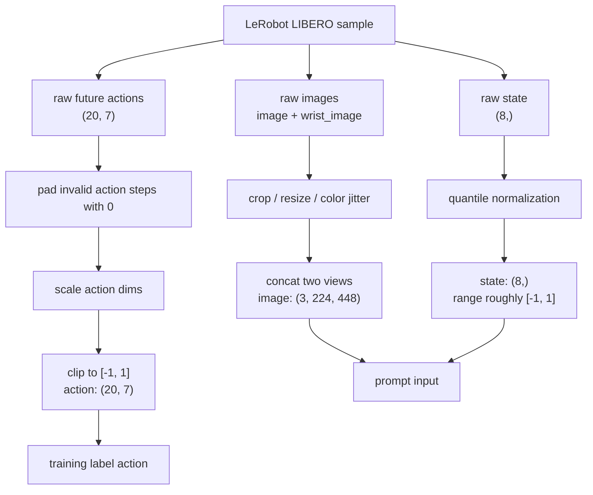
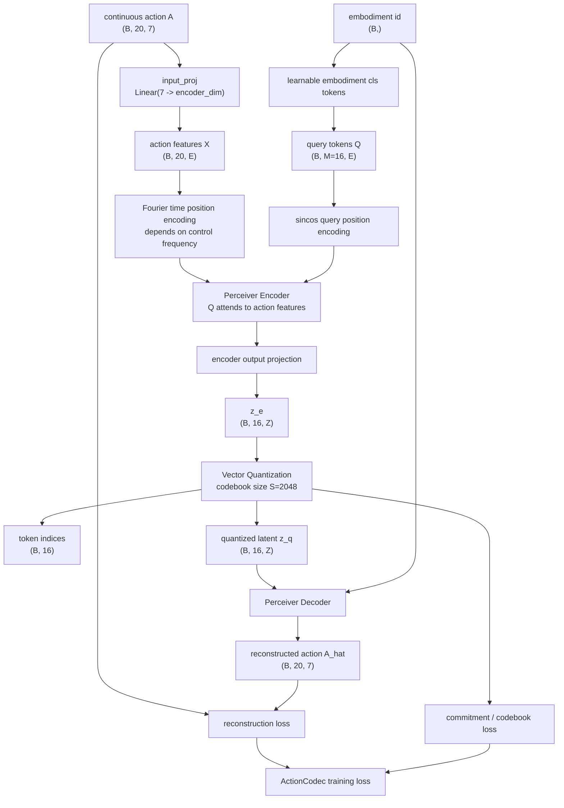
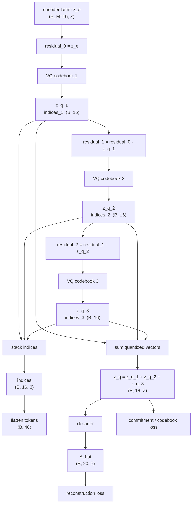
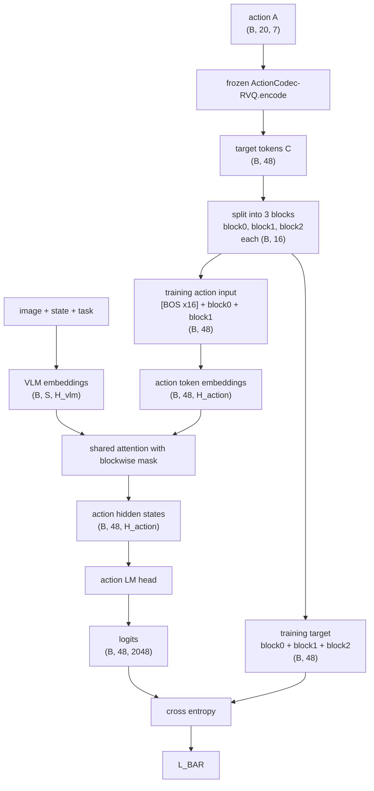
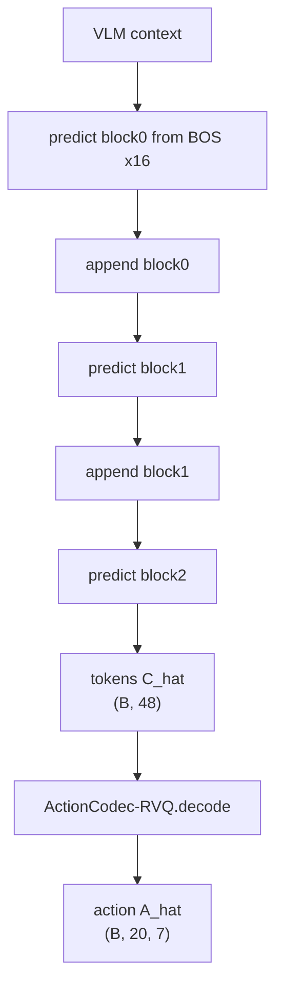

> [!note]- paper
![[Paper/PDF/2603.08519v1.pdf]]

# Motivation
文章任务现在的主流VLA模型, 将robot action离散化成token(如, [[2501.09747|FAST]], [[2512.04952|FASTer]], [[2504.16054|pi0.5]]等). 但是认为现在的tokenizer存在设计问题:
1. 过度关注精度. 现有的tokenizer(如, [[VQ-VAE|VQ-VAE]])主要以最小化重建误差为目标, 但是忽略了tokenize方式对VLA模型优化效率和训练稳定性造成的影响
2. 不了解什么样的token sequence最有利于VLM学习action
3. 有时更先进的数据分词方法反而不如简单的分词方法(如, [[RT-2|RT-2]]和[[2406.09246#OpenVLA|OpenVLA]]的bin)

# Contribution
1. 本文从信息论的角度分析了VLA优化的NLL(负对数似然损失), 分解为容量、感知对齐、伪影熵(Artifact Entropy)等部分. 
2. 提出高性能action token的四个关键要素:
	1. 高时间重叠率: 两个连续的action chunk之间有多少token重叠
	2. 低词汇冗余: 在满足action重建的需求上, 尽可能压缩token的数量和codebook的大小
	3. 强多模态互信息: token与视觉观测$V$、语言指令$L$之间的相关性, 即“感知对齐”
	4. token独立性: 同一个action chunk内部, 各个token之间不应该存在显式相互依赖的关系(即, 最小化“残差语法”, residual grammar)
3. 提出ActionCodec, 基于[[Perceiver|Perceiver]]架构的高性能tokenizer, 支持cross-embodiment的知识迁移
4. 无需pre-train, 在LIBERO等benchmark中取得sota

# Key of Tokenizer
## Temporal Overlap Rate (OR)

[[2602.15397v1.pdf#page=3&selection=376,55,397,53|重叠率]]

两个相邻的chunk $A_t$ 和 $A_{t+1}$ 之间重叠的token数量. $A_t=\{a_t,a_{t+1},\cdots,a_{t+H}\},A_{t+1}=\{a_{t+1},\cdots,a_{t+1+H}\}$. 这个的目的是为了维持解码的稳定性. 两个chunk之间有大量的action重复(执行和推理之间的权衡. 一般是推理一整个chunk但是执行其中的一部分, 执行结束之后再次推理), 因此两个chunk解码的结果要尽可能相似, 于是提出了OR

注意, 这里说的两个相邻的chunk指的是当前 $t$和$t+1$ 的两个chunk, 而不是 $t$和$t+H$ 的两个chunk

高重叠率是为了减少上下chunk执行和推理之间由于延迟或者执行步长等问题而导致的歧义(如, [[Real-Time Chunking|Real-Time Chunking]])

## Vocabulary Redundancy

[[2602.15397v1.pdf#page=4&selection=173,17,181,57|词汇表冗余]]

假设token的数量为$n$, codebook大小为$S$. 那么信息瓶颈的上线为$n\log_2S$. 经过测试发现, $n=16,S=2048$是[[2602.15397v1.pdf#page=5&selection=14,54,27,28|性能与复杂度的平衡]]

## Multimodal Mutual Information

[[2602.15397v1.pdf#page=5&selection=214,1,221,7|多模态互信息]]

在Tokenizer中即成TCL(时间对比学习)和基于CLIP的目标函数进行定义

TCL是时间对比学习(Time Contrastive Learning). 其核心逻辑是 认为两个相邻的Action Chunk应该是相似的, 与其他随机抽样得到的Action Chunk应该是不相同的. 因此通过 [[2602.15397v1.pdf#page=5&rect=83,474,260,512|InfoNCE]] 把相邻Chunk($Z^{i+}$)拉近, 把随机chunk($Z^{i-}$)推离:
$$\mathcal L_{TCL}=-\sum_i\log\frac{e^{\mathcal S(Z^i,Z^{i+})}}{e^{\mathcal S(Z^i,Z^{i+})}+e^{\mathcal S(Z^i,Z^{i-})}}$$
- $\mathcal S$是[[Cosine Similarity|余弦相似度]]

基于CLIP的[[2602.15397v1.pdf#page=5&rect=82,444,258,474|目标函数]], 目的是让action和instruct尽可能对齐, 让两者之间的相关性变强:
$$\mathcal L_{CLIP}=-\sum_i\sum_j\log\frac{1}{1+e^{l_{ij}(-tZ^iy^j+b)}}$$
- $l_{ij}$: 一个指示变量. 当$i,j$真的是配对的时候为1, 否则为-1. 目的是让真正相关的语言和action latent vector对齐, 不同的
- $t$, $b$: 可学习的参数. $t$用于自动缩放相似度, 动态调整难易程度(太小会导致乘法太低, 无法真正学到; 太大会导致影响太大, 离群点噪声影响过强); $b$用于动态调整基线(如, 所有的action/instruction都至少有0.2, 那么使用bias调整把这个0.2去掉)
- $Z^i$: ActionCodec Encoder生成的latent vector, 是对action粗略的理解
- $y^j$: 来自于CLIP的语言embedding. $Z^iy^j$做点积是为了计算相似性(类似[[1706.03762|Transformer]]的score或者[[Cosine Similarity|余弦相似度]])

## Token Independence

各个token之间不应该存在显式的相互依赖关系.

> [!tip]- 信息论相关知识: 互信息(Mutual Information)和熵(Entropy)
> 
> 熵: Entropy, 表示“不确定性”的度量: $$H(X)=-\sum p(x)\log(p(x))$$
> 
> 互信息: Mutual Information, 表示“知道一个东西能帮助减少多少的不确定性”, 定义为: $$I(X;Y)=H(X)-H(X|Y)$$
> 
> 如果互信息很大, 那么表明“知道Y对预测X有很大帮助”

[[2602.15397v1.pdf#page=3&selection=548,0,557,18|最小残差语法]]通过信息论来定义:
$$I(c_k;V,L,c_{<k})=I(c_k;V,L)+I(c_k;c_{<k}|V,L)$$
- $I(c_k;V,L,c_{<k})$: 总信息, 表示 为了准确预测当前的action token信息, 需要的额外的信息
- $I(c_k;V,L)$: 视觉语言对齐, 表示 当前的token 和 当前视觉反馈、语言指令 的相关程度. 表示当前视觉、语言能够提供的环境信息
- $I(c_k;c_{<k}|V,L)$: 残差语法, 表示在当前已知视觉、语言的情况下, 与之前的token的相关性. 相当于是, 在视觉与语言之外, 历史action信息依然能够提供的信息

当$I(c_k;c_{<k}|V,L)$很大的时候, 说明在视觉和语言信息之外, 过去的action能给当前的action提供非常多的信息. 说明当前action和过去的action强耦合(预测变成了背诵, 而不是根据环境推理)

> [!note]
> 定义最小残差语法的目的是为了引出, token之间最好不要有太多的依赖, 并没有直接计算这个值

判断指标:
- 抽取一个三元组 $(V,L,A)$: $V$是vision, 是视觉输入; $L$是Language, 语言指令; $A$是Action, 是最终的目标动作
- 使用训练好的VLA模型进行infer, 得到action的token序列
- 随机打乱某一个位置$k$处的token
- 把解码得到的action $\hat A$ 和target action $A$ 计算 [[Machine Learning#Lasso回归|L1 loss]]

比较不同结构的误差, 得到结果([[2602.15397v1.pdf#page=5&selection=253,0,262,49|figure 6]]):
- 使用cross attention得到的independent token又更好的结果, 减少token之间的依赖关系(query只和key/value做交互, q/k/v内部不做交互), 获得更高的鲁棒性
- [[1706.03762#Self Attention|Self-Attention]]和CausalLM都有token的增加, 特别是Self-Attention, 增加依赖会导致出错的概率增加

注意, 这几部分都是在说action tokenizer相关的内容, 与VLA部分并没有太多关系.
# ActionCodec Modeling

prepare data:

stage 1, train tokenizer:

stage 2, RVQ post-training:

stage 3, train VLA(BAR):

inference:

## Block-wise AutoRegressive

训练时, 并行解码. 使用block-wise attention mask进行掩码, 让后面的block的信息不回泄漏到前面. 因此这个forward实际上就是在训练如何从之前的block推理得到新的block, 是一个block wise的自回归

