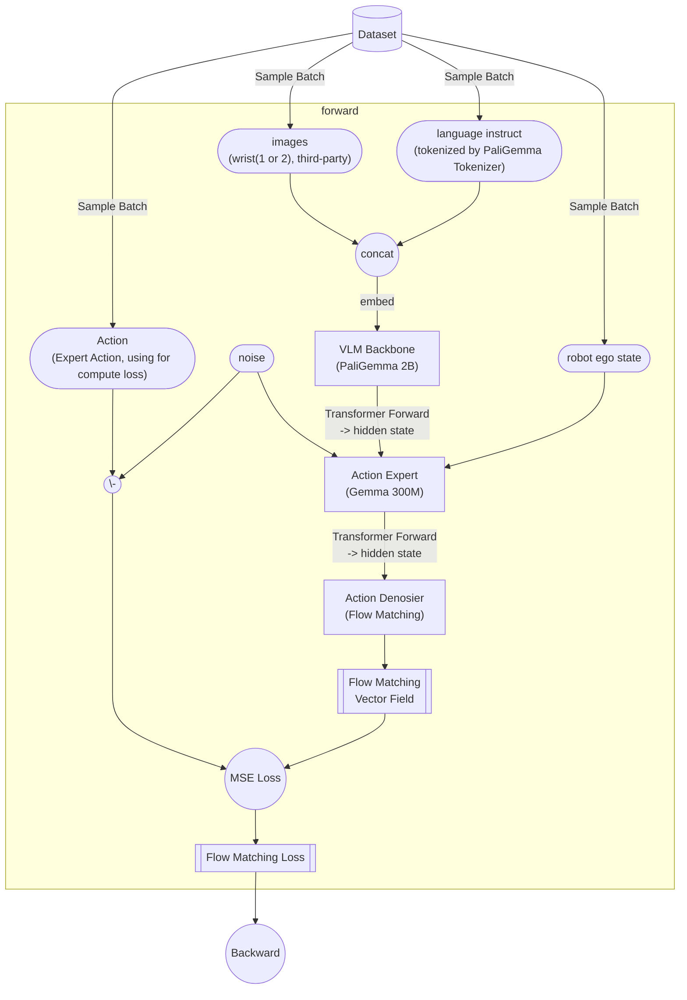
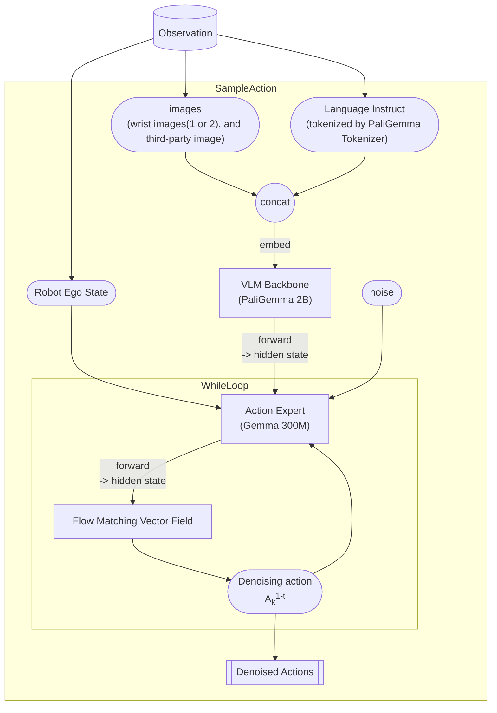

> [!note]- paper
![[2410.24164v3.pdf]]

Motivation:
1. Embodiment数据稀缺: 使用[[2410.24164v3.pdf#page=2&selection=161,9,162,48|pretrained VLM]]以获取先验知识. 使用corss-embodiment数据集
2. 模型架构泛化性: 使用[[2410.24164v3.pdf#page=3&selection=1,41,7,32|cross-embodiment training]], 将来自多个不同机器人的数据合并到一个模型中
3. 给出一个更加高效的训练策略: 在[[2410.24164v3.pdf#page=3&selection=53,16,54,4|10000h+的机器人数据集中pretrain]], [[2410.24164v3.pdf#page=3&selection=54,11,57,22|然后针对特殊的任务进行finetune]]

pipeline:
![[2410.24164v3.pdf#page=1&rect=57,297,550,568|2410.24164v3_pi0, p.1]]
但是核心的pipeline只有:
![[2410.24164v3.pdf#page=4&rect=47,587,578,751]]

Training的代码的架构:

Inference时的架构:

metrics:

