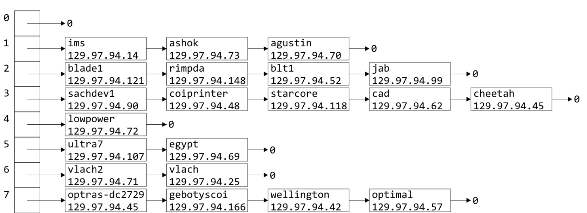

# CS101 算法与数据结构

## 有序数列的存储

1. List ADT

    一个序列, 不是列表. 有序.

    - 操作:

       CURD 增删改查, 可以找到当前点的前后, 获取长度, 是否为空
    
2. array

    这是一个正常见到的一个数组. 

    增删不容易做(把后面的向后或向前整体移动, `O(n)`), 但是改查是容易的(地址直接查`O(1)`)

3. 链表

    指针指向下一个

    快速增删, 查找复杂

    ```c++
    class List;
    class Node {
    private:
        int data;
        Node * next_node;
    public:
        int retrieve() const { return data; }
        Node * next() const { return next_node; }
        friend class List;
    }
    
    class underflow {}
    
    class List {
    private:
    	Node *list_head;
    public:
    	List() {
            list_head = nullptr;
        }
        ~List() {
            while (list_head) {
                pop_front();
            }
        }
    	// Accessors
    	bool empty() const { return !list_head; }
    	int size() const {
            int cnt = 0;
            for (Node * ptr = list_head; ptr != nullptr; ptr = ptr->next()) { cnt++; }
            return cnt;
        }
    	int front() const { 
            if (empty()) {
                throw underflow();
            }
            return list_head->retrieve(); 
        }
    	Node *head() const { return list_head; }
    	int count(int elem) const {
            int cnt = 0;
            for (Node * ptr = list_head; ptr != nullptr; ptr = ptr->next()) {
                if (ptr->retrieve() == elem) cnt++;
            }
            return cnt;
        }
    
    	// Mutators
        void push_front(int elem) { list_head = new Node( n, list_head )}
    	int pop_front() {
            if (empty()) {
              throw underflow();
        	}
            int ret = front();
            Node * head_ptr = list_head;
            list_head = list_head->next();
            delete head_ptr;
            return ret;
        }
    	int erase(int elem) {
            int cnt = 0;
            for (Node * ptr = list_head; ptr != nullptr; ptr = ptr->next()) {
                if (ptr->next() && ptr->next()->retrieve() == elem) {
                    Node * next = ptr->next();
                    ptr->next_node = next->next();
                    delete next;
                    cnt++;
                }
            }
            return cnt;
        }
    };
    ```

4. 双向链表

    两个指针, 一个指向上一个, 一个指向下一个

5. 用数组模拟链表

    可以用两个数组, 一个存`data`, 一个存`data`的`next_index`

    开空间同`vector`, 开双倍空间, 但是空间可能浪费

    优势: `new`的次数少. `new`是底层操作, 很耗时

## 时间复杂度

一般来讲, 指的是worst case的时间复杂度$O(\cdot)$.

二分查找:$O(\log n)$ average: 

$O(n)$: $\exist k,\ s.t.\ \mbox{when }x>k,f(x)\leq c\cdot g(x))$. 那么就有时间复杂度为$O(g(n))$

$\Theta(n)$: $\exist k,\ s.t.\mbox{ when }x>k,\ c_1g(x)<f(x)<c_2g(x)$, 有$\Theta(g(n))$

| 时间复杂度          | 极限式                                                 |
| ------------------- | ------------------------------------------------------ |
| $f(n)=o(g(n))$      | $\lim_{n\to\infty}\frac{f(n)}{g(n)}=0$                 |
| $f(n)=O(g(n))$      | $\lim_{n\to\infty}\frac{f(n)}{g(n)}<\infty$            |
| $f(n)=\Theta(g(n))$ | $\lim_{n\to\infty}\frac{f(n)}{g(n)}=c, c\in(0,\infty)$ |
| $f(n)=\Omega(g(n))$ | $\lim_{n\to\infty}\frac{f(n)}{g(n)}>0$                 |
| $f(n)=\omega(g(n))$ | $\lim_{n\to\infty}\frac{f(n)}{g(n)}=\infty$            |

$$
f(n)=\Theta(g(n))\Leftrightarrow g(n)=\Theta(f(n))\\
f=O(g)\Leftrightarrow g=\Omega(f)\\
f=o(g)\Leftrightarrow g=\omega(f)
$$

$$
f=\Theta(g),g=\Theta(h)\Rightarrow f=\Theta(h)\\
f=\Theta(f)
$$

## HashTable

将Object映射到一个数字，然后将数字映射到一个地址（内存空间）

有$N$大小的空间，$m$个要存入的物体，冲突的概率为$1-1\times\frac{n-1}n\times\cdots\times\frac{n-m+1}n$

### hash函数

必要：

- hash值必须是可以确定的（两次对同一个Object进行hash得到相同的值）
- 相同的Object必须有相同的hash（$x=y\Rightarrow h(x)=h(y)$）

最优：

- 必须很快：$\Theta(1)$
- 如果两个物体是随机抽取的，那么两个物体应该等可能的分布在0-m的范围里。（是$\frac1m$的概率相同）

#### Predetermined

```C++
class HashPredetermined {
public:
    HashPredetermined(){
        hashValue = hashCount;
        hashCount++;
    }
    unsigned int hash() const {
        return hashValue;
    }
private:
    unsigned int hashValue;
    static unsigned int hashCount;
}
```

#### 字符串hash

对于字符串，可以直接计算他们的char的值：

```c++
for (int i = 0; i < str.length(); i++){
    hash += str[i];
}
```

但是是一个$O(n)$的算法。

优化：只取其中一部分：

```c++
for (int i = 0; i <str.length(); i *= 2){
    hash += str[i];
}
```

存地址：

取最后三位，然后转成10进制存到长度为8的数组中，然后遍历寻找：



设n个物体，M的内存空间，令$\lambda=\frac nM$叫做load factor。表示每次寻找平均需要找多少个物体。那么空间复杂度就是$O(\lambda)$

#### 比特运算

取其中一部分（2进制最后的一定的数字转成10进制）

```c++
unsigned int C = 581869333;
unsigned int hash_M( unsigned int n, unsigned int m ) {
    unsigned int shift = (32 – m)/2;
    return ((C*n) >> shift) & ((1 << m) – 1);
}
```

## 排序

- 稳定的算法：处理两个相同的元素的时候不会交换这些元素

### 插入

   稳定的

### 冒泡

   稳定的

### 归并
$$
   T(n)=\left\{\begin{array}{cc}\Theta(1)&n=1\\2T(\frac n2)+\Theta(n)&n>1\end{array}\right.\\
   \Rightarrow \Theta(n\log n)
$$

### 快速

纠正逆序对的方法。速度更快就是纠正逆序对的效率高，一次操作纠正很多逆序对

最坏复杂度：$\Theta(n^2)$

最优复杂度：$\Theta(n\log n)$

平均复杂度：$\Theta(n\log n)$

递归调用

worse case: 总是选左边的，导致左边的永远没法分割，需要遍历整个数组而非递归

Master Theorem:
$$
T(n)=aT(\frac nb)+\Theta(n^d)\\
T(n)=\left\{\begin{matrix}n^{\log_b(a)}&d<\log_ba\\n^d\log n&d=\log_ba\\n^d&d>\log_ba\end{matrix}\right.
$$

# 数据结构
