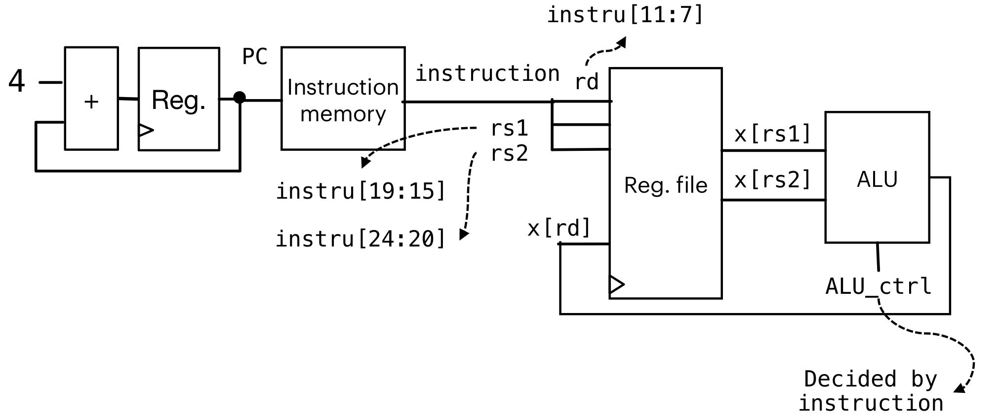
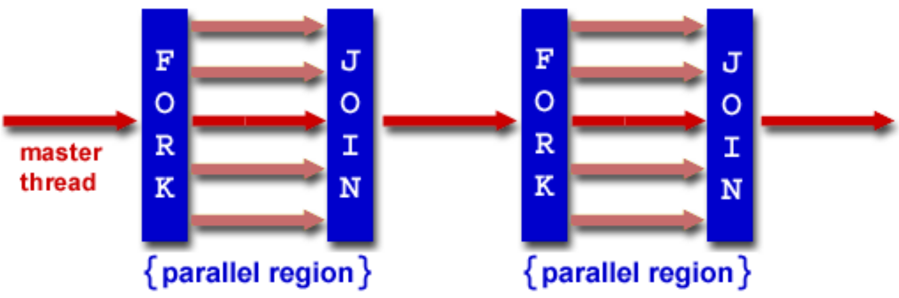

# Representation of number

### two's-Complement

对于一个有`n`位的数字（二进制下），2的补码为取反加一

可以直接应用加法

但是需要检查溢出（只能是在硬件层面，软件编程层面无法解决）

### 浮点数

一个32-bit浮点数，第一位是符号位，后面的8位是exponent位，剩下的23位是mantissa位

一个常规(normal)的表示方法为：先判断符号，然后$1.Mantissa\times2^{exponent}$或者写成$S\times M\times2^E$，其中Mantissa是2进制的。如果要写成10进制需要转换

e.g.

`0 01111011 1100000000000000000000`

$S=(-1)^0=1$

$E=exponent_2-127_{10}=01111011_2-127_{10}=123-127=-4$

$M=1.mantissa_2=1.11_2=1.75_{10}$ 注意，小数点后是2的负多少次方，这里就是$\frac12+\frac14+0=0.75$

$\Rightarrow\text{decimal}=S\times M\times 2^E=1\times1.75\times2^-5=0.109375$

但是这种常规表示方法有一个问题，在区间$(-1.0\times2^{-127}, 1.0\times2^{-127})$里面的值是无法表示的。所以产生的denomal的表示方法：当exponent为0的时候，mantissa表示的是没有前导1的情况。

e.g.

`0 00000000 11000000000000000000000`

$S=(-1)^0=1$

$E=-126$

$M=0.mantissa_2=0.11_2=0.75$

$\Rightarrow\text{decimal}=S\times M\times 2^E=1\times0.75\times2^-5=8.816208\times10^{-39}$

#### Special Cases

- Infinite: `0/1 11111111 00000000000000000000000` $\pm\infty$
- NaN: `0/1 1111111111 NOT_ALL_ZERO`, normally, `0 11111111 10000000000000000000000`
- Zero: `0 00000000 00000000000000000000000`

#### Arithmetic

计算加法：

- 计算实际exponent
- 对齐exp部分，对mantissa位移。在位移的时候，按照不同要求进行取舍（是否需要保留位数，是否需要四舍五入，等等）
- 对齐之后，将mantissa相加
- 判断进位，然后操作exponent
- 判断是否overflow

计算乘法

- 计算实际exponential
- 将符号相乘
- exponent部分相加
- mantissa部分相乘
- 判断进位，然后操作exponent
- 判断overflow

# C

### 自动类型推断

对于一个直接的数字：`int`,`long int`, `unsigned long int`

对于八进制或者十六进制的数字：`int`, `unsigned int`, `unsigned long int`

对于`u`或者`U`后缀的数字：`unsigned int`, `unsigned long int`

`l/L`后缀：`long int`, `unsigned long int`

# RISC-V

- 加法：
  add rd rs1 rs2: rd = rs1 + rs2

  eg: add x5 x1 x2: x5=0x12345678

  这里的溢出是不做考虑的

- 减法：sub rd rs1 rs2: rd = rs1 - rs2

- 位运算：

  and/xor/or rd rs1 rs2

  可以用来做bit mask

- 比较：slt/sltu rd rs1 rs2

  slt: rd = rs1 < rs2 ? 1 : 0

  sltu是unsigned版本的，slt是signed版本的

  可以用来作为溢出的判断：

  - 对于unsigned：

    ```assembly
    add x5 x3 x3
    sltu x6 x5 x3 # 如果x5小于x3那么一定是overflow
    ```

  - 对于signed

    ```assembly
    add t0, t1, t2
    slti t3, t2, 0
    slt t4, t0, t1
    bne t3, t4, overflow
    ```

- 位移

  sll/srl/sra rd rs1 rs2

  sll/srl：逻辑左移、右移：补零

  - eg. sll x5 x2 x4:相当于把x2左移4比特位(对于16进制只移动一位)$\Rightarrow$000067890$\Rightarrow$00067890
  - eg. srl x6 x2 x4:00006789$\Rightarrow$000006789$\Rightarrow$00000678

  算数右移：sra：与逻辑右移相似，但是要保证符号拓展

- 与内存交互

  所有指令存在寄存器中，但是数据存在于主内存中。需要从主内存读取数据到寄存器中进行运算

  读取：lw/lh/lb rd imm(rs1)：从rs1的value+imm的偏移的主内存中读取4/2/1字节到rd中

  存放：sw rs2 imm(rs1)：将rs2的内容存放到主内存的imm+rs1的value的偏移的主内存中

  如：

  - ```assembly
    addi x11 x0 0x4F6
    sw x11 0(x5)
    ld x12 1(x5)
    ```

    $\Rightarrow$ x11 = 0x000004F6

    存储到主内存x5的位置：00 00 04 F6

    读取，从x5的位置多一个字节的偏移量：00 00 00 04

    $\Rightarrow$ x12 = 0x4

  - ```assembly
    addi x11 x0 0x85F6
    sw x11 0(x5)
    ld x12 1(x5)
    ```

    $\Rightarrow$ x11 = 0x000085F6

    存储：00 00 85 F6

    读取，注意85对应的2进制中第一位是1，是一个负数，所以补全：FF FF FF 85

    $\Rightarrow$ x12 = 0xFFFFFF85

- branch

  - bne/beq rs1 rs2 imm/label：当rs1和rs2不同/相同的时候，进入imm/label的位置。

    e.g.

    ```assembly
    addi x2, x0, 5
    assembler
    addi x3, x0, 6
    bne x2, x3, L1 #imm = 8
    beq x2, x3, L2
    L1:addi x2, x2, 1
    ret #kind of jump, psuedo-instruction
    L2:addi x2, x2, -1
    ret
    ```

    对应C源码：

    ```c
    int main(void) {
    	int i=5;
    	if (i!=6){
    		i++;
    	}
    	else i--;
    	return 0;
    }
    ```

  - blt/bltu/bge/bgeu rs1 rs2 imm/label：$<$/$\geq$的情况下跳转

    用于写for loop：

    ```c
    int A[20];
    int sum = 0;
    for (int i=0; i < 20;i++) sum += A[i];
    ```

    ```assembly
    # Assume x8 holds pointer to A
    # Assign x10=sum
    add x9, x8, x0 # x9=&A[0]
    add x10, x0, x0 # sum=0
    add x11, x0, x0 # i=0
    addi x13,x0, 20 # x13=20
    Loop:
    bge x11,x13,Done
    lw x12, 0(x9)
    # x12=A[i]
    add x10,x10,x12 # sum+=
    addi x9, x9,4
    # &A[i+1]
    addi x11,x11,1 # i++
    j Loop
    Done:
    ret
    ```

- 函数调用

  `jal rd label`: jump and link，保存caller的下一条指令的地址（从程序返回的时候直接回到rd的指令位置，一般而言rd=ra，ra=x1, ra: return address），然后跳转到label。rd的值是PC+4（因为一条指令的长度是4，所以是PC（当前位置）+4就是下一条指令的地址）

  `j label`: `jal x0 label`，当无条件跳转（goto）的时候，不需要记录下一条的位置，所以使用`x0`来接受rd

  `jalr rd rs1 label`: jump and link register: 是I-type的指令（前面的那个是J-type），负责从caller跳转到callee，从函数回到原始主程序。一般可以直接使用`jalr x0 ra 0`返回主程序中。如果只是把控制权交回给主函数，rd其实是没有用的，所以可以设置为x0取消接受rd。

  e.g.:

  | addr       | value        |
  | ---------- | ------------ |
  | 0x00001008 | add a1 x0 x0 |
  | 0x0000100C | jal ra lable |
  | 0x00001010 | ...          |
  | ......     | .......      |
  | 0x00002000 | addi a0 a1 0 |
  | 0x00002004 | jalr x0 ra 0 |

  jal指令之后，ra=(0x0000100C+4)=0x00001010，PC=0x00002000（函数的开头的位置）

  jalr指令之后，ra暂时不用管，PC=0x00001010（返回到主函数）

  - jalr的rd的作用：当定义一个函数指针的时候可以将rd的值给到指针，然后可以通过指针调用函数。

  函数调用的过程：

  1. 将参数放在一个可以获取到的位置，然后再函数内部copy，如，addi/add等方法
  2. 跳转到对应的函数块，jal/jalr
  3. 获取对应的存储空间
  4. 完成函数内部的工作
  5. 将返回值存储到caller可以获取到的地方，add/addi
  6. 返回主程序，jalr

  但是有一个竞争：如果主程序把所有的寄存器占用，导致函数内部无法调用到需要的参数

  $\Rightarrow$解决：存到内存中，从函数出来之后再将内存中的值读取到寄存器（但是与内存交互较慢，所以只存一部分）

  stack pointer: `sp`

  - e.g.

    ```c
    int Leaf (int g, int h, int i, int j) {
        int f; f = (g + h) - (i + j);
        return f;
    }
    int main (void){
        int a=1, b=2, c=3, d=4, e, x;
        e = Leaf(a,b,d,c);
        ... ...
        return e;
    } /*a function called by OS*/
    ```

    调用：

    ```assembly
    jal ra Leaf # ra -> main, PC -> Leaf
    ...
    
    Leaf:
    addi sp, sp, -4 # adjust stack for 1 items, callee saved s1
    sw s1, 0(sp) # save callee saved s1 to stack
    add s1, a0, a1 # s1 = g + h
    add a2, a2, a3 # j = i + j
    sub a0, s1, a2 # calculate result (g + h) – (i + j)
    # return value (g + h) – (i + j)
    lw s1, 0(sp) # restore register s1 for caller
    addi sp, sp, 4 # adjust stack to delete 1 items
    jr ra # jump back to caller (=jalr x0 ra 0) (pseudo-assembly: ret)
    ```

    改进：t开头的内容是Callee保存的，所以Caller不需要对t开头的内容进行维护，所以可以直接使用，因此可以不用再对`s1`进行操作：

    ```assembly
    jal ra Leaf # ra -> main, PC -> Leaf
    ...
    
    Leaf:
    addi sp, sp, -4 # adjust stack for 1 items, callee saved s1
    add t1, a0, a1 # s1 = g + h
    add a2, a2, a3 # j = i + j
    sub a0, t1, a2 # calculate result (g + h) – (i + j)
    # return value (g + h) – (i + j)
    jr ra # jump back to caller (=jalr x0 ra 0) (pseudo-assembly: ret)
    ```

- 函数调用的参数保存机制

  分为两类，Caller Saved Register，由调用者保存，被调用函数不用去考虑保存相关的内容。Callee Saved Register，需要由被调用函数保存，在进入的时候需要先保存相关内容，return之前需要重新加载到register中。

  | Register name | Saver  |
  | ------------- | ------ |
  | ra            | Caller |
  | sp            | Callee |
  | t0-t6         | Caller |
  | s0-s11        | Callee |
  | a0-a7         | Caller |

- 指令的编码

  最高位是第0位，最低位是最后一位（注意是有进位的，万/千/百/十/个，类似这种顺序）

  - R-Type

    e.g. `add x2 x0 x1`

    0000000 00001 00000 000 00010 0110011

    [func7: 31-25] [rs2: 24-20] [rs1: 19-15] [func3: 14-12] [rd: 11-7] [opcode: 6-0]

    可以通过查询green card，找到[31-25] [14-12]对应的具体指令

  - I-Type

    [imm: 12] [rs1: 5] [func3: 3] [rd: 5] [opcode: 7]

    imm的范围：[-2048, 2047]

    但是对于移位而言，只能是正数且是只能移动32位，所以只取imm部分最后面的五位[0-4]作为移动位数，其他位用于区分SRLI(0000000)和SRAI(0100000)

  - S-Type

    [imm: 7] [rs2: 5] [rs1: 5] [func3: 3] [rd: 5] [opcode: 7]

    imm需要拆分，因为比I-type多了一个rs2

  - B-Type

    [imm: 1] [seperator: 1] [imm: 6] [rs2: 5] [rs1: 5] [func3: 3] [rd: 5] [opcode: 7]

    认为在跳转的过程中是有限的，所以就不需要太大的字节来储存跳转的范围

    实际上，因为PC的指令是4bytes的倍数，所以对应的2进制最后两位都是`00`，所以把imm中表示跳转的内容的最后一位的`0`省略掉（至于为什么不是把两个`00`都省略，是为了兼容16-bit的指令集）。为了便于硬件读取，在imm[12]和imm[10-5]之间有一个间隔位imm[11]=0

  - J-Type

    [imm: 1] [imm: 10] [imm: 1] [imm: 8] [rd: 5] [opcode: 7]

    没有额外的寄存器作为操作数，所以imm更长

    也是类似的，寻址的imm也是不考虑最低的一位

  - U-Type

    [imm: 20] [rd: 5] [opcode: 7]

    li=lui+addi，表示直接给一个寄存器赋值

    但是`li x5 0xDEADBEEF`的时候，`lui x5 0xDEADB`是没有问题的，但是对于`addi x5 0xEEF`，要符号位补全，所以变成了`addi x5 0xFFFFFEEF`，因为`E`第一位是`1`，表示负数，所以拓展到32字节变成了`FFFFFEEF`，所以最后变成了`0xDEADAEEF`（直接做加法，`DEADB000+FFFFFEEF=DEADAEEF`）。因此在li的时候，如果后三位Hex是表示负数，要给第五位加1，即`lui x5 0xDEADC`

# Electronic

### build

构建电路：

1. 画真值表
2. 写minterms：就是所有的输入的组合
3. 根据minterms来写出布尔代数表达式

e.g. XOR:

| A   | B   | O   |
| --- | --- | --- |
| 0   | 0   | 0   |
| 1   | 0   | 1   |
| 0   | 1   | 1   |
| 1   | 1   | 0   |

Minterms:

| input          | output |
| -------------- | ------ |
| $\bar A\bar B$ | $m_0$  |
| $A\bar B$      | $m_1$  |
| $\bar AB$      | $m_2$  |
| $AB$           | $m_3$  |

$\Rightarrow$ $A$ Xor $B$ = $m_1+m_2$ = $\bar AB+A\bar B$

### Karnauph Map

表示对应的minterm对应的值，$A=0$表示$\bar A$，$A=1$表示$A$

如：AB/CD

|     | 00  | 01  | 11  | 10  |
| --- | --- | --- | --- | --- |
| 00  |     |     |     |     |
| 01  |     |     | 1   |     |
| 11  |     | 1   | 1   | 1   |
| 10  |     |     | 1   | 1   |

- 覆盖：选取$2^n$大小的方框选中为1的格子（不能选中0的格子）
  每一个选中表示一个逻辑表达式（化简之后）

## Datapath

- 多路选择器 Multiplexers:

  <span></span>

  多路选择器可以进行叠加，然后得到的是一个n路选择器。需要有$\log_2n$个mux2

有了多路选择器，可以通过这个组合多个逻辑运算单元，变成一个ALU

e.g. ALU的一部分：


### 组成

- 加法器：

  可以类似高精加法的原理计算，要考虑进位（第一个全加器的进位的那里是0，因为没用更低位的信号）

  

- 减法器：

  复用加法器。$A-B=A+(-B)=A+\bar B+1$

  注意取补码是取反加一（加一这个操作直接把最低位的信号置为1即可）

  

  如果想要直接在加法器上进行复用（减少电路的复杂度），可以直接使用异或门进行控制是否取反。

  

- Register寄存器

  暂存数据。寄存单元里面使用D-触发器储存数据。如果是32位寄存单元（每个寄存单元里面存储32位数据），那么需要32个D触发器。注意寄存器的输出是不收时钟控制的，受时钟控制的只有输入（写入）

  在实际的寄存器（RISC-V中的Register，也称作寄存器文件Register File）里面，有32个寄存器（x0~x31），所以需要32个寄存单元。

  使用mux32进行管理寄存器，方便I-type等类型的指令直接获取某一些位的立即数。如果想要对某一位寄存器中的值进行操作，可以加上一个Clock-Gating，给时钟信号加一个与门，控制是否可以进行操作（0时禁止操作）

  

- PC指针

  直接默认是每次执行PC加4即可

  

- 内存

  DRAM和寄存器类似，但是在电路层面不同。是使用晶体管进行保存数据。但是晶体管不稳定。在Wordline打开的时候进行读取，Wordline关闭的时候不读取。但是Wordline关闭的时候，晶体管也会向外放电（如果遇到高电平，也会反向充电），会导致数据丢失（1放电成0，0反向充电成1）。所以会需要刷新（有一个buffer锁住数据）

  这门课里面再试不需要考虑，只做了解

  

### 结构

instruction是指RISC-V的指令（或者机器码）

如何选择功能：主要依靠opcode/func3/func7进行选择

- R-type:

  进行假设：Instruction memory和Data memory是分开的（但是依照冯诺依曼结构师在一起的）

  

- I-type

  在R-type的基础上添加了一个mux2进行选择，判断是取rs2还是取imm立即数进行输入（电路复用）

  注意imm需要符号拓展（这个是在电路层面拓展，不用再汇编层面使用）

  

  lw等与内存地址交互：

  添加一条通路，与Data Memory进行交互读取。然后使用mux2进行选择（保证原有的I-type和R-type都是正常的）

  

- S-type

  首先需要保证在单周期内只有一次读写内存，所以需要给Data Memory添加re(read enable)和we(write enable)。在时钟上升沿的时候只有enable=1的时候才能操作内存

  Assume behavior model of data memory:

  - When we=1 && re=0, at clk rising edge, data[addr.]=d_in; d_out stays at high-resistance (output nothing)

  - When we=re=0, d_out stay at high-resistance (output nothing, state would not change); we=re=1 is forbidden

  - When we=0 && re=1, d_out=data[addr.]

  但是这里有一个问题，sw不需要对寄存器写入，应该只是对Data memory写入。所以需要额外加一个控制的指令，保证不会更改Register File

  

- Imm Generator

  首先对于低12位的立即数，需要给高位进行符号位拓展。不能使用分线器对每一位赋值（电流会分流，导致电流的驱动力降低）

  对于S-type的设置，可以添加一个控制信号，判断应该取哪一部分

  

## Pipline

single-cycle:


pipeline:


> IF: Instruction Fetch
>
> ID: Instruction Decode
>
> MEM: memory read/write
>
> WB: write back to register file

time for pipeline: $t=\max(t_{IF},t_{ID},t_{EX},t_{MEM},t_{WB})$

time for single-cycle: $t=t_{IF}+t_{ID}+t_{EX}+t_{MEM}+t_{WB}$

the pipeline CPU is faster

.e.g.

| IF    | ID    | EX    | MEM   | WB    |
| ----- | ----- | ----- | ----- | ----- |
| 400ps | 100ps | 250ps | 400ps | 100ps |

Q1: clock cycle before/after pipeline:

- before: $400+100+250+400+100=1250ps=1.25ns$
- after: $\max(400,100,250,400,100)=400ps=0.4ns$

Q2: how long each instru kept in pipeline:

- each component has 0.4ns
- total 5 components
- each instruction will be kept in pipeline for $5\times0.4=2ns$

注意，Pipeline会使整体加速，但是每条指令滞留时间会更长

### components in datapath


有些信号（如：rd）只有在WB这一层才会用到，所以需要和pipeline一起流到第五层WB里。

### Hazard

如果上下两条指令的寄存器是相同的，那么会导致出现竞争(Hazards)

e.g.

```assembly
addi t0 t1 t2
sw t0 0(t3)
lw t5 0(t6)
addi t6 t0 1
```

#### Data Hazard

1. through wait/stall:

   insert nop between two command

   

2. Forwarding or bypass:

   

   走一个捷径，直接从输出重新回到输入，跳过`WB`

   通过`op1_src`操作数来选择哪一个输入

   

   判断规则：

   1. 判断是否会发生Data Hazards：只有两个指令都会对同一个register读写才会出问题
   2. Ignore write or read to `x0`
   3. the first instruction must write the register, and the second/third instruction must read the instruction

#### Control Hazard

如果遇到了`beq`/`bne`等branch跳转指令，会导致：跳转之前，PC的值已经加4，下一条指令已经读入，但是应该跳转而不是运行下一条

1. 使用nop进行wait。

   但是这种方式会让效率特别低

2. 假设法

   假设不会跳转。先读入下面的指令，然后判断是否需要跳转。

   如果不需要，继续执行即可。

   如果需要，那么将读入的内容（Reg）直接flash清除掉

3. 减少操作数

   在ID之后就可以知道是否是branch跳转。直接控制即可，省去了MEM和WB两步

# CPU Cache

将经常使用的CPU指令写入CPU cache高速缓冲区。但是这一个部分对软件开发是隐身的。

需要有一个小的更快的存储器和CPU进行交互（缓存）

## Cache

1. 将经常使用的CPU指令写入CPU cache高速缓冲区。但是这一个部分对软件开发是隐身的。需要有一个小的更快的存储器和CPU进行交互（缓存）
2. Cache hit: 需要的内存在缓存中有（在同一个set index中，有相同的tag，并且valid bit是1）
3. Cache miss: 需要的内存没有在缓存中
4. Valid bit: 一个单独的bit，表示是否可用

### Cache capacity

1. cache level: L1是最接近CPU的，但是一个Cache block只能保存instruction(Instruction Cache)或者一个Data(Data Cache)，L2+的缓存可以同时存instruction和data
2. cache capacity: total # bytes in cache
3. Cache line or Cache block: A single entry of cache
4. Cache block size: total # bytes in each cache line

1 memory/cache block $\Rightarrow$ 1 word $\Rightarrow$ 4bytes

### Associativity

1. Number of cache lines: cache capacity / block size
2. mapping methods:
   1. DIrect mapping: 直接映射，只有一个cache set，只需要选择tag
   2. Fully associativity: 每一个cache line都是一个cache set，不区分tag
   3. N-ways Associative: 分了N个cache set
3. Total # of cache lines == capacity of cache/line size
   Total # of lines in a set == # ways == N == associativity
   Total # of sets == # of cache lines / associativity

### Parts of address

1. Address is divided into` |TAG|INDEX|OFFSET|`

2. Offset:

   - The lowest bits of the memory address which say where data exists within the cache line.
   - It is log2(line/block size)
   - So for a cache with 64B blocks it is 6 bits

3. Index:

   - The portion of the address which says where in the cache an address may be stored
   - Takes log2(# of cache lines / associativity) bits
   - So for a 4-way associative cache with 512 lines it is 7 bits

4. Tag: The portion of the address which must be stored in the cache to check if a
   location matches

   - #of bits of address - (# of bits for index + # of bits for offset)

   - So with 64-bit addresses it is 51-bit...

### Write policy

1. write through

   直接写入。

   需要write buffer，因为内存读写是慢的，为了不让cpu等待memory的写入，用write buffer储存写入的信息，异步操作

2. write back

   先写到内存中，当cache miss替换掉这个被更改的cache的时候才会去写入到memory

   更快，I/O操作减少

### Replacement policy

cache miss时覆盖的方法：

1. 随机
2. Least-Recent Used
3. FIFO先入先出
4. Reuse Distance:根据复用时间距离判断

### Cache Performance

1. Hit Time:
   - Amount of time to return data in a given cache: depends on the cache
   - i7 L1 hit time: 4 clock cycles
2. Miss Penalty:

- Amount of additional time to return an element if its not in the cache: depends on the cache
- miss penalty is additional time for cache miss

3. Miss Rate:
   - Fraction of a particular program's memory requests which miss in the cache
4. Average Memory Access Time (AMAT):
   - Hit time + Miss Rate \* Miss Penalty

### Cache Misses: The 3Cs

1. Compulsory (cold start or process migration, 1st reference):

   calculate: set cache size to infinity and fully associative, and count number of misses

   - First access to block impossible to avoid; small effect for long running programs
   - Solution: increase block size (increases miss penalty; very large blocks could increase miss rate)

2. Capacity:

calculate: Change cache size from infinity, usually in powers of 2, and count misses for each reduction in size

- Cache cannot contain all blocks accessed by the program
- Solution: increase cache size (may increase access time)

3.  Conflict (collision):

calculate: Change from fully associative to n-way set associative while counting misses

- Multiple memory locations mapped to the same cache location
- Solution 1: increase cache size
- Solution 2: increase associativity (may increase access time)

4. improving Cache performance

   - reduce the hit time: smaller cache size
   - reduce the miss rate: better program / bigger cache size
   - reduce the miss penalty: mutliple cache level

effect of performance

1. increasing associativity

   - hit time increase.
   - miss rate goes down

2. increasing #entries

   更多的cache line个数，所以查找时需要比较的tag会变多，那么hit time会变大，但是miss rate会减小

   在设计的时候需要找到一个最优解，针对cache的大小（cache line的个数），并不是越大越好

   - hit time increase
   - miss rate goes down

3. increasing block size

   cache line的长度会很大，那么如果miss了，读取一条新的cache line需要将整个大的cache line全都读入

   - miss rate goes down
   - miss penalty increase

## victim cache

如果cache剔除一个缓存，那么先存到victim cache里面，如果有复用，直接调用即可。（少量，4-8个地址）

可以使write back，或者write through

e.g. 有4个cache line，有abcde五个内存地址，那么调用abcd之后调用e替换掉a，这时先把a放在victim cache里面。后面调用的时候直接存victim cache调用（将这个拉回main cache，置换出去的那一条cache line，这里是e，放到victim cache里面）

## memory hierarchy


有多层cache，那么可以减少miss penalty来加速

# Parallelism

## Data-Level Parallelism

SIMD: single instruction operate multiple data


MIMD: multi-thread, multiple instruction operate multiple data


> Amdahl's Law
>
> 假设一个程序，有$F$的可并行的部分，则剩下$1-F$是不可并行的部分。
>
> 假设有$S$个可用的核，可以用于并行加速
>
> $$
> \text{speed up}=\frac{1}{1-F+\frac{F}{S}}
> $$
>
> e.g. if there are 25% of program can be calculate by parallelism, and runs 20 times faster:
>
> $$
> \text{speed up}=\frac{1}{0.75+\frac{0.25}{20}}=1.31
> $$
>
> e.g. if only 15% of the program:
>
> $$
> \text{speed up}=\frac{1}{0.85+\frac{0.15}{20}}=1.17
> $$

- strong scaling: 问题规模不改变，获得一个运算速度的提升
- weak scaling: 问题规模扩大，但是也能获得一个速度的提升

### 矩阵乘法

首先分割成两个操作过程：乘法和加法

乘法：矩阵A的一列向量和矩阵B的一个常数相乘，这个过程可以使用SIMD进行加速。

加法：直接相加

能够加速矩阵乘法

## Thread-Level Parallelism

each processor has its own PC and executes an independent stream of instructions.

- Different processors can access same memory

### Thread

线程：指令集的序列流

每个线程都有PC+processor register并且能够抵达相同的内存

每个处理器(processor，不是thread)都会提供一个硬件的线程，能够处理指令

操作系统将软件线程分配到可用的硬件线程上执行，产生许多活动线程的错觉

- 通过中断软件线程的执行并将其寄存器和PC 保存到内存中，从硬件线程中删除软件线程
- 可以通过将不同的软件线程的寄存器加载到硬件线程的寄存器中并跳转到其保存的 PC 来激活不同的软件线程

#### Hardware Multithreading (Hyperthreading)

Basic Idea: 硬件处理器是昂贵的，所以不应该让硬件处理器等待(Idle)

在Cache miss等待memory fetch的时候，可以先执行其他的useful work

使用冗余的硬件，减少每次切换线程时的保存上下文


- Duplicate all elements that hold the state (registers)
- Use the same CL blocks
- Use muxes to select which state to use every clock cycle

这张图用了两个Hardware Threads，没有Data Hazard(不同的Register)，但是可能会有memory hazard。使用线程锁或者mux来解决

### OpenMP

OpenMP是一个语言的拓展，针对于多线程操作，共享内存，并行计算的

编译选项：

```shell
cc -fopenmp name.c -o p
```

Pros:

- Takes advantage of shared memory, programmer need not worry (that much) about data placement
- Compiler directives are simple and easy to use
- Legacy serial code does not need to be rewritten

Cons:

- Code can only be run in shared memory environments
- Compiler must support OpenMP

#### 在C里面使用

1. 在文件中使用头文件

   ```c
   #include <omp.h>
   ```

2. 使用编译选项`-fopenmp`

   ```shell
   cc -fopenmp name.c -o p
   ```

原理：



语法：

- 基础语法

  ```c
  #pragma omp parallel
  {
      ...
  }
  ```

- for循环

  ```c
  #pragma omp parallel
  {
      #pragma omp for
      for(int i = 0; i < n; i++){
          ...
      }
  }
  ```

  简写：

  ```c
  #pragma omp parallel for
  for(int i = 0; i < n; i++){
  	...
  }
  ```

  注意，如果有for的嵌套，但是只有一层`#pragma omp parallel for`，那么只有外层是多线程的。

- 私有成员

  - 全局私有化

    即，这个变量在当前的多线程过程中全部是私有的

    ```c
    int var = 114514;
    #pragma omp parallel private(var)
    {
        // 这里面var是私有的，和外部的var完全不相关
        assert(var == 114514);
    }
    ```

  - 第一次私有化

    即，第一次初始化的时候用外面的值进行初始化，结束这段多线程之后，这个值不被保留

    ```c
    int var = 0;
    #pragma omp parallel firstprivate(var)
    {
        assert(var == 0);
        var = 1;
    }
    assert(var == 1);
    ```

  - 最后一次私有化

    保留最后的值，但是不初始化

    ```c
    int k = 0;
    #pragma omp parallel for lastprivate(k)
    for (int i = 1; i <= 100; i++) {
        if (i % 33 == 0) {
            k = i;
        }
    }
    assert(k == 99);
    ```

- 只允许单线程

  - single

    单线程，在这个线程执行结束之前，不允许其他线程执行

    ```c
    #pragma omp parallel
    {
        printf("thread %d start\n", omp_get_thread_num());
        #pragma omp single
        {
            for (int i = 0; i < 6; i++) {
                printf("single i = %d, thread %d\n", i, omp_get_thread_num());
            }
        }
    }

    ```

  - master

    只允许在master中执行（fork之前），因此不存在线程的等待。也就是说，其他线程不需要等待master执行结束。

    ```c
    #pragma omp parallel
    {
        printf("thread %d start\n", omp_get_thread_num());
        #pragma omp master
        {
            for (i = 0; i < 6; ++i) {
                printf("master i = %d, thread %d\n", i, omp_get_thread_num());
            }
        }
        printf("outside master, i = %d, thread %d\n", i, omp_get_thread_num());
    }
    ```

  - critical

    将关联结构块的执行限制为一次只能执行一个线程。
    
    ```c
    #pragma omp parallel for
    for (i = 0; i < 100; i++) {
        #pragma omp critical
        sum += A[i];
        printf("thread %d, i = %d, sum = %.2f\n", omp_get_thread_num(), i, sum);
    }
    
    avg = sum / 100;
    printf("Average = %.2f\n", avg);
    ```

- reduction

  将某个值和操作从并行中去除。目的：防止出现数据冲突。如：同时对一个变量读写。

  ```c
  double avg, sum = 0.0, A[100];
  int i;

  for (i = 0; i < 100; i++) {
      A[i] = i * 1.0;
  }

  #pragma omp parallel for reduction(+ : sum)
  // #pragma omp parallel for
  for (i = 0; i < 100; i++) {
      sum += A[i];
      printf("thread %d, i = %d, sum = %.2f\n", omp_get_thread_num(), i, sum);
  }

  avg = sum / 100;
  printf("Average = %.2f\n", avg);
  ```

  原因：实际上`sum += A[i]`是`sum = sum + A[i]`，但是由于读取这个`sum`是并行的，写入也是并行的，所以可能出现这个顺序：

  ```mermaid
  graph LR
  id1(A read)-->id2(B read)-->id3(A write)-->id4(B write)
  ```

  但是这个时候，B写入的时候就会问题，就是A所计算出来的值没有参与B的计算，B写入之后覆盖掉了A的值。所以需要Reduction进行去掉并行操作。

  语法：`reduction(operator : variable)`

- functions

  ```c
  void omp_set_num_threads(int num); // set the total threads num
  int omp_get_num_threads(); // return the number of threads
  int omp_get_thread_num(); // return the number of current thread
  double omp_get_wtime(); // return current time. usually use for get total time
  /*
  e.g.
  double start = omp_get_wtime();
  #pragma omp parallel
  {
  	...
  }
  double end = omp_get_wtime();
  printf("total: %f\n", end - start);
  */
  ```

### 原子操作 - Atomic Memory Operatio

只可能成功或者失败，不存在半成功的状态

e.g. atomic swap: 用一个值`1`和lock的值交换，如果这个值变成`0`，那么相当于lock的值被改成`0`了，即上锁成功。如果交换完还是`1`，相当于别人已经上锁了，那么就需要等待。

### Lock

load reserve:

```assembly
lr rd, rs
```

load the word pointed to by `rs` into `rd`, and add a reservation

store conditional:

```assembly
sc rd, rs1, rs2
```

Store the value in rs2 into the memory location pointed to by rs1, only if the reservation is still valid and set the status in rd

- Returns 0 (success) if location has not changed since the lr
- Returns nonzero (failure) if location has changed: Actual store will not take place

```assembly
try:
lr t1, s1
sc t0, s1, s4
bne t0, x0, try
add s4, x0, t1
```

目的：别人上锁之后不能成功，解决下面的情况：

```
______                      |              ______
| lr |                      |              |    |
------                      |              ------
   |                        |                 |
______                      |              ______
|    |                      |              | lr |
------                      |              ------
   |                        |                 |
______                      |              ______
| sc |                      |              |    |
------                      |              ------
   |                        |                 |
_________                   |              ______            _________
|success|                   |              | sc |      ->    |failure|
---------                   |              ------            ---------
```

**Test and Set**


- Test to see if a memory location is set (contains a 1)

- Set it (to 1) if it isn’t (it contained a zero when tested)
  - Otherwise indicate that the Set failed, so the program can try again
- While accessing, no other instruction can modify the memory location, including other Test-and-Set instructions

```assembly
li t2, 1
Try:
lr t1, s1
bne t1, x0, Try
sc t0, s1, t2
bne t0, x0, Try
Locked:
# critical section
Unlock:
sw x0,0(s1)
```

> 这样做的目的是防止用特殊手段修改锁(control flow hijack)，lr+sc能感受到修改

# OS

## I/O

### Polling

每个输入设备都有一个控制用的register。可以通过读取reg来判断是否可用

判断：不断地读取相应的reg，直到reg表示准备好

但是设备的输入或者输出的效率（速度）很低，CPU输入输出不能实时给出（因为CPU运算速度很快，那么CPU需要长时间等待，导致效率浪费）。因此，CPU需要等待设备准备就绪：

```assembly
li t0, 0xffff0000 # hardware ctrl
lw t1, 0(t0) # load keyboard control
andi t1, t1, 0x1
beq t1, zero, waitloop # wait until ready
lw a0, 4(t0) # read data
```

```assembly
li t0, 0xffff0000 # hardware ctrl
lw t1, 8(t0) # load display control
andi t1, t1, 0x1
beq t1, zero, waitloop # wait until ready
lw a0, 12(t0) # write data to display
```

### 中断执行

> 假设CPU的频率是1GHz，如果一个Polling需要400 clock cycles(调用poll routine，获取设备，返回)，假设鼠标的请求是每秒30次，那么：
> $$
> \mbox{mouse polling}=30[polls/s] * 400[cc/polls]=12000[cc/s]\\
> \mbox{\%processor of polling}=\frac{12000[cc/s]}{10^9[cc/s]}=0.0012\%
> $$
> 可知：轮询鼠标对处理器影响很小

让处理器等待polling是一种浪费

假设每秒有一个请求，那么一共是$\frac{1}{10^9}$的概率出现I/O请求，那么可以把这个当成一个特殊的情况

当设备准备好之后中断程序，等待数据返回之后再继续。

- Interrupt: 由当前运行程序外部的事件引起（例如按键、鼠标活动）

  可以异步

  有方便的指令处理中断

- Exception: 由当前运行程序的一条指令执行期间的某些事件引起（例如，页面错误、总线错误、非法指令）

  程序自己出了问题（可能是runtime error，或者是写入硬件的时候出现错误）

- Trap: 通过硬件跳转到“trap handler”代码来处理中断或异常的操作

  

**处理precise trap**

处理这种中断，前提是假设前面的代码全部已经完成了，后面的代码还没来得及执行。

但是有一个问题：乱序执行代码(-O3, out-of-order)，这个情况下无法确定哪一条代码执行过，哪一个代码没执行。并且不能取消乱序：乱序执行是对速度的优化

并且，多线程的情况下无法获取其他线程的执行情况。

**异常处理**


一条指令最后结束的位置在写入Data Mem的位置，所以异常处理写在Data Mem之前


如果多条指令都出现问题，那么需要处理最早出现问题的一个，因为后面的错误可能是前面指令错误导致的；一条指令出错，先处理最早出现错误的一个阶段(PC>Opcode>Overflow>Data)

一般而言，外部的Interrupt不是最要紧的

处理流程：

1. 更新Cause（原因）和SEPC register（来源寄存器）
2. 杀死所有的stage
3. 将trap handler的instruction加载到PC里面，后面接着运行handler的代码


需要等待4个cc，等待所有的指令全部被kill然后再载入trap handler。

如果结束之后还回到原位置（overflow可以被解决），那么跳转到096的位置重新处理。

## multiprogramming

进程：内存分离

线程：共享内存


执行程序：使用`syscall`创建一个系统的进程。在linux中，使用`fork`创建一个新的进程，通过`execve`加载一个可执行程序。：

- 从磁盘中加载instruction和data到memory
- 准备堆和栈
- 设置环境：argc和argv
- 跳转到main程序入口


为了防止恶意软件，有一个管理员模式位`supervisor mode bit`。在不处于`supervisor mode`时，只能访问指令和内存地址的子集。进程可以通过中断进入管理员模式，使用特殊指令退出`supervisor mode`


如果需要系统调用，如读取文件等操作，需要在寄存器中设置参数并引发中断，并进入用户模式，这样CPU可以协调资源访问，包括设备和CPU本身。


操作系统可以同时运行多个程序，但是不是时间同步（除非每一个core都只有一个processor），是使用time-sharing的方式。

当进入一个线程的时候：

- 设置计时器，然后执行指令
- 如果计时器到期（时间到了），那么保存PC值，寄存器等等（进程的状态）
- 选择另外进程然后加载他的状态
- 设置计时器（重复）

在多个进程之间的切换被称作“上下文切换”("context switch")

决定运行哪一个进程称作“scheduling”

### 虚拟内存

在linux中使用swap进行虚拟内存的管理。swap本身是一个文件，用于储存虚拟内存的数据。

虚拟内存：

1. malloc开的区域如果被置换掉，那么会先存放到swap分区。swap是一个文件，虚拟内存
2. 不需要考虑物理位置和虚拟内存的映射，这个映射由操作系统给出
3. 不允许操作物理内存地址，而是提供一个虚拟内存的地址，能够保护物理内存。所有的物理内存都由OS维护

原因：

1. 需要连接内存架构中的硬盘和内存

2. 简化应用对内存的调用（可以看做每一个应用都有一个固定的内存地址，而不是根据应用调用顺序而改变）

3. 对于`bare system`，`supervisor mode`的时候无法完全隔绝进程的内存，所以可能会导致一个程序覆盖另一个程序的内存的值。所以需要给每一个程序开一个虚拟内存，保证他们互不干扰。

   我们应该通过操作系统控制的机制发送所有地址，然后再将其发送到 DRAM - 一种转换机制


#### 管理机制

需要将实际的物理内存地址映射到一个虚拟内存地址，用户只能直到虚拟内存地址。这个映射由OS决定

有一个base register，基址寄存器，表示最开始的位置。然后只需要给这个位置加上虚拟内存地址，就可以直接映射到物理内存地址。

需要有一个bound range，如果判断超过了边界范围，那么需要禁止访问。


根据这个思想设计的Data path:


#### Pages

> Memory Fragment
>
> 如果是连续分配虚拟内存，那么可能会导致两个虚拟内存之间有碎片化的内存空间。

在32-bit系统上通常约为 4 KB

- 64-bit里面还提供更大的尺寸：2MB，非常现代的1GB！

现在，我们将内存“划分”为一组页面

<blockquote alt="info">常见的混淆点：字节、字、块、页都是查看内存的不同方式！<br/></blockquote>

一个程序生成的虚拟内存的地址可以被分成两部分：`page number | offset`

页表可以保存真实的物理地址，这将允许内存空间的不连续使用，增加空间利用率


Page里面存放的应该是物理内存的地址。可以通过这个地址直接访问物理内存


##### 多级页表

> 页表（PT）所需的空间与地址空间、用户数量成正比， 太大，无法保存在 CPU 寄存器中
>
> - 想法：将PT保存在主存中
> - 需要一个引用来检索页基地址，并需要另一个引用来访问数据字
>
> 内存引用的数量加倍！

对于32位机，假如说是4KB Pages，那么有$\frac{2^{32}}{4\times2^{10}}=2^{20}=4MB$有些大。

对于64位机，$\frac{2^{64}}{4\times2^{10}}=2^{52}=32PB$有些过大。那么考虑使用大页（Larger pages）。但是一个页内部的未使用的空间就太大了。同时page fault的惩罚有些太大（从硬盘读取时用时间太长）

考虑使用多维数组解决。现在电脑一般使用4-5级的页表。


将地址分成`级数+1`段，如，上图一共有两级页表，分成3段（对于32位机已经足够，但是对于64位机可能需要分更多）

有了虚拟地址(Virtual Address)之后，先去找`p1`对应的地址。实际地址应该是基址寄存器(Root of the Current Page Table)保存的地址加上这个`p1`的值，就是二级页表的地址。然后将这个地址加上`p2`的值，就是物理页表的值。最后加上`offset`之后就是对应的实际物理地址。

实际上如果是不分级的页表，即没有`p1`的存在，那么相当于是`p2`的部分全部连在一起，所以`offset`是20位。可以看做是1级页表，是多级页表的一种特殊情况。

并且实际上，一个程序并不一定会用到所用的分配到的页表空间。所以使用多级页表有一个好处：能够减少空间浪费的情况。

地址转换的时候需要做Protection：


##### TLB: Translate Lookaside Buffers

内存地址转换的过程需要尽可能的快速（大约一个clock cycle），并且需要空间利用率高。

原因：每一条指令至少需要做一次地址转换，所以相当于每一条指令的执行时间至少大于地址转换的时间

所以产生了TLB

其实上是一种特殊的cache，用于加速地址转换。将经常使用的Page Table Entry(PTE)地址放到TLB中

一般而言，TLB大小是256-512个entry，也就是1KB~2KB左右的大小。如果很大的话可能会分层(一般是两层)

`TLB Reach`: 最多能够管理的虚拟内存对应的空间大小。`entries of TLB * space of one page`


如果一个TLB可以存放4KB的地址，也就是说，能够存放至少1024个int，也就是1024个内存地址，已经足够用了


VM-related events with pipline:


但是实际上，有了虚拟地址之后，同时根据虚拟地址去找cache并且做地址转换，同步进行，节省时间

如果出现了page fault，大概需要$1\mu s$的时间去处理，大概是4000 clock cycle，那么需要进行precise trap跳转出去，等待读取结束之后再回到程序本身。

总处理流程：


### Cache Coherence


读取没有问题


写入的时候，这个程序（多线程）的其他线程的cache保存的值实际上是一个旧的值。需要把其他人的valid bit改成0使其他人的cache line变成invalid（通过监听的方式：在地址总线上监听，如果有人写(发送一个事件)，那么久将自己的valid bit变成invalid）

但是会导致很多不必要的Cache miss

true sharing: 用的同一个值

false sharing: 用的不是同一个值，但是恰好在同一个cache line里面

#### LLC - last level cache

当LLC命中的时候，标志着前面的所有缓存都miss了。

[//]: # (TODO)

解决方案：

物理上的cache的访问时间并不是相同的，如果这个内核和cache的距离较远，那么花费的时间就太长了。

其实可以获取到这个程序的数据会绑定到哪一个cache上，那么根据这个cache找到最近的core，然后将程序在这个core上运行

可以减少12.2%的数据读取时间

#### NUCA

另外一种优化方案，基于Reuse：

最开始的时候每一个cache line都有一个home，如果cache line由别的内核多次调用，那么在距离那个内核最近的cache里面创建一个副本使用。如果这个值的热度下降了（不再经常使用），就将这个副本回收。


但是有一个问题：读取没有问题，但是如果写入，如何让副本之间同步？

## Warehouse-scale Computer

defination: 对外呈现是一台计算机，但是背后有一个集群(cluster)，整个集群来处理计算机的请求（类似前后端，前端负责简单计算和UI，后端负责复杂耗时的计算然后将答案给到前端），通过网络将前后端（计算机和集群）连接在一起

有了一定大规模之后就很难去管理


question-level parallelism：能够同时处理多个请求。

data-level parallelism：需要能够同时处理多个数据运算

scale of economy：不能让有的机器一直不工作（每个机器都需要承担一定运算任务）

High number of failures：机器非常多，所以出错误的机器可能也会变得很大：1000000 * 0.01%=100也是一个很严重的问题


### Map Reduce

分布式计算。

将(稀疏)矩阵的每个元素给出到一个映射，另一个矩阵也有相同的映射。

映射的lhs是row，rhs是column。然后将第一个矩阵映射的结尾的数字和第二个矩阵开头的数字相同的两个映射所表示的数字相乘，得到了一个新的映射，lhs=row_1, rhs=column_2，得到的是最终的矩阵的元素。然后将所有相同数字映射所代表的值相加，得到最终的值。


### Direct Memory Access - DMA

> CPU和硬盘进行操作的方式主要有：
> 
> - Polling轮询
> - Interrups事件中断
> - Programmed I/O: 通过`lw`/`sw`进行操作硬盘的内容
> 
> 但是CPU读内容太慢，所以需要分配到下一级的处理器进行处理，CPU只需要进行运> 算，这样能够提高CPU的效率

那么就有了一个新的硬件：DMA engine

DMA engine包含：

- 内存获取


Incoming data:

1. 接受device发出的Interrupt

2. CPU接受这个interrupt，开始数据传输

   Instructs DMA engine将数据放到指定的address处

3. DMA engine处理转换

   这个时候CPU可以去处理其他的内容

4. DMA完成之后，将interrupt传递给CPU

Outcoming data:

1. CPU 决定启动传输，确认外部设备已准备就绪
2. CPU 开始传输，指示 DMA引擎/设备数据在某个地址可用
3. 设备/DMA 引擎处理传输，CPU 可以自由执行其他操作
4. 设备/DMA 引擎再次中断 CPU 以发出完成信号


DMA的位置

如果放在CPU和L1之间，那么有一个优点，可以保证数据的一致性，但是会导致出现垃圾数据（如果想要读取小量数据，那么会导致整个Cache line被替换掉，可能这个数据只用了一次，导致浪费时间）

如果放在Last-level Cache和Main memory之间：不会让cache混乱，但是会导致CPU读取到的内容不是最新的（如果在高级的cache中存在这个地址，那么不会往LLC去找最新的数据，而是直接读取一个过时的旧数据）


CPU和DMA对内存的竞争

- Brust Mode：CPU需要等待DMA结束之后
- Cycle Stealing Mode：DMA传输一定Byte之后，CPU再接着传输一定Byte，交替执行
- Transparent Mode：只有CPU不使用内存的时候DMA才能是有内存


## Disk

### 磁盘


一般能够一次性读写512Bytes（1 Sectors=512Bytes）

现在多用于数据备份或者是安全的问题。

磁盘获取数据的时间：

SeekTime+RotationTime+TransferTime+ControllerTime

- SeekTime:寻道时间，磁头找到对应的磁道（磁盘上的某一圈轨道）。平均寻道时间：$\frac{\#tracks }{3}$
- RotationTime: 磁盘旋转，将需要的数据的位置转到磁头下的时间
- TransferTime: 数据传输的时间
- ControllerTime: 设置register的时间(通知CPU需要设置Register，这个也需要时间)

磁盘内部为了加速，会有一个Disk Cache。读数据的时候先去看Disk Cache，如果miss再去读数据(Buffer)

### Flash 闪存

是非易失性的（无需电源即可保留内容）

闪存的优势：功耗更低，很少崩溃（没有移动部件，需要旋转微型硬盘）

磁盘成本 = 电机 + 机械臂的固定成本，但实际磁性介质成本非常低

闪存成本 = 闪存芯片的大多数成本/位

耐力不足，多次使用时候会导致磨损

## Networks

1. 总线型
    优点：假设成本低，简单
    缺点：
    
    - 保密性差（同一条总线）
    - 节点之间无法同时通信（冲突），效率低
    
    但是现在在汽车中等使用（但是很容易被欺诈：不知道这个信号是谁发出的，sender未知，所以很容易被Hack）
    
    

IP: 身份验证

TCP: 保证送达

UDP: 保证传输正常，常用于传输视频音频


网络传输信息：

1. TCP Header
2. IP Header
3. Ethernet Header 将数据内容拆分成多个块

## Dependability via Redundancy

冗余备份

MTTF: 正常使用的时间

MTTR: failure之后恢复的时间

MTBF = MTTF + MTTR

可以使用的时间比例 Availability: $\frac{MTTF}{MTTF+MTTR}$

- 增加MTTF:
  - 更加可靠的硬件/软件设备
- 减少MTTR：
  - 使用更好的工具或过程去定位并修复问题


内存系统会产生错误（意外翻转的位）

- DRAM 每个位存储的电荷非常少
  - 当单元受到阿尔法粒子或其他环境干扰时，偶尔会发生“软”错误
  - 当芯片永久故障时，可能会发生“硬”错误

- 修复：使用 EDC/ECC 保护内存免受故障影响
  - 每个数据字都会添加额外的位，用于检测和/或纠正内存系统中的故障
    - 每个数据字值都映射到唯一的代码字
    - 故障会将有效代码字更改为无效代码字，可以检测到
    - 虽然有可能从合法出现意外重新变成了一个新的合法的关键字，但是问题不大

### Hamming Distance

Hamming Distance = difference in # of bits

e.g. `p=011011`, `q=001111`, 其中第二位第四位不同，那么海明距离就是2

e.g. `p=011011`, `q=110001`, 1,3,5位不同，d=3

一个合法的码的海明距离至少是3

### Parity

\# of 1：如果是奇数个1，那就补充一个1，如果是偶数个1，那就补一个0（使用xor进行判断：最终是1那么就是奇数个）

e.g.:

`0101 0101`$\Rightarrow$`0101 0101 0`

`0101 0111`$\Rightarrow$`0101 0111 1`

Read from memory`0101 0101 0`: even parity $\Rightarrow$ no error

Read from memory`1101 0101 0`: odd parity $\Rightarrow$ error

但是如果是parity位出错，那么也会导致error的情况（虽然数据没错，但是parity也是属于数据，所以也会导致出错）

### Hamming ECC

SEC,DED: Single Error Correct, Double Error Detection

编码空间有$2^N$个点，但是只有少量的码是valid，其他全是invalid。

如果出现invalid的情况，那么就去找Hamming Distance最近的码，映射到这个点，达到纠错的目的

注意：如果是3位的编码空间，那么如果是选取4个码作为valid:


这个时候其实是无法分辨来源的(e.g. 001和011, 101, 000的距离都是1)


只有这样才会找到真正的空间

### RAID

raid4: 专门有一列disk储存校验码


但是储存校验的这一块硬盘很容易出现性能瓶颈。每一块硬盘区域的读写都需要同时对这个P区域读写

raid5：只对修改的内容更改


1. D0'和D0异或，得到新数据和原数据的差异
2. D0'和D0的差异和校验P异或，得到需要修改的校验
3. 写入D0'
4. 写入P'

## Security

HeartBleed: 使用SSL协议发送请求，发送的参数数字是非法时，没有校验参数，所以无法保证参数的合理性。

如：发送参数`orange|6`，返回`orange`，表示返回字符和字符后N位。如果把6改成很大的数字，因为没有校验，所以返回更多的内容（Servers的缓冲区内的内容）变成`orange|......`

HeartBeat：使用TLS Heartbeat extension：发送“心跳”包来进行判断是否还在线（is alive），不只是client$\rightarrow$server，也会有server$\rightarrow$client
