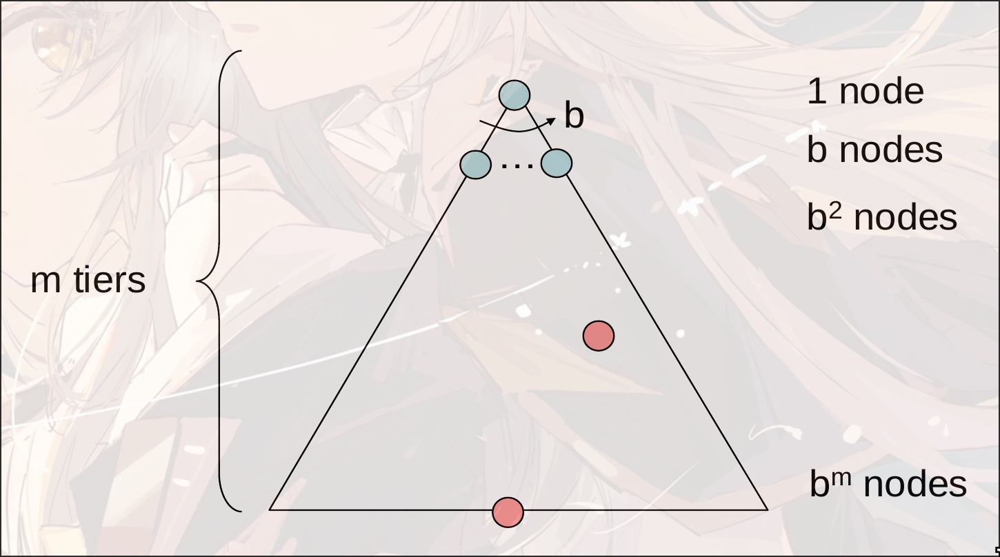

# Search

e.g. 

- problem: pathing
  - states: (x,y) location
  - action: NSEW
  - successor: update location only
  - goal test: is (x,y) = END
- problem: eat-all-dots
  - states: (x,y) dot boolean
  - action: NSEW
  - successor: update location and possibly a dot boolean
  - goal: all dots false

## 状态空间 states:

World State:

e.g. Pacman

- parameters

  - Agent position: 120

  - Food count: 30

  - Ghost: 12

  - Agent facing: NSEW

- World States:

  - Agent position: 120
  - food count: 2^30
  - Ghost: 12*12
  - Agent facing: 4
  - total: 120 * 2^30 * 12*12 * 4

- state of pathing: 120

- states for eat-all-dots: 120 * 2^30

针对不同的问题会有不同大小的解空间

状态空间越少越好, 状态空间越大, 搜索越多

### 状态空间图 State Space Graph

很少使用这种状态空间图, 因为保存的内容太多了

所以使用另外的一种算法

### 搜索树 Search Tree

当前状态作为一个根节点, 然后可以往不同决策行进

是一种"what if"树

每一个子节点都表示一种可能性(successor)

依然是无法表达出整个状态空间

- `b`: branching factor: 表示一个节点可以扩展多少子节点
- `m`: maximum depth: 搜索可能达到的最深的路径

#### fringe

边缘

维护所有已扩展的路径中的叶子节点的路径(从根节点到该节点的路径)

更新: 选择一个fringe里面的叶子节点, 然后扩展到其子节点.

#### err

如果图上有环, 那么会导致搜索可能陷入循环, 导致没有optimal

优化: never expand a state twice. 只对某一个state搜索一次, 第二次直接停止.

不会破坏completeness, 因为所有节点还是会被访问到

### different between search graph and search tree

## 搜索

属性

- complete: 是否能找到完整的节点
- optimal: 能否找到最优解
- time complexity
- space complexity

b是branching factor: 表示多少种不同的选择

m是最大深度, 选择的次数

solutions可能在任意深度

一共有$b+b^2+\cdots+b^m=O(b^m)$

#### DFS

depth-first search

使用stack来存储

- complete: 如果深度有限那么是完整的
- optimal: 只找到了最左侧的解, 但是并没有考虑深度问题, 所以不是optimal
- time: $O(b^m)$
- space: $O(bm)$

#### BFS

breadth-first search

- complete: yes
- optimal: 如果每一条边的cost是1, 那么才是optimal的

- time: $O(b^s)$, 其中$s$表示搜索结果的层级
- space: $O(b^s)$

#### Iterative Deepening

- 限制深度为1, 进行DFS, 判断是否有解
- 如果无解, 那么限制深度为2, 进行DFS, 判断是否有解
- ...

上一层的时间复杂度远远小于下一层的时间复杂度, 每一层指数增长, 上一层的搜索对下一层可以忽略不计, 因此实用性比较好

### Cost-Sensitive Search

每个状态的转移具有不同的花费.

#### Uniform Cost Search(UCS)

strategy: 展开cost最小的node

- complete:
- optimal

- time: $b^\frac{C^*}{\varepsilon}$

- space: 存储到priority queue内部, 比较的是cumulative cost. 

  假设最小的花费(最优解)是$C^*$, 并且这条路上的最小花费是$\varepsilon$, 那么有效路径长度大概是$\frac{C*}{\varepsilon}$

缺点: 展开的过程中, 所有展开的距离(cost)是相同的

## Model

agent对于world state的一种建模. 需要基于这个建模进行Planning和Searching

e.g. 出门是否带伞: Model: 看了天气预报 / Model: 随机带伞

### Search Heuristics

目标函数: 搜索使靠近$h(goal)=0$

#### Greedy Search

贪心算法: 只考虑当前状态的最优解

best cases:

worst cases:

#### A* Search

uniform-cost search: backward cost 路径的花费: $g(n)$

greedy search: forward cost 未来估计价值: $h(n)$

A* search: $f(n)=g(n)+h(n)$

- complete: 需要让$h(n)$是admissible: $0<h(n)<h^*(n)$其中$h^*(n)$是真实距离

- optimal: 

  假设:

  - 任意节点$n$, 最优解$A$, 次优解$B$

  Claim:

  - A will exit fringe before B

    A比B先弹出fringe, 表示A会先进行is_goal的测试

  Proof:
  
  - $$
    \text{admissive}\Rightarrow h(n)\leq h^*(n)=g(A)-g(n)\\
    h(A)=0\Rightarrow f(A)=g(A)\Rightarrow h(n)\leq f(A)-g(n)\\
    \Rightarrow h(n)+g(n)\leq f(A)\Rightarrow f(n)\leq f(A)\\
    \Rightarrow\text{因此, 节点$n$一定在节点$A$之前找到}
    $$
  
  - $$
    \text{A is optimal and B is  suboptimal}\Rightarrow g(A)<g(B)\\
    \text{A, B are goal}\Rightarrow h(A)=h(B)=0\Rightarrow f(A)<f(B)
    \Rightarrow f(n)\leq f(A)<f(B)\\
    \Rightarrow\text{n比B先expand}
    $$
  
  - A的所有祖先节点都比B先expand
  
  - A比B先expand
  
  所以是optimal的

heuristics越接近真实cost, 搜索代价就越小

##### admissible

$0<h(n)<h^*(n)$其中$h^*(n)$是真实距离

##### consistency

$h(A)-h(C)\leq h^*(A-C)$

其中$h^*(A-C)$表示A到C的实际距离

consistency可以推出admissible
$$
h(C)=h(C)-h(goal)\leq h^*(C-goal)=h^*(C)
$$
