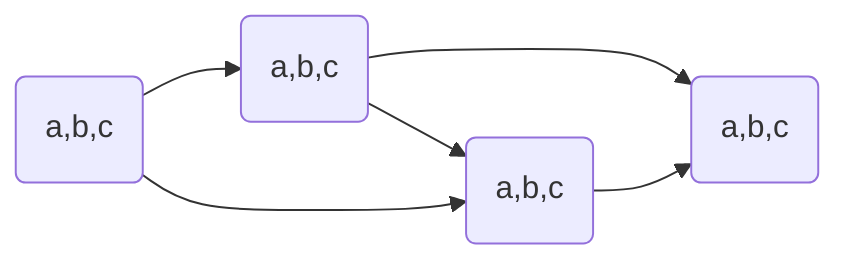
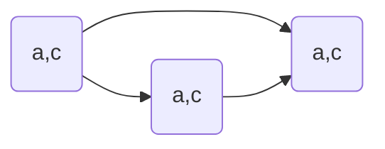
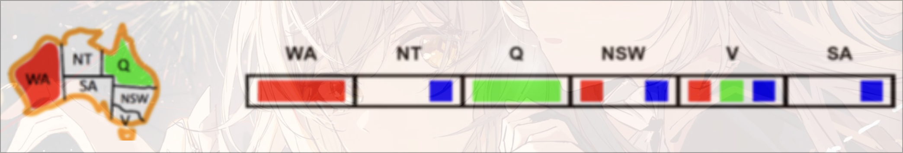
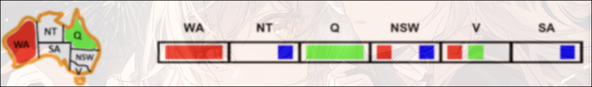
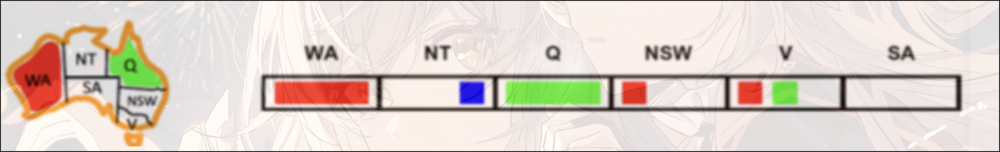
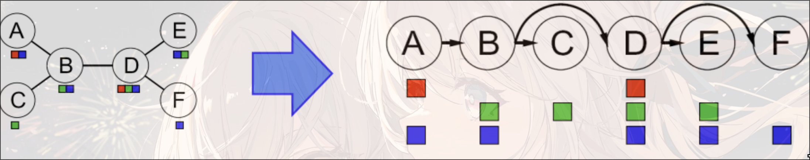

# CSP

constraint satisfaction problems约束满足问题(约束求解)

Search问题的最终goal是一个固定的state, 但是CSP的每一次搜索之后都需要重新判断goal的state

state有一个变量$X_i$, 属于一个域$Domain$

e.g. 四色问题

- Variable: 不同区域
- Domain: $D=\{\text{different colors}\}$
- constraint:
  - implicit: 区域$\neq$区域
  - explicit: $(\text{区域,区域})\in\{(\text{颜色,颜色}),\cdots\}$

e.g. N皇后问题

- Formulation 1:
  - Variables: $X_{ij}$不同棋盘位置
  - Domains: $\{0,1\}$
  - constraints:
    - $\forall i,j,k, (X_{ij},X_{jk})\in\{(0,0),(1,0),(0,1)\},i\neq k\text{ or }j\neq k$
    - $\forall i,j,k,(X_{ij},X_{i+k,j\pm k})\in\{(0,0),(1,0),(0,1)\}$
    - $\sum_{ij} X_{ij}=N$
- Formulation 2:
  - 不能有相互威胁的存在


unary一元约束: $X\neq red$

Bin二元约束: $X\neq Y$

Higher-order: 更多变量之间的约束

soft: preferences, 更倾向于某些选择而不是强制约束, 经常使用不同选择有不同cost来确定(在Bayes Net部分cover)

## Solving

- 初始状态: 空的assignment, {}
- Successor function: 给一个未赋值的变量赋值
  - 变量的赋值是可交换的, 所以需要一个固定的赋值顺序
    - e.g. [WA = red then NT = green] == [NT = green then WA = red]
  - 但是赋值的顺序会影响搜索的效率
- goal test: 所有的变量是complete的并且满足所有的约束条件

### Backtracking Search

在DFS的基础上的优化

每走一步都进行计算判断是否满足约束, 如果不满足, 那么回溯

```pseudocode
function BACKTRACKING-SEARCH(csp) returns solution/failure
	return RECURSIVE-BACKTRACKING({}, csp)
function RECURSIVE-BACKTRACKING(assignment, csp) returns solution/failure
	if assignment is complete then return assignment
	var <- SELECT-UNASSIGNED-VARIABLE(VARIABLES[csp],assignment,csp)
	for each value in ORDER-DOMAIN-VALUES(var, assignment, csp) dp
		if value is consistent with assignment given CONSTRAINTS[csp] then
			add {var=value} to assignment
			result <- RECURSIVE-BACKTRACKING(assignment, csp)
			if result != failure then return result
			remove {var=value} from assignment
	return failure
```


## Improving

filtering: 能否直接找到不满足的情况

ordering: 哪些变量应该先赋值

Structure: 利用问题建模的结构

### filtering

#### 剪枝(forward checking)

每一次赋值, 去掉不满足的assignment(对整个图进行遍历一边). 如果出现了某一个state没有值可选, 那么直接停止搜索, 进行回溯

速度变快, 但是数据结构变复杂

#### 约束传递(Constraint Propagation)

每一次赋值之后, 将这个赋值的约束传递给所有未被赋值的state

e.g.



$1.\{(a,b,c),(a,b,c),(a,b,c),(a,b,c)\}\Rightarrow\text{检查2,3}\{(A),(b,c),(b,c),(a,b,c)\}\Rightarrow\text{检查4}\{(A),(b,c),(b,c),(a)\}$

$2.\{(A),(b,c),(b,c),(a)\}\Rightarrow\text{检查3,4}\{(A),(B),(c),(a)\}\Rightarrow\text{重新检查4}\{(A),(B),(c),(a)\}$

...

原理: 在每一次确定一个选项之后, 去判断相邻且未选择的state中,是否有值能满足constraint. 即, 遍历Domain中所有可选的值, 判断如果选这个能否还能满足constraint

缺点: 



无法提前结束, 但是这种情况无解

#### 弧相容(Consistency of Arc)

将相互约束的两个state之间的无向边理解成相互指向的有向边.

一个约束弧`Arc` $X\rightarrow Y$ 是相容的 当且仅当 tail $X$中每一个value $x$在head $Y$中有一个$y$可以满足约束

方向: 未赋值变量指向正在赋值的节点之间的所有弧

如果head $Y$因为constraint失去了value, 那么所有指向$Y$的tail $X$都需要重新进行遍历

Algorithm:

1. 将CSP约束图中所有的弧存入队列Q中
2. 从Q中pop一个arc, 并强制要求每一个正在移除的弧$X_i\rightarrow X_j$中, 对tail $X_i$的每一个剩余的值$x$都有一个head $X_j$中的值$y$能够满足约束
   - 如果不存在$y$使得$x$满足约束, 需要将$x$从$X_i$的domain中移除
3. 如果有任意值在$X_i$中被移除, 将所有的$\forall k\ s.t.\ X_k\rightarrow X_i$的弧push入Q中
4. 重复操作, 直到$Q=\emptyset$或者某一个$X_k$的domain为空

```pseudocode
function AC_3(csp) returns the CSP, possibly with reduced domains
    inputs: csp, a binary CSP with variables {X1, X2, ... Xn}
    local variables: queue, a queue of arcs, initially all the arcs in csp
    while queue is not empty do
        (Xi,Xj) <- REMOVE-FIRST(queue)
        if REMOVE-INCONSISTENT-VALUES(Xi, Xj) then
            for each Xk in NEIGHBORS[Xk] do
                add (Xk, Xi) to queue
function REMOVE-INCONSISTENT-VALUES(Xi, Xj) returns true iff succeeds
	removed <- false
	for each x in DOMAIN[Xi] do
		if no value y in DOMAIN[Xj] allows (x,y) to satisfy the constraint Xi <- Xj
			then delete x from DOMAIN[Xi]
			removed <- true
	return removed
```

e.g.



initial: `Q=[SA->V,V->SA,SA->NSW,NSW->SA,SA->NT,NT->SA,V->NSW,NSW->V]`

- `SA->V`

  `SA: blue` satisfy the constraint

  No value will be removed

- `V->SA`

  `V: blue` violate the constraint

  remove blue from domain of `V`

  readd `SA->V` into queue(`NSW->V` is already in queue): `Q=[SA->NSW,NSW->SA,SA->NT,NT->SA,V->NSW,NSW->V,SA->V]`

  

- ...

- `NSW->SA`

  

  the domain of `SA` is empty$\rightarrow$backtracking

Complexity:

最坏情况下时间复杂度是$O(ed^3)$, 其中$e$为弧(有向边的数量, 即无向边数量$\times2$), d为最大domain的大小

每一条弧最多插入队列$d$词, 每一次相容性检验需要$O(d^2)$, 因此最多有$O(n^2d^3)$

> 但是听说可以同通过数据结构优化至 $O(n^2d^2)$ , 但具体方法未给出

### ordering

#### Minimal Remain Value

每次对最少选择的(约束最多的)state做选择

#### Least Constraining Value

每次选择最少受限的值, 因为这样最有可能找到可行解

### structure

#### Tree Structure CSP

$O(d^n)\Rightarrow O(nd^2)$

需要保证不存在环



1. 无向无环图的任意节点都可以作为树, 因此只需要任选一个节点作为树根
2. 将无向边转换为指向根节点反向的有向边, 拓扑排序, 即可将无向图线性化
3. Remove Backward: `For i = n:2, apply RemoveInconsistent(Parent(Xi),Xi)`
4. Assign Forward: `For i = 1:n, assign Xi consistently with Parent(Xi)`

因为在经历过backward的consistency of arc之后, 所有的弧都是consistent的. 因此无论后续节点选什么值, forward的过程中都可以找到对应的可选的值. 因此在forward的时候不会进行回溯

### Iterative Algorithms for CSP

思想: 拿到一个不满足约束的complete的解, 然后给重新赋值, 使冲突达到最小

1. 拿到一个solution, 可能冲突
2. 随机选择一个冲突的值
3. 给该变量赋值使最小化冲突的值

preformance:

$R=\frac{\#constraints}{\#variables}$

$R$很大或者很小的时候都很快

### Local Search

只对局部状态做调整

优点: 不需要关心之前的状态和访问过的状态, 更快

缺点: 可能会导致incomplete和suboptimal

state: 一个complete的分配(assignment)

successor function: local changes

但是不同的策略可能导致不同的结果

### Hill Climbing

贪心, 类似梯度上升

但是可能陷入局部最优

### Beam Search

每次不止选择一个状态, 而是选择多个状态, 能够减少出现局部最优但是全局非最优的可能

也不能保证optimal

### Simulate Annealing

模拟退火

1. 拿到一个随机的移动
2. 总是接受一个uphill的移动
3. 如果是downhill, 那么有$e^\frac{-\Delta E}{T}$的概率接受这个移动, T是温度, $\Delta E$是能量差, 可以理解为上一步的评分和下一步的评分之差(这里可以看成满足constraints的个数)
4. T会随着时间的变化变小

如果T下降足够慢, 那么我们会更容易得到optimal的solution(探索更多, 更加容易跳出local局部最优)

### Genetic Algorithm

遗传算法

1. 根据fitness(评分)选择n个进行杂交
2. 随机选择一个点, 交换两者的DNA(值)
3. 概率突变

