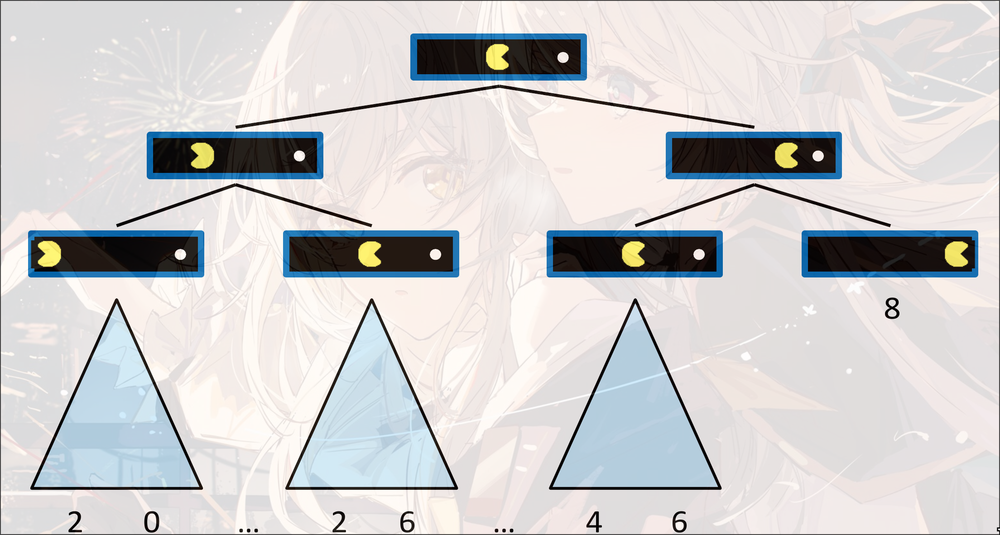
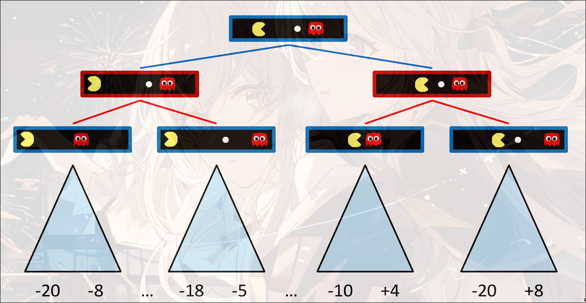
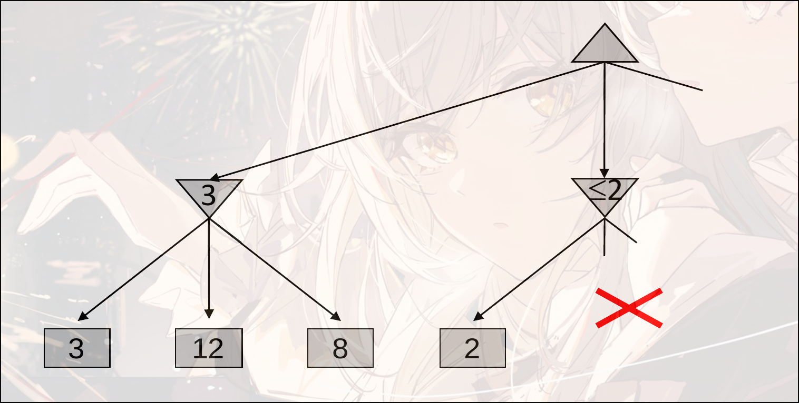
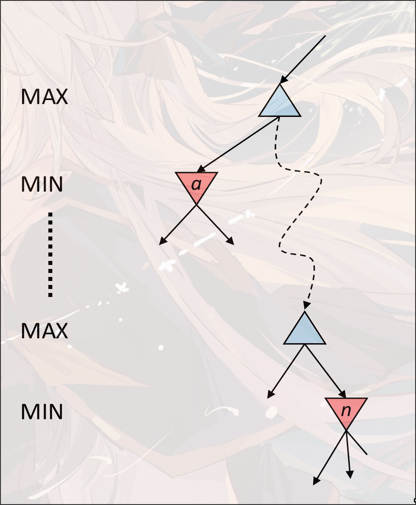

# Adversarial Search

Game Type:

- 是否确定(只能选择一个或几个行为之一) Deterministic or stochastic
- 玩家个数
- 是否零和博弈 zero sum
- 是否观测到当前状态的所有信息 Perfect Infomation

目的是找到一个policy(strategy), 能够给定任意的state $S$, 找到一个行为action $A$

## Search

### Single-Agent Tree

### Minmax Search

对抗: 红色状态是敌人的agent, 要让红色状态的state value越小越好, 蓝色状态的state value越大越好

- 如果是终止状态, 直接返回终止状态的value
- 如果是max, 寻找最大化的state value: `max(v, value(successor))`
- 如果是min, 寻找最小化的state value: `min(v, value(successor))`

是类似穷举的DFS

时间复杂度: $O(b^m)$

空间复杂度: $O(bm)$

$b$是state, $m$是步数

## Improve

### depth-limited search

在有限深度下搜索

Evaluation Function: 对非终止节点的state value的估计, 根据不同的特征进行判断

理想方程: 真实的minmax search的state value

### Monte Carlo Tree Search

对树进行采样, 控制采样的深度和次数, 对采样的结果进行统计, 可以得出原始的树的state value和distribution

## Game Tree Pruning

### Minmax Pruning

第一步找到了3, 第二步中, 找到了一个2, 那么第二步的min的state value一定是一个小于2的值, 那么可以直接舍去这一个选择(要选择max的state value)

### Alpha-Beta Pruning

- 假设现在对节点`n`计算state value
- 展开`n`的节点的子节点. 因为是取最小, 那么展开`n`的子节点的过程中, `n`的state value一定是递减的
- 假设`a`是MIN层中最大的节点
- `n`的state value一旦小于`a`的state value, 那么在向上传递的过程中, 在与`a`同层的位置一定会选择更大的`a`而不是`n`的state value
- 所以可以直接舍去`n`节点的后续计算

Implementation:

- 初始化$\alpha$是MAX的最优选项, $\beta$是MIN的最优选项
- max value:
  - 初始化$v=-\infty$
  - 更新每一个successor
    - `v = max(v, value(successor))`
    - 如果$v\leq\beta$, 那么直接不计算(剪枝)
    - 更新$\alpha=\max(\alpha, v)$
- min value:
  - 初始化$v=+\infty$
  - 更新每一个successor:
    - `v=min(v, value(successor))`
    - 如果$v\geq\alpha$, 剪枝
    - 更新$\beta=\min(\beta, v)$