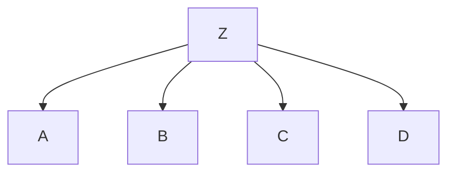
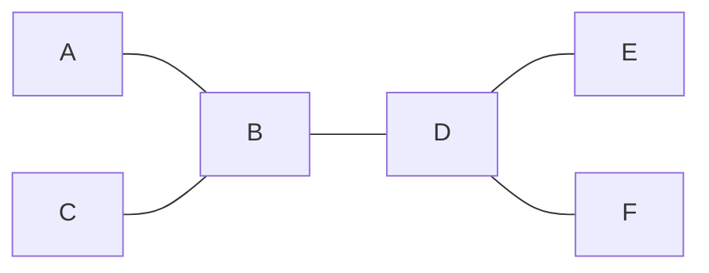

# Bayes Net: Exact Inference

## Variable Elimition


$$
P(B|+j,+m)\propto_B P(B,+j,+m)\\
=\sum_{e,a}P(B,e,a,+j,+m)\\
=\sum_{e,a}P(B)P(e)P(a|B,e)P(+j|a)P(+m|a)\\
=P(B)P(+e)P(+a|B,+e)P(+j|+a)P(+m|+a)+P(B)P(-e)P(+a|B,-e)P(+j|+a)P(+m|+a)\\+P(B)P(+e)P(-a|B,+e)P(+j|-a)P(+m|-a)+P(B)P(-e)P(-a|B,-e)P(+j|-a)P(+m|-a)
$$
考虑$uwy + uwz + uxy + uxz + vwy + vwz + vxy +vxz=(u+v)(w+x)(y+z)$

可以将原本16乘法7加法转换成2乘法3加法

于是考虑隐变量的因子消除方法:
$$
P(B|+j,+m)\propto_B P(B,+j,+m)\\
=\sum_{e,a}P(B)P(e)P(a|B,e)P(+j|a)P(+m|a)\\
=P(B)\sum_eP(e)\sum_aP(a|B,e)P(+j|a)P(+m|a)
$$

### operation

1. Join Factors

   给定多个CPT, 将多个CPT整合成一个CPT

   

2. Variable Elimition

   将隐变量求和, 消除

   

假设求$P(Q|E_1=e_1,\cdots,E_n=e_n)$

- 从local CPT开始
- 选择一个隐变量$H$
  - 将所有提到$H$的factor进行join
  - 对$H$进行求和(sum elimition)
- 重复, 直到只剩下$Q$和$E_1,\cdots,E_n$

e.g.


## Ordering Matter



假设我们需要计算$P(D)$

那么所有其他的变量都是hidden variable

- 如果消除顺序为`CBAZ`
  $$
  P(D)=\alpha\sum_{a,b,c,z}P(z)P(D|z)P(A|z)P(B|z)P(C|z)\\
  =\alpha\sum_{z}P(z)P(D|z)\sum_aP(A|z)\sum_bP(B|z)\sum_cP(C|z)
  $$

- 如果消除顺序为`ZABC`
  $$
  P(D)=\alpha\sum_{a,b,c,z}P(z)P(D|z)P(A|z)P(B|z)P(C|z)\\
  =\alpha\sum_{a}\sum_{b}\sum_{c}\sum_{z}P(z)P(D|z)P(A|z)P(B|z)P(C|z)
  $$
  

消除顺序不同则参数量不同

不存在一种最小的复杂度对于一个Bayes Network Variable Elimition. 这个和图的结构有关

## Message Passing and General Graphs



对于`poly-tree`的网络, 可以看作图上的信息的传播. 将算好的概率传播


分团之后, 两个团的连接点必须同时出现在两个团中. 如 cluster1: $ABC$, cluster2: $BCD$, 相连的两个点是$C$和$B$, 那么这两个点必须在这两个cluster中同时出现

# Bayes Net: Approximate Inference

Sampling from given distribution

1. step1: 从一个`[0, 1)`的uniform distribution采样一个u

   有多重方式实现, 如:

   ```python
   import random
   u = random.random()
   ```

2. step2: 从采样的概率中获取到变量

   如:
   

## Prior Sampling


> 先根据$C$的概率采样: $c$
>
> 然后已知$C=c$的情况下采样 $\neg s$, $r$
>
> 然后在已知$c,\neg s,r$的情况下采样: $w$
>
> 最终得到$c,\neg s,r,w$
>
> 重复多次

采样的顺序最好为Bayes Network的拓扑结构(有了condition才能更好算出当前的结果)


采样多次之后, 假设我们有$(c,\neg s,r,w),(c,\neg s,r,w)(c,\neg s,r,w)(c,\neg s,r,w)(c,\neg s,r,\neg w)$

如果要计算$P(W)$, 那么有$\{w:4,\neg w:1\}$, 则$P(w)=0.8,P(\neg w)=0.2$

>算法推导:
>
>- 根据真实概率采样
>
>  $S_{Prior Sample}(x_1,\cdots,x_n)=\prod_iP(x_i|\text{Parent}(x_i))=P(x_1,\cdots,x_n)$
>
>- 采样得到的概率$\hat P$有
> $$
>  \hat P(x_1,\cdots,x_n)=\frac{N_{Prior Sample}(x_1,\cdots,x_n)}{N}
> $$
>
>- 则当采样次数$N\to\infty$时:
> $$
>  \lim_{N\to\infty}\hat P(x_1,\cdots,x_n)=\lim_{N\to\infty}\frac{N_{Prior Sample}(x_1,\cdots,x_n)}{N}\\
>  =S_{Prior Sample}(x_1,\cdots,x_n)\\
>  =P(x_1,\cdots,x_n)
> $$

## Rejection Sample

假设我们需要计算$P(W|r,w)$, 即需要已知$R=r,W=w$的概率, 那么我们直接不需要采样(记录)出现$R=\neg r$或者$W=\neg w$的情况


有问题:

假设condition本身就是很小的概率, 那么我们的概率可能很小或者极大.

如:


假设$P(\text{Color}=\text{Blue})=0.001$, 那么本身出现blue的概率很小, 那么如果采样Shape, 很容易出现极端情况

## Likelihood Sample

为了解决Rejection Sample的问题, 我们首先固定已知的变量, 在这种情况下进行采样, 而不是直接采样然后拒绝

将所有采样的Evidence的条件概率相乘作为权重

然后在计算概率的时候, 我们并不是使用出现的个数, 而是使用采样对应的权重进行计算


那么有$\{(c,r,w)=0.1+0.2+0.1=0.4,(\neg c,r,w)=0.3+0.6=0.8\}$

然后归一化$P(c,r,w)=0.333,P(\neg c,r,w)=0.667$

> 正确性推导
>
> - $S_{Likelihood Sample}(z,e)=\prod_iP(z_i|\text{Parent}(z_i))$
> - $w(z,e)=\prod_iP(e_i|\text{Parent}(e_i))$
> - $\Rightarrow S_{LikelihoodSample}(z,e)\cdot w(z,e)=\prod_iP(z_i|\text{Parent}(z_i))\prod_iP(e_i|\text{Parent}(e_i))\\=P(z,e)$

### Importance Sample

使用Likelihood Sample的优化, 改变weight的计算

假设$P(x)$很小, 那么很难采样$P(x)$. 我们可以自己设计一个$Q(x)$分布, 然后根据$Q(x)$进行采样, 最终使用$\frac{P(x)}{Q(x)}$作为权重

选取$Q(x)$对算法的影响很大. 最好的$Q(x)$应该是$Q(x)\propto\abs{f(x)}P(x)$

## Gibbs Sample

原先的采样是$X_i'\sim P(X_i|\text{Parent}(X_i))$, 现在我们认为采样的时候与其他所有的变量相关, 即$X_i'\sim P(X_i|X_1,\cdots,X_n)$

但是注意有Markov Blanket阻断其他变量的信息流通, 那么我们其实只需要关注:
$$
X_i'\sim P(X_i|X_1,\cdots,X_n)=P(X_i|\text{Markov Parent}(X_i))\\
=\alpha P(X_i|U_1,\cdots,U_m)\prod_jP(Y_j|\text{Parent}(Y_j))
$$


### Markov Chain Monte Carlo(MCMC)

Markov Chain是一个条件假设: 每一个状态只依赖于前一个状态而不是全局状态

Monte Carlo: 采样算法

### Metropolis-Hastings

在给定分布$g(x'|x)$下进行采样

- $g(x'|x)$是一种易于采样的分布

有概率接受这个采样, 接受概率为$\min\left(1,\frac{P(x')g(x|x')}{P(x)g(x'|x)}\right)$

