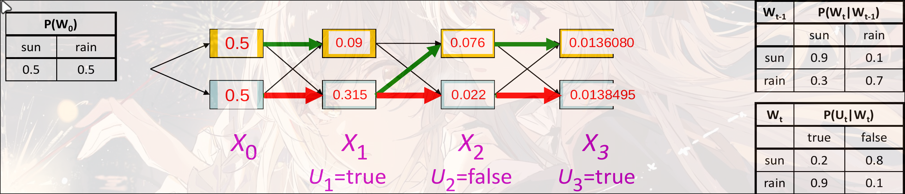

# Probabilistic Temporal Model

## Markov Model

假设许多离散的变量(infinity)拥有相同且有限的domain(Domain中的values叫做states),

转移模型$P(X_t|X_{t-1})$展示了state随时间的转移的概率

Stationarity Assumption: 所有时间步上, 有相同的转移模型

联合概率: $P(X_0,\cdots,X_T)=P(X_0)\prod_tP(X_t|X_{t-1})$ 

Markov Assumption: $X_{t+1}\perp\!\!\!\perp X_0,X_1,\cdots,X_{t-1}|X_t$, 即每一个变量之和自己的上一时刻的状态相关, 与过去的state无关

> e.g. Weather Predict
> 
> 
> 
> 
> 
> 可以写成$P(X_{t+1})=\sum_tP(X_{t+1},X_t=x_t)=\sum_tP(X_{t+1}|X_t=x_t)P(X_t=x_t)$, 迭代计算从$t=0$开始

### Stationary Distribution

注意: 随着后续转移次数增多, 状态最终**有可能**会趋向于一个固定的概率, 无论初始值是什么

因此我们称Stationary Distribution $P_\infty(X)=P_{\infty+1}(X)=\sum_xP(X|x)P_\infty(X)$

但是并不是所有的Markov Chain都有Stationary Distribution

> e.g. Weather
>
> 

## HMM - Hidden Markov Model

[b站教程笔记](./HMM.md)

只能知道Evidence Variable(或者说, 可观测变量)$E$, 但是Markov Chain的state transition是在隐变量$X$上进行的.

### Model

- Initial Distribution: $P(X_0)$
- Transition Mode: $P(X_t|X_{t-1})$
- Emission Model: $P(E_t|X_t)$

Joint Distribution of HMM: $P(X_0,\cdots,X_T,E_1,\cdots,E_T)=P(X_0)\prod_tP(X_t|X_{t-1})P(E_t|X_t)$

独立性: 

- 给定上一时刻的state, 当前时刻的state与其他时刻的state条件独立
- 给定当前的隐变量, 当前的evidence与其他任何变量条件独立

### Inference

规定: 一个标记: $A_{t:T}=A_t,A_{t+1},A_{t+2},\cdots,A_T$

- **Filtering** $P(X_t|E_{1:t})$

  belief state: 给定目前为止所有的观测变量之后找到当前state的后验概率分布

- **Prediction** $P(X_{t+k}|E_{1:t})\text{ for }k>0$

  在给定目前为止所有变量之后, 计算未来state的后验概率分布

- **Smoothing** $P(X_k|E_{1:t})\text{ for }0\le k\leq t$

  在给定目前为止所有evidence之后计算过去的一个state的后验概率分布

- Most Likely explanation

  $$
  \mathop{\arg\max}_{X_{0:t}}P(X_{0:t}|E_{0:t})
  $$

#### Filtering

Filtering: infer current state given all evidence

目标: 用迭代的方式求解Filtering
$$
P(X_{t+1}|E_{1:t+1})=P(X_{t+1}|E_{1:t},E_{t+1})=\alpha P(E_{t+1}|X_{t+1},E_{1:t})P(X_{t+1}|E_{1:t})\\
=\alpha P(E_{t+1}|x_{t+1})\sum_{X_t}P(X_t|E_{1:t})P(X_t|X_{t+1})
$$
其中$\alpha=\frac1{P(E_{t+1}|E_{1:t})}$是正则化项. 因为已经观测到了$E_{t+1}$和$E_{1:t}$, 所以$\alpha$是一个常量, 不影响概率分布. 因此可以直接写成一个正则化项的形式

假设结果是$f_{1:t+1}$, 计算过程为$f_{1;t+1}=\mathbf{Forward}(f_{1:t},E_{t+1})$. 其中初始化为$f_{1:0}=P(X_0)$

时间复杂度: $O(|X|^2)$, 其中$|X|$是state的数量

变量消除: $\sum_{X_t}$

> e.g. Weather
>
> 
>
> 

##### Another view

每一个边(Arc)表示一个transition: $X_{t-1}\rightarrow X_t$

每一个边都有自己的weight: $P(X_t|X_{t-1})P(E_t|X_t)$

weight的乘积与这个path的路径的概率成正比: $P(X_0)\prod_tP(X_t|X_{t-1})P(E_t|X_t)=P(X_{0:t}, E_{1:t})\propto P(X_{0:t}|E_{1:t})$

计算新的state: $P(X_{t+1}|E_{1:t+1})=\sum_{X_{0:t}}P(X_{0:t+1}|E_{1:t+1})$, 类似BFS

使用动态规划的思想: 保存每一个state的概率, 便于计算(用空间换时间, 不用记忆化需要时间$O(T^{|X|})$, 用记忆化搜索之后时间为$O(|X|^2T)$):
$$
f_{1:t+1}=\mathbf{Forward}(f_{1:t},E_{t+1})\\
=\alpha P(E_{t+1}|X_{t+1})\sum_{X_t}P(X_{t+1}|X_{t})f_{1:t}[X_t]
$$

#### Most Likely Explanation

维特比算法 Viterbi algorithm. 计算最优路径:
$$
\mathop{\arg\max}_{X_{0:t}}P(X_{0:t}|E_{1:t})
$$

- Viterbi algorithm

  对于时间$t$的state, 记录最大概率的路径

  $m_{1:t+1}=\mathbf{Viterbi}(m_{1:t},E_{t+1})=\alpha P(E_{t+1}|X_{t+1})\max_{X_t}P(X_{t+1}|X_t)m_{1:t}[X_t]$

- Forward Algorithm

  求和. 对于时间$t$的state, 记录路径到该节点处的总概率

  $f_{1:t+1}=\alpha P(E_{t+1}|X_{t+1})\sum_{X_t}P(X_{t+1}|X_t)f_{1:t}[X_t]$

$$
m_{1:1}(\text{sun})=0.2\times\max(\underline{0.9\times0.5},0.3\times0.5)=0.09\\
m_{1:1}(\text{rain})=0.9\times\max(0.1\times0.5, \underline{0.7\times0.5})=0.315\\
\cdots\cdots
$$

时间复杂度: $O(|X|^2T)$

空间复杂度: $O(|X|T$)

本质上是一个Search. 从根节点出发, 逐层扩展. 保留概率最大的state.

## DBN Dynamic Bayes Network

Bayes Network的基础之上, 加上了时间的状态

假设后一时态的状态和上一时态的状态有关.

每一个Dynamic Bayes Network都可以被HMM表示. 但是每一个DBN的时态都需要做笛卡尔积.

如: 3个二元变量在HMM中就是一个$2^3$大小的一个隐变量

### 优点

依赖稀疏(Sparse Dependencies): 参数量极少

e.g. 假设有20个二元变量, 每一个变量都有两个祖先:

- HMM parameters: $2^{20}\times2^{20}\simeq10^{12}$
- DBN parameters: $20\times2^{2+1}=160$, 两个父节点和自己一共八个状态

### Exact Inference

Variable Elimination 应用给DBN

- Offline: 将网络在$T$个时间步上展开, 然后消除变量, 计算得出$O(X_T|E_{1:T})$

  但是会导致出现很大的BN

- Online: 正常展开. 但是每一次展开都消除掉上一时间步中的所有的变量.

## Particle Filtering

对于一个状态空间极大的HMM, 直接进行Exact Inference是不可行的

我们使用approximate inference, 将Evidences看作"下游", 通过忽略evidence, 直接对Hidden State进行采样. 但是权重会下降非常快, 概率变得非常低, 可能会导致过少的可接受的结果出现.

改进: 使用Particle Filtering

每一个采样的sample叫做一个particle. 初始可以设置成先验分布或者均一分布进行采样. 然后将采样的粒子作为新的概率. 注意, 一般而言, 采样的大小$N<<|X|$

第一次根据$P(X_0)$的分布采样. 然后有转移概率:$X_{t+1}\sim P(E_t|X_t)$, 当前状态下的权重是$P(E_t|X_t)$. 但是weight在多次之后会变得很小, 会导致每个粒子的权重一直在衰减.

所以进行resample. 在拿到weight之后iou, 根据这个weight重新进行采样新的分布, weight全为1

