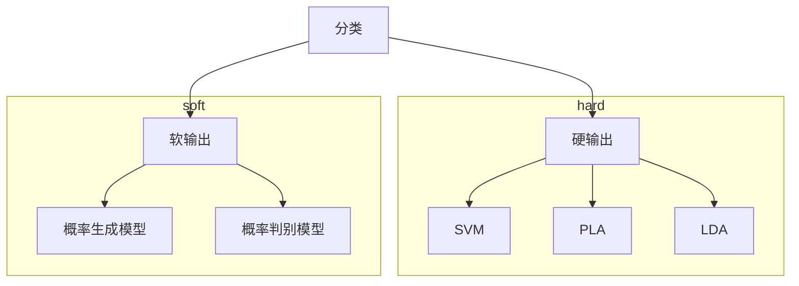
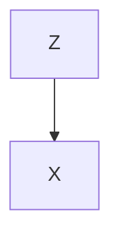
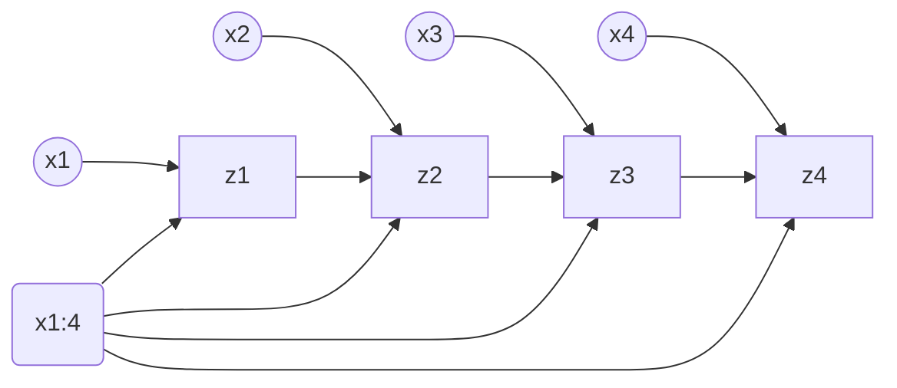
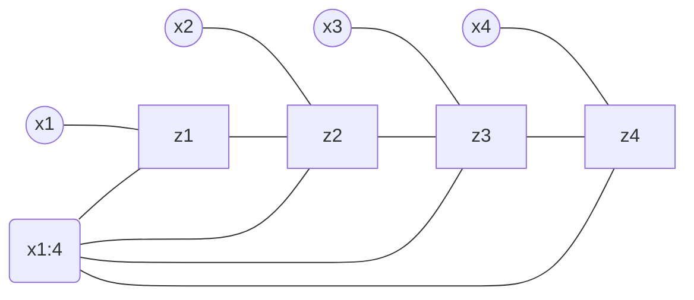

# Background

条件随机场 CRF Conditional Random Field

硬输出是有一个明确的分类边界的, 而软输出是计算概率, 找到最大的后验概率$p(\text{class}=a|x=x_i)$

概率生成模型是对$p(x,y)$建模(e.g. HMM), 而概率判别模型是对$p(y|x)$建模(e.g. softmax, Logistic Regression等, 都是属于Maximum Entropy Model的一种)

Gaussian Mixture Model:

Z是隐变量, X是观测变量. 现在假设$Z$服从离散分布, 即可以取值$1,\cdots,K$, 而$p(X|Z)\sim\mathbf{Gaussian}$

## MEMM

现在综合HMM和Maximum Entropy Model, 组合得出一个新的模型MEMM(Maximum Entropy Markov Model), 属于判别模型

其中, 与HMM相比, 隐变量不再影响观测变量, 而是观测变量作为输入影响隐变量($p(Z|X)$)

其中, $x_{1:4}$指的是全局的global观测变量的约束, $x_i$是单独的local的观测变量. 隐变量受到local的观测变量的影响, 并同时受到global观测变量的影响.

这样相比HMM, 打破了观测独立假设, 让模型整体更加的合理. 

但是MEMM会陷入一个问题: 标注偏差问题(label bias problem), 原因是局部归一化

## CRF

为了解决MEMM的label bias problem, CRF在MEMM的概率图的基础上, 将有向图转换成了无向图:

这个也是一个判别模型, 也是对$p(Z|X)$进行建模. 由于这个模型是无向图建模, 所以天然就是全局归一化, 不存在局部归一化

## HMM vs MEMM

### HMM

齐次一阶马尔科夫假设

- 一阶: 这一个时刻的状态只会受到上一个时刻的状态的影响
- 齐次: 所有的状态在受到上一个状态的影响下的分布是相同的.

观测独立假设

- 观测值只和对应时刻的隐变量有关

建模对象: $p(X,Z|\lambda)=\prod_{t=1}^Tp(x_t,y_t|\lambda)=\prod_{t=1}^Tp(y_t|y_{t-1},\lambda)p(x_t|y_t,\lambda)$

### MEMM

打破观测独立假设

