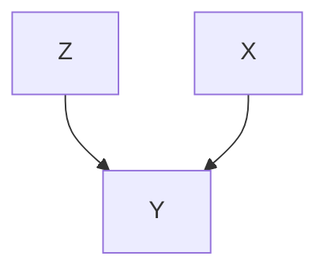
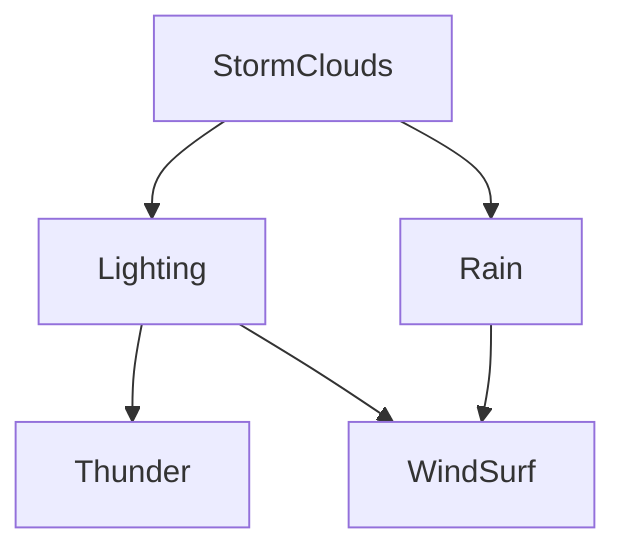
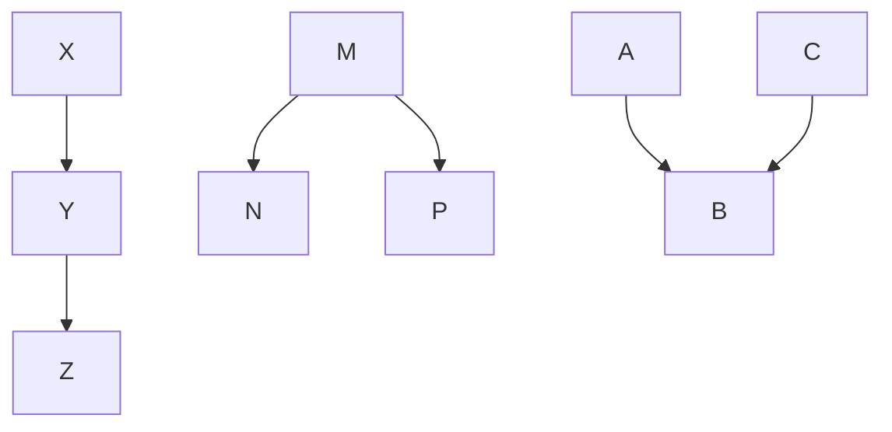
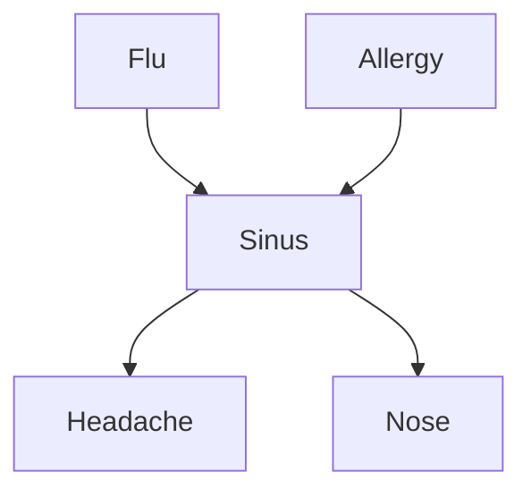
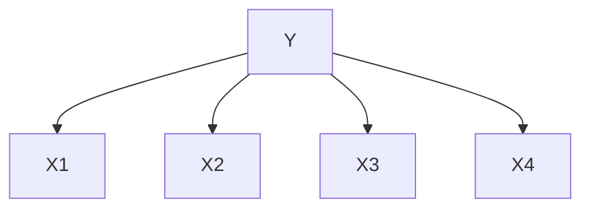
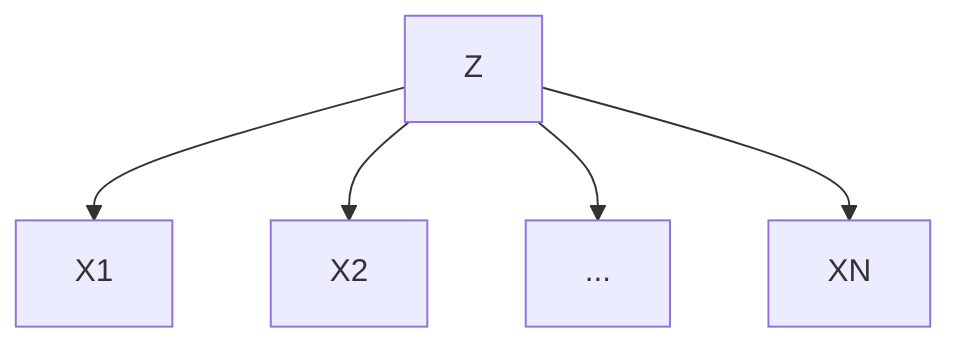

# 机器学习引论

## 简单拟合

### 最小二乘法: Least Square

#### 计算

- Input: $X^T=(X_1,X_2,\cdots,X_p)$,

- predict output via the model: $\hat{Y}=\hat{\beta_0}+\sum_{j=1}^pX_j\hat\beta_j$

  $\hat\beta_j$: bias or intercept, 偏差

  而$\hat{\beta_j}$和$\hat{\beta_0}$都是需要求解的参数,

- Include the constant variable 1 in X: 在向量X中包含常数1: $\hat Y=X^T\hat\beta$

  可令$X_0=[1]$, 则$X^T=(X_0,X_1,\cdots,X_p)$,  那么$\hat\beta=\left[\begin{array}{c}\hat\beta_0\\\hat\beta_1\\\vdots\\\hat\beta_p\end{array}\right]$. 相当于是把最开头的那个$\hat\beta_0$收到了参数向量$\hat\beta$里面

- 这里的$\hat Y$可以是标量, 可以是向量. 如果$\hat Y$是k维向量, 那么就有$\hat\beta$是一个$p\times K$的参数矩阵(多元回归)

- 在(p+1)维的输入输出空间中, $(X,\hat Y)$代表一个超空间. 如果$\hat\beta_o$在$\hat\beta$中, 那么这个超空间就经过原点.

  ground-truth: $f(X)=X^T\beta$,  it's gradient(梯度): $f'(X)=\beta$ 是一个指向最陡的上升方向的向量.

> 补充: 矩阵导数:
> $$
> \frac{\partial f_\theta(X)}{\partial \beta}=\left[\begin{array}{c}X_1\\X_2\\\vdots\\X_p\end{array}\right]=X\\
> \frac{\partial \beta^TA\beta}{\partial \beta}=(A+A^T)\beta\\
> \frac{\partial \beta^TX^TX\beta}{\partial \beta}=(X^TX+XX^T)\beta\\
> $$
> 其中, $X$是一个向量, $A$是一个二次型系数矩阵.

#### 残差

- N: #observations 观测量(样本空间)

- minimize the residual sum of squares:

  $RSS(\beta)=\sum_{i=1}^N(y_i-x_i^T)^2$

  向量(矩阵): $RSS(\beta)=(\vec y-\bold X\vec \beta)^T(\vec y-\bold X\vec \beta)=||\vec y-\bold X\vec \beta||_2^2$

  $||\vec y-\bold B\vec \beta||$是范数, 关于$\beta$的函数, 是一个抛物面.

  > 范数: $||a||_2=\sqrt{a^Ta}, \forall a\in\mathbb R^{p\times1}$

要找到最小值点, 需要求导数:
$$
RSS(\beta)=(y-X\beta)^T(y-X\beta)=y^Ty-X^T\beta^Ty-y^TX\beta+\beta^TX^TX\beta\\
RSS'(\beta)=X^T(y-X\beta)\\
\mbox{如果$X$不是奇异矩阵, 那么}\hat\beta=(X^TX)^{-1}X^Ty
$$

### 最近邻项: Nearest Neighbor

分类.

- model: $\hat Y(x)=\frac1k\sum_{x_o\in N_k(x)}y_i$
- $N_k(x)$: 最近的$k$个元素的集合.

- $y$: 类别.
- 分类依据: 计算$\hat Y(x)$, 与0.5(二元)去对比

## 条件概率公式展开

期望: $E[x]=\sum_xxP(X=x)\text{， 当x是非连续变量；}E(x)=\int xP(X=x)\mathbf{d}x\mbox{ ，当x是连续变量}$

损失函数：$L(X,f(X))=(Y-f(X))^2$，也写作$L_2$。还有一个$L_1=|Y-f(X)|$也是损失函数。第一类损失函数比第二类的优点：第一类鲁棒性更好，面对误差或者错误标注的数据能更好的抵抗

EPE, Excepted prediction error, 描述$y$与$\hat y$之间的差异:
$$
EPE(f)=E(Y-F(X))^2=\int(y-f(x))^2Pr(dx,dy)\\
\mbox{Since }Pr(X,Y)=Pr(Y|X)Pr(X),\mbox{EPE can also be written as}\\
EPE(f)=E_XE_{Y|X}([Y-f(X)]^2|X)
$$
所以说，可以通过找EPE的最小值来进行寻找合适的参数，如：
$$
f(x)=\text{arg}\min_{c}E_{Y|X}([Y-c]^2|X=x)\\
$$
回归方程: $f(x)=E(Y|X=x)$

### 回归方程

#### Nearest Neighbor

回归方程：$\hat f(x)=\mathbf{Ave}(y_i|x_i\in N_k(x))$

$N_k$表示前k个最近的元素。 

需要极大样本量，才能够保证有均值与期望相接近。当$k\to\infty$的时候，才会有$\frac kN\to0\Rightarrow\hat f(x)=E(Y|X=x)$

如果当每一个样本点的维数增多的时候(即特征维度增多)，所需要的N的数量会急速增加。

#### Linear Regression

$f(x)\approx  x^T\beta$，是一个有模型预测的回归模型。这里我们假设了线性模型。

由于有了对回归模型的假设，我们对样本量的需求比kNN算法小了很多。这里的EPE为：
$$
EPE(f)=E(Y-f(X))^2=E((Y-X^T\beta)^T(Y-X^T\beta))=E(||Y-X^T\beta||_2^2)\\
\frac{\partial((Y-X^T\beta)^T(Y-X^T\beta))'}{\partial \beta}=\frac{\partial(Y^TY-\beta^TXY-Y^TX^T\beta+\beta^TXX^T\beta)'}{\partial \beta}\\
=0-XY-Y^TX^T+(XX^T+X^TX)\beta=0\\
\therefore \beta=[E(XX^T)]^{-1}E(XY)
$$
而根据残差平方和，
$$
\mathbf{RSS}(\beta)=\sum^N_{i=1}(y_i-x_i^T\beta)^2
$$
当残差平方和最小的时候，有$\beta=(X^TX)^-1X^Ty$

### 协方差

Covariance，$\mathbf{Cov}(X,Y)=E[(X-E[X])^TT(Y-E[Y])]=Var+Bias^2$，是方差加上偏差的平方。

方差$\mathbf{Var}(X)=\mathbf{Cov}(X, X)$

#### kNN

分类输出变量$G$ 的程序，其值来自$g$。损失函数是一个$K\times K$的矩阵$L$，而$K=card(g)$

- $L(k,l)$是错误把$g_k$里的内容估计成$g_l$中内容所付出的代价。

所以，我们有了一个0-1损失方程：$L(k,l)=1-\delta_{kl},\delta_{kl}=1\mbox{ if and only if k == l}$
$$
EPE=E_X\sum_{k=1}^KL[g_k,\hat G(X)]Pr(g_k|X)\\
\hat G(X)=argmin_{g\in G}\sum_{k=1}^KL(g_k,g)Pr(g_k|X=x)\\
\text{Or simply, }\hat G(x)=argmax_{g\in G}Pr(g|X=x)
$$

## Cross Validation

交叉验证

把一个数据集分成$n$份，验证$m$个$k$的取值，那么对于每一次循环，把$n$份中的一份座位测试集，循环$m$次，计算$k$

循环$n$次之后去计算每一个$k$的取值的平均准确度，找到准确度最大的一个

## 高维中的本地模型（local model）

- 随着维度的上升，本地模型逐渐演化成广域模型（global model）
  - 如：在一个边长为1的p维的立方体中，取一个覆盖了$r\%$的数据（体积），那么设小立方体的边长为$e_p(r)=r^{\frac1p}$.
  - 那么有：$e_{10}(0.01)=0.63,e_{10}(0.1)=0.80,e_1(0,01)=0.01,e_2(0.01)=0.1$

- 高维空间中，数据去向样本空间的边缘。

  - 假设有N个数据点，p维的空间，假设数据空间是一个单位球体（$r=1$）。那么中位距离（所有数据到样本空间中心点的距离的中位数）是$d(p,N)=\left(1-\frac12^{\frac1N}\right)^{\frac1p}$。那么就有$d(10,500)\approx0.52$

    > 对于一个p维的球体样本空间，有以下推论：
    > $$
    > \prod_{i=1}^nPr(||x_i||>r)=\frac12\\
    > Pr(||x_i||>r)=1-Pr(||x_i||\leq2)=1-V_p(r)=1-\frac{\pi^{\frac p2}}{\Gamma(\frac p2+1)}r^p\approx1-r^p\text{(当p极大时)}\\
    > (1-r^p)^N=\frac12
    > $$
    > 可以得出中位距离的公式

### 函数拟合

1. 数据集：$(x_i,y_i)$的数值对，在$(p+1)$维中。有以下函数(ground-truth): $y_i=f(x_i)+\varepsilon_i,f:\mathbb R^p\rightarrow\mathbb R$
2. 目标：找到一个对于$f(x)$的好的逼近。给定训练样本集$\tau$

$$
\mbox{给定参数集合$\theta$，那么对于线性模型，有}f(x)=x^T\beta\mbox{，而$\theta=\beta$，其中这两个可以是scalar，也可以是vector或matrix}\\
f_\theta(x)=\sum_{k=1}^Kh_k(x)\theta_k\\
h_k\mbox{：一个函数，可以将非线性的输入转换成线性的输入。如：有$x_1,x_2$两个轴，组成的样本集的分界线是一个圆。那么可以令}\\
h_k(x_1,x_2)=\sqrt{x_1^2+x_2^2}\mbox{转换成一个线性的问题}\\
h_k\mbox{的例子：}h_k(x)=x_1x_2^2\mbox{(Polynomial expansion)},h_k(x)=\cos(x_1)\mbox{(Trigonometric expansion)},h_k(x)=\frac1{1+\exp(-x^T\beta_k)}\mbox{(Sigmoid expansion)}
$$

然后利用$RSS$进行拟合$\theta$：
$$
RSS(\theta)=\sum_{i=1}^N(y_i-f_\theta(x_i))^2
$$

### 最大似然估计 MLE

使用$Pr_\theta(y)$（预测值）去估计$Pr(y)$（真实值）
$$
\mbox{Lamma：KL散度：}\\
KL(p||q)=\int p(x)\log\frac{p(x)}{q(x)}dx=\int p(x)\log p(x)dx-\int p(x)\log q(x)dx=-H[x]-E[\log q(x)]\\
\mbox{推导MLE：}\\
\min_{\theta}KL(p(y)||p_\theta(y))=\int p(y)\log p(y)dy-\int p(y)\log p_\theta(y)dy=C-\int p(y)\log p_\theta(y)dy\\
\mbox{由于$\int p(y)\log p(y)dy$是对$y$的焓，所以是一个常数。}\\
\mbox{考虑Monte Carlo方法抽样：}E[x]=\int xp(x)dx=\frac1K\sum_{k=1}^Kx_k,x_k\sim p(x)\\
\mbox{即在$p(x)$中抽样。当$K$足够大，可以认为与期望是相等的。那么有：}\\
\min_{\theta}KL(p(y)||p_\theta(y))=C-\frac1N\sum_{i=1}^N\log p_\theta(y_i)\mbox{，去掉常数（因为是对$\theta$求最小），有：}\\
\max_\theta l(\theta)=\sum_{i=1}^N\log Pr_\theta(y_i)\mbox{（注意求最小，但是有个负号，所以是对这个求最大。）}
$$
对于高斯分布的概率密度函数求MLE:
$$
l(\theta)=\sum_{i=1}^N\log Pr_\theta(X)=-\frac{N}2\log(2\pi)-N\log\sigma-\frac1{2\sigma^2}\sum_{i=1}^N(y_i-f_\theta(x_i))^2\\
\mbox{求最大值那么对$l$求偏导，因为$\theta$包含了两个参数，$\mu,\sigma$}
$$
对训练数据集$\tau$，那么
$$
l(\theta|\tau)=\sum_{i=1}^N\log Pr_\theta(x_i,y_i)=\sum_{i=1}^N\log Pr_\theta(y_i|x_i)Pr_\theta(x_i)=\sum_{i=1}^N\log Pr_\theta(y_i|x_i)
$$
注意这里省去了$Pr_\theta(x_i)$是因为这个不是我们需要估计的，是给定的随机变量$x$

### 贝叶斯估计与惩罚

$$
Pr(A,B)=Pr(A|B)Pr(B)=Pr(B|A)Pr(A)\\
Pr(B|A)=\frac{Pr(A|B)Pr(B)}{Pr(A)}
$$

有惩罚的损失函数：
$$
PRSS(f;\lambda)=RSS(f)+\lambda J(f)
$$
$\lambda$是超参数，自己定义。$\lambda$越大，惩罚越大，原来的约束条件越小，模型越简单；反之，原来训练集的约束条件越大，模型越复杂。

$J(f)$是对模型复杂度的描述。这个是为了防止在参数很少的时候训练导致过拟合（就是这个模型只适用于这一些少量的参数，对于大量的其他没有训练的参数反而不适用）

如：对于cubic smoothing spline（这个就是$J(x)=\int[f''(x)]^2dx$）的最小二乘法：
$$
PRSS(f;\lambda)=\sum_{i=1}^N(y_i-f(x_i))^2+\lambda\int[f''(x)]^2dx
$$
后面的$\lambda J(x)$也可以称作正则化项，对抗过拟合

## 简单线性估计

### 最小二乘法

单变量的求解：
$$
\hat\beta_0,\hat\beta=\text {argmin}_{\beta_0,\beta}\sum_{i=1}^N(y_i-\beta_0-\beta x_i)^2\\
\hat\beta=\frac{\sum_{i=1}^N(x_i-\bar x)(y_i-\bar y)}{\sum_{i=1}^N(x_i-\bar x)^2}\\
\hat\beta_0=\bar y-\hat\beta\bar x
$$
但是求解单变量的时候，尽量是从$\beta_0$入手，为了以后求解正则化项作保障。正则化项不能包含$\beta_0$，因为$\beta_0$只是斜率，与自变量没有任何关系，惩罚这个项没有任何意义。

对于多变量，$X=(X_1,X_2,\cdots,X_p)^T$
$$
f(X)=\beta_0+\sum_{j=1}^pX_j\beta_j\\
RSS(\beta)=\sum_{i=1}^N(y_i-f(x_i))^2=\sum_{i=1}^N(y_i-\beta_0-\sum_{j=1}^px_{ij}\beta_j)=(\vec y-X\vec\beta)^T(\vec y-X\vec\beta)\\
\frac{\partial RSS(\beta)}{\partial\beta}=-2X^T(\vec y-X\vec\beta)=0\\
\Rightarrow \hat\beta=(X^TX)^{-1}X^T\vec y
$$
需要满足：$X^TX$是可逆的。
$$
\hat y=X\hat\beta=X(X^TX)^{-1}X^Ty=Hy
$$
其中，$H$是一个投影矩阵。相当于是从$x$空间向$y$空间的投影

对于多输出：
$$
Y_k=\beta_{ok}+\sum_{j=1}^pX_j\beta_{jk}+\varepsilon_k=f_k(X)+\varepsilon_k\\
Y=XB+E\\
RSS(B)=\sum_{k=1}K\sum_{i=1}^N(y_{ik}-f_k(x_i))^2=||Y-XB||_F^2\\
||A||_F^2=tr(A^TA)=\sum_{ij}a_{ij}^2\\
RSS(B)=tr((Y-XB)^T(Y-XB))=tr(Y^TY)-2tr(B^TX^TY)+tr(B^TX^TXB)\\
\frac{\partial RSS(B)}{\partial B}=-2X^TY+2X^TXB=0\Rightarrow \hat B=(X^TX)^{-1}X^TY
$$
$tr(A)$是迹，是对角线上的元素相加

#### 关于奇异性

假设有一个矩阵，$p$维，训练样本集有$N$个数据$\Rightarrow$输入样本集$X$是一个$N\times p$的矩阵

要想$X^TX$是一个非奇异的矩阵，需要满足$rank(X)=p$，即满秩的矩阵

| 矩阵的描述 | 秩                       | 奇异性              |
| ---------- | ------------------------ | ------------------- |
| 胖         | $rank(X)\leq N<p$        | 一定是奇异矩阵      |
| 方阵       | $rank(X)\leq N,p$，$N=p$ | 需要有$rank(X)=p=N$ |
| 瘦         | $rank(X)\leq p<N$        | 需要有$rank(X)=p$   |

非满秩：有多余信息，维度高，样本少$\Rightarrow$解决方案：1. 特征选择（降维，去掉某些不必要的特征）2. 正则化（添加一个正则化项使$\hat\beta=(X^TX+\lambda I)^{-1}X^Ty$）

$X^TX+\lambda I$一定是满秩的：$X^TX+\lambda I=(UVU^T)^T(UVU^T)+\lambda I=UV^2U^T+\lambda UU^T=U(V^2+\lambda I)U^T$，因为$V^2$是一个每个项都是大于等于0的对角矩阵，那么加上一个大于0的单位矩阵一定是一个满秩的对角矩阵

### 岭回归 Ridge Regression

$$
\hat\beta^\mbox{ridge}=\arg\min_\beta\left\{\sum_{i=1}^N(y_i-\beta_0-\sum_{j=1}^px_{ij}\beta_j)^2+\lambda\sum_{j=1}^p\beta_j^2\right\}
$$

注意正则化不包含$\beta_0$截距

另一种表示方式：
$$
\hat\beta^\mbox{ridge}=\arg\min_\beta||Y-\beta_0-X\beta||_2^2\mbox{，subject to }||\beta||_2^2\leq t\\
PRSS(\lambda,\beta)=(y-X\beta)^T(y-X\beta)+\lambda\beta^T\beta\\
\frac{\partial PRSS(\lambda,\beta)}{\partial\beta}=-2X^Ty+2(X^TX+\lambda I)\beta=0\Rightarrow\hat\beta^\mbox{ridge}=(X^TX+\lambda I)^{-1}X^Ty
$$
与最小二乘法对比：
$$
X\beta^\mbox{ls}=(X^TX)^{-1}X^Ty=\sum_{j=1}^pu_ju^T_jy\\
X\beta^\mbox{ridge}=(X^TX+\lambda I)^{-1}X^Ty=\sum_{j=1}^p\frac{d_j^2}{d_j^2+\lambda}u^T_jy
$$
其中，$X^TX$进行SVD分解之后的结果是$UDU^T$，$u$属于$U$，$d$属于$D$

有效自由度（表示复杂度的一种方法）：
$$
df(\lambda)=\sum_{j=1}^p\frac{d_j^2}{d_j^2+\lambda}u^T_jy
$$
假设训练样本集的输入是一个$p$维的：
$$
\lambda\rightarrow0\Rightarrow df(\lambda)\rightarrow p\mbox{，相当于没有正则化}\\
\lambda\rightarrow\infty\Rightarrow df(\lambda)\rightarrow0\mbox{，正则化惩罚过强，不在关心Loss函数，导致原来的模型极端简单}
$$

### Lasso回归

是一种稀疏的回归方式

我们希望对$\beta_i$不为零的项进行惩罚，因为只有$\beta_i\neq0$才会导致模型变得复杂。所以需要使用“零范数”用作惩罚项。（岭回归用的是二范数座位惩罚项）

使用零范数的时候称为“最佳子集回归”，best subset regression。

但是零范数是一个非凸曲线，无法使用求导来进行分析最小值。包括所有$p$范数($0<p<1$)都是非凸的。那么距离零范数最近的一个最小的凸曲线的范数是一范数。（注意，在一范数的顶点位置还是不能求导，因为不连续）。所以Lasso回归使用了一范数
$$
\hat\beta^\mbox{lasso}=\arg\min_\beta\left\{\frac12\sum_{i=1}^N(y_i-\beta_0-\sum_{j=1}^px_{ij}\beta|j)^2+\lambda|\beta_j|\right\}\\
=\arg\min_\beta\left\{\frac12||Y-\beta-X\beta||_2^2+\lambda||\beta||_1\right\}
$$

#### 与最小二乘法对比

$$
\hat\beta^\mbox{ridge}=\frac1{1+\lambda}\hat\beta^\mbox{ls}\\
\hat\beta^\mbox{lasso}_j=sign(\hat\beta^\mbox{ls}_j)(|\hat\beta_j^\mbox{ls}|-\lambda)_+
$$

### MAP

$$
\hat\beta^{MAP}=\arg\max_\beta Pr(y|X,\beta)Pr(\beta)\\
Pr(\beta)\mbox{是由岭回归或者Lasso回归计算的，}Pr(y|X,\beta)\mbox{是最小二乘法计算的}\\
ridge:Pr(\beta)=N(\beta|0,\frac1\lambda I_p)\mbox{，高斯分布}\\
lasso:Pr(\beta)=\frac\lambda2e^{-\lambda||\beta||_1}
$$

## 简单分类器

### 线性分类器

利用不同类别赋值不同，把每个类别赋值作为输出($y_i$)，进行线性回归，找到$y_i=x^T\hat\beta=0.5$的那条线
$$
\mbox{拟合函数需要满足}\hat f(x)=\hat B^T\left(\begin{array}{c}1\\x\end{array}\right)=\left(\begin{array}{c}\hat f_1(x)\\\hat f_2(x)\\\vdots\\\hat f_K(x)\end{array}\right)\in\mathbb R^K\\
\mbox{对x的分类：}\hat G(X)=\arg\max_{k\in g}\hat f_k(x)\mbox{，相当于是寻找可能性最大的那个类别$k$，或者等效写作：}\\
\hat G(x)=\arg\min_{k\in g}||\hat f(x)-t_k||_2^2\mbox{，$t_k$是类别标号，即寻找相关性最强，类别最近的一个}\\
\hat G(x)=\arg\max_{k\in g}Pr(G=k|X=x)\mbox{，后验概率}
$$
如果是简单的线性回归去拟合，可能会导致掩盖掉某些类。具体情况查看L5-p14

所以需要把线性回归拓展到非线性空间：加上一些二次项或者更高次的项然后再进行回归，最后把回归的结果映射回线性空间，得到一个非线性的分界线

### LDA

使用基于贝叶斯的后验概率
$$
Pr(G=k|X=x)=\frac{Pr(X=x|G=k)Pr(G=k)}{Pr(X=x)}=\frac{Pr(X=x|G=k)Pr(G=k)}{\sum_{l=1}^KPr(X=x|G=l)Pr(G=l)}\\
f_k(x)=Pr(X=x|G=k)\\
\pi_k=Pr(G=k)\\
\mbox{类别分布}=\Pi_{k=1}^K\pi_k^{\mathbb1_{x=k}}\\
\mathbb1_{x=k}=\left\{\begin{array}{cc}1&x=k\\0&x\neq k\end{array}\right.\\
\mbox{边界（概率相等的地方）：}\{x|Pr(G=k|X=x)=Pr(G=l|X=x)\}\Rightarrow \frac{\Pr(G=k|X=x)}{Pr(G=l|X=x)}=1\Rightarrow\ln\frac{Pr(X=x|G=k)Pr(G=k)}{Pr(X=x|G=l)Pr(G=l)}=0\\
\Rightarrow\mbox{LDA：}\beta^TX+\beta_0=0\\
Pr(G=k|X=x)=\frac{f_k(x)\pi_k}{\sum_{l=1}^Kf_l(x)\pi_l}
$$
对于高维高斯分布的LDA:
$$
f_k(x)=\frac1{(2\pi)^\frac p2|\Sigma_k|^\frac12}\exp(-\frac12(x-\mu_k)^T\Sigma_k^{-1}(x-\mu_k))
$$
我们做一个假设：对于所有的$\Sigma_k=\Sigma$，即任意的$\Sigma_k$都相等。这里的$\Sigma_k$是$k$分类的方差（$\sigma^2_k$）
$$
\mbox{Logit：}\ln\frac{Pr(G=k|X=x)}{Pr(G=l|X=x)}=\ln\frac{f_k(x)}{f_l(x)}+\ln\frac{\pi_k}{\pi_l}=\ln\frac{\pi_k}{\pi_l}-\frac12(\mu_k+\mu_l)^T\Sigma^{-1}(\mu_k-\mu_l)+x^T\Sigma^{-1}(\mu_k-\mu_l)\\
\Rightarrow\hat\pi_k=\frac{N_k}{N},\hat\mu_k=\sum_{g_i=k}\frac{x_i}{N_k},\hat\Sigma=\sum_{k=1}^K\sum_{g_i=k}\frac{(x_i-\hat\mu_k)(x_i-\hat\mu_k)^T}{N-K}
$$

|         | $X_1$ | $X_2$ | G    |
| ------- | ----- | ----- | ---- |
| $x_1^T$ | 0.2   | 0.3   | 1    |
| $x_2^T$ | 0.8   | 0.7   | 3    |
| $x_3^T$ | 0.4   | 0.6   | 2    |
| $x_4^T$ | 0.6   | 0.4   | 2    |
| $x_5^T$ | 0.3   | 0.2   | 1    |
| $x_6^T$ | 0.7   | 0.8   | 3    |

$$
\hat\pi_1=\hat\pi_2=\hat\pi_3=\frac13\\
\hat\mu_1=\frac12(x_1+x_5)=\frac12\left(\matrix{0.2\\0.3}\right)+\frac12\left(\matrix{0.3\\0.2}\right)=\left(\matrix{0.25\\0.25}\right)\\
\hat\mu_2=\frac12(x_3+x_4)=\left(\matrix{0.5\\0.5}\right)\\
\hat\mu_3=\frac12(x_2+x_6)=\left(\matrix{0.75\\0.75}\right)\\
\hat\Sigma=\frac{\left(\matrix{0.005&-0.005\\-0.005&0.005}\right)+\left(\matrix{0.02&-0.02\\-0.02&0.02}\right)+\left(\matrix{0.005&-0.005\\-0.005&0.005}\right)}{6-3}=\left(\matrix{0.01&-0.01\\-0.01&0.01}\right)\\
\ln\frac{Pr(G=1|X=x)}{Pr(G=2|X=x)}=\ln\frac{\hat\pi_1}{\hat\pi_2}-\frac12(\hat\mu_1+\hat\mu_2)^T\hat\Sigma^{-1}_\lambda(\mu_1-\mu_2)+x^T\hat\Sigma^{-1}_\lambda(\hat\mu_1-\hat\mu_2)=0.1875-(x_1,x_2)\left(\matrix{0.25\\0.25}\right)=0\\
\Rightarrow\mbox{边界为}\{(x_1,x_2)|x_1+x_2=0.75\}\mbox{，其中}\hat\Sigma_\lambda=\hat\Sigma+\lambda I,\lambda=1\\
\mbox{定义线性判别函数为}\delta_k(x)=x^T\Sigma^{-1}\mu_k-\frac12\mu_k^T\Sigma^{-1}\mu_k+\ln\pi_k\\
\mbox{在$x$点，哪一个类的$\delta_k(x)$大，这个点就是哪一类的。当$\delta_k(x)=\delta_l(x)$的时候，说明这个点事$l$类和$k$类的边界线上}
$$

### QDA

相对LDA，少了一个假设：$\Sigma_k=\Sigma,\forall k\in G$

所以特征表达更好，但是计算的特别多。

LDA计算$K\times p+p\times p$个参数，只需要估计$\pi,\mu,\Sigma$

QDA计算$K\times p+K\times p\times p$个参数，需要估计$\pi,\mu,\Sigma_k\forall k\in G$

判别式：$\delta_k(x)=-\frac12\ln|\Sigma_k|-\frac12(x-\mu_k)^T\Sigma_K^{-1}(x-\mu_k)+\ln\pi_k$

### LDA 正则化与降维

#### RLDA 正则化LDA

$$
\hat\Sigma(\gamma)=\gamma\hat\Sigma+(1-\gamma)\mathbf{diag}(\hat\Sigma),\gamma\in[0,1]
$$

#### Diagonal LDA 对角LDA

$$
\hat\Sigma=diag(\hat\Sigma)
$$

| 低方差（高复杂度），高偏差 |                      |              |                        | 高方差，低偏差（高准确度） |
| -------------------------- | -------------------- | ------------ | ---------------------- | -------------------------- |
| Diag LDA                   | RLDA                 | LDA          | RQDA                   | QDA                        |
| $diag(\hat\Sigma)$         | $\hat\Sigma(\gamma)$ | $\hat\Sigma$ | $\hat\Sigma_k(\alpha)$ | $\hat\Sigma_k$             |

### Fisher Formulation of Discriminant Analysis

$$
\log\frac{Pr(G=k|X=x)}{Pr(G=l|X=x)}=\delta_k(x)-\delta_l(x)\\
\delta_k(x)\propto\log Pr(G=k|X=x)\\
\log Pr(G=k|X=x)=-\frac12(x-\hat\mu_k)^T\hat\Sigma^{-1}(x-\hat\mu_k)+\ln\hat\pi_k+C=-\frac12||x^*-\hat\mu_k^*||^2+\ln\hat\pi_k+C\\
\hat G(x)=\arg\max_{k\in g}\delta_k(x)=\arg\min_{k\in g}\frac12||x^*-\hat\mu_k^*||^2-\ln\hat\pi_k
$$

其中，$x^*=\hat\Sigma^{-\frac12}x$，$\hat\mu_k^*=\hat\Sigma^{-\frac12}\hat\mu_k$

目的：白化（球化），使协方差矩阵变成单位矩阵。目的：降低两个类别之间的重叠区域。

## 贝叶斯

#### 对实验结果的修正

对于一些实验次数非常少的实验，结果可能偏差较大，导致得出的结论过拟合或者不准确。那么可以根据先验概率（经验）进行修正。实验次数越少修正越大

如：掷硬币：
$$
\mbox{先验(prior)：}P(X=1)=0.5\\
\mbox{第一种算法：}P(X=1)=\frac1n\frac12+(1-\frac1n)\frac{\alpha_1}{\alpha_1+\alpha_0}\\
\mbox{第二种算法}P(X=1)=\frac{\alpha_1+\beta_1}{\alpha_1+\beta_1+\alpha_0+\beta_0}\\
\hat\theta^\mbox{MLE}=\frac{\alpha_1}{\alpha_1+\alpha_0}
$$
$\alpha_1$是投出$X=1$的次数，$\alpha_0$是投出$X=0$的次数。而$\beta$是修正值。

#### 分类器

$$
Pr(W=w|G=g,H=h)=\frac{Pr(W=w,G=g,H=h)}{\sum_{w}Pr(G=g,H=h,W=w)}
$$

通过求和把$W$项消除掉

#### 参数的个数

假设输入$X=\langle X_1,X_2,\cdots,x_n\rangle$，那么所有的$X$的可能性有$2^n$种。

假设有$n=30$，那么一共有$2^{30}\approx10^9$数据量过大

### Naive Bayes 朴素贝叶斯

进行假设：所有的特征都是相互独立的。（这个假设太强，实际中并不可能出现这种情况。但是可以用来简单模拟）

那么有$Pr(X_1,X_2|Y)=Pr(X_1|Y)Pr(X_2|Y)$。这时如果有$n$个参数，那么只需要计算$2n$次（分别是$Y=1$和$Y=0$两种情况，其他的每一个变量只需要计算一次即可，不需要考虑相关性）

#### 训练Naive Bayes

对于所有的标签$y_k$，分析计算$\pi_k\equiv P(Y=y_k)$。

对于多输入的$X_i$向量：对每一个$x_{ij}\in X_i$，计算$\theta_{ijk}=P(X_i=x_{ij}|Y=y_k)$

然后对$X^\mbox{new}$进行分类：$Y^\mbox{new}=\arg\max_{y_k}P(Y=y_k)\prod_iP(X_i^\mbox{new}|Y=y_k)=\arg\max_{y_k}\pi_k\prod_i\theta_{ijk}$
$$
\mbox{目标函数：}l(\theta,\pi)=\ln Pr(D,\theta,\pi)=\ln((x_0,y_0),\cdots,(x_n,y_n))\\
=\sum_{i=1}^n\ln Pr(x_i,y_i|\theta,\pi)=\sum_{i=1}^n\ln Pr(x_i|y_i,\theta)Pr(y_i|\pi)=\sum_{i=1}^n\ln Pr(x_i|y_i,\theta)+\sum_{i=1}^n\ln Pr(y_i|\pi)\\
D=\{x_i,y_i\}^m_{i=1}\\
\frac{\partial l(\theta,\pi)}{\partial \theta}=\frac{\partial \sum_{i=1}^n\ln Pr(x_i|y_i,\theta)}{\partial l}=0,\ \ \frac{\partial l(\theta,\pi)}{\partial \pi}=\frac{\partial\sum_{i=1}^n\ln Pr(y_i|\pi)}{\partial\pi}=0
$$
如果假设不成立，强行使用也可以。但是如果有两个特征强相关，极端一点假设$X_i=X_j$，那么会过度关注于$X_i$，因为这一项可以看成是平方了。

还有就是样本不够的时候会出现某一些$Pr(X_i|Y)=0$的情况，导致整个模型不可用

所以要引入先验的修正，从MLE变成MAP

MLE计算：
$$
\hat\mu_{ik}=\frac1{\sum_j\delta(Y^j=y_k)}\sum_jX_i^j\delta(Y^j=y_k)\mbox{，第$i$个特征，对应第$k$个类别，第$j$个训练样本}\\
\hat\sigma^2=\frac1{\sum_j\delta(Y^j=y_k)}\sum_j(X_i^j-\hat\mu_{ik})^2\delta(Y^j=y_k)
$$

### Bayesian Net 贝叶斯网络

#### 概率模型图

是一种有向无环图（DAG）

表示$Y$受到$X$影响，$Y$也受到$Z$影响，但是$Z$和$X$相互独立，不相关

那么就可以化简成$P(A,B|Y)=P(A|Y)P(B|Y)$

然后就可以计算（CPD）联合概率密度分布:

|         | Y=1            | Y=0              |
| ------- | -------------- | ---------------- |
| X=1,Z=1 | $\theta_{1,1}$ | $1-\theta_{1,1}$ |
| X=1,Z=0 | $\theta_{1,0}$ | $1-\theta_{1,0}$ |
| X=0,Z=1 | $\theta_{0,1}$ | $1-\theta_{0,1}$ |
| X=0,Z=0 | $\theta_{0,0}$ | $1-\theta_{0,0}$ |

然后对上表的$\theta$进行估计

如：

上述图表中，可以简单认为给定$X_i$的所有直接父节点情况下，$X_i$和所有非子代节点的节点都独立。

(假设上面的单词使用首字母进行表示)

即，可以认为，$T\perp\!\!\!\perp WS,R,SC|L$，以及$WS\perp\!\!\!\perp T,SC|\{L,R\}$，等

更精确一点(D-separated)：

这个时候，有三种情况：

1. 第一种原来是条件不独立，给定$Y$之后变成条件独立
2. 第二种原来条件不独立，给定$M$后条件独立
3. 第三种原来条件独立，给定$B$之后条件不独立

可以认为，两者之间如果有一条通路，那么就算是条件独立。但是注意第三种，给定$B$之后不是将通路打断，而是把断掉的通路合成

- 马尔科夫毯：Markov Blanket

  $X_{MB_i}$：一个点$X_i$的所有的直接父节点，子节点，联合父节点（直接子节点的直接父节点）组成的一部分

  那么给定$X_{MB_i}$之后，$X_i$和$X_{\bar{MB_i}}$条件独立$\Rightarrow X_i\perp\!\!\!\perp X_{\bar{MB_i}}|X_{MB_i}$

#### CDP 联合概率分布

计算完所有的CDP之后就可以通过这个表进行计算所有需要的条件概率。

如：

|      | T=1        | T=0          |
| ---- | ---------- | ------------ |
| L=1  | $\theta_1$ | $1-\theta_1$ |
| L=0  | $\theta_0$ | $1-\theta_0$ |

计算
$$
P(T|L)=\theta_1^{TL}(1-\theta_1)^{(1-T)L}\theta_0^{T(1-L)}(1-\theta_0)^{(1-T)(1-L)}\\
\theta_0,\theta_1=\arg\max_{\theta_0,\theta_1}l(\theta_0,\theta_1)=\sum_{i=1}^n\ln P(T=t_i|L=l_i)
$$
然后
$$
P(S,L,R,T,W)=P(S)P(L|S)P(R|S)P(T|L)P(W|L,R)\\
P(S=1,L=0,R=1,T=0,W=1)\\=P(S=1)P(L=0|S=1)P(R=1|S=1)P(T=0|L=0)P(W=1|L=0,R=1)\\
P(S=1|L=0,T=1)=\frac{P(S=1,L=0,T=1)}{P(T=1,L=0)}\\=\frac{\sum_{w,r}P(S=1,T=1,L=0,W=w,R=r)}{\sum_{w,r,s}P(S=s,T=1,L=0,W=w,R=r)}\\
P(S=1)=\sum_{t,l,w,r}P(S=1,T=t,L=l,R=r,W=w)
$$
注意，给定的观测值越少，计算量就越多。

所以要转换成采样或者变分来做。

- 采样
  $$
  \mathbb E_{Pr(X|Y)}[F(x)]=\int Pr(X|Y)F(X)dX=\frac1K\sum_{k=1}^KF(X_k),x_k\sim Pr(X|Y)
  $$
  使用Monte Carlo方法进行采样。但是有个问题，需要样本量极大

- 变分

  使用Gaussian Distribution进行逼近
  $$
  \min_\phi KL(q_\phi(x)||Pr(X|Y))
  $$
  其中$q_\phi$是使用高斯分布逼近的结果。

  所以将这个问题变成了优化问题

#### 对于连续随机变量

1. 离散化：$X=1,2,3,\cdots$，其中$X=i$意味着$X\in[i-1,i)$

2. 对参数建模

   使用Sigmoid函数进行分析：$\sigma(x)=\frac1{1+e^x}$

   $\Rightarrow P(X=x|Y=y)=\frac{1}{1+e^{-\beta_1y+\beta_0}}$，然后求解$\beta_1,\beta_0$

### 隐变量

假设存在隐变量$Z$（虽然存在于模型中，但是没有任何观测数据），使用MLE：

$$
\ell(\theta)=\max_\theta\mathbb{E}[\ln P_\theta(x)]=\max_\theta\mathbb{E}[\ln\int p(x,z)dx]\\
\mbox{估计下界：}\ln P_\theta(x)=\ln\int p_\theta(x,z)dx=\ln\int q(z)\frac{p_\theta(x,z)}{q(z)}dx=\ln\mathbb{E}_{q(z)}\left[\frac{p_\theta(x,z)}{q(z)}\right]\geq\mathbb E_{q(z)}\left[\ln p_\theta(x,z)-\ln q(z)\right]\mbox{（吉森不等式）}\\
\mbox{取最小值时，等式成立，即}\min_\theta\ln P_\theta(x)=\mathbb E_{p_\theta(z|x)}\left[\ln\frac{P_{\theta'}(x,z)}{\sum_zP_\theta(x,z)}\right]\\
\mbox{使用Expectation Maximization（MLE）进行估计}
$$
使用MLE进行对隐变量$Z$存在的模型进行估计：
$$
\theta\leftarrow\arg\max_\theta\log P(X,Z|\theta)\leftarrow\arg\max_\theta\mathbb E_{Z|X,\theta}[\log P(X,Z|\theta)]\\\mbox{是迭代求解，可以在线计算，时间复杂度不高}\\
\mbox{对于$P(X,Z|\theta)$，正常使用全概率公式链式法则加上贝叶斯网格的先验进行优化计算即可}
$$

### EM算法

EM算法，Exception Maximization Algorithm。

E-step：根据$\theta$计算隐变量的分布

M-step：根据计算所得隐变量的分布计算更新$\theta$

例子：

假设可观测值：$X=\{F,A,H,N\}$，隐变量$Z=\{S\}$
$$
P(S_k=1|f_ka_kh_kn_k,\theta)=\frac{P(S_k=1,f_kz_kh_ku_k|\theta)}{P(S_k=1,f_kz_kh_ku_k|\theta)+P(S_k=0,f_kz_kh_ku_k|\theta)}\\
\mbox{E-step: Calculate $P(Z_k|X_k;\theta)$ for each training example, }k\\
P(S_k=1|f_kz_kh_ku_k,\theta)=\mathbb E[s_k]=\frac{P(S_k=1,f_kz_kh_ku_k|\theta)}{P(S_k=1,f_kz_kh_ku_k|\theta)+P(S_k=0,f_kz_kh_ku_k|\theta)}\left(=P(Z|X,\theta)\right)\\
\mbox{M-step: update all relevant parameters. For example: }\\
\theta_{s|i,j}\leftarrow\frac{\sum_{k=1}^K\delta(f_k=i,a_k=j)\mathbb E[s_k]}{\sum_{k=1}^K\delta(f_k=i,a_k=j)}
$$

### 半监督学习

| Y    | X1   | X2   | X3   | X4   |
| ---- | ---- | ---- | ---- | ---- |
| 1    | 0    | 0    | 1    | 1    |
| 0    | 0    | 1    | 0    | 0    |
| 0    | 0    | 0    | 1    | 0    |
| ?    | 0    | 1    | 1    | 0    |
| ?    | 0    | 1    | 0    | 1    |

EM算法的实现过程：
$$
\mbox{E-step:}\\
\mathbb E_{P(Y|X_1\cdots X_N)}[y(k)]=P(y(k)=1|x_1(k),\cdots,x_N(k);\theta)=\frac{P(y(k)=1)\prod_iP(x_i(k)|y(k)=1)}{\sum_{j=0}^1P(y(k)=j)\prod_iP(x_i(k)|y(k)=j)}\\
\mbox{M-step:}\\
\theta_{ij|m}=\hat P(X_i=j|Y=m)=\frac{\sum_kP(y(k)=m|x_1(k),\cdots,x_N(k))\delta(x_i(k)=j)}{\sum_kP(y(k)=m|x_1(k),\cdots,x_N(k))}
$$

## Boosting

通过弱分类器投票决定一个强分类器
$$
\mbox{Input: }S=\{(x_1,y_1),(x_2,y_2),\cdots,(x_m,y_m)\},D_t\mbox{是$\{x_1,\cdots,x_m\}$这些点的权重，$\alpha$是每一个分类器在投票里面所占权重}\\
\mbox{Run $A$ on $D_t$ producing }h_t:X\rightarrow\{-1,1\}\\\epsilon_t=P_{x_i\sim D_t}(h_t(x_i)\neq y_i)=\frac1M\sum_{n=1}^M\mathbb1[h_t(x_i)\neq y_i]\mbox{，即错误分类的概率}\\
H_{\mbox{final}}(x)=\mathbf{sign}(\sum_t\alpha_th_t(x))
$$
计算流程：
$$
\mbox{初始化：}D_1(i)=\frac1m\\
\epsilon_t=\frac1m\sum_{n=1}^m\mathbb1[h_t(x_i)\neq y_i]\\
\alpha_t=\frac12\ln\left(\frac{1-\epsilon_t}{\epsilon_t}\right)\\
Z_t=2\sqrt{\epsilon_t(1-\epsilon_t)}\\
D_{t+1}(i)=\left\{\begin{matrix}\frac{D_t(i)}{Z_t}e^{-\alpha_t}&\mbox{分类正确，减少该点的权重，把目标放在分类错误的点上}\\\frac{D_t(i)}{Z_t}e^{\alpha_t}&\mbox{分类错误，提高权重}\end{matrix}\right.\\
$$
训练次数为$T=O(\frac1{\gamma^2}\ln\frac1\epsilon)$

## SVM

间隔$\gamma=\min\frac{y\omega^{*T}x}{||\omega^*||}$

求解：
$$
\mbox{应用拉格朗日乘数法：}\mathcal L(\vec w, b,\vec \alpha)=\frac12||\vec w||^2+\sum\alpha_i(1-y_i(\vec w\cdot\vec x_i-b))\\
\left\{\begin{matrix}\frac{\partial L}{\partial\vec w}=0\\\frac{\partial L}{\partial b}=0\end{matrix}\right.\Rightarrow \begin{matrix}\vec w=\sum\alpha_iy_i\vec x_i\\0=\sum\alpha_iy_i\end{matrix}\Rightarrow \mathcal L(\vec w, b,\vec \alpha)=\sum_{i=1}^m\alpha_i-\frac12\sum_{i=1}^m\sum_{j=1}^m\alpha_i\alpha_jy_iy_j(\vec x_i^T\cdot\vec x_j)\\
\mbox{上面的$\vec x_i^T\cdot\vec x_j$可以使用核函数进行升维}\\
\Rightarrow\left\{\begin{matrix}\alpha_i\geq0\\y_if(\vec x_i)-1\geq0\\\alpha_i(y_if(\vec x_i)-1)=0\end{matrix}\right.\\\mbox{然后使用SMO (Sequential Minimal Optimization)求解}
$$
[SMO](https://en.wikipedia.org/wiki/Sequential_minimal_optimization)相关简介

## 聚类

假设$P(X_1,\cdots.X_N)$是多分布的混合模型，处于一个$n$维的变量空间，使用离散的随机变量$Z$指示是哪一个分布正在被使用。所以$P(X_1\cdots X_N)=\sum_iP(Z=i)P(X_1\cdots X_N|Z)$，其中$Z$是一个隐变量，$P(Z=i)$属于某个高斯分布的先验。贝叶斯图像如图：

1. 假设每个数据点都是$n$维的数据，即$X=\lang X_1,\cdots,X_n\rang$，假设$X_i$之间相互独立（高斯分布的朴素贝叶斯假设）

   $P(X|Z=j)=\prod_iN(x_i|\mu_{ij},\sigma_{ij})$

2. 根据先验的Gaussian分布$P(Z=i)$进行随机采样$i$（假设只有两个类，并且$\forall i,j,\sigma_{ji}=\sigma$，假设认为所有的方差相同）

   $P(X)=\sum_{j=1}^2P(Z=j|\pi)\prod_iN(x_i|\mu_{ij},\sigma)$

3. 随机生成数据点$\lang x_1,\cdots,x_n\rang$根据$N(\mu_i,\Sigma_i)$

   假设已经知道了$\sigma$，还需要知道$\pi_1,\cdots,\pi_k$和$\mu_{1i},\cdots,\mu_{Ki}$

   观测值：$X=\lang X_1,\cdots,X_n\rang$，隐变量：$Z$

使用EM算法进行估计：

Define $Q(\theta'|\theta)=\mathbb E_{Z|X,\theta}[\log P(X,Z|\theta')],\theta=\lang\pi,\mu_{ji}\rang$
$$
\mbox{E-step:}\\
P(z(n)=k|x(n),\theta)=\frac{\prod_iN(x_i(n)|z(n)=k,\theta)(\pi^k(1-\pi)^{1-k})}{\sum_{j=0}^1[\prod_iN(x_i(n)|\mu_{ji},\sigma)](\pi^j(1-\pi)^{1-j})}\\
\mbox{M-step:}\\
\pi\larr\frac{1}{N}\sum_{n=1}^N\mathbb E[z(n)]\\
\mu_{ji}\larr\frac{\sum_{n=1}^NP(z(n)=j|x(n),\theta)x_i(n)}{\sum_{n=1}^NP(z(n)=j|x(n),\theta)}
$$

### 使用贝叶斯网络进行优化

最小化$\mathbf{KL}(P||T)=-\sum_iI(X_i,Pa(X_i))+\sum_iH(X_i)-H(X_1\cdots X_n)$

其中，边缘概率密度分布$I(A,B)=\sum_a\sum_bP(a,b)\log\frac{P(a,b)}{P(a)P(b)}$，$Pa(X_i)$指的是在图中$X_i$的直接父节点。$H$是焓。

给定$I$，然后根据最大化$I$的思路去建树，根据这个树进行优化

## kernel函数

找到内积$XX^T$才能使用（$d\times n$的矩阵，至少结果需要是一个$d\times d$的矩阵）

常用kernel：
$$
\mbox{Linear: }K(x,z)=x\cdot z\\
\mbox{Polynomial: }K(x,z)=(x\cdot z)^d\mbox{ or }K(x,z)=(x\cdot z+1)^d\\
\mbox{Gaussian: }K(x,z)=\exp\left[-\frac{||x-z||^2}{2\sigma^2}\right]\mbox{，$\sigma$是超参数}\\
\mbox{Laplace: }K(x,z)=\exp\left[-\frac{||x-z||}{2\sigma^2}\right]
$$
直接对内积使用核函数，可以将原本是时间复杂度极大的矩阵乘法降低为$O(n)$

核函数可以相加可以相乘，所以可以根据这点直接构建一个新的核函数（称为多核学习）

## 半监督学习

### 半监督SVM

根据有标签的点进行分类，计算得出一个模型，然后根据这个模型对无标签的样本点分类，然后对分好类的样本点再一次计算模型，重复迭代。

### 协同训练

假设有一个样本多个特征，其中一个特征的分类置信度很高，那么认为这个样本其他的特征都是这一个分类的，然后根据这个分类进行再训练迭代

缺点：容易把错误放大

假设只有两个视角（两个类别的特征，训练分别是$h_1$和$h_2$）
$$
\arg\min_{h_1,h_2}\sum_{l=1}^2\sum_{i=1}^{m_l}l(h_l(x_i),y_i)+C\sum_{i=1}^{m_u}\mathbf{agreement}(h_1(x_i),h_2(x_i))
$$
其中$l(h_l(x_i),y_i)$是损失函数，一般是距离或者0/1损失，$\mathbf{agreement}(h_1(x_i),h_2(x_i))$是$h_1$和$h_2$之间的差距，可以自定义

### Similarity Based Regularity

找到距离最近的几个点，然后把自己的类别传递过去

如：根据相似度建图，取相似度小于等于$\varepsilon$的之间连一条边，然后根据已经有的样本标签传递

相似度可以使用Gaussian Kernel来计算：$$，其中$x_i$和$x_j$是两个样本点的特征向量

可以把相似度组成一个矩阵（对称的）：$w_{ij}=\exp\left[-\frac{||x_i-x_j||^2}{2\sigma^2}\right]\Rightarrow W$，然后只需要进行最小化目标函数：
$$
\min_{f}\sum_{e=(i,j)}w_e||f_i-f_j||^2=2f^T(D-W)f
$$
其中，$f$是标签组成的一个矩阵，D是W的对角矩阵，现在令$L=D-W$有$\min_ff^TLf$。这种方法叫做Spectral Clustering

然后因为有一些标签是已知信息，所以要加上Loss：
$$
\min_f\sum_{ij}w_{ij}||f_i-f_j||^2-C\sum_{i=1}^{m_e}||y_i-f_i||^2\\
\mbox{令}f=\beta X\Rightarrow f^TLf=\beta^TX^TLX\beta\Rightarrow \min\beta^TX^TLX\beta+\lambda||y-X\beta||^2_2+\alpha||\beta||^2
$$
最终的类似一个岭回归，当时还存在local的信息（$\beta^TX^TLX\beta$）

### GMM

Generative Model中的高斯混合模型（Gaussian Mixture Model）

变量：$\theta=\{\pi_i,\mu_i,\Sigma_i\}_{i=1}^K$，其中$\pi_i$是分类的先验概率，$\mu_i$是高斯的均值，$\Sigma_i$是高斯的协方差矩阵

联合概率密度分布：$p(x,y|\theta)=\sum_{i=1}^K\pi_i\mathcal N(x;\mu_i,\Sigma_i)$

分类：$p(y|x,\theta)=\frac{p(x,y|\theta)}{\sum_{i=1}^Kp(x,y_i|\theta)}$

## 主动学习 Active Learning

减少人为干预，判断哪些样本是需要人工标注的

### SVM 主动学习

首先根据一些已有标签的点计算得出Model，然后找到margin最小的一个点，然后询问这个点的标签，根据这个点的标签迭代计算模型（这个点的标签由人工给出）

## 无监督聚类
