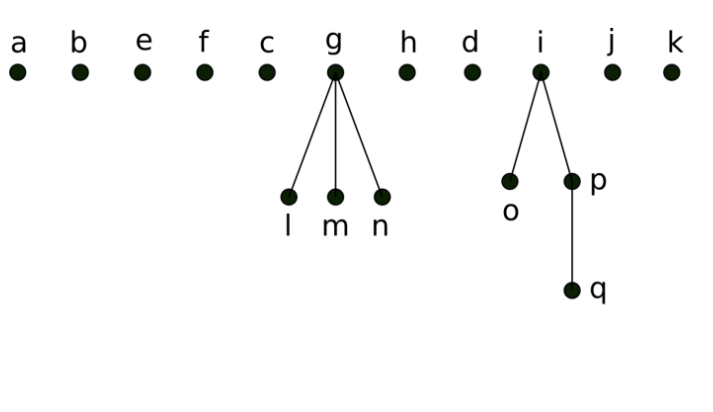

# 图论

边:E, 顶点: V, 面: F, 图: G,

## Graph - 图

- 定义: a graph G = (V, E) is defined by a nonempty set V of vertices(顶点) and a set E if edges(边), where each edge is associated with one or two vertices(called endpoints(端点) of the edge).

  - 无限图 - Infinite Graph: $|V|=\infty\ or\ |E|=\infty$

  - 有限图 - Finite Graph: $|V|<\infty\ and\ |E|<\infty$, $|V|$被成为图的阶数(order)(顶点个数)

- 循环图/多边图 - Loop& multiple-edge Graph: 循环图: 一个边的端点是同一个顶点, 即$1\rightarrow1$; 多边图: 两个顶点之间有多条直接连接的边
- 简单图 - Simple Graph: 既不循环也没有多边的图
- 加权图 - Weighted Graph: 每条边上有正整数作为权重的图

- 有向图 - directed graph
- 子图 - subgraph

### Types of Graphs - 图的分类

- 定义: 令G=(V,E) 是一个图, 顶点集为 $V=\{v_1,v_2,\cdots\}$
  - 边有方向?
    - 有: 有向图 - directed graph
    - 无: 无向图 - undirected graph
  - 多重边?
    - 有: 多重图 - multigraph
    - 无: 简单图 - simple graph
  - 循环?
    - 有: 伪图 - pseudograph

​

| Type                 | Edge      | Multiple-edge allowed | Loops allowed |
| -------------------- | --------- | --------------------- | ------------- |
| 简单图               | 无向      | no                    | no            |
| 多重图               | 无向      | yes                   | no            |
| 伪图                 | 无向      | yes                   | yes           |
| 简单有向图           | 有向      | no                    | no            |
| 多重有向图           | 有向      | yes                   | yes           |
| 混合图 - Mixed Graph | 有向+无向 | yes                   | yes           |

    
    
    

    
    
    

### Special Simple Graph - 特殊的简单图

1. 完全图 - Complete Graph: $K_n: V=\{v_1, v_2,\cdots,v_n\};E=\{(v_i,v_j),1\leq i\ne j\leq n\}$

2. 环图 - Circle Graph: $C_n: V=\{v_1,v_2,\cdots,v_n\}; E=\{(v_1,v_2),\cdots.(v_n,v_1)\}$

3. 轮图 - Wheel: $W_n: V=\{v_0,v_1,\cdots,v_n\}; E=\{(v_1,v_2),\cdots,(v_n,v_1)\}\cup\{(v_0,v_1),\cdots,(v_0,v_n)\}$

4. 方体 n-Cubes: $Q_n: V\{0,1\}^n; E=\{(u,v):d_{(u,v)}=1\}, d_{(u,v)}=|\{i\in[n],u_i\ne v_i\}|$

### 图的表示

#### Adjacency List - 邻接表

- 定义: 令G=(V,E)是一个没有多边的图, G的邻接表是顶点的列表, 列出所有的相邻顶点
  - 相邻 - adjacent: 如果$v_i,v_j$之间有一条边, 那么他们就是相邻的

#### Adjacency Matrix - 邻接矩阵

- 定义: G是一个简单图, 则邻接矩阵是一个$n\times n$的矩阵, $a_{ij}=\left\{\begin{array}{cc}1&(v_i,v_j)\in E\\0&(v_i,v_j)\not\in E\end{array}\right.$

#### Incidence Matrix

## Degree - 度

- 定义: 令 G=(V,E) 是一个无向图, 如果两个顶点之间$(u,v)\in E$, 那么认为u,v是相邻的(adjacent)
  - 邻域 - neighborhood: $N(v) = \{u\in V:(u,v)\in E\};N(A) = \bigcup_{v\in A}N(v)$ for $A\subseteq V$
  - 度 - degree: $\deg(v)$是与这一点相关联的边的数量
    - 如果$\deg(v)=0$, 那么称点$v$是孤立的(isolated), 如果$\deg(v)=1$, 那么称$v$为悬挂的(pendant)
- 有向图中:
  - (u,v): u是起始点(initial vertex), v是终点(e terminal vertex)
  - 入度 - in-degree
  - 出度 - out-degree

### 握手定理 - Handshaking Theorem

- 定义: 令G=(V, E)是一个无向图, $2|E|=\sum_{v\in V}\deg(v)$, and $|\{v\in V:\deg(v)\ is\ odd\}|$ is even

- 定义: 令G=(V, E)是一个有向图, 则$\sum_{v\in V}\deg^-(v)=\sum_{v\in V}\deg^+(v)=|E|$

## 子图 - Subgraph

- 定义: 令G=(V, E)是一个简单图, H=(W, F), 如果$W\subseteq V,F\subseteq E$, 那么称H为G的子图
  - 真子图 - proper subgraph: H是G的子图且$H\neq G$
  - 导出子图 - subgraph include:
    - $W\subseteq V,F=\{e:e\in E,e\subset W\}$ Notion: $G[W]$
      - 顶点是先去出来(可能会少), 然后把原图G里面这些点相连的边取出来, 连接成H
    - $F\subseteq E,W=\{v:v\in V,v\in e\ for\ some\ e\in F\}$ Notion: $G[F]$
      - 先取出想要的边, 然后把用到的顶点取出来

### 减边 - Removing An Edge

- 定义: 令图G=(V, E)是一个简单图, 且边$e\in E$, 则$G-e=(V,E-\{e\})$

### 加边 - Adding An Edge

- 定义: 简单图G=(V, E), $e\not\in E$, 则$G+e=(V,E\cup{e})$

### 缩边 - Edge Contraction

- 定义: 简单图G=(V, E), $e=\{u,v\},G/e=(V', E')$, $V'=(V-\{u,v\})\cup\{w\}$, $E'=\{e'\in E:e'\cap e=\emptyset\}\cup\{\{w,x\}:\{u,x\}\in E\ or\ \{v,x\}\in E\}$

就是把两点之间的边缩成了一个点, 两个点上的所有相连边都合在了所完之后的点上

### 减点 - Removing Vertex

- 定义: $G-v=(V-{v}, E'),E'$是剪完顶点之后还能存在的边

### 补图 - Complement

- 定义: 简单图G=(V, E), 阶数是n, 定义补图为G'=(V, E'), $E'=\{\{u,v\}:u,v\in V,u\neq v,\{u,v\}\not\in E\}$

## 图的同构 - Graph Isomorphism

- 定义: 如果有双射$\sigma: V_1\rightarrow V_2$, 有$\{u,v\}\in E_1\Leftrightarrow \{\sigma(u),\sigma(v)\}\in E_2$, 则称图$G_1=(V_1,E_1),G_2=(V_2,E_2)$是同构的
  - $\sigma$被称为同构映射(isomorphism)

### 图的常项 - Graph Invariants

- 定义: 同构的图中不会改变的属性

如:

- 顶点个数
- 边的个数
- 某个度的顶点个个数
- 后面还有[路径](#路径和同构 - Path and Isonorphism)

## 二分图 - Bipartite Graph

- 定义: 如果$V$有一个划分$\{V_1,V_2\}$, 满足$E\subseteq\{\{u,v\}:u\in V_1,v\in V_2\}$, 则称图G=(V, E)是一个二分图

就是把上面分成一个集合,下面分成一个集合, 只有上面与下面相连(两个集合之间相连), 但集合与集合之间不相连

### 完全二分图 - Complete Bipartite Graph

- 定义: $K_{m,n}=(V,E),V=\{x_1,x_2,\cdots,x_m\}\cup\{y_1,y_2,\cdots,y_n\},E=\{\{x_i,y_j\}:i\in[m],j\in[n]\}$

### 判断是否是二分图

- 首先是简单图
- 将一个顶点染上一种颜色(eg. 红色)
- 与这个顶点相连的点都染上另一种颜色(eg. 蓝色)
- 然后再把与蓝色相连的点染上红色, 如此重复, 直到所有顶点都染上色
- 如果有一个点既是蓝色又是红色, 那么不是二分图
- 如果一条边有相同颜色的顶点相连接, 那么就不是二分图, 否则是二分图

数学版本:

- 如果有映射$f:V\rightarrow\{1,2\},f:v\mapsto\left\{\begin{array}{cc}1&v\in V_1\\2&v\in V_2\end{array}\right.$, 满足$\{x,y\}\in E\Rightarrow f(x)\neq f(y)$

### 匹配 - Matching

- 定义: 边的子集, 使得边之间不相交(没有共享的节点).
  - 最大匹配 - maximum matching: 一个有最大数量边的匹配
  - 完全匹配 - complete matching: $V_1$到$V_2$中$V_1$的每一个点都被匹配到.

### Hall's Theorem

- 定义: 一个二分图$G=(X\cup Y,E)$当且仅当$|N(A)|\geq|A|$对任意的$A\subseteq X$时, 有一个完全匹配

## 路径 - Path

- 定义: 令图$G=(V,E)$是一个无向图, 令$k\in\mathbb N$. 从图$G$中的一点$u$到一点$v$的长度为$k$的路径为一个$k$边的序列$\{e_1,e_2,\cdots,e_k\}$, 经过顶点$x_0=u,\ \ x_1,\ \ x_2,\ \ x_3,\ \ \cdots,\ \ x_{k-1},\ \ x_k=v$, 其中$e_i=(x_{i-1},x_i),\forall i\in[k]$
  - 如果$u=v$且$k>0$, 那么成这个路径为回路(circuit)
  - 这个路径经过(pass through)顶点$x_0,x_1,x_2,\cdots,x_k$
  - 这个路径遍历(traverse)边$e_1,e_2,\cdots,e_k$
  - 这个路径是简单的(simple)当路径不包含重复的边
  - 如果路径是简单的, 那么可以被写成$x_0,x_1,\cdots,x_k$的形式

- 有向图也是一样的定义, 但是注意, 有向图的边的顺序是固定的, 有前面的顶点指向后面的顶点.

## 连通 - connectivity

- 定义: 对于任意一对顶点, 如果有一条路径连接这两个点, 那么这个图是连通的
- 定理: 令图$G$是一个连通的无向图, 那么任意一对顶点之间是有一条简单路径的.

### 连通分支 - connected component

- 定义: 一个连通分支图中的连通子图, 而且必须是一个非真子图, 或者说, 是一个最大连通子图,

- 切点 - cut vertex: 去掉这个点会有更多的连通分支产生
- 切边 - cut edge: 去掉这个边会有更多的连通分量产生

### 点连通度 - Vertex Connectivity

- 不可分的 - nonseparable: 如果一个图没有切点, 那么就是不可分的
- 点割集 - vertex cut: $V'\subseteq V$, 且满足$G-V'$是不连通的, 那么$V'$是一个点割集
- 点连通度 - vertex Connectivity: $\kappa(G)$: 使图$G$不连通需要移除的最少节点数
  - 如果$G$不连通, 那么$\kappa(G)=0$
  - 如果$G$是一个完全图$K_n$, 那么$\kappa(G)=n-1$
  - 否则, $\kappa(G)$是点割集中的元素的数量

- 定理: 如果$G=(V,E)$是一个简单图, 阶为n, 那么

  - $0\leq\kappa(G)\leq n-1$
  - $\kappa(G)=0$ iff $G$ 是不连通的或者$G=K_1$
  - $\kappa(G)=n-1$ iff $G=K_n$

- k-连通 - k-connectivity: $\kappa(G)\geq k$
  - $G$是1-连通的 当且仅当 $G$是连通的且$G\neq K_1$
  - $G$是2-连通的 当且仅当 $G$是不可分割的且阶数大于等于3
  - $G$是$k$连通的 当且仅当 $G$是$j$连通的对于$\forall j\in\{0,1,\cdots,k\}$

### 边连通度 - edge connectivity

- 边割集 - edge cut: 使得简单连通图$G$变成不连通的需要删掉的边
- 边连通度 - edge connectivity: $\lambda(G)$: 如果$G$是不连通的, $\lambda(G)=0$. 如果$|V|=1$, 那么$\lambda(G)=0$. 如果$|V|\geq1$, 那么$\lambda(G)$是最小边割集中的元素的个数

### 连通度 - connectivity

- 定理: 简单图$G$, $\kappa(G)\leq\lambda(G)\leq\delta(G)$, $\delta(G)=\min_{v\in V}\deg(v)$

### 有向连通图 - connected directed graph

- 强连通-定义: 如果图$G=(V,E)$是一个有向图, 如果对于任意$u,v\in V$, 有从$u\rightarrow v$和从$v\rightarrow u$的路径, 那么就是强连通的.
- 弱连通-定义: 如果去掉边的方向后图是连通的

## 路径和同构 - Path and Isonorphism

- 定理: 如果有一个简单回路,长度为$k$, 如果$k>3$, 那么这个回路也是简单图的常项

- 其他的图的常项: [常项](#图的同构 - Graph Isomorphism)

### 路的计数 - Counting Paths Between Vertices

- 定义: $G$是一个图, 邻接矩阵是$A$, 判断$(i,j),i,j\in V$之间有多少长度是$r$的路径, 只需要看$A^r$中$(i,j)$点的值是多少即可

## 欧拉七桥问题

- 定义: 令图$G=(V,E)$, 边只遍历一次

  - 欧拉路径 - Euler Path: 简单路径遍历所有顶点
  - 欧拉环路 - Euler Circuit: 简单环路遍历所有的顶点

- 定义: 令图$G=(V,E)$是一个阶数为2的连通多重图, 当且仅当$2\mid\deg(v),\forall v\in V$时图$G$有欧拉回路

- 无向图:
  - 如果所有的点的度都是偶数, 那么存在欧拉回路
  - 如果奇数度的点只有2个, 那么存在欧拉通路(路径)
- 有向图:
  - 所有点的入度等于出度, 那么存在欧拉回路
  - 可以允许有且仅有两个点的入度不等于出度, 或者所有点入度出度都相等, 那么有欧拉通路
- 欧拉图: 有欧拉回路
- 半欧拉图: 有欧拉通路

### Hierholzer算法

1. 在一个欧拉图中, 以任意一个顶点为起点, 遍历与之相邻的顶点
2. 深搜, 访问相邻的节点, 将经过的边删除
3. 如果当前顶点没有相邻边, 那么把这个点入栈
4. 倒序输出栈中的顶点, 即为一个欧拉回路

### 哈密顿路径 - Hamilton Path

- 定义: 只遍历一次顶点的路径

- 哈密顿环:只遍历一次顶点的环路

- 但是判断是否有哈密顿环还是一个NP-Complete问题

- 必要条件: 有一个度为1的顶点那么不能有哈密顿环; 有一个度为2的顶点那么哈密顿环遍历所有的边

- 充分条件:

  令$G=(V,E)$是一个简单图,阶数$n\geq3$,

  - Ore's定理: 如果$\deg(u)+\deg(v)\geq n,\forall \{u,v\}\not\in E$, 那么G有哈密顿环
  - Dirac's定理: 如果$\deg(u)\geq\frac n2,\forall u\in V$, 则G有哈密顿环

## 最短路问题 - Shortest Path Problem

每个边都有权重, 找到两点之间权重之和最小的一条路径

问题: 找到ad之间最短路径

方法: 找到距离a最近的顶点, 再找第二近的, ..., 直到找到d $\Rightarrow$ Dijkstra's Algorithm

### Dijkstra算法

1. 找a到任意相连的路径的最短路:

   {a,b}=4,{a,f}=2: 最近的点是f

2. 现在已经有点集{a,f}, 和剩余的点集{b,c,d,e}, 然后通过边来找到距离a第二近的点.

   从a出发: {a,b}=4; 从f出发: {a,f,e}=5

   所以第二近的点是b

3. 现在已有点集{a,f,b}, 剩余点集{c,d,e}, 更新第三近的点

   a出发: 全部遍历过; b出发: {a,b,c}=7,{a,b,e}=7; f出发: {a,f,e}=5

   第三近的点是e

4. 已有点击{a,f,b,e}, 剩余点集{c,d},更新第四近的点

   a,f出发: 全部遍历过; b出发: {a,b,c}=7,{a,b,e}=7; e出发: {a,f,e,d}=6(找到d)

5. a到d的最短路是6

$O((N+M)\log(N))$

贪心, 局部最优解去更新下一步的最优, eg. 在e点的dis是用f.dis更新而不是b.dis更新, 因为b.dis>f.dis.

<h3>旅行者问题 - Travel Salesperson Problem</h3>

从一个城市出发, 经过所有城市一次, 并回到自己的城市, 问, 怎么用最短路径

- 完全图中哈密顿环的最短路径

完全遍历(没有简化算法)

## 平面图 - Planer Graph

- 定义: 没有交叉边的图是平面图

- e.g.
  - $K_1,K_2,K_3,K_4$
  - $K_{1,n},K_{2,n}$
  - $C_n, W_n,\ n\geq3$
  - $Q_1,Q_2,Q_3$

### 非平面图 - Nonplaner Graph

- Jordan曲线定理: 如果有一个闭合曲线, 那么这个闭合曲线必然会把所处的平面分成两个区域. 任何连接这两个区域的曲线都会与原来的曲线交叉.

- e.g. $K_{3,3}$不是平面图
  - 

## 欧拉公式 - Euler's Formula

### 区域 - Region

一个闭合曲线将空间分成几个区域.

- 度:
  - 这个区域由多少遍围成的.
  - 如果有一条孤立的边, 那么这条边对度数的贡献为2
- 外部面: 无穷的空间(曲线围成的区域外部)
- 内部面: 有限的区域空间(曲线围成的区域)

### 欧拉公式

$V+F=E+2$

#### 应用

- 定理: 令图$G$是一个连接平面上的简单图, 如果每个面$R_i$都有$\deg(R_i)\geq l$, 那么$|E(G)|\leq\frac l{l-2}(|V|-2)$
- 推论: 令图$G$是一个连接平面上的简单图, 那么一定有$|E(G)|\leq3|V|-6$
- e.g. $K_5$不是平面图
  - $|E(K_5)|=C_5^2=10,|V(K_5)|=5\therefore|E(K_5)|\geq3|V(K_5)|-6\therefore$不是平面图

## 同胚 - Homeomorphic

- 定义: 在同一个初始图上初等细分之后得到的图是同胚的.
- 初等细分 - elementary subdivision: 在一条边上加上一个顶点.

### Kuratowski定理

- 定义: 一个非平面图一定是与$K_{3,3}$或者$K_5$同胚

## 对偶图 - Dual Graph

在每一个区域连一个点, 然后在每一个公共边处连一条线(连接区域对应的点), 得到的图

### 五色定理 - 5-coloring Theorem

- 定理: 最多用五种颜色可以把一个平面图的所有区域染上色.

### 四色定理

略

## 树 - Tree

- 定义: 连接无向无环图
- 森林: 多棵树组成的图

性质:

- 定理: 每两个顶点之间有且仅有一条简单的路径.(如果有多条路径, 那么一定有环, 与树的定义冲突)
- 边: n-顶点的图有$n-1$条边. (数学归纳法: 假设$k$顶点有$k-1$边, $k+1$顶点多了一个顶点, 用一条边链接, 那么边是$k$, 得证)
- 树是连接的

上述三点知二推一, 或者说知道两点就能判断是一颗树.

子节点不超过m的树被称作m叉树(m-ary)

### 平衡树 - Balance Tree

- 定义: 一颗$m$叉树所有的叶节点都是在$h$层或者$h-1$层的时候被称为平衡树

- 定理: $h$层的$m$叉树最多有$m^h$个叶节点
- 推论: $m$叉树有$h$层$l$个叶节点, 那么$h\geq\lceil\log_ml\rceil$. 如果是全满且平衡的m叉树, 那么$h=\lceil\log_ml\rceil$

> 叶节点只是一个分支的最底层的节点(就是最子的节点)

### 树的遍历 - Tree Traversal

把节点全走一边

#### 遍历

1. 先序遍历 - Preorder

   

2. 中序遍历 - Inorder

   从左边最深的节点(叶节点)开始, 遍历到上一层, 查找该层是否有其他子节点, 如果有, 再从左往右找叶节点开始遍历, 如果全遍历完, 去找父节点, 重复上述过程.

   $e\rightarrow b\rightarrow f\rightarrow a\rightarrow l\rightarrow g\rightarrow m\rightarrow n\rightarrow c\rightarrow h\rightarrow o\rightarrow i\rightarrow q\rightarrow p\rightarrow d\rightarrow j\rightarrow k$

3. 后序遍历 - Postorder

   从左往右, 从下往上

   $e\rightarrow f\rightarrow b\rightarrow l\rightarrow m\rightarrow n\rightarrow g\rightarrow h\rightarrow c\rightarrow o\rightarrow q\rightarrow p\rightarrow i\rightarrow j\rightarrow k\rightarrow d\rightarrow a$

#### 深度优先搜索 - DFS Depth First Search

一般用递归

#### 广度优先搜索 - BFS Breadth First Search

一般用栈

### 生成树 - Spanning Tree

- 定义: 一个简单图中的子图, 且这个子图是一颗包含这个简单图所有节点的树.

- 定理: 如果一个简单图连接$\Leftrightarrow$有生成树(当且仅当, 互推)

#### 最小生成树 - Minimum Spanning Tree(MST)

- 定义:
  - 是一棵树
  - 遍历所有顶点
  - 在所有生成树中, 边的权重之和最小
  - 不一定是唯一的

##### Prim算法

