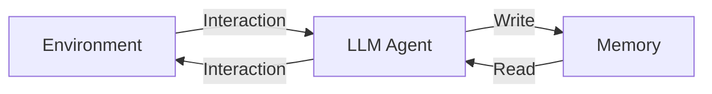
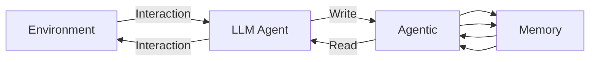

---
tags:
  - algorithm
  - paper
  - LLM
  - DL
aliases:
  - "A-MEM: Agentic Memory for LLM agent"
publish: arxiv preprint
---
# A-MEM

> [!paper]-
> ![[2502.12110v3_A-MEM.pdf]]
## Introduce

原始的:

新的:

## Methodology

![[Pasted image 20250408000544.png]]

基于卡片盒笔记法, atomic note-taking, flexible organization

agent和environment交互时, 记录: $m_i=\{c_i,t_i,K_i,G_i,X_i,e_i,L_i\}$, 其中$c_i$表示原始交互内容, $t_i$是时间戳, $K_i$是LLM捕获的关键词, $G_i$是LLM生成标签, $X_i$是的上下文描述, $L_i$是维护共享语义的链接记忆集.

使用Sentence-BERT进行编码: $e_i=f_{\text{enc}}[\text{concat}(c_i,K_i,G_i,X_i)]$

### Link Generation

定义余弦相似度: $s_{i,j}=\frac{e_i\cdot e_j}{|e_i||e_j|}$

定义相似记忆: $\mathcal M_{\text{near}}^n=\{m_j|\text{rank}(s_{i,j})\leq k,m_j\in\mathcal M\}$

使用prompt, 让LLM分析潜在的联系: $L_i=\text{LLM}(m_n\|\mathcal M_{\text{near}}^n\|P_{s_2})$

### Memory Evolution

使用Link Generation更新memory: $m_j^*\leftarrow\text{LLM}(m_n\|\mathcal M_{\text{near}}^n\backslash m_j\|m_j\|P_{s_3})$

### Retrieve Relative Memory

每次交互, 执行context-aware的memory retrieval, 提供history给agent. 给定当前输入的query $q$, 获取$e_q=f_{\text{enc}}[q]$

使用余弦相似度查询$k$个相关的记忆, 构建一个context: $\mathcal M_{retrieved}=\{m_j|\text{rank}(s_{i,j})\leq k,m_i\in\mathcal M\}$
