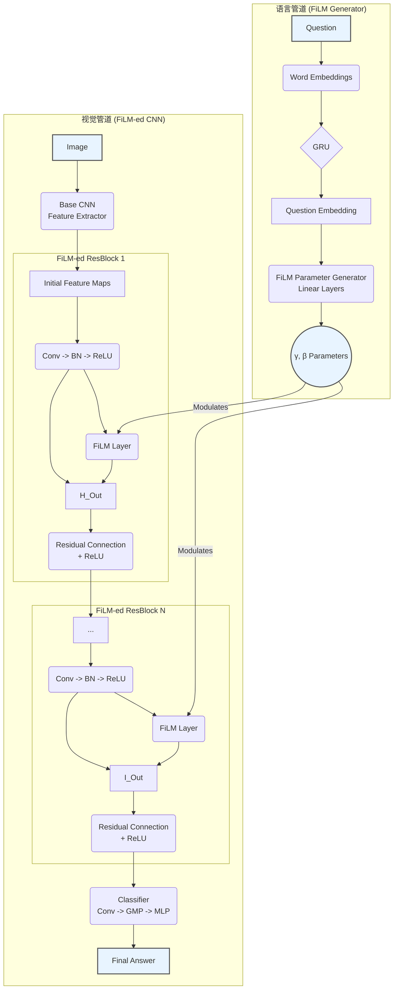

---
tags:
  - paper
  - Vision
  - LLM
  - algorithm
  - DL
aliases:
  - "FiLM: Visual Reasoning with a General Conditioning Layer"
publish: AAAI 2018
---
# FiLM

> [!paper]-
> ![[1709.07871v2_FiLM.pdf]]

FiLM: **F**eaeture-w**i**se **L**inear **M**odulation

通过使用一个基于外部信息的特征级仿射变换, 动态影响一个神经网络(如, CNN等)的计算结果

将语言信息动态影响图片特征

## Methods

1. **语言管道 (Linguistic Pipeline) / FiLM 生成器**:
    - **输入**: 一个文本问题 (e.g., "那个蓝色大球体是什么材质的?")。
    - **处理**:
        - 问题中的单词首先被转换为词嵌入 (Word Embeddings)。
        - 词嵌入序列被送入一个门控循环单元网络 **GRU (Gated Recurrent Unit)**。
        - GRU 最终的隐藏状态被视为整个问题的**问题嵌入 (question embedding)**。
        - 这个“问题嵌入”通过一个简单的线性层（仿射变换），为视觉管道中的**每一个** FiLM-ed ResBlock 生成一组对应的调制参数 $\gamma$ 和 $\beta$。
2. **视觉管道 (Visual Pipeline) / 被 FiLM 调节的网络**:
    - **输入**: 一张图像。
    - **处理**:
        - **特征提取**: 图像首先通过一个基础的 **CNN** (论文中使用了从头训练的 CNN 或预训练的 ResNet) 来提取初始的图像特征图 (feature maps)。
        - **FiLM-ed 残差块 (FiLM-ed ResBlocks)**: 提取出的特征图会经过一系列（论文中为4个）特殊的残差块。在每个残差块内部：
            - 特征图 $F$ 会经过一个 FiLM 层的处理。
            - FiLM 层接收来自 FiLM 生成器的 $\gamma$ 和 $\beta$ 参数，并对特征图 $F$ 的每个通道 c 执行仿射变换：$$FiLM(F_c) = \gamma_c \times F_c + \beta_c$$。
            - 这个操作可以理解为：根据问题，有选择性地**缩放 (scale)** 和 **平移 (shift)** CNN 中的特征图，从而“打开”、“关闭”或“增强”某些特定的视觉特征。
        - **空间坐标信息**: 为了帮助模型进行空间推理，在送入每个 ResBlock 和最终分类器之前，特征图会与两个表示相对 x, y 坐标的特征图进行拼接。
    - **分类器 (Classifier)**:
        - 经过所有 FiLM-ed ResBlocks 处理后的最终特征图，会进入一个分类器。
        - 该分类器由一个 1x1 卷积、一个全局最大池化 (Global Max-Pooling) 和一个两层的 MLP 组成。
        - 最终通过 Softmax 输出所有可能答案的概率分布，得到最终答案。

