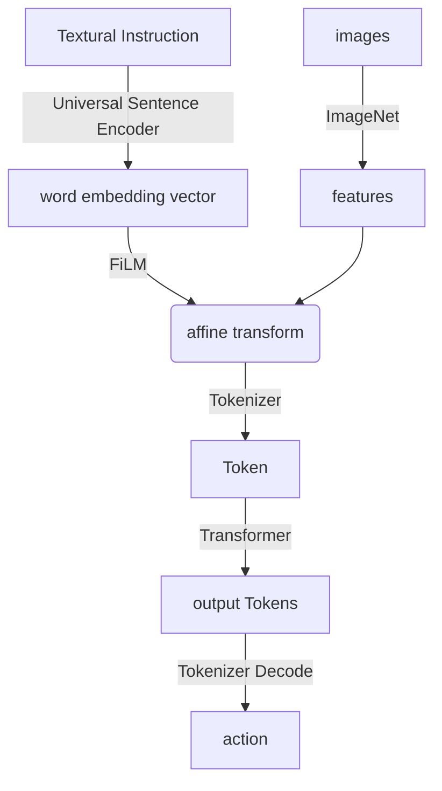

---
tags:
  - paper
  - EmbodiedAI
  - DL
  - RL
aliases:
  - "RT-1: Robotics Transformer for Real-world Control at Scale"
publish: RSS 2023
---
# RT-1

> [!paper]-
> ![[RT-1.pdf]]

希望能够找到一个泛化能力强, 能吸收大量知识的模型架构.

## Intro

创建了新的数据集

Transformer模型: 高容量

对高维的input/output进行tokenize, 生成token用于transformer计算

## Preliminaries

### Robot learning

类似于[[09-RL|RL]]目标是从视觉中学习解决language-conditioned任务的robot policies.

考虑顺序决策环境(sequential decision-making environment):
- timestamp $t=0$: policy $\pi$ receive language instruction $i$ and initial image observation $x_0$.
	- policy generate a action distribution: $\pi(\cdot|i,x_0)$ from which the action $a_0$ is sampled, and applied to robot.
- 过程持续进行, policy通过从 学习到的distribution: $\pi(\cdot|i,\{x_j\}_{j=0}^t)$中 采样action $a_t$, 应用于robot
- 到达终止条件时, 交互结束.

从starting step $t=0$开始到终止条件$T$的完整交互$i,\{x_j\}_{j=0}^T$称为一个episode. 结束时, 给一个reward $r\in\{0,1\}$表示是否完成了$i$.

target是 学一个$\pi$能够maximize average reward, in expectation over distribution of instruction,starting step $x_0$ and transition dynamic

### Transformer

[[Transformer]]
### Imitation Learning

假设有一个可访问的dataset $\mathcal D=\{(i^{(n)},\{x_t^{(n)},a_t^{(n)}\}_{t=0}^{T^{(n)}})\}_{n=0}^N$, 其中所有的episode都是success的($r=1$). 

> [!info]
> Behavioral Cloning
> 
> 或者称作模仿学习(IL, Imitation Learning)
>
> 假设已经有了一个expert的动作$a^\text{expert}$, 我们需要通过最小化预测的动作和$a^\text{expert}$差异来进行学习
> 
> 事实上, 这还是一个reinforcement learning, 只是结合了一下deep learning
> 
> $$\hat a=\pi_\theta(s)$$
> $$\mathcal L=\frac1N\sum_{i=1}^N\|\hat a_i-a_i^\text{expert}\|_2^2$$

我们可以使用Behavioral Cloning来学习$\pi$, 通过minimize给定$i$和图像的$a_t$的negative log-likelihood进行对$\pi$的优化

## System Overview

使用了Everyday Robots的机械臂. 具有7 degree-of-freedom的机械臂,一个两指夹爪和一个移动底座.

Robot Transformer 1(RT-1), 将一系列的short sequence of images和自然语言instruction作为输入, 在每个time step输出robot action.

[[FiLM|关于FiLM, 请参考这篇文章]]

action包含
- 7个维度的机械臂运动$(x,y,z,\text{roll},\text{pitch},\text{yaw},\text{opening of the gripper})$
- 三个底座运动的自由度($x,y,\text{yaw}$)
- 一个discrete的维度用于控制模式切换: 控制机械臂, 控制底座, 终止片段.
RT-1执行闭环控制, 3 Hz的频率执行动作

## RT-1

基于[[Transformer]]架构

**Text and image tokenization**

使用Universal Sentence Encoder将instruction转成embedding vector, 使用FiLM获取$\gamma,\beta$, 用于对image feature map进行约束.

6张$300\times300$的image经过EfficientNet-B3, 在每一层convolution(MBConv)之后使用FiLM得到的参数$\gamma,\beta$进行affine变换. 最终将images flatten成81个visual token.

> [!tip]
> 通常, 直接使用$\gamma,\beta$进行仿射变换会破坏pretrained model weight. 因此最开始将FiLM的仿射变换的dense layer($f_c,h_C$)的weight初始化成0(即恒等变换), 以保留原始的pretrained weight. 同时, 保持这个setting从头训练EfficientNet也能产生更好的结果, 但是还是pretrained最好.

为了进一步压缩token量来加速transformer推理速度, 使用[TokenLearner](https://openreview.net/forum?id=z-l1kpDXs88)将大量的tokens映射为更少的tokens. 因此可以将ImageNet得到的81 tokens采样为8 tokens, 然后给transformer

**transformer**

然后这8个tokens和history中的其他image的tokens连接, 形成48个tokens, 并添加[[Transformer#Positional Encoding|Position Encoding]], 然后给Transformer Block. Transformer是Decoder-only的, 有8-layer transformer block.

**action tokenization** ^298e80

将每个动作维度离散化成256个bin. 一共有11个维度. 对于每一个变量, we map the target to one of the 256 bins, where the bins are uniformly distributed within the bounds of each variable. ==Have Question Here==

**Loss function**

使用cross-entropy loss和causal mask

**inference speed**

给robot用的model需要 快速,一致 的inference speed. 期望3 Hz的控制频率, model的inference速度应小于100 ms.

加速: 使用TokenLearner, 使用cache记录之前的token