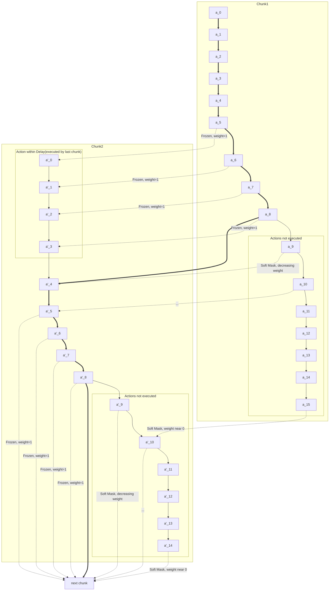

---
tags:
  - paper
  - EmbodiedAI
  - VLA
  - DL
aliases:
  - Real-Time Execution of Action Chunking Flow Policies
publish: arxiv preprint
---
# RTC

> [!paper]-
> ![[2506.07339v1_RTC.pdf]]

问题:
1. 由于两个action chunk是分开生成的, 那么在两个action chunk之间可能会有较大的突变
2. 在执行结束一个action chunk之后, 模型需要等待下一个action chunk生成结束(同步), 会导致卡顿
3. 对推理延时非常敏感(推理时间很大的时候, 可能会: "把咖啡倒在被子里" -> "把咖啡倒在腿上")

解决方案(具体方案在后面):
1. 将问题建模成为Inpaint问题
2. 异步执行
3. freeze一些action

## Preliminaries and Motivation

考虑一个action chunk policy: $\pi(A_t|o_t),A_t=[a_t,\cdots,a_{t+H}]$, 把$H$称作prediction horizon

在每一次预测一个action chunk的时候, 执行前$s$个action, 其中$s\leq H$, 我们称$s$为execution horizon. $s$一般比$H$小, 但仍然远大于$1$, 通常$s=\frac{H}{2}$.

使用[[FlowMatching]]训练的policy, 但是inference的时候也可以使用[[Diffusion]] policy.

---

现在假设$\Delta t$是控制器的采样周期, $\delta$为生成一个chunk的时间, 定义$d:=\frac{\delta}{\Delta t}$为推理延时(此处忽略从controller拿obversation的时间)

如果$d=0$, 那么可以在两个chunk之间无间断的执行inference. 但是现实无法做到: 网络延迟+VLA推理延迟

早期工作是使用暂停, 但会导致卡顿, 并引入training set和inference的distribution drift. 因此要求执行异步inference, 在inference的过程中仍然有action chunk可以执行.

那么假设提前从$j$开始切换action chunk. 由于未知$j$到$d$之间这$d-j$个action的结果, 可能会导致问题: 两个action非常不匹配(两个chunk可能是不连续的)

> [!example]
> ![[Pasted image 20250617024404.png]]
> 这张图表示: 假设第一个chunk是$a_0$到$a_{10}$, 现在假定第二个推理是$a_3$开始的. 那么第二个chunk $a_3$到$a'_{10}$之间就可能会和真实执行的$a_3$到$a_{10}$有区别. 在切换chunk的时候, $a_{10}$和$a_{11}'$的差距可能会非常大.
## Real-Time Chunking via Inpainting

将这个问题视作"image inpaint"问题, 在给定前面的action的基础上继续生成下一个action chunk
### Inference-Time Inpainting with Flow Matching

inpaint是[[Diffusion]]和[[FlowMatching]]框架的优势.

参考[[piGDM.pdf|PiGDM]]和[[2310.04432v2_TrainFreeInpaint.pdf|Train free inpaint 算法]]的去噪步骤:
$$\mathbf v_{\Pi\text{GDM}}(A_t^\tau,o_t,\tau)=\mathbf v(a_t^\tau,o_t,\tau)+\min\left(\beta,\frac{1-\tau}{\tau\cdot r^2_\tau}\right)\left(\mathbf Y-\widehat {\mathbf {A}_t^1}\right)^\top\text{diag}(\mathbf W)\frac{\partial\widehat{\mathbf A_t^1}}{\partial\mathbf A_t^\tau}$$
其中:
- $\mathbf v$: 学习到的速度场
- 目标值$\mathbf Y$. 在inpaint问题中, 这里的$\mathbf Y$是masked image, 期望得到的结果是完整的图像
- $\widehat{\mathbf A_t^1}=\mathbf A_t^\tau+(1-\tau)\mathbf v(\mathbf A_t^\tau,o_t,\tau)$是flow matching的denoise过程, $\widehat{\mathbf A_t^1}$是最终去噪结束后的原始chunk
- $r_\tau^2=\frac{(1-\tau)^2}{\tau^1-(1-\tau)^2}$
- $\mathbf W$是mask
- $\beta$是guidance weight clipping超参数, 目的是在small number of denoising的时候会unstable

在action生成的过程中, 可以将$\mathbf Y,\mathbf A_t,\mathbf W$看成维度为$HM$-dim的向量, 其中$H$是prediction horizon, $M$是action dimension. 那么这个guidance term可以看作是vector-Jacobian product, 可以使用backpropagation进行计算

在计算过程中, 
- 训练得到的原始的[[FlowMatching]]的vector field $\mathbf v$. 后面的项的目的是将生成的结果往$\mathbf Y$上面靠近.
- 因为延迟是$d$, 提前$d$个action进行下一个chunk的生成, 那么需要让下一个action chunk的前$d$个action尽可能和上一个chunk的action重合
- 因此让$\mathbf Y$的前$d$个action就是上一个chunk的后$d$个action, 其他的空缺补0 (Question here)
- 使用mask, 只关注重叠的action
	- Hard mask: 前$d$个action的权重为1, 其他的权重为0
	- Soft mask: 前$d$个action的权重为1, 然后$s$(execution horizon)个action的mask从1到0降低, 其他的为0
	- Soft mask的图片如下:
	  ![[Pasted image 20250617024805.png]]
- 计算vector-Jacobian product的时候, 可以使用backpropagation进行简化, 无需计算真正的Jacobian matrix:
	- $\widehat{\mathbf A_t^1}=\mathbf A_t^\tau+\mathbf v(\mathbf A_t^\tau,o_t,\tau)$
	- $\mathbf J=\left(\mathbf Y-\widehat {\mathbf {A}_t^1}\right)^\top\text{diag}(\mathbf W)$
	- 上述使用pytorch进行编写. 然后对$\mathbf J$进行求和, 得到`L_pseudo`, 调用grad得到结果: `guidance_term = torch.autograd.grad(L_pseudo, A_t^τ)[0]`
	- 这里的`guidance_term`就是$\left(\mathbf Y-\widehat {\mathbf {A}_t^1}\right)^\top\text{diag}(\mathbf W)\frac{\partial\widehat{\mathbf A_t^1}}{\partial\mathbf A_t^\tau}$

