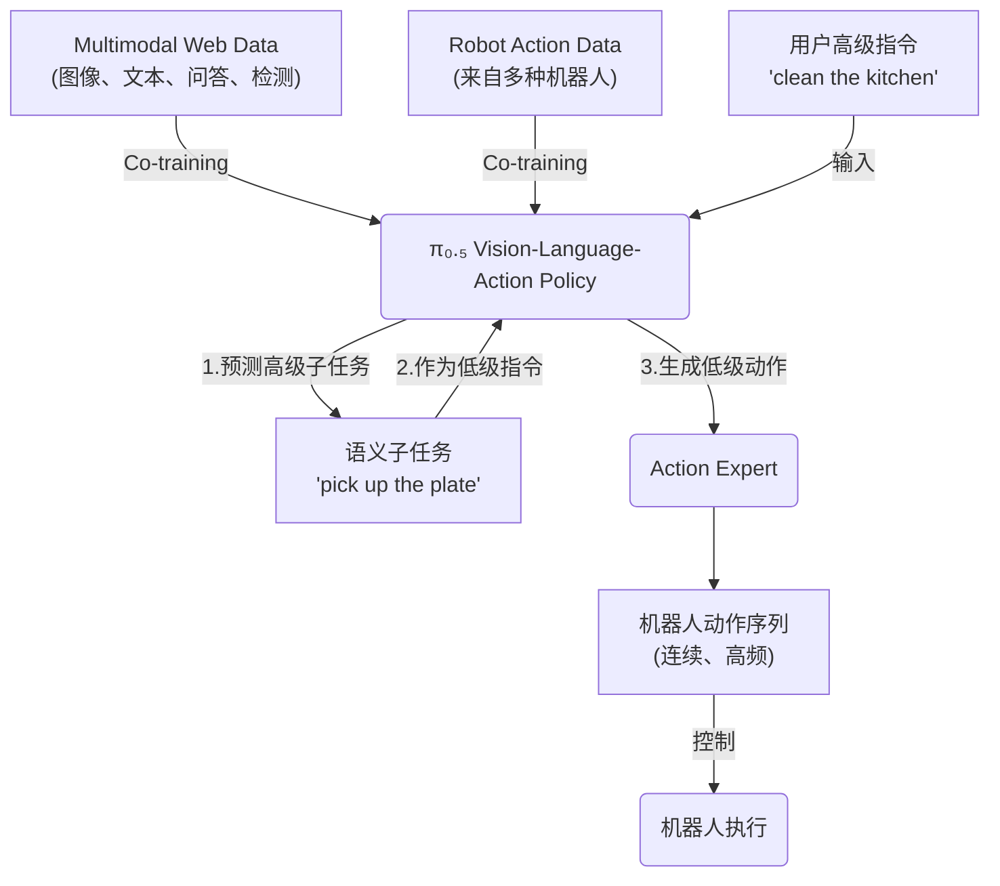

---
tags:
  - paper
  - DL
  - LLM
  - EmbodiedAI
  - VLA
aliases:
  - "pi0.5: a Vision-Language-Action Model with Open-World Generalization"
---
# $\pi_{0.5}$

> [!paper]-
> ![[2504.16054v1_pi0.5.pdf]]

设计训练recipe, 以提供breadth knowledge, 使robots在不同级别的抽象层次上泛化

![[Pasted image 20250613172029.png]]

training分成两步
1. 在不同的training tasks上进行训练, 输出high-level的指导
2. 在low-level action和high-level semantic actions上进行fine-tune

