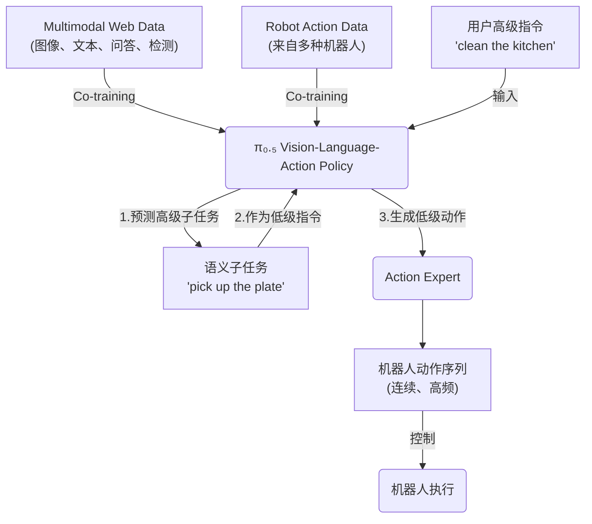

---
tags:
  - paper
  - DL
  - LLM
  - EmbodiedAI
  - VLA
aliases:
  - "pi0.5: a Vision-Language-Action Model with Open-World Generalization"
publish: arxiv preprint
---
# $\pi_{0.5}$

> [!paper]-
> ![[2504.16054v1_pi0.5.pdf]]

基于[[pi0]]的改进版

设计训练recipe, 以提供breadth knowledge, 使robots在不同级别的抽象层次上泛化

![[Pasted image 20250613172029.png]]

training分成两步
1. 将不同的数据(不同的robot的data, high-level semantic(subtask分解), 网络的数据等)混合, 训练VLA, 生成high-level的指导(subtask)
2. 在low-level action和high-level semantic actions上进行fine-tune(专门针对移动操作)

inference步骤:
1. 首先预测semantic subtask: 根据场景信息和任务结构推断下一步应该执行的行为
2. 根据subtask预测robot的low-level action

## Preliminaries

VLA的任务: $$\max\mathbb E_{(a_{t:t+H},o_t,l)\sim D}[\log(\pi_\theta(a_{t:t+H}|o_t,l))]$$
其中:
- $a_{t:t+H}$: action chunk或者action
- $o_t$: 观测state
- $l$: Language instruction

## The $\pi_{0.5}$ Model and Training Recipe

大体分为两步. 从一个web-data pretrained VLM开始:
1. pre-train: 调整VLM, 使其适应不同的任务
2. post-train: 将其专门应用于 移动操作 并 配备高效的test-time推理机制

在pre-train阶段, 所有的robot actions使用离散的token表示, 使之更简单, 可扩展 并 让训练更有效率

在post-train阶段, 给模型添加Action Expert(类似[[pi0]]), 使用更细粒度的表达, 实现更高效的实时计算控制.

在inference时, model首先提供high-level的subtask, 然后基于这个instruction使用action expert生成low-level actions.
### The $\pi_{0.5}$ architecture

policy: $\pi_\theta(a_{t:t+H},\hat l|o_t,l)=\pi_\theta(a_{t:t+H}|o_t,\hat l)\pi_\theta(\hat l|o_t,l)$, 其中
- [ ] $o_t=[I^1_t,\cdots,I_t^n,q_t]$: observation, 包含所有摄像机提供的image $I$ 和当前robot的状态$q$
- $l$: language instruction
- $\hat l$: subtask instruction(tokenized)

high-level的policy输出$\hat l$, low-level根据$\hat l$输出actions

这里的attention比较特殊, attention matrix这里, image patch, textual prompt, action tokens使用non-causal attention进行处理, 能够理解上下文
### Combining discrete & continuous action representations

和[[pi0]]相同, [[FlowMatching]]预测连续的action:
$$\mathbf a_{t:t+H}^{\tau,\omega}=\tau\mathbf a_{t:t+H}+(1-\tau)\omega,\omega\sim\mathcal N(0,\mathbf I)$$

使用discrete token对VLA的训练会增大训练效率(参考[[FAST]]). 但是在inference的时候, discrete的token会让auto-regressive prediction变慢. 因此一个理想的方案是: 使用discrete token进行训练, 使用continuous token进行inference

分成两个阶段, 用同一个loss函数, 使用超参数进行控制是否训练Flow Matching:
$$\mathcal L=\mathbb E_{D,\tau,\omega}[H(x_{1:M},f_\theta^l(o_t,l))+\alpha\|\omega-a_{t:t+H}-f_\theta^a(a^{\tau,\omega}_{t:t+H},o_t,l)\|^2]$$
其中:
- $f_\theta^l(o_t,l)$: VLM主干, 进行next token prediction
- $f^a_\theta(a,o,l)$: action expert, 在后期训练可以认为是flow matching
- $H(x_{1:M},f_\theta^l(o_t,l))$: cross entropy loss, 是正常LLM训练的loss(包含[[FAST]] encoded action tokens)
- $\alpha$: trade-off factor. 进行pre-train的时候, $\alpha=0$, 只训练VLM. post-train的时候, 打开action expert(flow matching)的loss权重

在post-train的时候仍然训练VLM的next-token prediction, 因为要保持原来输出token的能力

### Pre-Training

使用[[FAST]]将连续的动作转换成离散的token

**Diverse *M*obile *M*anipulator data**(MM):

移动操作数据, 400 hours, 在100个新环境中做家务

**Diverse *M*ulti-*E*nvironment non-mobile robot data**(ME):

在家中不可移动的单/双臂机器人数据

***C*ross-*E*mbodiment laboratory data**(CE):

在实验室中的任务, 包含叠衣服, 摆桌子等等, 在一个比较整洁的环境中

包含开源数据集[Open X-Embodiment](https://arxiv.com/abs/2310.08864)

***H*igh-*L*evel subtask prediction**(HL):

将"打扫卧室"等高层级指令分解成"整理床铺","调整毯子"等low-level subtask

手动标注

**Multi-modal *W*eb *D*ata**(WD):

图像描述和物体定位等数据集([Cambrain-7M](https://arxiv.org/abs/2406.16860), [PixMo](https://arxiv.com/abs/2409.17146), [VQAv2](https://arxiv.com/abs/1612.00837))

**dataset settings**

为了区分一般token和action token, 使用`<control_mode> joint/end effector <control_mode>`

类似[[FAST]], 需要将1st and 99th quantile到$[-1,1]$

### Post-Training

pre-train 280k gradient steps之后, 添加flow matching, 并为专门训练移动policy

令$\alpha=10.0$(在loss中), 保留文本输出能力(cross entropy loss保留), 附加80k的refine

post-training dataset:
- MM
- ME
- WD: 为了保持模型的视觉能力和文字能力
- Verbal Instruction: 新收集的数据集, 关于用户提供language demonstrations, 选择合适的sub-task commands指导机器人移动
### Robot system details
![[Pasted image 20250616172730.png]]
根据平台的不同, 总体DoF在18-19
