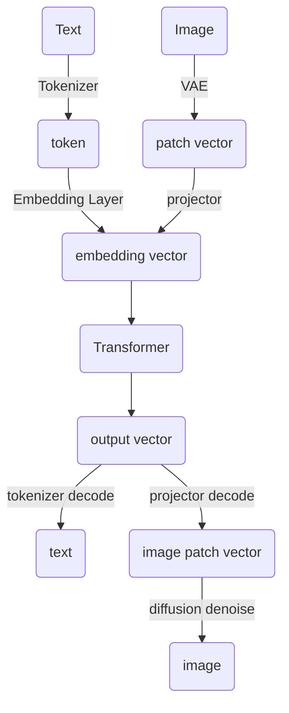
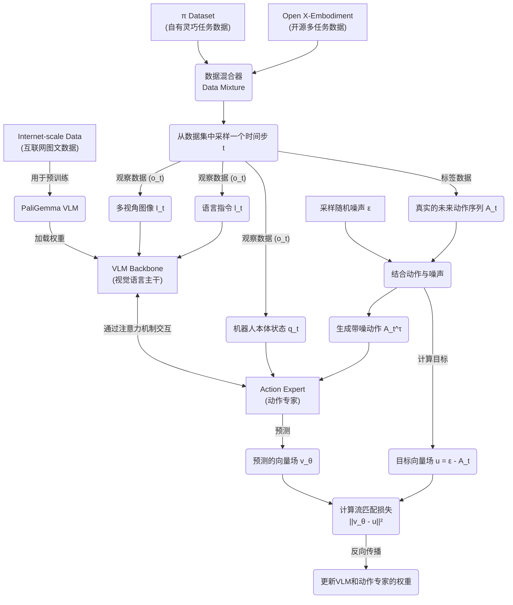
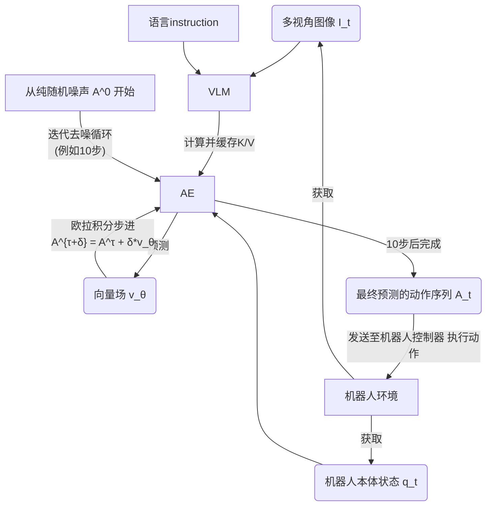

---
tags:
  - paper
  - LLM
  - EmbodiedAI
  - VLA
  - RL
  - DL
aliases:
  - "pi0: A Vision-Language-Action Flow Model for General Robot Control"
---
# $\pi_0$

> [!paper]-
> ![[pi0.pdf]]
## Introduce

在高度多样化的数据集上进行pretrain, 然后在根据需要的任务进行fine-tune(align), 能有更好的效果.

采用cross-embodiment training, 将来自多个不同机器人的数据合并到一个模型中

使用action chunking architecture with flow matching, 加速推理: 50 Hz

为了将flow matching和VLM结合, 提出了action expert

## Related Work

### [[FlowMatching]]

[[Diffusion]]的一个变种, 主要使用flow matching的loss而不是之前的cross-entropy

提供了高精度和多模态的建模能力

### Transfusion

[Github Project](https://github.com/lucidrains/transfusion-pytorch)

## Overview

Dataset: combine 自己的数据集和OXE数据集

pretrain stage: 训练一个base model在多种任务上有泛化能力

post-train stage: fine-tune base model使其适应特定的下游任务

## The $\pi0$ Model

$\pi0$模型主要由一个LLM backbone组成. 使用conditional flow matching对robot action的continuous distribution进行建模. 受到Transfusion的启发, 使用multiple objectives训练一个单独的transformer, 并使用flow matching对image的输出进行supervise. 使用独立的权重针对robot action可以提升performance. 因此有两个独立的flow matching weights, 第一个是image的, 第二个是robot action的(称作action expert)

希望model data distribution: $p(\mathbf A_t|\mathbf o_t)$, $\mathbf A_t=[\mathbf a_t, \mathbf a_{t+1},\cdots,\mathbf a_{t+H-1}]$是未来的action chunk, $\mathbf o_t=[\mathbf I_t^1,\cdots,\mathbf I_t^n,l_t,\mathbf q_t]$, 其中$\mathbf I_t^i$是$t$ time step的观测到的第$i$个image(每个robot都有2-3个image), $l_t$是sequence of language tokens, $\mathbf q_t$是机器人的关节角度向量.

对于$\mathbf A_t$中的每一个action $\mathbf a_t$, 都有一个对应的action token, 通过action expert进行处理. 使用flow matching的loss 进行处理:
$$L^\tau(\theta)=\mathbb E_{p(\mathbf A_t|\mathbf o_t),q(\mathbf A_t^\tau|\mathbf A_t)}\|\mathbf v_\theta(\mathbf A_t^\tau,\mathbf o_t)-\mathbf u(\mathbf A_t^\tau|\mathbf A_t)\|_2$$
其中, 下标表示time step, 上标表示flow matching step, $\tau\in[0,1]$.

flow matching的probability path为simple Gaussian(or optimal transport)的时候, 有strong empirical performance, probability path由$q(\mathbf A_t^\tau|\mathbf A_t)=\mathcal N(\tau\mathbf A_t,(1-\tau)\mathbf I)$给出.

在训练中, Network采样随机噪声$\epsilon\sim\mathcal N(\mathbf0,\mathbf I)$, 然后$\mathbf A_t^\tau=\mathbf A_t+(1-\tau)\epsilon$进行加噪, 通过训练network $\mathbf v_\theta(\mathbf A_t^\tau,\mathbf o_t)$以匹配去噪向量场$\mathbf u(\mathbf A_t^\tau|\mathbf A_t)=\epsilon-\mathbf A_t$

在inference的时候, 从$\tau=0$到$\tau=1$积分学到的向量场来生成action. 从随机噪声$\mathbf A_t^0\sim\mathcal N(\mathbf 0,\mathbf I)$开始, 使用Euler integration rule:
$$\mathbf A_t^{\tau+\delta}=\mathbf A_t^\tau+\delta\mathbf v_\theta(\mathbf A_t^\tau,\mathbf o_t)$$
其中$\delta$是integration step size. 这里使用$\delta=0.1$, 10 integrate step.

使用PaliGemma作为LLM backbone

## Train recipe

配置action space dimension始终为max: 18, 2个6 DoF的arms, 2个gripper, 一个自由移动的底座, 一个垂直移动的躯干. 对于low-dimension的robot, 使用0-padding. 对于摄像头少的robot, 会屏蔽对应的图片槽位.

使用fine-tune和prompt将复杂的动作分解成简单的任务, 然后根据简单的任务生成actions.

## Inference Recipe

