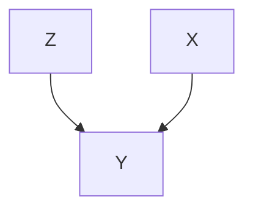
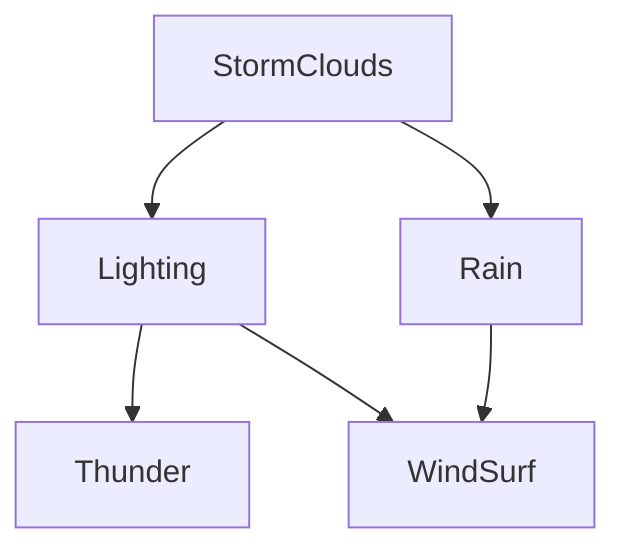
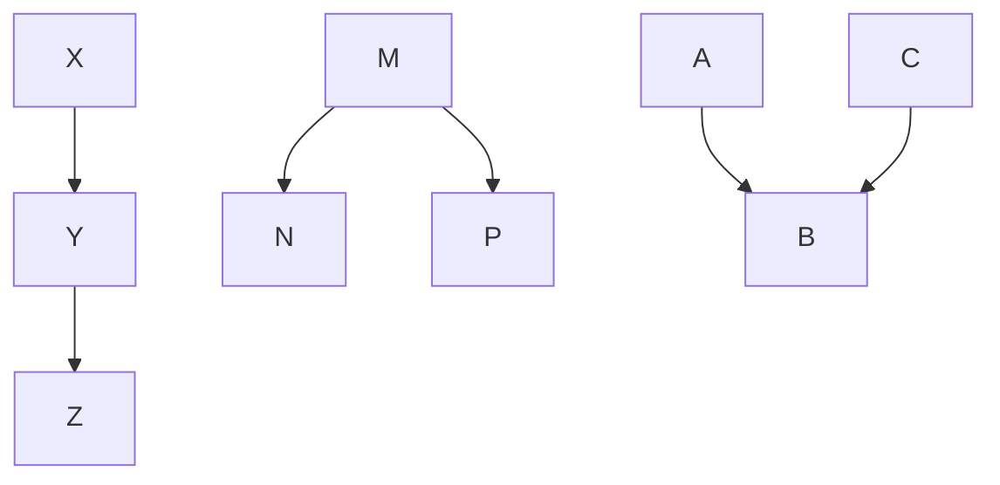
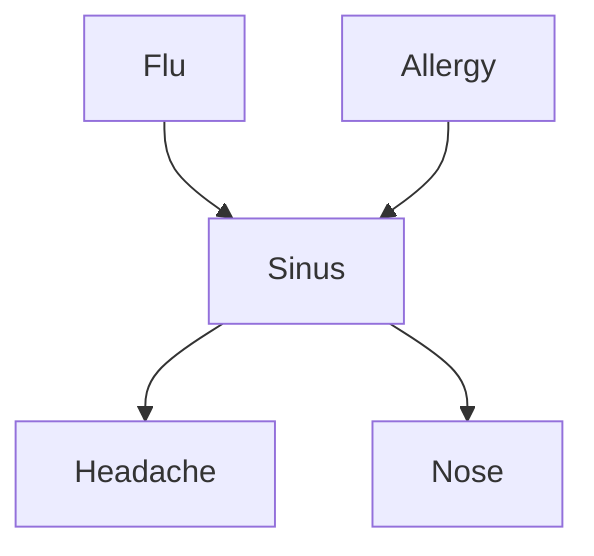

---
tags:
  - tutorial
  - algorithm
  - math
  - DL
aliases:
  - Introduce to Machine Learning - Bayes
---
# Bayes
## 贝叶斯估计与惩罚

$$Pr(A,B)=Pr(A|B)Pr(B)=Pr(B|A)Pr(A)$$
$$Pr(B|A)=\frac{Pr(A|B)Pr(B)}{Pr(A)}$$

有惩罚的损失函数：
$$PRSS(f;\lambda)=RSS(f)+\lambda J(f)$$
$\lambda$是超参数，自己定义。$\lambda$越大，惩罚越大，原来的约束条件越小，模型越简单；反之，原来训练集的约束条件越大，模型越复杂。

$J(f)$是对模型复杂度的描述。这个是为了防止在参数很少的时候训练导致过拟合（就是这个模型只适用于这一些少量的参数，对于大量的其他没有训练的参数反而不适用）

如：对于cubic smoothing spline（这个就是$J(x)=\int[f''(x)]^2dx$）的最小二乘法：
$$PRSS(f;\lambda)=\sum_{i=1}^N(y_i-f(x_i))^2+\lambda\int[f''(x)]^2dx$$
后面的$\lambda J(x)$也可以称作正则化项，对抗过拟合

### 对实验结果的修正

对于一些实验次数非常少的实验，结果可能偏差较大，导致得出的结论过拟合或者不准确。那么可以根据先验概率（经验）进行修正。实验次数越少修正越大

如：掷硬币：

先验(prior)：$P(X=1)=0.5$
- 第一种算法：
  $$P(X=1)=\frac1n\frac12+(1-\frac1n)\frac{\alpha_1}{\alpha_1+\alpha_0}$$
- 第二种算法:
  $$P(X=1)=\frac{\alpha_1+\beta_1}{\alpha_1+\beta_1+\alpha_0+\beta_0}$$
  $$\hat\theta^\text{MLE}=\frac{\alpha_1}{\alpha_1+\alpha_0}$$

$\alpha_1$是投出$X=1$的次数，$\alpha_0$是投出$X=0$的次数。而$\beta$是修正值。

## 分类器

$$Pr(W=w|G=g,H=h)=\frac{Pr(W=w,G=g,H=h)}{\sum_{w}Pr(G=g,H=h,W=w)}$$

通过求和把$W$项消除掉

#### 参数的个数

假设输入$X=\langle X_1,X_2,\cdots,x_n\rangle$，那么所有的$X$的可能性有$2^n$种。

假设有$n=30$，那么一共有$2^{30}\approx10^9$数据量过大

### Naive Bayes 朴素贝叶斯

进行假设：所有的特征都是相互独立的。（这个假设太强，实际中并不可能出现这种情况。但是可以用来简单模拟）

那么有$Pr(X_1,X_2|Y)=Pr(X_1|Y)Pr(X_2|Y)$。这时如果有$n$个参数，那么只需要计算$2n$次（分别是$Y=1$和$Y=0$两种情况，其他的每一个变量只需要计算一次即可，不需要考虑相关性）

#### 训练Naive Bayes

对于所有的标签$y_k$，分析计算$\pi_k\equiv P(Y=y_k)$。

对于多输入的$X_i$向量：对每一个$x_{ij}\in X_i$，计算$\theta_{ijk}=P(X_i=x_{ij}|Y=y_k)$

然后对$X^\text{new}$进行分类：$$Y^\text{new}=\arg\max_{y_k}P(Y=y_k)\prod_iP(X_i^\text{new}|Y=y_k)=\arg\max_{y_k}\pi_k\prod_i\theta_{ijk}$$
目标函数：
$$l(\theta,\pi)=\ln Pr(D,\theta,\pi)=\ln((x_0,y_0),\cdots,(x_n,y_n))$$
$$=\sum_{i=1}^n\ln Pr(x_i,y_i|\theta,\pi)=\sum_{i=1}^n\ln Pr(x_i|y_i,\theta)Pr(y_i|\pi)$$
$$=\sum_{i=1}^n\ln Pr(x_i|y_i,\theta)+\sum_{i=1}^n\ln Pr(y_i|\pi)$$
$$D=\{x_i,y_i\}^m_{i=1}$$
$$\frac{\partial l(\theta,\pi)}{\partial \theta}=\frac{\partial \sum_{i=1}^n\ln Pr(x_i|y_i,\theta)}{\partial l}=0$$
$$\frac{\partial l(\theta,\pi)}{\partial \pi}=\frac{\partial\sum_{i=1}^n\ln Pr(y_i|\pi)}{\partial\pi}=0$$
如果假设不成立，强行使用也可以。但是如果有两个特征强相关，极端一点假设$X_i=X_j$，那么会过度关注于$X_i$，因为这一项可以看成是平方了。

还有就是样本不够的时候会出现某一些$Pr(X_i|Y)=0$的情况，导致整个模型不可用

所以要引入先验的修正，从MLE变成MAP

MLE计算：
$$\hat\mu_{ik}=\frac1{\sum_j\delta(Y^j=y_k)}\sum_jX_i^j\delta(Y^j=y_k)$$
第$i$个特征，对应第$k$个类别，第$j$个训练样本
$$\hat\sigma^2=\frac1{\sum_j\delta(Y^j=y_k)}\sum_j(X_i^j-\hat\mu_{ik})^2\delta(Y^j=y_k)$$

### Bayesian Net 贝叶斯网络

#### 概率模型图

是一种有向无环图（DAG）



表示$Y$受到$X$影响，$Y$也受到$Z$影响，但是$Z$和$X$相互独立，不相关

那么就可以化简成$P(A,B|Y)=P(A|Y)P(B|Y)$

然后就可以计算（CPD）联合概率密度分布:

|         | Y=1            | Y=0              |
| ------- | -------------- | ---------------- |
| X=1,Z=1 | $\theta_{1,1}$ | $1-\theta_{1,1}$ |
| X=1,Z=0 | $\theta_{1,0}$ | $1-\theta_{1,0}$ |
| X=0,Z=1 | $\theta_{0,1}$ | $1-\theta_{0,1}$ |
| X=0,Z=0 | $\theta_{0,0}$ | $1-\theta_{0,0}$ |

然后对上表的$\theta$进行估计


如：



上述图表中，可以简单认为给定$X_i$的所有直接父节点情况下，$X_i$和所有非子代节点的节点都独立。

(假设上面的单词使用首字母进行表示)

即，可以认为，$T\perp\!\!\!\perp WS,R,SC|L$，以及$WS\perp\!\!\!\perp T,SC|\{L,R\}$，等
##### D-separate



这个时候，有三种情况：

1. 第一种原来是条件不独立，给定$Y$之后变成条件独立
2. 第二种原来条件不独立，给定$M$后条件独立
3. 第三种原来条件独立，给定$B$之后条件不独立

可以认为，两者之间如果有一条通路，那么就算是条件独立。但是注意第三种，给定$B$之后不是将通路打断，而是把断掉的通路合成

##### Markov Blanket

马尔科夫毯

$X_{MB_i}$：一个点$X_i$的所有的直接父节点，子节点，联合父节点（直接子节点的直接父节点）组成的一部分

那么给定$X_{MB_i}$之后，$X_i$和$X_{\bar{MB_i}}$条件独立$\Rightarrow X_i\perp\!\!\!\perp X_{\bar{MB_i}}|X_{MB_i}$

#### CDP 联合概率分布

计算完所有的CDP之后就可以通过这个表进行计算所有需要的条件概率。

如：

|      | T=1        | T=0          |
| ---- | ---------- | ------------ |
| L=1  | $\theta_1$ | $1-\theta_1$ |
| L=0  | $\theta_0$ | $1-\theta_0$ |

计算
$$P(T|L)=\theta_1^{TL}(1-\theta_1)^{(1-T)L}\theta_0^{T(1-L)}(1-\theta_0)^{(1-T)(1-L)}$$
$$\theta_0,\theta_1=\arg\max_{\theta_0,\theta_1}l(\theta_0,\theta_1)=\sum_{i=1}^n\ln P(T=t_i|L=l_i)$$
然后
$$P(S,L,R,T,W)=P(S)P(L|S)P(R|S)P(T|L)P(W|L,R)$$
$$P(S=1,L=0,R=1,T=0,W=1)$$
$$=P(S=1)P(L=0|S=1)P(R=1|S=1)P(T=0|L=0)P(W=1|L=0,R=1)$$
$$P(S=1|L=0,T=1)=\frac{P(S=1,L=0,T=1)}{P(T=1,L=0)}$$
$$=\frac{\sum_{w,r}P(S=1,T=1,L=0,W=w,R=r)}{\sum_{w,r,s}P(S=s,T=1,L=0,W=w,R=r)}$$
$$P(S=1)=\sum_{t,l,w,r}P(S=1,T=t,L=l,R=r,W=w)$$
注意，给定的观测值越少，计算量就越多。

所以要转换成采样或者变分来做。

- 采样
  $$\mathbb E_{Pr(X|Y)}[F(x)]=\int Pr(X|Y)F(X)dX=\frac1K\sum_{k=1}^KF(X_k),x_k\sim Pr(X|Y)$$
  使用Monte Carlo方法进行采样。但是有个问题，需要样本量极大

- 变分

  使用Gaussian Distribution进行逼近
  $$\min_\phi KL(q_\phi(x)||Pr(X|Y))$$

  其中$q_\phi$是使用高斯分布逼近的结果。

  所以将这个问题变成了优化问题

#### 对于连续随机变量

1. 离散化：$X=1,2,3,\cdots$，其中$X=i$意味着$X\in[i-1,i)$
2. 对参数建模

   使用Sigmoid函数进行分析：$\sigma(x)=\frac1{1+e^x}$

   $\Rightarrow P(X=x|Y=y)=\frac{1}{1+e^{-\beta_1y+\beta_0}}$，然后求解$\beta_1,\beta_0$

### 隐变量

假设存在隐变量$Z$（虽然存在于模型中，但是没有任何观测数据），使用MLE：

$$\ell(\theta)=\max_\theta\mathbb{E}[\ln P_\theta(x)]=\max_\theta\mathbb{E}[\ln\int p(x,z)dx]$$
估计下界：
$$\ln P_\theta(x)=\ln\int p_\theta(x,z)dx=\ln\int q(z)\frac{p_\theta(x,z)}{q(z)}dx$$
$$=\ln\mathbb{E}_{q(z)}\left[\frac{p_\theta(x,z)}{q(z)}\right]\geq\mathbb E_{q(z)}\left[\ln p_\theta(x,z)-\ln q(z)\right]\text{（吉森不等式）}$$
取最小值时，等式成立，即
$$\min_\theta\ln P_\theta(x)=\mathbb E_{p_\theta(z|x)}\left[\ln\frac{P_{\theta'}(x,z)}{\sum_zP_\theta(x,z)}\right]$$
使用Expectation Maximization（MLE）进行估计


对隐变量$Z$存在的模型进行估计：
$$\theta\leftarrow\arg\max_\theta\log P(X,Z|\theta)\leftarrow\arg\max_\theta\mathbb E_{Z|X,\theta}[\log P(X,Z|\theta)]$$
是迭代求解，可以在线计算，时间复杂度不高
对于$P(X,Z|\theta)$，正常使用全概率公式链式法则加上贝叶斯网格的先验进行优化计算即可

### EM算法

EM算法，Exception Maximization Algorithm。

E-step：根据$\theta$计算隐变量的分布

M-step：根据计算所得隐变量的分布计算更新$\theta$

例子：



假设可观测值：$X=\{F,A,H,N\}$，隐变量$Z=\{S\}$
$$P(S_k=1|f_ka_kh_kn_k,\theta)=\frac{P(S_k=1,f_kz_kh_ku_k|\theta)}{P(S_k=1,f_kz_kh_ku_k|\theta)+P(S_k=0,f_kz_kh_ku_k|\theta)}$$
E-step: Calculate $P(Z_k|X_k;\theta)$ for each training example, $k$
$$P(S_k=1|f_kz_kh_ku_k,\theta)=\mathbb E[s_k]=\frac{P(S_k=1,f_kz_kh_ku_k|\theta)}{P(S_k=1,f_kz_kh_ku_k|\theta)+P(S_k=0,f_kz_kh_ku_k|\theta)}\left(=P(Z|X,\theta)\right)$$
M-step: update all relevant parameters. For example:
$$\theta_{s|i,j}\leftarrow\frac{\sum_{k=1}^K\delta(f_k=i,a_k=j)\mathbb E[s_k]}{\sum_{k=1}^K\delta(f_k=i,a_k=j)}$$

> [!note] example
> ```mermaid
> graph TB
> Y-->X1
> Y-->X2
> Y-->X3
> Y-->X4
> ```
> 
> | Y    | X1   | X2   | X3   | X4   |
> | ---- | ---- | ---- | ---- | ---- |
> | 1    | 0    | 0    | 1    | 1    |
> | 0    | 0    | 1    | 0    | 0    |
> | 0    | 0    | 0    | 1    | 0    |
> | ?    | 0    | 1    | 1    | 0    |
> | ?    | 0    | 1    | 0    | 1    |
> 
> EM算法的实现过程：
> 
> E-step:
> $$\mathbb E_{P(Y|X_1\cdots X_N)}[y(k)]=P(y(k)=1|x_1(k),\cdots,x_N(k);\theta)=\frac{P(y(k)=1)\prod_iP(x_i(k)|y(k)=1)}{\sum_{j=0}^1P(y(k)=j)\prod_iP(x_i(k)|y(k)=j)}$$
> M-step:
$$\theta_{ij|m}=\hat P(X_i=j|Y=m)=\frac{\sum_kP(y(k)=m|x_1(k),\cdots,x_N(k))\delta(x_i(k)=j)}{\sum_kP(y(k)=m|x_1(k),\cdots,x_N(k))}$$
