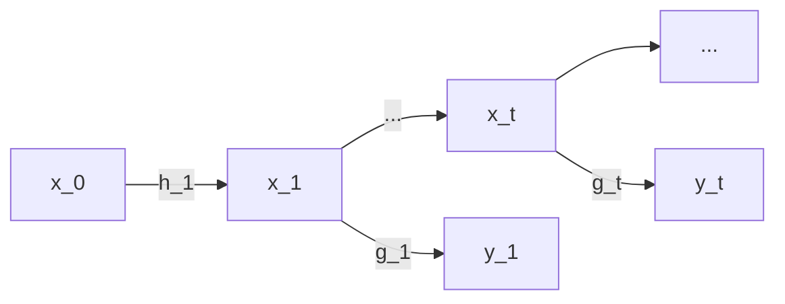

---
tags:
  - tutorial
  - algorithm
  - DL
aliases:
  - State Space Model
---
# State Space Model

是所有时间序列的统合. 如, [[HMM]], RNN等等.

框架:
$$x_t=h_t(x_1,\cdots,x_{t-1},\varepsilon_t)$$
$$y_t=g_t(x_1,\cdots,x_t,e_t)$$

上述是一般形式. 还有[[08-MDP#Markov Decision Process|Markov]]形式, 只依赖于上一个state:
$$x_t=h_t(x_{t-1},\varepsilon_t)$$
$$y_t=g_t(x_t,e_t)$$
其中, $\varepsilon_t$和$e_t$都是Noise

应用场景:
- [[HMM#filtering|filtering]]
- [[HMM#smoothing|smoothing]]
- [[HMM#prediction|prediction]]
- Estimation: 根据数据估计参数, 使用MLE:
  $$P(y_1,\cdots,y_T|x_1,\cdots,x_T)P(x_1,\cdots,x_T)$$
  因为只能观测到输出, 隐变量是观测不到的, 所以要求$y_1,\cdots,y_T$的边缘分布

## 优点

使用HIPPO(High-order Polynomial Projection Operator)进行构建, 简化公式如下:
$$x_t=A\cdot x_{t-1}+B\cdot f(t)$$
$$y_t=C\cdot x_t$$
这个将复杂的函数$h_t$,$g_t$简化成了一个线性变换, 并且省略掉了Noise

这个可以使用卷积操作进行并行计算加速: 累乘可以使用FFT将$x_1,\cdots,x_t$从时域转换到频域, 然后将累乘变成累加, 可以使用GPU等快速并行计算.