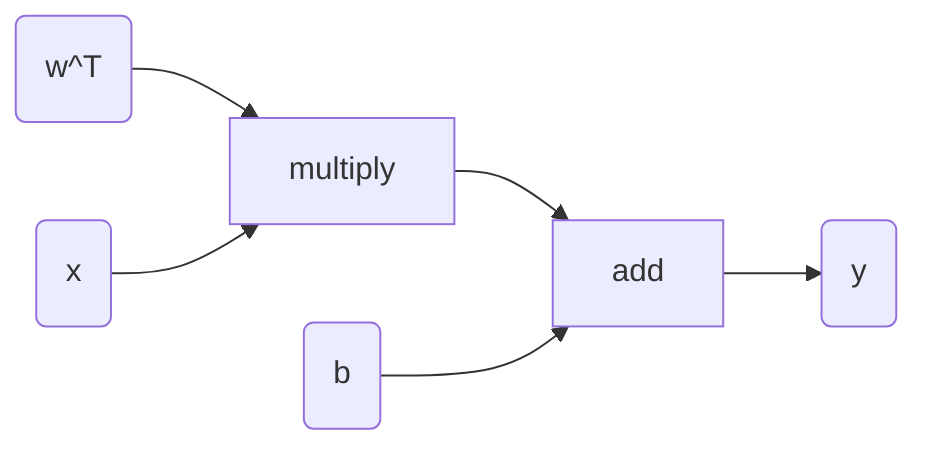

---
tags:
  - tutorial
  - python
  - algorithm
---
# Install

use [[module#pip|pip]] to install the package.

if we want to use GPU, we should first check the cuda environment. and then install the package relate to cuda: [pytorch](https://pytorch.org/get-started/previous-versions/)

# Dataset

创建一个类, 继承自`torch.utils.data.Dataset`, 需要手动实现`__init__`, `__len__`, `__next__`, `__getitem__`函数.

通过`[]`取值是通过`__getitem__`的返回值拿到的. Dataloader是通过`__next__`拿到的

一个常见的写法是:

```python
class SistorDataset(torch.utils.data.Dataset):
    def __init__(self, phase, **kwargs):
        super().__init__()

        self.phase = phase
        self.curr_iter = 0

    def __len__(self):
        return len(self.all_paths["imu_token"])

    def __next__(self):
        if self.curr_iter >= len(self):
            self.curr_iter = 0
            raise StopIteration()
        else:
            single_data = self.__getitem__(self.curr_iter)
            self.curr_iter += 1

        return single_data

    def __getitem__(self, idx):
        item = self.load_data(idx)

        # {"motion_token": tensor(frame).int, "imu_token": tensor(frame).int, "text": list, "fps": int}
        return item
```

# Dataloader

在训练的时候, 一般是直接提供一个batch的数据. 这个时候会使用`torch.utils.data.Dataloader`来对`Dataset`一次性取多个data.

这个时候, 所有的data会以`batch = [data1, data2, ...]`的形式存在. 如果有`collate_fn`, 那么会运行`collate_fn(batch)`并将返回值作为一个batch的数据给到训练.

`collate_fn`的作用为: 将多个data对齐(为了保证dim相同), 处理成特殊的格式(llm的input_ids, attention_mask, labels等)

一个例子为:

```python
def collate_fn(batch, **kwargs):
    new_data = []
    for data in batch:
        new_data.append(pre_process_func(data, **kwargs))
    return torch.tensor(new_data).to(kwargs.device)

dataloader = torch.utils.data.Dataloader(Dataset(), collate_fn: lambda batch: collate_fn(batch, device=torch.cuda()))

for i in tqdm(dataloader):
    batch = i
    o = model(batch)
    loss = loss_func(o)
    loss.backward()
```

# Train State

首先要有一个继承自`torch.nn.Module`的Model. 可以有forward, 也可以没有. 不过如果要调用`__call__`(直接调用Model的实例化, 如: `m=Model();out=m(**data)`), 需要实现forward函数

训练开始之前, 需要指定哪一些参数是需要训练的, 一些不需要计算更新的常量, 使用`parameter.requires_grad_(False)`取消梯度, 可以冻结, 停止loss的backward. 能够降低一部分梯度计算图的显存占用.

开始训练之后, 需要调用`model.train()`标志表示是训练阶段.

一个常见的训练循环为:

```python
class Model(torch.nn.Module):
    def __init__(self):
        super().__init__()
        self.linear = torch.nn.Linear(10, 10)
        self.relu = torch.nn.ReLU()
        self.softmax = torch.nn.Softmax
    def forward(self, data):
        x = self.linear(x)
        x = self.relu(x)
        x = self.softmax(x)

model = Model()
# train loop
for epoch in trange(total_epoch):
    for batch in tqdm(dataloader):
        optimizer.zero_grad()
        outputs = model(batch)
        loss = loss_func(outputs)
        loss.backward()
        optimizer.step()
    scheduler.step()
```


## Gradient

torch的梯度计算是使用动态的梯度图的方式计算.

如:
$$
\hat y=\omega^T\vec x+\beta
$$




计算loss之后, 通过`loss.backward()`反向传播到每一个参数, 然后通过`optimizer.step()`更新参数
# eval state

在进行验证测试的时候, 需要首先将模型的`eval()`模式打开, 然后可以在`@torch.no_grad()`的decorator下进行验证

如:

```python
model = Model()
model = model.cuda().eval()

with torch.no_grad():
    outputs = model(data)
```

