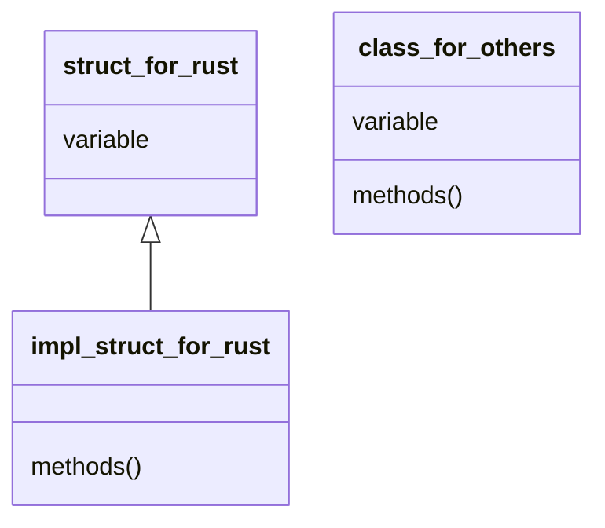

---
tags:
  - tutorial
  - rust
---
after [[RustInstall]] and [[Variable]]
# Syntax

## Expression and Statement

statement is ended by semicolons `;`, complete a specific operation, with no return value

expression will compute the value and return it.
```rust
fn main() {
    let y = {
        let x = 3; // statement
        x + 1 //return value 4, expression
    }; // statement, but the bracket is a expression with return value 4

    println!("The value of y is: {}", y) // also a expression, with return value () (tuple)
}
```
## Function

define by prepend `fn` and (optional) return value
```rust
fn functino_name(arg1: Type1, arg2: Type2) -> ReturnType {
	...
}
```

return value `!` means this function never return.
```rust
fn loop_forever() -> ! {
	loop {
		...
	};
}
fn dead_end() -> ! {
	panic!("Error!");
}
```

# Control flow

## if-else

```rust
if condition {
	// ...
} else if condition2 {
	// ...
} else {
	// ...
}
```

the `if-else` block is [[#Expression and Statement|Expression]]. so you can do this:
```rust
let a = if condition {
	// ...
	b // return val, because no `;` at the end
} else {
	// ...
	c // return val
}; // this is a statement(from `let` to here), so don't forget adding a semicolon
```

## for loop

```rust
for element in iterator {
	// ...
}
```

pay attention for ownership:

| usage                         | equal usage                                       | ownership        |
| ----------------------------- | ------------------------------------------------- | ---------------- |
| `for item in collection`      | `for item in IntoIterator::into_iter(collection)` | move             |
| `for item in &collection`     | `for item in collection.iter()`                   | immutable borrow |
| `for item in &mut collection` | `for item in collection.iter_mut()`               | mutable borrow   |

use `.iter().enumerate()` to get index `for (index, val) in collection.iter().enumerate()` same as python

**continue**

skip current term, continue the next term

**break**

stop loop

## while loop

```rust
while condition {
	// loop ...
}
```

use break and condition to control the loop

no condition loop is defined as
```rust
loop {
	// ...
	if condition {
		break;
	}
	// ...
}
```

## match

```rust
match target {
    模式1 => 表达式1,
    模式2 => {
        语句1;
        语句2;
        表达式2
    },
    _ => 表达式3 // default
}
```

example
```rust
enum Coin {
    Penny,
    Nickel,
    Dime,
    Quarter(UsState), // bind a value here
}

fn value_in_cents(coin: Coin) -> u8 {
    match coin {
        Coin::Penny =>  {
            println!("Lucky penny!");
            1
        },
        Coin::Nickel => 5,
        Coin::Dime => 10,
        Coin::Quarter(state) => {
            println!("State quarter from {:?}!", state); // get the value bind with Coin::Quarter
            25
        },
    }
}

enum IpAddr {
   Ipv4,
   Ipv6
}

fn main() {
    let ip1 = IpAddr::Ipv6;
    let ip_str = match ip1 {
        IpAddr::Ipv4 => "127.0.0.1",
        _ => "::1", // match must exhaust all the patterns, which means, each pattern have a handler.
    };

    println!("{}", ip_str);
}
```

if you only want to match one pattern and ignore others, use `if-let`:
```rust
let a = Option<T> = ...;
if let Some(i) = a {
	// i could be a variable or value
	// handle case a == Some(i) here. if i is value, this is just a condition
	// if i is variable, here bind value from a to i
}
```

`while-let` is also available:
```rust
// Vec是动态数组
let mut stack = Vec::new();

// 向数组尾部插入元素
stack.push(1);
stack.push(2);
stack.push(3);

// stack.pop从数组尾部弹出元素
while let Some(top) = stack.pop() {
    println!("{}", top);
}
```
### macro `matches!`

match a variable by pattern, and return the result `ture` or `false`:
```rust
enum MyEnum {
    Foo,
    Bar
}
let v = vec![MyEnum::Foo,MyEnum::Bar,MyEnum::Foo];
v.iter().filter(|x| matches!(x, MyEnum::Foo));

let foo = 'f';
assert!(matches!(foo, 'A'..='Z' | 'a'..='z'));

let bar = Some(4);
assert!(matches!(bar, Some(x) if x > 2));
```

# Class

## Methods

rust v.s. others:


```rust
struct Circle {
    x: f64,
    y: f64,
    radius: f64,
}

impl Circle {
    // new是Circle的关联函数，因为它的第一个参数不是self，且new并不是关键字 或者说叫做Class function
    // 这种方法往往用于初始化当前结构体的实例
    fn new(x: f64, y: f64, radius: f64) -> Circle {
        Circle {
            x: x,
            y: y,
            radius: radius,
        }
    }

    // Circle的方法，&self表示借用当前的Circle结构体
    fn area(&self) -> f64 {
        std::f64::consts::PI * (self.radius * self.radius)
    }
}
```

> [!warning]
> the argument `self` still has ownership. usually `&self` to use reference, sometimes `&mut self` to use mutable reference. seldom use `self` directly.

rust allow us to use multiple `impl` block:
```rust
impl Rectangle {
    fn area(&self) -> u32 {
        self.width * self.height
    }
}

impl Rectangle {
    fn can_hold(&self, other: &Rectangle) -> bool {
        self.width > other.width && self.height > other.height
    }
}
```

also, we can implement method for [[Variable#Enum|enum]]:
```rust
enum Message {
    Quit,
    Move { x: i32, y: i32 },
    Write(String),
    ChangeColor(i32, i32, i32),
}

impl Message {
    fn call(&self) {
        // 在这里定义方法体
    }
}
```

## Generics

泛型

use generics will not cause speed down. but may cause bigger bin file and slow compile speed.

use `<T>` to declare a generics.

use [[#Trait#trait bound|trait]] and `where` to limit generics:

```rust
fn add<T: std::ops::Add<Output = T>>(a:T, b:T) -> T {
    a + b
}

use std::fmt::Display;

fn create_and_print<T>() where T: From<i32> + Display {
    let a: T = 100.into(); // 创建了类型为 T 的变量 a，它的初始值由 100 转换而来
    println!("a is: {}", a);
}

fn main() {
    create_and_print::<i64>();
}
```

in struct:
```rust
struct Point<T,U> {
    x: T,
    y: U,
}
impl<T,U> Point<T,U> { // still need to declare here
    fn x(&self) -> &T {
        &self.x
    }
    fn mixup<V, W>(self, other: Point<V, W>) -> Point<T, W> { // and can declare new generics
        Point {
            x: self.x,
            y: other.y,
        }
    }
}
impl Point<f32,f32> { // define function only for type Point<f32,f32>
    fn distance_from_origin(&self) -> f32 {
        (self.x.powi(2) + self.y.powi(2)).sqrt()
    }
}
fn main() {
    let p = Point{x: 1, y :1.1};
}
```

in enumerate:
```rust
enum Result<T, E> {
    Ok(T),
    Err(E),
}
```

### const generics

for array, we have type `[item_type; length]`. if we have many array with different size and we want to use a function to print the array, we need to use const generics for length:
```rust
fn display_array<T: std::fmt::Debug, const N: usize>(arr: [T; N]) { // make generics enable debug print by using trait std::fmt::Debug
    println!("{:?}", arr);
}
fn main() {
    let arr: [i32; 3] = [1, 2, 3];
    display_array(arr);

    let arr: [i32; 2] = [1, 2];
    display_array(arr);
}
```

## Trait

trait is a group of methods. since you implement the trait, you can call all the methods defined by this trait.

you can regard it as the base class with virtual method.
```rust
pub trait Summary { // trait
    fn summarize(&self) -> String {
        format!("(Read more from {}...)", self.summarize_author())
    }
    fn summarize_author(&self) -> String;
}
pub struct Post {
    pub title: String, // 标题
    pub author: String, // 作者
    pub content: String, // 内容
}

impl Summary for Post {
    fn summarize(&self) -> String {
        format!("文章{}, 作者是{}", self.title, self.author)
    }
    fn summarize_author(&self) -> String {
        format!("@{}", self.username)
    }
}

pub struct Weibo {
    pub username: String,
    pub content: String
}

impl Summary for Weibo {
    fn summarize_author(&self) -> String {
        format!("@{}", self.username)
    }
}

fn main() {
    let post = Post{title: "Rust语言简介".to_string(),author: "Sunface".to_string(), content: "Rust棒极了!".to_string()};
    let weibo = Weibo{username: "sunface".to_string(),content: "好像微博没Tweet好用".to_string()};

    println!("{}",post.summarize()); // override
    println!("{}",weibo.summarize()); // use default impl
}
```

### trait argument

```rust
pub fn notify(item: &impl Summary) {
    println!("Breaking news! {}", item.summarize());
}
```

the argument `item` should implement the trait `Summary`

### trait bound

is just a syntactic sugar.

```rust
pub fn notify(item: &(impl Summary + Display), other: &(impl Summary + Display)) {}

pub fn notify<T: Summary + Display>(item: &T, other: &T) {
	println!("Breaking news! {} \n {}", item.summarize(), other.summarize());
}
```

#### `where` bound

```rust
fn some_function<T: Display + Clone, U: Clone + Debug>(t: &T, u: &U) -> i32 {}

fn some_function<T, U>(t: &T, u: &U) -> i32
    where T: Display + Clone, U: Clone + Debug
{}
```

### derive trait

automatically generate implementation for trait.

[details here](https://course.rs/appendix/derive.html)

### trait object

use keyword `dyn` to declare a trait object type:
```rust
trait Draw {
    fn draw(&self) -> String;
}

impl Draw for u8 {
    fn draw(&self) -> String {
        format!("u8: {}", *self)
    }
}

impl Draw for f64 {
    fn draw(&self) -> String {
        format!("f64: {}", *self)
    }
}

// 若 T 实现了 Draw 特征， 则调用该函数时传入的 Box<T> 可以被隐式转换成函数参数签名中的 Box<dyn Draw>
// Box means a reference force storage on heap
fn draw1(x: Box<dyn Draw>) {
    // 由于实现了 Deref 特征，Box 智能指针会自动解引用为它所包裹的值，然后调用该值对应的类型上定义的 `draw` 方法
    x.draw();
}

fn draw2(x: &dyn Draw) {
    x.draw();
}

fn main() {
    let x = 1.1f64;
    // do_something(&x);
    let y = 8u8;

    // x 和 y 的类型 T 都实现了 `Draw` 特征，因为 Box<T> 可以在函数调用时隐式地被转换为特征对象 Box<dyn Draw> 
    // 基于 x 的值创建一个 Box<f64> 类型的智能指针，指针指向的数据被放置在了堆上
    draw1(Box::new(x));
    // 基于 y 的值创建一个 Box<u8> 类型的智能指针
    draw1(Box::new(y));
    draw2(&x);
    draw2(&y);
}
```

this is different between `Box<T>` and `Box<dyn Trait>`:
![[Pasted image 20250328215644.png]]

