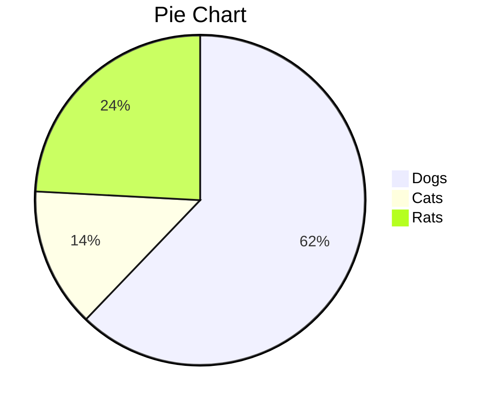
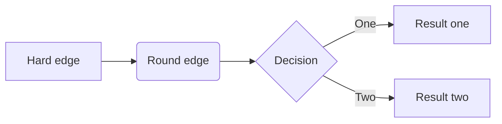
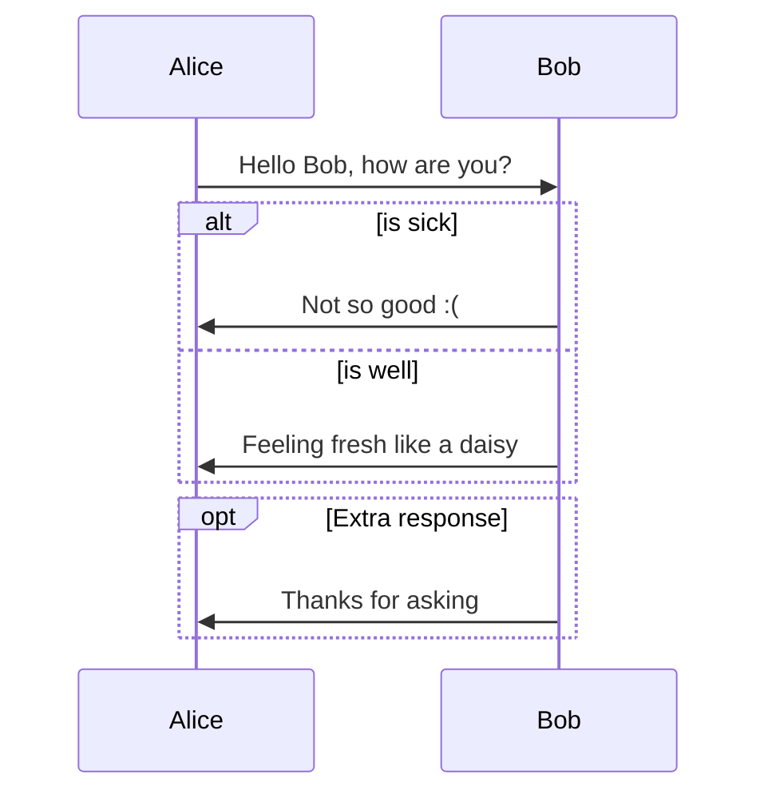
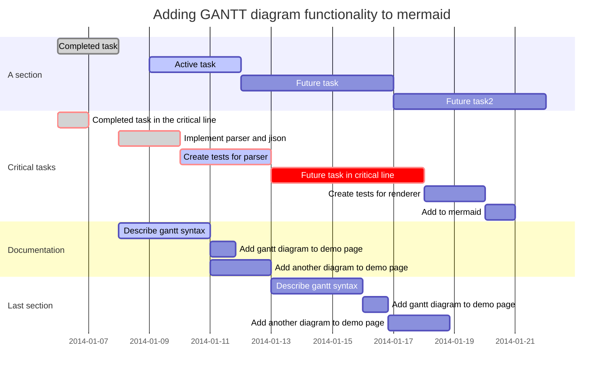
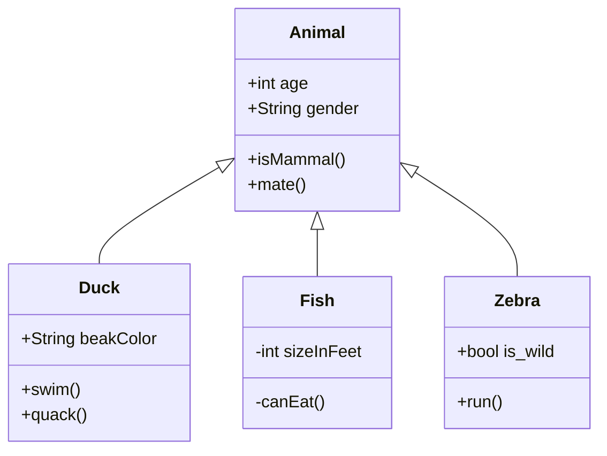
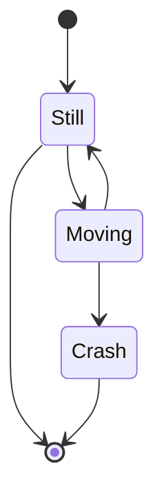

---
tags:
  - tutorial
  - markdown
---
# Basic Syntax

## Inline Style

this is `code block`

this is ==highlight==

this is ~~delete line~~

this is *italic*

this is **bold**

this is $\text{inline math: }\sum_i\min\limits_{x}ax+b$
## Block

math block:
$$\text{center math block but no break line: }\mathbf y=\mathbf w^\top\mathbf x+\mathbf b\in\mathbb R^n$$

code block:

```python
import os
for file, _, _ in os.walk(os.getcwd()):
	print(file)
```

block quote:

> this is default block quote
> without any theme

> [!tip]
> this is a tip block

> [!info]
> this is a info block

> [!tldr]
> too long; don't read

> [!todo]
> this is a todo block

> [!warning]
> this is a warning block

> [!error]
> this is a error block

> [!success]
> this is a success block

> [!bug]
> this is a bug block

> [!fail]
> this is a fail block

> [!example]
> this is a example block

> [!Custom] Custom Title
> this is a custom block with custom title

block quote with auto collapse:

```markdown
> [!note]- collapse / expand
> use `-` after `[!note]` to make the quote auto collapse
```

> [!note]- collapse / expand
> use `-` after `[!note]` to make the quote auto collapse

## Title

for title, use `#` as indicator:

```markdown
# Title 1
## Title 2
### Title 3
#### Title 4
##### Title 5
###### Title 6
```

## Link

we can link image/URL in markdown.

image:


URL:

[official homepage](https://obsidian.md)

# Mermaid

pie chart:


flow chart:


sequence diagrams:


Gantt:


class diagrams:


state diagrams:


# HTML

we can simple use html element in markdown.

## original element

<div>this is simple div element</div>

<details>
	<summary>this is a summary for details block</summary>
	
	Here is the inner space of details.
	
	Only in read(or preview) mode could open and show this.
	
	No markdown syntax available here, only html syntax

</details>

## element with CSS

<div style="color: cyan; background-color: gray">this is HTML block with style sheet</div>

## Use other framework

you can simple use `<script>` block to import other framework such as [[Vuetify]], [[ElementUI]] or others.