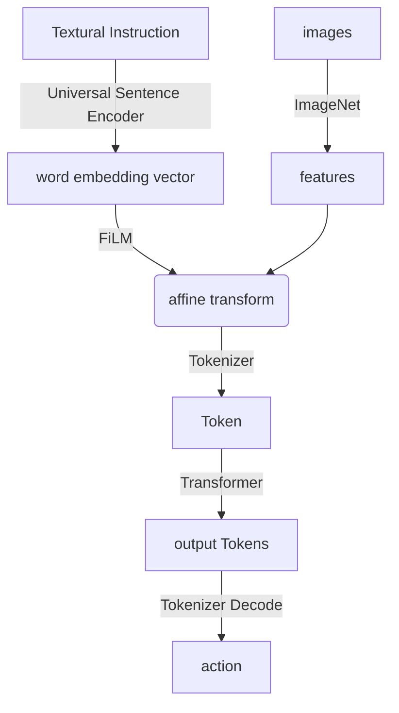

---
tags:
  - pre
  - paper
  - algorithm
  - EmbodiedAI
  - diffusion
  - LLM
  - math
  - python
  - VLA
  - RL
  - DL
---

# Paper Reading

---
# [[OpenVLA]]

--
## Related work
::: block <!-- element style="font-size: 1.3ch;" align="left" -->
**VLM**:
- bridge features from pretrained visual encoder(e.g. DINOv2, SigLIP) with pretrained LLM(e.g. Llama)
**Generalist Robot Policies**:
- Octo: policy learning, compose pretrained component, learn to "stitch" them together.
- OpenVLA: end-to-end
	- more generalist
	- large Internet-scale dataset
	- generic architecture
:::

--

### VLM
::: block <!-- element style="font-size: 1.3ch;" align="left" -->
- visual encoder: map image inputs to image patch embeddings
- projector: align image embeddings with word embeddings
- LLM backbone
:::

--

### OpenVLA

::: block <!-- element style="font-size: 1.3ch;" align="left" -->
- concat SigLIP+DINOv2(helpful for improving spatial reasoning)
- projector: 2-layer MLP
- use Llama 2 as backbone
- map continuous action into discrete action token.
	- discretize each dimension of robot action separately into one of 256 bins.
	- each bin uniformly divided into $1^{st}$ to $99^{th}$ quantile
- Training Data: Open X-Embodiment dataset
:::

---
# [[RT-1]]

--
## Preliminaries
::: block <!-- element style="font-size: 1.3ch;" align="left" -->
**Robot learning**: 
- Aim to learn robot policy: $\pi(\cdot|i,x_i)$
- sample the action $a_t$ from learned distribution $\pi(\cdot|i,\{x_j\}^t_{j=0})$
- target: maximize average reward(indicate complete or not)
**Transformer**:
- sequence model
- map image&text to action sequence
**Imitation Learning**:
- minimize the gap between $\hat a_t$ and $a_t^\text{expert}$
- refine $\pi$ by negative log-likelihood
:::

--
## System Overview

---
# [[RT-2]]

--

## RT-2

::: block <!-- element style="font-size: 1.2ch;" align="left" -->
**Model**:
- use CLIP to tokenize images and share embeddings with text
- use PaLI-x and PaLM-E as backbone of VLM
- decode output action token
::: 

![[Pasted image 20250317231436.png|500]]

--

::: block <!-- element style="font-size: 1.2ch;" align="left" -->
**Co-Fine-tuning**:
- combine datasets: to enhance more generalizing policies

**Output Constraint**:
- only sampling robot action when prompted with a robot-action task
- otherwise, answer natural language

**chain of thought**:
- an additional step: Plan Step. describes the purpose of the action that the robot is about to take in natural language first
- then followed by the actual action tokens.
:::

---

# [[RDT-1B]]

--

## Related work

::: block <!-- element style="font-size: 1.2ch;" align="left" -->
**[[DiT]]**:
- combine [[diffusion]] and transformer
**VLA**:
- Vision-Language-Action Model
:::

--

## Problem formulation

::: block <!-- element style="font-size: 1.2ch;" align="left" -->
$\mathbf o_t:=(\mathbf X_{t-T_{img}+1:t+1},\mathbf z_t,c)$
- $\mathbf X_{t-T_{img}+1:t+1}=(\mathbf X_{t-T_{img}+1},\cdots,\mathbf X_t)$: RGB image history
- $z_t$: low-dimensional proprioception of robot
- $c$: control frequency
- $\mathbf a_t$: action, usually a subset of $z_{t+1}$
:::

--

## Diffusion Model

::: block <!-- element style="font-size: 1.2ch;" align="left" -->
1. $\mathbf a^k_t\sim\mathcal N(\mathbf 0,\mathbf I)$
2. $$\mathbf a^{k-1}_t=\frac{\sqrt{\bar\alpha^{k-1}}\beta^{k}}{1-\bar\alpha^k}\mathbf a_t^0+\frac{\sqrt{\alpha^k}(1-\bar\alpha^{k-1})}{1-\bar\alpha^k}\mathbf a_t^k+\sigma^k\mathbf z$$
	- $\mathbf a_t^0=f_\theta(l,\mathbf o^t,\mathbf a_t^k,k)$
	- $\mathcal L(\theta)=\text{MSE}(\mathbf a_t,f_\theta(l,\mathbf o_t,\sqrt{\bar\alpha^k}\mathbf a_t^k+\sqrt{1-\bar\alpha^k}\epsilon,k))$
	- $\widetilde{\mathbf a}_t^k=\sqrt{\bar\alpha^k}\mathbf a_t^k+\sqrt{1-\bar\alpha^k}\epsilon$
3. use action chunk to encourage time consistency and alleviate error accumulation over time
:::

--

## Encoding

::: block <!-- element style="font-size: 1.2ch;" align="left" -->
- low-dimensional vectors represent physical quantities(proprioception, action chunk, control frequency)
	- use MLP with Fourier Features, capture the high-frequency changes
- image input: high-dimension
	- use image-text-aligned pretrained vision encoder: SigLIP
- language input:
	- pretrained T5-XXL
:::

--

### Network Structure

::: block <!-- element style="font-size: 1.2ch;" align="left" -->
- QKNorm
- RMSNorm instead of LayerNorm
- MLP Decoder instead of linear decoder
- Alternative Condition Injection
:::

--

## Data
<split gap=3>

::: block <!-- element style="font-size: 1.2ch;" align="left" -->
::: block
**Physically Interpretable Unified Action Space**:
- $z_t$ and $a_t$
- unified space
:::
:::

![[Pasted image 20250318024222.png]]
</split>

---

# [[pi0]]

--

## Related Work

::: block <!-- element style="font-size: 1.2ch;" align="left" -->
**Flow Matching**:
- denoise by conditional probability path $p_t(x|x_t)$
- loss: $\mathcal L_{CFM}(\theta)=\mathbb E_{t,q(x_1),p_t(x|x_1)}\|v_t(x)-u_t(x|x_1)\|_2^2$

**Transfusion**:
- train single transformer by multiple objectives
- loss: $\mathcal L=\mathcal L_{LM}+\lambda\mathcal L_{DDPM}$
:::

--
## $\pi_0$ Model

::: block <!-- element style="font-size: 1.2ch;" align="left" -->
- model data distribution: $p(\mathbf A_t|\mathbf o_t)$
	- $\mathbf A_t=[\mathbf a_t, \mathbf a_{t+1},\cdots,\mathbf a_{t+H-1}]$
	- $\mathbf o_t=[\mathbf I_t^1,\cdots,\mathbf I_t^n,l_t,\mathbf q_t]$
- handle action by action expert, with CFM loss:
  $$L^\tau(\theta)=\mathbb E_{p(\mathbf A_t|\mathbf o_t),q(\mathbf A_t^\tau|\mathbf A_t)}\|\mathbf v_\theta(\mathbf A_t^\tau,\mathbf o_t)-\mathbf u(\mathbf A_t^\tau|\mathbf A_t)\|_2$$
:::

![[Pasted image 20250318212123.png]]

--

## Train Recipe

::: block <!-- element style="font-size: 1.2ch;" align="left" -->
- first pretrain on big dataset
- then fine-tune with specific task
:::