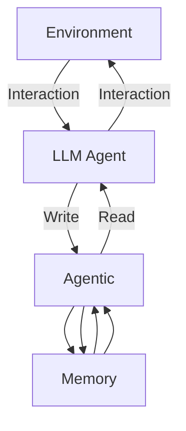

---
tags:
  - pre
  - paper
  - algorithm
  - EmbodiedAI
  - LLM
  - math
  - VLA
  - RL
  - DL
---

# Coding

--

## ROCO Bench

- LLM generate path points
- using RRT

--
## Humanoid Bench

- env
	- two agent mujoco model
	- reward, observation space, action space
- train
	- tdmpc2
	- ppo

---

# Paper Reading

---

# [[CoT#Auto CoT|CoT]]

--

## basic CoT
- manually add prompt
- make LLM thinking step by step

--

## zero-shot CoT
- add prompt: `"Let's think step by step"` <!-- element style="font-size: 1.3ch" -->
- pros: simple, zero-shot
- cons: bad performance

--

## AutoCoT
- use BERT, cluster
- kmeans
- example guided

--

## [[CoT#Tot|ToT]]

- Thought Decomposition
- Thought Generator
	- Sample
	- Propose
- State Evaluator
	- Value
	- Vote

--

## [[CoT#GoT|GoT]]
::: block <!-- element style="font-size: 1.5ch;" -->
1. find unreasonable choices
2. analyze why unreasonable with context
3. find the best choice
:::
![[Pasted image 20250407233941.png]]
--
## [[CoT#CoD|Chain of Draft]]

::: block <!--element style="background: #232326; font-size: 1ch;" -->
Think step by step, but only keep a minimum draft for each thinking step, with 5 words at most. Return the answer at the end of the response after a separator ####.
:::

---

## [[A-MEM]]

--

## Method

::: block <!-- element style="font-size: 1.3ch;" -->
- Zettelkasten Method
	- $m_i=\{c_i,t_i,K_i,G_i,X_i,e_i,L_i\}$
- Link Generation
	- $s_{i,j}=\frac{e_i\cdot e_j}{|e_i||e_j|}$
	- $\mathcal M_{\text{near}}^n=\{m_j|\text{rank}(s_{i,j})\leq k,m_j\in\mathcal M\}$
- Memory Evolution
	- $m_j^*\leftarrow\text{LLM}(m_n\|\mathcal M_{\text{near}}^n\backslash m_j\|m_j\|P_{s_3})$
- Retrieve Relative Memory
	- $e_q=f_{\text{enc}}[q]$
	- $\mathcal M_{retrieved}=\{m_j|\text{rank}(s_{i,j})\leq k,m_i\in\mathcal M\}$

:::

---

[[Legion|Preserving and combining knowledge in robotic lifelong reinforcement learning]]

--

![[Pasted image 20250408142002.png]]

--

## DPMM

- $\theta_k|\lambda\sim\mathcal H(\lambda)$
- $\pi|\alpha\sim\text{GEM}(\alpha)$
- $v_i|\pi\sim\text{Cat}(\pi)$
- $x_i|v_i\sim F(\theta_{v_i})$

--

## Variational Inference

$\text{ELBO}(q)=\sum_{k=1}^K\left[\mathbb E_q[\theta_k]^\top s_k(x)-\hat N_k[a(\theta_k)]+\hat N_k[\log\pi_k(\beta)]\right.$<!-- element style="font-size: 1ch;" -->
$\left.-\sum_{n=1}^N\hat r_{nk}+\mathbb E_q\left[\log\frac{B(\beta_k|1,\alpha)}{q(\beta_k|\hat\alpha_{k_1},\hat\alpha_{k_0})}\right]+\mathbb E_q\left[\log\frac{\mathcal H(\theta_k|\lambda)}{q(\theta_k|\hat\lambda_k)}\right]\right]$<!-- element style="font-size: 1ch;" -->

--

## Metrics

- average success rate
	- $P(t)=\frac1N\sum_{i=1}^NP_i(t)\text{: 每个任务的成功率的平均}$
- forgetting
	- $F_i=(P_i(\Delta i)-P_i(T)) \text{: 训练后的成功率减去最终成功率}$
	- $F=\frac1{N-1}\sum_{i=1}^NF_i$
- forward transfer
	- $FT_i=\frac1{i-1}\sum_{k=1}^{i-1}P_k(\Delta k)\text{ : 训练前i个任务的平均成功率}$
	- $FT=\frac1{N-1}\sum_{i=2}^NFT_i$
- Improvement of few-shot knowledge recall
	- $f=\frac1{T\times P_\text{max}}\left(\int^{T_j}_{t_j}P(t)dt-\int^{T_i}_{t_i}P(t)dt\right)$
