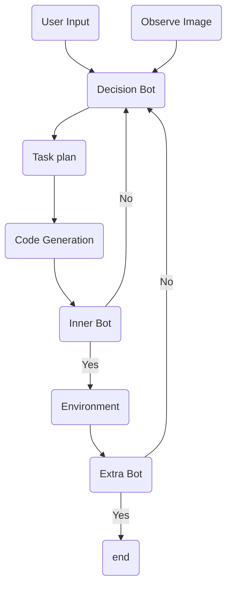

---
tags:
  - pre
  - paper
  - algorithm
  - EmbodiedAI
  - LLM
  - DL
  - RL
---

# [[2407.21762v1_ReplanVLM.pdf|ReplanVLM]]

--

--

- Decision Bot:
  - generate task plan based on user input and observed images
  - generate code based on task plan
- Inner Bot:
  - check code correctness
  - check with environment and codebase information
- Extra Bot:
  - compare images before and after taking action
  - return feedback if not succeed

---

# [[2309.11495v2_Chain-of-Verification.pdf|Chain of Verification]]

--

1. generate baseline response by LLM
2. based on user input and baseline response, generate verification question for baseline response
3. independently answer the verification questions (w/o baseline response).
   
   then check the answer against baseline response
4. generate final response based on baseline response and feedback from step 3

---

# [[Adaptive Interactive Navigation of Quadruped Robots using Large Language Models.pdf|Adaptive Interactive Navigation]]

--

![[Pasted image 20250417152142.png|500]]

- Task planing:
  - generate skill tree
  - evaluate nodes and find high-level skeleton
- Advisor:
  - interpret environment: Failure, New Object, Revaluation
- Arborist:
  - adding node for new information
  - pruning the failed nodes