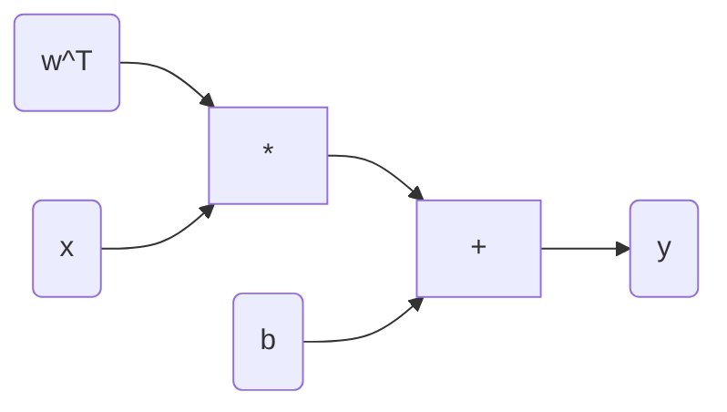

# Gradient

torch的梯度计算是使用动态的梯度图的方式计算.

如:
$$
\hat y=\omega^T\vec x+\beta
$$

```mermaid
graph LR
op1[+]
y(y)
xx(x)
w(w^T)
b(b)
op2[*]

w-->op2
xx-->op2
op2-->op1
b-->op1
op1-->y
```

计算loss之后, 通过`loss.backward()`反向传播到每一个参数, 然后通过`optimizer.step()`更新参数