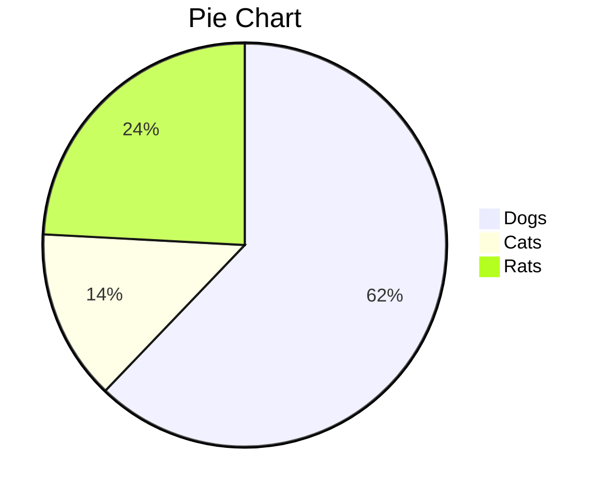
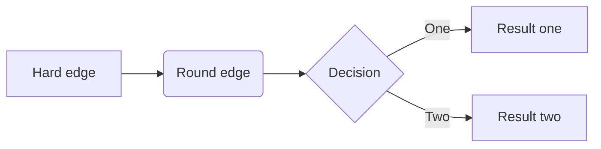
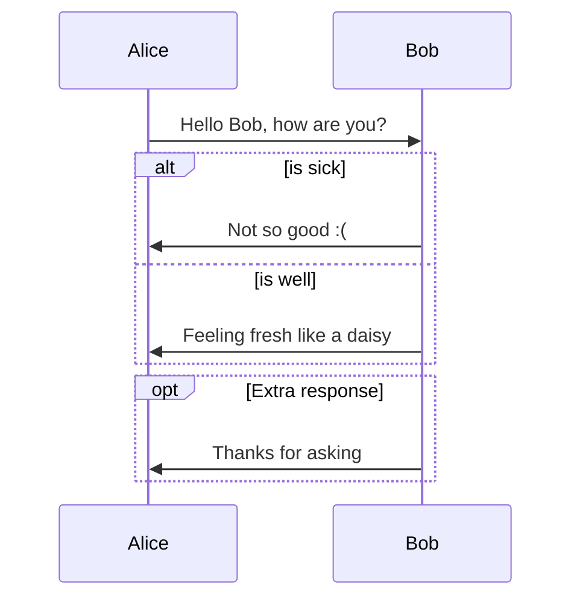
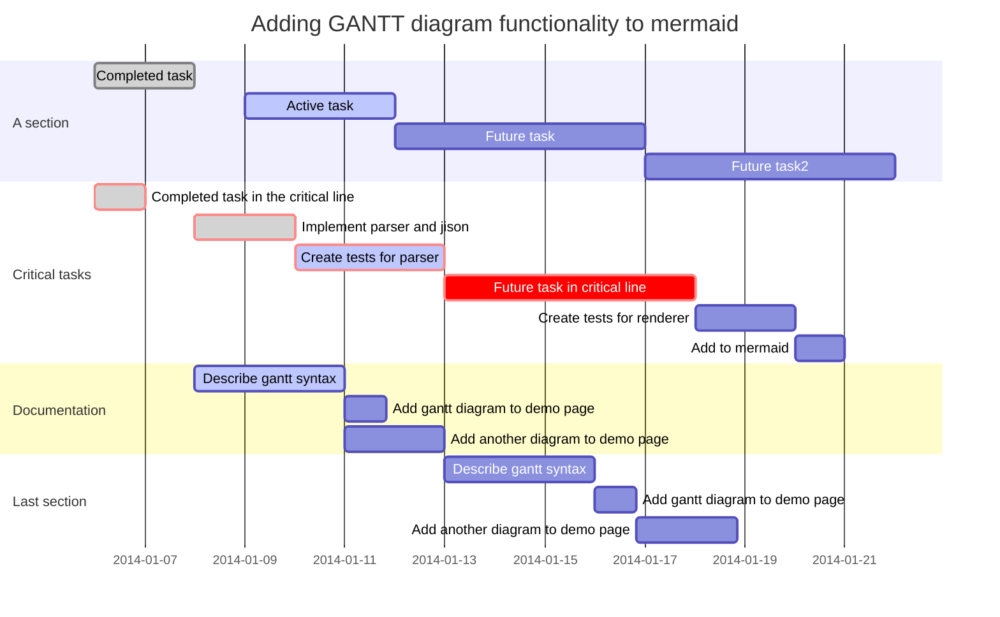
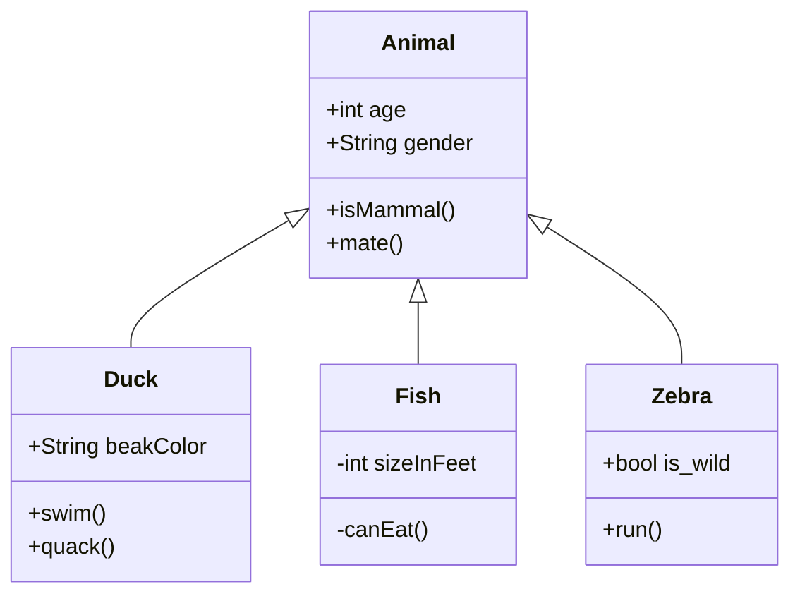
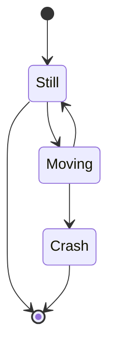

# Draw charts

## Pie Chart



## Sequence

```sequence
Alice->Bob: Hello Bob, how are you?
Note right of Bob: Bob thinks
Bob-->Alice: I am good thanks!
```

## Flow Chart

### flowchart.js

```flow
st=>start: Start
a=>operation: Help
op=>operation: Your Operation
cond=>condition: Yes or No?
e=>end
 
st->op->a->cond
cond(yes)->e
cond(no)->cond
```

```flow
st=>start: Start|past:>http://www.google.com[blank]
e=>end: End|future:>http://www.google.com
op1=>operation: My Operation|past
op2=>operation: Stuff|current
sub1=>subroutine: My Subroutine|invalid
cond=>condition: Yes
or No?|approved:>http://www.google.com
c2=>condition: Good idea|rejected
io=>inputoutput: catch something...|future

st->op1(right)->cond
cond(yes, right)->c2
cond(no)->sub1(left)->op1
c2(yes)->io->e
c2(no)->op2->e
```

```flow
st=>start: Need something to be translated!:>https://www.localistars.com[blank]
e=>end: Be happy!:>https://youtu.be/e6Ede8hdU8c
cond=>condition: Are you a client
or a translator?
subc=>subroutine: Why should you choose a localistar?:>https://www.localistars.com/for-clients.html
subt=>subroutine: Why should you become a localistar?:>https://www.localistars.com/for-translators.html
op=>operation: Check out how it works!:>https://www.localistars.com/how-it-works.html
io=>inputoutput: Work together with your partner!:>https://www.localistars.app/login

st->cond
cond(no@client)->subc->op->io->e
cond(yes@translator)->subt->op->io->e
```


### mermaid.js



## Sequence Diagrams



## Gantt



## Class Diagrams



## State Diagrams



